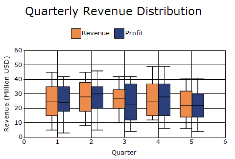
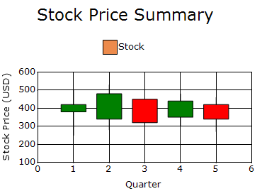
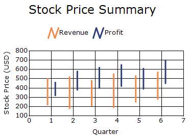
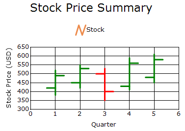
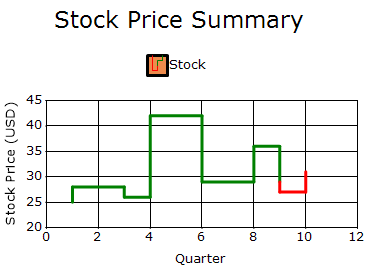

# Financial Charts in Windows Forms Chart

Financial chart types are specialized charts designed to represent financial and stock market data that contains multiple values, such as open, high, low, and close prices. They provide a clear visual representation of price movements, trends, and market performance over time, making complex financial data easier to analyze and interpret.

The following features are supported in the Financial charts:

* **Chart 3-D Mode**: A chart can be rendered in 3D by enabling the `Series3D` property.
* **Open-Close-Draw Mode**: The `OpenCloseDrawMode` property will set the chart series in open, close, or both modes. This property is applicable to open-high-low-close charts.

## Box And Whisker Chart

Box and Whisker Chart is a statistical chart used to summarize and visualize the distribution of a dataset. It displays key measures such as the minimum, maximum, median, and quartiles, helping to identify data spread, variability, skewness, and potential outliers.




ChartSeries revenueSeries = new ChartSeries("Revenue", ChartSeriesType.BoxAndWhisker);

revenueSeries.Points.Add(1, 5, 15, 25, 35, 45);
revenueSeries.Points.Add(2, 8, 18, 28, 38, 45);
revenueSeries.Points.Add(3, 10, 20, 27, 33, 42);
revenueSeries.Points.Add(4, 12, 15, 25, 37, 49);
revenueSeries.Points.Add(5, 6, 14, 22, 32, 41);

ChartSeries profitSeries = new ChartSeries("Profit", ChartSeriesType.BoxAndWhisker);

profitSeries.Points.Add(1, 3, 18, 24, 35, 42);
profitSeries.Points.Add(2, 5, 20, 30, 35, 46);
profitSeries.Points.Add(3, 4, 12, 23, 37, 42);
profitSeries.Points.Add(4, 6, 15, 28, 37, 49);
profitSeries.Points.Add(5, 4, 14, 22, 30, 41);

chartControl.Series.Add(revenueSeries);
chartControl.Series.Add(profitSeries);




' Revenue Series
Dim revenueSeries As New ChartSeries("Revenue", ChartSeriesType.BoxAndWhisker)

revenueSeries.Points.Add(1, 5, 15, 25, 35, 45)
revenueSeries.Points.Add(2, 8, 18, 28, 38, 45)
revenueSeries.Points.Add(3, 10, 20, 27, 33, 42)
revenueSeries.Points.Add(4, 12, 15, 25, 37, 49)
revenueSeries.Points.Add(5, 6, 14, 22, 32, 41)

' Profit Series
Dim profitSeries As New ChartSeries("Profit", ChartSeriesType.BoxAndWhisker)

profitSeries.Points.Add(1, 3, 18, 24, 35, 42)
profitSeries.Points.Add(2, 5, 20, 30, 35, 46)
profitSeries.Points.Add(3, 4, 12, 23, 37, 42)
profitSeries.Points.Add(4, 6, 15, 28, 37, 49)
profitSeries.Points.Add(5, 4, 14, 22, 30, 41)

' Add series to chart
chartControl.Series.Add(revenueSeries)
chartControl.Series.Add(profitSeries)




## Candle Chart
A Candle chart displays stock information using the `High`, `Low`, `Open` and `Close` values. The Hi and Lo values are represented by the wick of a candle. The candle represents open and close values.




ChartSeries series = new ChartSeries("Stock", ChartSeriesType.Candle);

series.Points.Add(1, 500, 250, 380, 420); // body 40
series.Points.Add(2, 530, 280, 340, 480); // body 140
series.Points.Add(3, 520, 220, 450, 320); // body 130
series.Points.Add(4, 480, 300, 350, 440); // body 90
series.Points.Add(5, 460, 270, 420, 340); // body 80

chartControl.Series.Add(series);




Dim series As New ChartSeries("Stock", ChartSeriesType.Candle)

' X, High, Low, Open, Close
series.Points.Add(1, 500, 250, 380, 420) ' Body = 40
series.Points.Add(2, 530, 280, 340, 480) ' Body = 140
series.Points.Add(3, 520, 220, 450, 320) ' Body = 130
series.Points.Add(4, 480, 300, 350, 440) ' Body = 90
series.Points.Add(5, 460, 270, 420, 340) ' Body = 80

chartControl.Series.Add(series)




## HiLo Chart

HiLo Chart is a financial chart commonly used to display the trading range of a stock or other data over a period. It uses two Y-values `High` and `Low` to represent the maximum and minimum values, making it easy to visualize value ranges and fluctuations.




ChartSeries revenue = new ChartSeries("Revenue", ChartSeriesType.HiLo);

revenue.Points.Add(1, 500, 220);
revenue.Points.Add(2, 520, 180);
revenue.Points.Add(3, 480, 210);
revenue.Points.Add(4, 550, 190);
revenue.Points.Add(5, 530, 250);
revenue.Points.Add(6, 570, 280);

ChartSeries profit = new ChartSeries("Profit", ChartSeriesType.HiLo);

profit.Points.Add(1, 460, 320);
profit.Points.Add(2, 580, 380);
profit.Points.Add(3, 620, 400);
profit.Points.Add(4, 650, 420);
profit.Points.Add(5, 610, 390);
profit.Points.Add(6, 700, 450);

chartControl.Series.Add(revenue);
chartControl.Series.Add(profit);

revenue.Style.Border.Width = 3;
profit.Style.Border.Width = 3;




Dim revenue As New ChartSeries("Revenue", ChartSeriesType.HiLo)

' X, High, Low
revenue.Points.Add(1, 500, 220)
revenue.Points.Add(2, 520, 180)
revenue.Points.Add(3, 480, 210)
revenue.Points.Add(4, 550, 190)
revenue.Points.Add(5, 530, 250)
revenue.Points.Add(6, 570, 280)

Dim profit As New ChartSeries("Profit", ChartSeriesType.HiLo)

' X, High, Low
profit.Points.Add(1, 460, 320)
profit.Points.Add(2, 580, 380)
profit.Points.Add(3, 620, 400)
profit.Points.Add(4, 650, 420)
profit.Points.Add(5, 610, 390)
profit.Points.Add(6, 700, 450)

chartControl.Series.Add(revenue)
chartControl.Series.Add(profit)

' Increase line thickness
revenue.Style.Border.Width = 3
profit.Style.Border.Width = 3




## HiLo Open Close Chart

HiLo open close chart is a financial chart commonly used in stock market analysis. It requires four Y-values for each data point `High`, `Low`, `Open`, and `Close` to represent a stock's price movement during a specific period, providing a clear view of trading activity and market trends.




ChartSeries series = new ChartSeries("Stock", ChartSeriesType.HiLoOpenClose);

// X, High, Low, Open, Close
series.Points.Add(1, 520, 380, 420, 490);
series.Points.Add(2, 550, 420, 450, 530);
series.Points.Add(3, 530, 350, 500, 400);
series.Points.Add(4, 590, 410, 430, 560);
series.Points.Add(5, 610, 450, 480, 580);

chartControl.Series.Add(series);

series.Style.Border.Width = 3;




Dim series As New ChartSeries("Stock", ChartSeriesType.HiLoOpenClose)

' X, High, Low, Open, Close
series.Points.Add(1, 520, 380, 420, 490)
series.Points.Add(2, 550, 420, 450, 530)
series.Points.Add(3, 530, 350, 500, 400)
series.Points.Add(4, 590, 410, 430, 560)
series.Points.Add(5, 610, 450, 480, 580)

chartControl.Series.Add(series)

' Increase line thickness
series.Style.Border.Width = 3




## Kagi Chart

Kagi Chart is a financial chart that tracks price movements using a series of connected vertical lines. The direction, thickness, and color of the lines change based on price trends and reversals, helping traders easily identify bullish and bearish market patterns.




ChartSeries series = new ChartSeries("Stock", ChartSeriesType.Kagi);

series.Points.Add(1, 25);
series.Points.Add(2, 28);
series.Points.Add(3, 26);
series.Points.Add(4, 30);
series.Points.Add(5, 42); 
series.Points.Add(6, 35);
series.Points.Add(7, 29);
series.Points.Add(8, 36);
series.Points.Add(9, 27);
series.Points.Add(10, 31);

series.Style.Border.Width = 3;
chartControl.Series.Add(series);




Dim series As New ChartSeries("Stock", ChartSeriesType.Kagi)

series.Points.Add(1, 25)
series.Points.Add(2, 28)
series.Points.Add(3, 26)
series.Points.Add(4, 30)
series.Points.Add(5, 42) 
series.Points.Add(6, 35)
series.Points.Add(7, 29)
series.Points.Add(8, 36)
series.Points.Add(9, 27)
series.Points.Add(10, 31)

' Increase line thickness
series.Style.Border.Width = 3

chartControl.Series.Add(series)




## Point and Figure Chart

Point and figure Chart is a financial chart used to identify price trends, support and resistance levels, and chart patterns. It focuses solely on price movements, using X's to represent rising prices and O's to represent falling prices, while ignoring the passage of time. The chart requires two Y-values high and low for each data point.










## Renko Chart










## Three Line Break Chart










