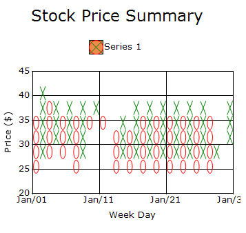
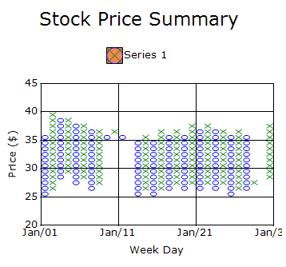
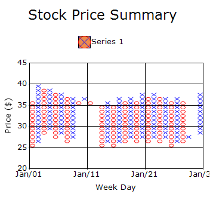
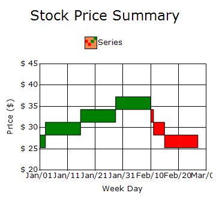
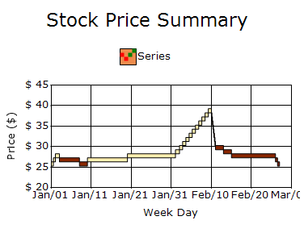
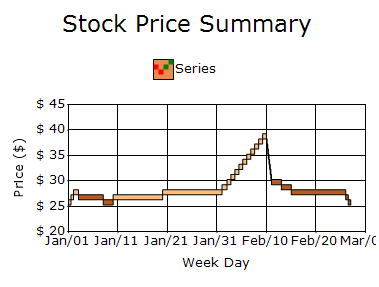

# Financial Chart in Windows Forms Charts

## HiLo open close chart

A HiLo Open Close chart displays each data point as a group of horizontal lines and a vertical line representing the `High`, `Low`, `Open`, and `Close` values. 

The following code example demonstrates how to create a hilo open close chart.




ChartSeries series = new ChartSeries("Stock", ChartSeriesType.HiLoOpenClose);

// X, High, Low, Open, Close
series.Points.Add(1, 520, 380, 420, 490);
series.Points.Add(2, 550, 420, 450, 530);
series.Points.Add(3, 530, 350, 500, 400);
series.Points.Add(4, 590, 410, 430, 560);
series.Points.Add(5, 610, 450, 480, 580);

chartControl.Series.Add(series);

series.Style.Border.Width = 3;




Dim series As New ChartSeries("Stock", ChartSeriesType.HiLoOpenClose)

' X, High, Low, Open, Close
series.Points.Add(1, 520, 380, 420, 490)
series.Points.Add(2, 550, 420, 450, 530)
series.Points.Add(3, 530, 350, 500, 400)
series.Points.Add(4, 590, 410, 430, 560)
series.Points.Add(5, 610, 450, 480, 580)

chartControl.Series.Add(series)

' Increase line thickness
series.Style.Border.Width = 3




### Close tip color

The [CloseTipColor](https://help.syncfusion.com/cr/windowsforms/Syncfusion.Windows.Forms.Chart.ChartHiLoOpenCloseConfigItem.html#Syncfusion_Windows_Forms_Chart_ChartHiLoOpenCloseConfigItem_CloseTipColor) property specifies the color of the tip that represents the closing value in a hilo open close chart, with `Color.Empty` as the default value.

The following code sets the close tip color to `Color.Blue`.



chartControl.Series[0].ConfigItems.HiLoOpenCloseItem.CloseTipColor = Color.Blue;


chartControl.Series(0).ConfigItems.HiLoOpenCloseItem.CloseTipColor = Color.Blue



### Draw mode

The [DrawMode](https://help.syncfusion.com/cr/windowsforms/Syncfusion.Windows.Forms.Chart.ChartHiLoOpenCloseConfigItem.html#Syncfusion_Windows_Forms_Chart_ChartHiLoOpenCloseConfigItem_DrawMode) property specifies whether the open tip, close tip, or both tips are displayed in a hilo open close chart. By default, both tips are displayed using the `Both` draw mode.

This property supports the following values:

- [Both](https://help.syncfusion.com/cr/windowsforms/Syncfusion.Windows.Forms.Chart.ChartOpenCloseDrawMode.html#Syncfusion_Windows_Forms_Chart_ChartOpenCloseDrawMode_Both): Displays both the open and close tips.
- [Close](https://help.syncfusion.com/cr/windowsforms/Syncfusion.Windows.Forms.Chart.ChartOpenCloseDrawMode.html#Syncfusion_Windows_Forms_Chart_ChartOpenCloseDrawMode_Close): Displays only the close tip.
- [Open](https://help.syncfusion.com/cr/windowsforms/Syncfusion.Windows.Forms.Chart.ChartOpenCloseDrawMode.html#Syncfusion_Windows_Forms_Chart_ChartOpenCloseDrawMode_Open): Displays only the open tip.

The following code displays only the open tip.



chartControl.Series[0].ConfigItems.HiLoOpenCloseItem.DrawMode = ChartOpenCloseDrawMode.Open;


chartControl.Series(0).ConfigItems.HiLoOpenCloseItem.DrawMode = ChartOpenCloseDrawMode.Open



### Open tip color

The [OpenTipColor](https://help.syncfusion.com/cr/windowsforms/Syncfusion.Windows.Forms.Chart.ChartHiLoOpenCloseConfigItem.html#Syncfusion_Windows_Forms_Chart_ChartHiLoOpenCloseConfigItem_OpenTipColor) property specifies the color of the tip that represents the opening value in a hilo open close chart, with `Color.Empty` used as the default value.

The following code sets the open tip color to `Color.Blue`.



chartControl.Series[0].ConfigItems.HiLoOpenCloseItem.OpenTipColor = Color.Blue;


chartControl.Series(0).ConfigItems.HiLoOpenCloseItem.OpenTipColor = Color.Blue



## Candle chart

A candle chart displays each data point using a vertical column and a vertical line based on the `High`, `Low`, `Open`, and `Close` values. The vertical line represents the High and Low values, while the column represents the Open and Close values.

The following code example demonstrates how to create a candle Chart.




ChartSeries series = new ChartSeries("Stock", ChartSeriesType.Candle);

series.Points.Add(1, 500, 250, 380, 420); // body 40
series.Points.Add(2, 530, 280, 340, 480); // body 140
series.Points.Add(3, 520, 220, 450, 320); // body 130
series.Points.Add(4, 480, 300, 350, 440); // body 90
series.Points.Add(5, 460, 270, 420, 340); // body 80

chartControl.Series.Add(series);
series.Style.Border.Width = 3;




Dim series As New ChartSeries("Stock", ChartSeriesType.Candle)

' X, High, Low, Open, Close
series.Points.Add(1, 500, 250, 380, 420) ' Body = 40
series.Points.Add(2, 530, 280, 340, 480) ' Body = 140
series.Points.Add(3, 520, 220, 450, 320) ' Body = 130
series.Points.Add(4, 480, 300, 350, 440) ' Body = 90
series.Points.Add(5, 460, 270, 420, 340) ' Body = 80

chartControl.Series.Add(series)
' Increase line thickness
series.Style.Border.Width = 3




## Kagi chart

A Kagi chart shows price trends using connected vertical lines. The line continues when the closing price moves in the same direction and reverses when the price reaches a predefined [ReversalAmount](https://help.syncfusion.com/cr/windowsforms/Syncfusion.Windows.Forms.Chart.ChartSeries.html#Syncfusion_Windows_Forms_Chart_ChartSeries_ReversalAmount). Breaking a previous high or low changes the line color to indicate a bullish or bearish pattern. The [PriceUpColor](https://help.syncfusion.com/cr/windowsforms/Syncfusion.Windows.Forms.Chart.ChartFinancialConfigItem.html#Syncfusion_Windows_Forms_Chart_ChartFinancialConfigItem_PriceUpColor) and [PriceDownColor](https://help.syncfusion.com/cr/windowsforms/Syncfusion.Windows.Forms.Chart.ChartFinancialConfigItem.html#Syncfusion_Windows_Forms_Chart_ChartFinancialConfigItem_PriceDownColor) properties control these colors, while the column width represents trend strength.

The following code example demonstrates how to create a kagi Chart.




ChartSeries series = new ChartSeries("Stock", ChartSeriesType.Kagi);

series.Points.Add(1, 25);
series.Points.Add(2, 28);
series.Points.Add(3, 26);
series.Points.Add(4, 30);
series.Points.Add(5, 42); 
series.Points.Add(6, 35);
series.Points.Add(7, 29);
series.Points.Add(8, 36);
series.Points.Add(9, 27);
series.Points.Add(10, 31);

series.Style.Border.Width = 3;
chartControl.Series.Add(series);




Dim series As New ChartSeries("Stock", ChartSeriesType.Kagi)

series.Points.Add(1, 25)
series.Points.Add(2, 28)
series.Points.Add(3, 26)
series.Points.Add(4, 30)
series.Points.Add(5, 42) 
series.Points.Add(6, 35)
series.Points.Add(7, 29)
series.Points.Add(8, 36)
series.Points.Add(9, 27)
series.Points.Add(10, 31)

' Increase line thickness
series.Style.Border.Width = 3

chartControl.Series.Add(series)




## Point and figure

A point and figure chart tracks price movements while ignoring time. It uses X's for upward trends and O's for downward trends to identify support, resistance, and price patterns.

Use the [PriceUpColor](https://help.syncfusion.com/cr/windowsforms/Syncfusion.Windows.Forms.Chart.ChartFinancialConfigItem.html#Syncfusion_Windows_Forms_Chart_ChartFinancialConfigItem_PriceUpColor) property for X’s and the [PriceDownColor](https://help.syncfusion.com/cr/windowsforms/Syncfusion.Windows.Forms.Chart.ChartFinancialConfigItem.html#Syncfusion_Windows_Forms_Chart_ChartFinancialConfigItem_PriceDownColor) property for O’s. The default [ReversalAmount](https://help.syncfusion.com/cr/windowsforms/Syncfusion.Windows.Forms.Chart.ChartSeries.html#Syncfusion_Windows_Forms_Chart_ChartSeries_ReversalAmount) is `1.0`, and the chart requires high and low Y-values for each period.

The following code example demonstrates how to create a point and figure Chart.




double[] points = {
    35.25, 37.75, 39.0, 38.275, 37.75, 37.75, 37.275, 36.25, 35.75, 35.25,
    36.25, 35.25, 34.5, 35.625, 35.5, 36.625, 36.275, 36.25, 36.875, 37.25,
    36.875, 36.5, 37.125, 36.275, 35.875, 36.625, 27.125, 26.25, 27.0, 27.25,
    37.5, 38.5, 39.5, 38.875, 38.5, 39.0, 38.5, 28.5, 29.0, 29.0,
    40.0, 29.875, 29.875, 28.875, 28.5, 28.25, 28.875, 29.275, 29.275, 29.75,
    29.5, 29.275, 28.5, 27.75, 27.625, 27.5, 26.5, 25.0, 26.625, 26.0,
    25.875, 25.0, 25.25, 25.125, 25.05
};

double[] pointsOne = {
    25.0, 27.5, 28.75, 28.025, 27.5, 27.5, 27.025, 26.25, 35.75, 35.25,
    36.25, 35.25, 34.5, 25.625, 25.5, 26.625, 26.275, 26.25, 26.875, 27.25,
    26.875, 26.5, 27.125, 26.275, 25.875, 26.625, 27.125, 26.25, 27.0, 27.25,
    27.5, 38.5, 39.5, 38.875, 38.5, 39.0, 28.5, 28.5, 29.0, 29.0,
    40.0, 29.875, 29.875, 28.875, 28.5, 28.25, 28.875, 29.275, 29.275, 29.75,
    29.5, 29.275, 28.5, 27.75, 27.625, 27.5, 26.5, 25.0, 26.625, 26.0,
    25.875, 25.0, 25.25, 25.125, 25.05
};

DateTime current = new DateTime(2026, 1, 1);
int numberOfPoints = points.Length;

ChartSeries series = new ChartSeries("Series 1");

for (int j = 0; j < numberOfPoints; j++)
{
    series.Points.Add(current.AddDays(j), new double[] { points[j], pointsOne[j] });
}

series.Type = ChartSeriesType.PointAndFigure;
series.Text = series.Name;
series.ReversalAmount = 0.0;

chartControl.Series.Add(series);

chartControl.PrimaryXAxis.ValueType = ChartValueType.DateTime;
chartControl.PrimaryXAxis.RangeType = ChartAxisRangeType.Set;

chartControl.PrimaryXAxis.DateTimeRange = new ChartDateTimeRange(
    current,
    current.AddDays(30),
    10,
    ChartDateTimeIntervalType.Days);

chartControl.PrimaryXAxis.DateTimeFormat = "MMM/dd";




Dim points() As Double = {
    35.25, 37.75, 39.0, 38.275, 37.75, 37.75, 37.275, 36.25, 35.75, 35.25,
    36.25, 35.25, 34.5, 35.625, 35.5, 36.625, 36.275, 36.25, 36.875, 37.25,
    36.875, 36.5, 37.125, 36.275, 35.875, 36.625, 27.125, 26.25, 27.0, 27.25,
    37.5, 38.5, 39.5, 38.875, 38.5, 39.0, 38.5, 28.5, 29.0, 29.0,
    40.0, 29.875, 29.875, 28.875, 28.5, 28.25, 28.875, 29.275, 29.275, 29.75,
    29.5, 29.275, 28.5, 27.75, 27.625, 27.5, 26.5, 25.0, 26.625, 26.0,
    25.875, 25.0, 25.25, 25.125, 25.05
}

Dim pointsOne() As Double = {
    25.0, 27.5, 28.75, 28.025, 27.5, 27.5, 27.025, 26.25, 35.75, 35.25,
    36.25, 35.25, 34.5, 25.625, 25.5, 26.625, 26.275, 26.25, 26.875, 27.25,
    26.875, 26.5, 27.125, 26.275, 25.875, 26.625, 27.125, 26.25, 27.0, 27.25,
    27.5, 38.5, 39.5, 38.875, 38.5, 39.0, 28.5, 28.5, 29.0, 29.0,
    40.0, 29.875, 29.875, 28.875, 28.5, 28.25, 28.875, 29.275, 29.275, 29.75,
    29.5, 29.275, 28.5, 27.75, 27.625, 27.5, 26.5, 25.0, 26.625, 26.0,
    25.875, 25.0, 25.25, 25.125, 25.05
}

Dim current As New DateTime(2026, 1, 1)
Dim numberOfPoints As Integer = points.Length

Dim series As New ChartSeries("Series 1")

For j As Integer = 0 To numberOfPoints - 1
    series.Points.Add(current.AddDays(j), New Double() {points(j), pointsOne(j)})
Next

series.Type = ChartSeriesType.PointAndFigure
series.Text = series.Name
series.ReversalAmount = 0.0

chartControl.Series.Add(series)

chartControl.PrimaryXAxis.ValueType = ChartValueType.DateTime
chartControl.PrimaryXAxis.RangeType = ChartAxisRangeType.Set

chartControl.PrimaryXAxis.DateTimeRange = New ChartDateTimeRange(
    current,
    current.AddDays(30),
    10,
    ChartDateTimeIntervalType.Days)

chartControl.PrimaryXAxis.DateTimeFormat = "MMM/dd"




### Box height

The [HeightBox](https://help.syncfusion.com/cr/windowsforms/Syncfusion.Windows.Forms.Chart.ChartSeries.html#Syncfusion_Windows_Forms_Chart_ChartSeries_HeightBox) property specifies the height of the boxes in a Point and Figure chart. The default value is `1.0`.

The following code sets the box height to `3`.



chartControl.Series[0].HeightBox = 3.0;


chartControl.Series(0).HeightBox =  3.0



### Price down color

The [PriceDownColor](https://help.syncfusion.com/cr/windowsforms/Syncfusion.Windows.Forms.Chart.ChartFinancialConfigItem.html#Syncfusion_Windows_Forms_Chart_ChartFinancialConfigItem_PriceDownColor) property specifies the color used to indicate a downward price movement. The default value is `Red`.

N> The `PriceDownColor` property also applies to `Kagi`, `Renko`, and `Three Line Break` charts.

The following code sets the price-down color to blue.



chartControl.Series[0].ConfigItems.FinancialItem.PriceDownColor = Color.Blue;


chartControl.Series(0).ConfigItems.FinancialItem.PriceDownColor = Color.Blue



### Price up color

The [PriceUpColor](https://help.syncfusion.com/cr/windowsforms/Syncfusion.Windows.Forms.Chart.ChartFinancialConfigItem.html#Syncfusion_Windows_Forms_Chart_ChartFinancialConfigItem_PriceUpColor) property specifies the color used to indicate an upward price movement. The default value is `Green`.

N> The `PriceUpColor` property also applies to `Kagi`, `Renko`, and `Three Line Break` charts.

The following code sets the price-up color to blue.



chartControl.Series[0].ConfigItems.FinancialItem.PriceUpColor = Color.Blue;


chartControl.Series(0).ConfigItems.FinancialItem.PriceUpColor = Color.Blue



### Reversal amount

The [ReversalAmount](https://help.syncfusion.com/cr/windowsforms/Syncfusion.Windows.Forms.Chart.ChartSeries.html#Syncfusion_Windows_Forms_Chart_ChartSeries_ReversalAmount) property specifies the price change required to reverse the current trend. The default value is `1.0`.

N> The `ReversalAmount` property also applies to `Kagi` and `Renko` charts.

The following code sets the reversal amount for the Renko series to `2`.



chartControl.Series[0].ReversalAmount = 2.0;


chartControl.Series(0).ReversalAmount = 2.0



### Reversal amount as percentage

The [ReversalIsPercent](https://help.syncfusion.com/cr/windowsforms/Syncfusion.Windows.Forms.Chart.ChartSeries.html#Syncfusion_Windows_Forms_Chart_ChartSeries_ReversalIsPercent) property specifies whether the `ReversalAmount` value is interpreted as a percentage.

N>
- The `ReversalIsPercent` property works with the `ReversalAmount` property.
- The `ReversalIsPercent` property also applies to `Kagi` and `Point and Figure` charts.

The following code interprets the reversal amount of `5` as a percentage.



chartControl.Series[0].ReversalAmount = 5.0;
chartControl.Series[0].ReversalIsPercent = true;


chartControl.Series(0).ReversalAmount = 5.0
chartControl.Series(0).ReversalIsPercent = True



## Renko chart

A Renko chart tracks price movements using equal-sized bricks while filtering out minor price changes. A new brick is added only when the price moves by the specified [ReversalAmount](https://help.syncfusion.com/cr/windowsforms/Syncfusion.Windows.Forms.Chart.ChartSeries.html#Syncfusion_Windows_Forms_Chart_ChartSeries_ReversalAmount), which defaults to 1.

The brick color changes when the trend reverses, showing the new trend direction. Use the [PriceUpColor](https://help.syncfusion.com/cr/windowsforms/Syncfusion.Windows.Forms.Chart.ChartFinancialConfigItem.html#Syncfusion_Windows_Forms_Chart_ChartFinancialConfigItem_PriceUpColor) property for bullish trends and the [PriceDownColor](https://help.syncfusion.com/cr/windowsforms/Syncfusion.Windows.Forms.Chart.ChartFinancialConfigItem.html#Syncfusion_Windows_Forms_Chart_ChartFinancialConfigItem_PriceDownColor) property for bearish trends. Renko Charts help identify trends, support levels, and resistance levels.

The following code example demonstrates how to create a renko Chart.




double[] points = {   25.250,27.750,29.000,28.275,27.750,27.750,27.275,26.250,25.750,25.250,26.250,25.250,24.500,
                            25.625,25.500,26.625,26.275,26.250,26.875,27.250,26.875,26.500,27.125,26.275,25.875,26.625,
                            27.125,26.250,27.000,27.250,27.500,28.500,29.500,28.875,28.500,29.000,28.500,28.500,29.000,
                            29.000,40.000,29.875,29.875,28.875,28.500,28.250,28.875,29.275,29.275,29.750,29.500,29.275,
                            28.500,27.750,27.625,27.500,26.500,25.000,26.625,26.000,25.875,25.000,25.250,25.125,25.050};

DateTime date = new DateTime(2004, 1, 1);

ChartSeries series = new ChartSeries("Series");

for (int day = 0; day < points.Length; day++)
{
    series.Points.Add(date.AddDays(day), points[day]);
}

series.Type = ChartSeriesType.Renko;
series.ReversalAmount = 1;
chartControl.Series.Add(series);

chartControl.PrimaryXAxis.ValueType = ChartValueType.DateTime;
chartControl.PrimaryXAxis.DateTimeFormat = "MMM/dd";
chartControl.PrimaryXAxis.DateTimeRange = new ChartDateTimeRange(date, date.AddDays(60), 10, ChartDateTimeIntervalType.Days);
chartControl.PrimaryYAxis.Format = "$ #";




Dim points() As Double = {
    25.25, 27.75, 29.0, 28.275, 27.75, 27.75, 27.275, 26.25, 25.75, 25.25,
    26.25, 25.25, 24.5, 25.625, 25.5, 26.625, 26.275, 26.25, 26.875, 27.25,
    26.875, 26.5, 27.125, 26.275, 25.875, 26.625, 27.125, 26.25, 27.0, 27.25,
    27.5, 28.5, 29.5, 28.875, 28.5, 29.0, 28.5, 28.5, 29.0, 29.0,
    40.0, 29.875, 29.875, 28.875, 28.5, 28.25, 28.875, 29.275, 29.275, 29.75,
    29.5, 29.275, 28.5, 27.75, 27.625, 27.5, 26.5, 25.0, 26.625, 26.0,
    25.875, 25.0, 25.25, 25.125, 25.05
}

Dim date As New DateTime(2004, 1, 1)

Dim series As New ChartSeries("Series")

For day As Integer = 0 To points.Length - 1
    series.Points.Add(date.AddDays(day), points(day))
Next

series.Type = ChartSeriesType.Renko
series.ReversalAmount = 1

chartControl.Series.Add(series)

chartControl.PrimaryXAxis.ValueType = ChartValueType.DateTime
chartControl.PrimaryXAxis.DateTimeFormat = "MMM/dd"

chartControl.PrimaryXAxis.DateTimeRange = New ChartDateTimeRange( _
    date, _
    date.AddDays(60), _
    10, _
    ChartDateTimeIntervalType.Days)

chartControl.PrimaryYAxis.Format = "$ #"




### Colors mode

The [ColorsMode](https://help.syncfusion.com/cr/windowsforms/Syncfusion.Windows.Forms.Chart.ChartFinancialConfigItem.html#Syncfusion_Windows_Forms_Chart_ChartFinancialConfigItem_ColorsMode) property specifies how colors are applied to the data points in a financial chart. The default value is [Fixed](https://help.syncfusion.com/cr/windowsforms/Syncfusion.Windows.Forms.Chart.ChartFinancialColorMode.html#Syncfusion_Windows_Forms_Chart_ChartFinancialColorMode_Fixed).

The supported values are defined in the [ChartFinancialColorMode](https://help.syncfusion.com/cr/windowsforms/Syncfusion.Windows.Forms.Chart.ChartFinancialColorMode.html) enumeration:

- [DarkLight](https://help.syncfusion.com/cr/windowsforms/Syncfusion.Windows.Forms.Chart.ChartFinancialColorMode.html#Syncfusion_Windows_Forms_Chart_ChartFinancialColorMode_DarkLight): Applies dark and light colors to the financial data points.
- [Fixed](https://help.syncfusion.com/cr/windowsforms/Syncfusion.Windows.Forms.Chart.ChartFinancialColorMode.html#Syncfusion_Windows_Forms_Chart_ChartFinancialColorMode_Fixed): Applies the color specified by the `PriceUpColor` property.
- [Mixed](https://help.syncfusion.com/cr/windowsforms/Syncfusion.Windows.Forms.Chart.ChartFinancialColorMode.html#Syncfusion_Windows_Forms_Chart_ChartFinancialColorMode_Mixed): Combines the original point color with the color specified by the `PriceUpColor` property.

The following code applies dark and light colors to the Renko chart.



chartControl.Series[0].ConfigItems.FinancialItem.ColorsMode =
    ChartFinancialColorMode.DarkLight;


chartControl.Series(0).ConfigItems.FinancialItem.ColorsMode =
    ChartFinancialColorMode.DarkLight



### Dark-light power

The [DarkLightPower](https://help.syncfusion.com/cr/windowsforms/Syncfusion.Windows.Forms.Chart.ChartFinancialConfigItem.html#Syncfusion_Windows_Forms_Chart_ChartFinancialConfigItem_DarkLightPower) property specifies the intensity difference between the dark and light colors used in `DarkLight` color mode. The supported range is `0` to `255`, and the default value is `100`.

N> The `DarkLightPower` property takes effect when `ColorsMode` is set to `DarkLight`.

The following code sets the dark-light color intensity to `50`.



chartControl.Series[0].ConfigItems.FinancialItem.ColorsMode =
    ChartFinancialColorMode.DarkLight;

chartControl.Series[0].ConfigItems.FinancialItem.DarkLightPower = 50;


chartControl.Series(0).ConfigItems.FinancialItem.ColorsMode =
    ChartFinancialColorMode.DarkLight

chartControl.Series(0).ConfigItems.FinancialItem.DarkLightPower = 50



## Three line break

The three line break chart tracks price movements using vertical boxes while ignoring time. A rising box is added when the price exceeds the previous high, while a falling box is added when the price reaches a new low.

The box color changes to indicate a trend reversal. Use the [PriceUpColor](https://help.syncfusion.com/cr/windowsforms/Syncfusion.Windows.Forms.Chart.ChartFinancialConfigItem.html#Syncfusion_Windows_Forms_Chart_ChartFinancialConfigItem_PriceUpColor) property for bullish trends and the [PriceDownColor](https://help.syncfusion.com/cr/windowsforms/Syncfusion.Windows.Forms.Chart.ChartFinancialConfigItem.html#Syncfusion_Windows_Forms_Chart_ChartFinancialConfigItem_PriceDownColor) property for bearish trends. The [ReversalAmount](https://help.syncfusion.com/cr/windowsforms/Syncfusion.Windows.Forms.Chart.ChartSeries.html#Syncfusion_Windows_Forms_Chart_ChartSeries_ReversalAmount) property defines the price change required to draw a new box.

The following code example demonstrates how to create a three line break chart.




double[] points = {   25.250,27.750,29.000,28.275,27.750,27.750,27.275,26.250,25.750,25.250,26.250,25.250,24.500,
                  25.625,25.500,26.625,26.275,26.250,26.875,27.250,26.875,26.500,27.125,26.275,25.875,26.625,
                  27.125,26.250,27.000,27.250,27.500,28.500,29.500,28.875,28.500,29.000,28.500,28.500,29.000,
                  29.000,40.000,29.875,29.875,28.875,28.500,28.250,28.875,29.275,29.275,29.750,29.500,29.275,
                  28.500,27.750,27.625,27.500,26.500,25.000,26.625,26.000,25.875,25.000,25.250,25.125,25.050
                  };

DateTime dates = new DateTime(2026, 9, 4).AddDays(-points.Length);

ChartSeries series = new ChartSeries("Series");

for (int day = 0; day < points.Length; day++)
{
    series.Points.Add(dates.AddDays(day), points[day]);
}

series.Type = ChartSeriesType.ThreeLineBreak;
series.ReversalAmount = 3.0;

chartControl.PrimaryYAxis.Format = "$ #";
chartControl.PrimaryXAxis.ValueType = ChartValueType.DateTime;
chartControl.PrimaryXAxis.DateTimeRange = new ChartDateTimeRange(dates, dates.AddDays(60), 10, ChartDateTimeIntervalType.Days);
chartControl.PrimaryXAxis.DateTimeFormat = "MMM/dd";
chartControl.Series.Add(series);




Dim points() As Double = {
25.25, 27.75, 29.0, 28.275, 27.75, 27.75, 27.275, 26.25, 25.75, 25.25,
26.25, 25.25, 24.5, 25.625, 25.5, 26.625, 26.275, 26.25, 26.875, 27.25,
26.875, 26.5, 27.125, 26.275, 25.875, 26.625, 27.125, 26.25, 27.0, 27.25,
27.5, 28.5, 29.5, 28.875, 28.5, 29.0, 28.5, 28.5, 29.0, 29.0,
40.0, 29.875, 29.875, 28.875, 28.5, 28.25, 28.875, 29.275, 29.275, 29.75,
29.5, 29.275, 28.5, 27.75, 27.625, 27.5, 26.5, 25.0, 26.625, 26.0,
25.875, 25.0, 25.25, 25.125, 25.05
}

Dim dates As DateTime = New DateTime(2026, 9, 4).AddDays(-points.Length)

Dim series As New ChartSeries("Series")

For day As Integer = 0 To points.Length - 1
    series.Points.Add(dates.AddDays(day), points(day))
Next

series.Type = ChartSeriesType.ThreeLineBreak
series.ReversalAmount = 3.0

chartControl.PrimaryYAxis.Format = "$ #"

chartControl.PrimaryXAxis.ValueType = ChartValueType.DateTime
chartControl.PrimaryXAxis.DateTimeRange = New ChartDateTimeRange(
dates,
dates.AddDays(60),
10,
ChartDateTimeIntervalType.Days)

chartControl.PrimaryXAxis.DateTimeFormat = "MMM/dd"

chartControl.Series.Add(series)




