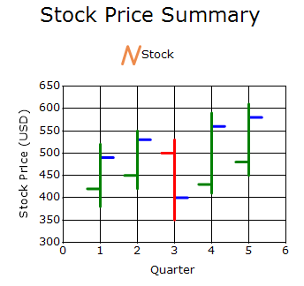
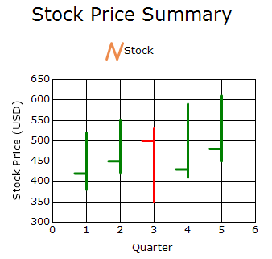
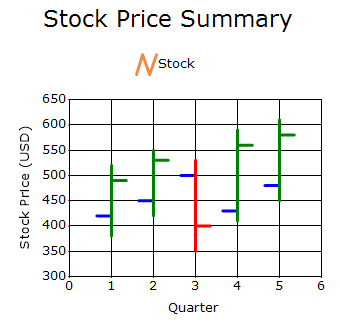

# Financial charts in windows forms chart

Financial Chart types are specialized charts designed to represent financial and stock market data that contains multiple values, such as open, high, low, and close prices. They provide a clear visual representation of price movements, trends, and market performance over time, making complex financial data easier to analyze and interpret.

The following features are supported in the Financial charts:

* **Chart 3-D Mode**: A chart can be rendered in 3D by enabling the `Series3D` property.

## HiLo open close chart

HiLo Open Close Chart is a financial chart commonly used in stock market analysis. It requires four Y-values for each data point `High`, `Low`, `Open`, and `Close` to represent a stock's price movement during a specific period, providing a clear view of trading activity and market trends.

N>
Chart details for area chart.
* Number of Y values per point - 4.
* Number of Series - One or More.
* Cannot be combined with - Pie, Bar, Polar, Radar, Stacked Bar.

The following code example demonstrates how to create a Hilo Open Close Chart.




ChartSeries series = new ChartSeries("Stock", ChartSeriesType.HiLoOpenClose);

// X, High, Low, Open, Close
series.Points.Add(1, 520, 380, 420, 490);
series.Points.Add(2, 550, 420, 450, 530);
series.Points.Add(3, 530, 350, 500, 400);
series.Points.Add(4, 590, 410, 430, 560);
series.Points.Add(5, 610, 450, 480, 580);

chartControl.Series.Add(series);

series.Style.Border.Width = 3;




Dim series As New ChartSeries("Stock", ChartSeriesType.HiLoOpenClose)

' X, High, Low, Open, Close
series.Points.Add(1, 520, 380, 420, 490)
series.Points.Add(2, 550, 420, 450, 530)
series.Points.Add(3, 530, 350, 500, 400)
series.Points.Add(4, 590, 410, 430, 560)
series.Points.Add(5, 610, 450, 480, 580)

chartControl.Series.Add(series)

' Increase line thickness
series.Style.Border.Width = 3




### Close tip color

The [CloseTipColor](https://help.syncfusion.com/cr/windowsforms/Syncfusion.Windows.Forms.Chart.ChartHiLoOpenCloseConfigItem.html#Syncfusion_Windows_Forms_Chart_ChartHiLoOpenCloseConfigItem_CloseTipColor) property specifies the color of the tip that represents the closing value in a HiLo Open Close chart, with `Color.Empty` as the default value.

The following code sets the close tip color to `Color.Blue`.



chartControl.Series[0].ConfigItems.HiLoOpenCloseItem.CloseTipColor = Color.Blue;


chartControl.Series(0).ConfigItems.HiLoOpenCloseItem.CloseTipColor = Color.Blue



### Draw mode

The [DrawMode](https://help.syncfusion.com/cr/windowsforms/Syncfusion.Windows.Forms.Chart.ChartHiLoOpenCloseConfigItem.html#Syncfusion_Windows_Forms_Chart_ChartHiLoOpenCloseConfigItem_DrawMode) property specifies whether the open tip, close tip, or both tips are displayed in a HiLo Open Close chart. By default, both tips are displayed using the `Both` draw mode.

The **DrawMode** property supports the following values:

- [Both](https://help.syncfusion.com/cr/windowsforms/Syncfusion.Windows.Forms.Chart.ChartOpenCloseDrawMode.html#Syncfusion_Windows_Forms_Chart_ChartOpenCloseDrawMode_Both): Displays both the open and close tips.
- [Close]((https://help.syncfusion.com/cr/windowsforms/Syncfusion.Windows.Forms.Chart.ChartOpenCloseDrawMode.html#Syncfusion_Windows_Forms_Chart_ChartOpenCloseDrawMode_Close)): Displays only the close tip.
- [Open]((https://help.syncfusion.com/cr/windowsforms/Syncfusion.Windows.Forms.Chart.ChartOpenCloseDrawMode.html#Syncfusion_Windows_Forms_Chart_ChartOpenCloseDrawMode_Open)): Displays only the open tip.

The following code displays only the open tip.



chartControl.Series[0].ConfigItems.HiLoOpenCloseItem.DrawMode = ChartOpenCloseDrawMode.Open;


chartControl.Series(0).ConfigItems.HiLoOpenCloseItem.DrawMode = ChartOpenCloseDrawMode.Open



### Open tip color

The [OpenTipColor](https://help.syncfusion.com/cr/windowsforms/Syncfusion.Windows.Forms.Chart.ChartHiLoOpenCloseConfigItem.html#Syncfusion_Windows_Forms_Chart_ChartHiLoOpenCloseConfigItem_OpenTipColor) property specifies the color of the tip that represents the opening value in a HiLo Open Close chart, with `Color.Empty` used as the default value.

The following code sets the open tip color to `Color.Blue`.



chartControl.Series[0].ConfigItems.HiLoOpenCloseItem.OpenTipColor = Color.Blue;


chartControl.Series(0).ConfigItems.HiLoOpenCloseItem.OpenTipColor = Color.Blue



### Customization option

The following chart series properties are used as customization options for HiLo Open Close chart:

- [DisplayText](https://help.syncfusion.com/windowsforms/chart/chart-series#displaytext)
- [DrawSeriesNameInDepth](https://help.syncfusion.com/windowsforms/chart/chart-series#drawseriesnameindepth)
- [FancyToolTip](https://help.syncfusion.com/windowsforms/chart/chart-series#fancytooltip)
- [Font](https://help.syncfusion.com/windowsforms/chart/chart-series#font)
- [Interior](https://help.syncfusion.com/windowsforms/chart/chart-series#interior)
- [LegendItem](https://help.syncfusion.com/windowsforms/chart/chart-series#legenditem)
- [Name](https://help.syncfusion.com/windowsforms/chart/chart-series#name)
- [OpenCloseDrawMode](https://help.syncfusion.com/windowsforms/chart/chart-series#openclosedrawmode)
- [PhongAlpha](https://help.syncfusion.com/windowsforms/chart/chart-series#phongalpha)
- [PointsToolTipFormat](https://help.syncfusion.com/windowsforms/chart/chart-series#pointstooltipformat)
- [Rotate](https://help.syncfusion.com/windowsforms/chart/chart-series#rotate)
- [ShadingMode](https://help.syncfusion.com/windowsforms/chart/chart-series#shadingmode)
- [SmartLabels](https://help.syncfusion.com/windowsforms/chart/chart-series#smartlabels)
- [Spacing Between Series](https://help.syncfusion.com/windowsforms/chart/chart-series#spacingbetweenseries)
- [Summary](https://help.syncfusion.com/windowsforms/chart/chart-series#summary)
- [Text](https://help.syncfusion.com/windowsforms/chart/chart-series#text-series)
- [TextColor](https://help.syncfusion.com/windowsforms/chart/chart-series#textcolor)
- [TextFormat](https://help.syncfusion.com/windowsforms/chart/chart-series#textformat)
- [TextOffset](https://help.syncfusion.com/windowsforms/chart/chart-series#textoffset)
- [TextOrientation](https://help.syncfusion.com/windowsforms/chart/chart-series#textorientation)
- [Visible](https://help.syncfusion.com/windowsforms/chart/chart-series#visible)

## Candle chart
A Candle Chart displays stock information using the `High`, `Low`, `Open` and `Close` values. The Hi and Lo values are represented by the wick of a candle. The candle represents open and close values.

n>
Chart details for candle chart.
* Number of Y values per point - 4 (High, Low, Open and Close respectively).
* Number of Series - One or More.
* Cannot be combined with - Pie, Bar, Polar, Radar, Stacked Bar.

The following code example demonstrates how to create a Candle Chart.




ChartSeries series = new ChartSeries("Stock", ChartSeriesType.Candle);

series.Points.Add(1, 500, 250, 380, 420); // body 40
series.Points.Add(2, 530, 280, 340, 480); // body 140
series.Points.Add(3, 520, 220, 450, 320); // body 130
series.Points.Add(4, 480, 300, 350, 440); // body 90
series.Points.Add(5, 460, 270, 420, 340); // body 80

chartControl.Series.Add(series);




Dim series As New ChartSeries("Stock", ChartSeriesType.Candle)

' X, High, Low, Open, Close
series.Points.Add(1, 500, 250, 380, 420) ' Body = 40
series.Points.Add(2, 530, 280, 340, 480) ' Body = 140
series.Points.Add(3, 520, 220, 450, 320) ' Body = 130
series.Points.Add(4, 480, 300, 350, 440) ' Body = 90
series.Points.Add(5, 460, 270, 420, 340) ' Body = 80

chartControl.Series.Add(series)




### Customization option

The following chart series properties are used as customization options for Candle chart:

- [Border](https://help.syncfusion.com/windowsforms/chart/chart-series#border)
- [DisplayShadow](https://help.syncfusion.com/windowsforms/chart/chart-series#displayshadow)
- [DisplayText](https://help.syncfusion.com/windowsforms/chart/chart-series#displaytext)
- [DrawSeriesNameInDepth](https://help.syncfusion.com/windowsforms/chart/chart-series#drawseriesnameindepth)
- [FancyToolTip](https://help.syncfusion.com/windowsforms/chart/chart-series#fancytooltip)
- [Font](https://help.syncfusion.com/windowsforms/chart/chart-series#font)
- [ImageIndex](https://help.syncfusion.com/windowsforms/chart/chart-series#imageindex)
- [Images](https://help.syncfusion.com/windowsforms/chart/chart-series#images)
- [Interior](https://help.syncfusion.com/windowsforms/chart/chart-series#interior)
- [LegendItem](https://help.syncfusion.com/windowsforms/chart/chart-series#legenditem)
- [Name](https://help.syncfusion.com/windowsforms/chart/chart-series#name)
- [PhongAlpha](https://help.syncfusion.com/windowsforms/chart/chart-series#phongalpha)
- [PointsToolTipFormat](https://help.syncfusion.com/windowsforms/chart/chart-series#pointstooltipformat)
- [Rotate](https://help.syncfusion.com/windowsforms/chart/chart-series#rotate)
- [ShadingMode](https://help.syncfusion.com/windowsforms/chart/chart-series#shadingmode)
- [ShadowInterior](https://help.syncfusion.com/windowsforms/chart/chart-series#shadowinterior)
- [ShadowOffset](https://help.syncfusion.com/windowsforms/chart/chart-series#shadowoffset)
- [SmartLabels](https://help.syncfusion.com/windowsforms/chart/chart-series#smartlabels)
- [Spacing Between Series](https://help.syncfusion.com/windowsforms/chart/chart-series#spacingbetweenseries)
- [Summary](https://help.syncfusion.com/windowsforms/chart/chart-series#summary)
- [Text](https://help.syncfusion.com/windowsforms/chart/chart-series#text-series)
- [TextColor](https://help.syncfusion.com/windowsforms/chart/chart-series#textcolor)
- [TextFormat](https://help.syncfusion.com/windowsforms/chart/chart-series#textformat)
- [TextOffset](https://help.syncfusion.com/windowsforms/chart/chart-series#textoffset)
- [TextOrientation](https://help.syncfusion.com/windowsforms/chart/chart-series#textorientation)
- [Visible](https://help.syncfusion.com/windowsforms/chart/chart-series#visible)