# Funnel and Pyramid Chart in Windows Forms Charts

## Pyramid chart
Pyramid Chart is a single-series chart that represents data as portions of 100% and does not use axes. It is similar to a Funnel Chart and is often used to display hierarchical or geographical data. Pyramid charts can be displayed in 2D or 3D mode.

N>
Chart Details
* Cannot be combined with - Any other chart types.

The following code example demonstrates how to create a Pyramid chart.




ChartSeries series = new ChartSeries("Pyramid chart", ChartSeriesType.Pyramid);
series.Points.Add(0, 25);
series.Points.Add(1, 25);
series.Points.Add(2, 25);
series.Points.Add(3, 25);
series.Points.Add(4, 25);
chartControl.Series.Add(series);

series.Styles[0].Text = "Oats\n4.15%";
series.Styles[1].Text = "Barley\n12.89%";
series.Styles[2].Text = "Maize\n21.62%";
series.Styles[3].Text = " Rice\n23.75%";
series.Styles[4].Text = "Wheat\n37.5%";

series.Style.DisplayText = true;
series.Style.TextColor = Color.Black;

series.ConfigItems.PyramidItem.LabelStyle = ChartAccumulationLabelStyle.OutsideInColumn;
series.ConfigItems.PyramidItem.LabelPlacement = ChartAccumulationLabelPlacement.Center;

chartControl.Legend.Visible = false;




' Pyramid Series
Dim series As New ChartSeries("Pyramid chart", ChartSeriesType.Pyramid)

series.Points.Add(0, 25)
series.Points.Add(1, 25)
series.Points.Add(2, 25)
series.Points.Add(3, 25)
series.Points.Add(4, 25)

chartControl.Series.Add(series)

' Labels
series.Styles(0).Text = "Oats" & vbLf & "4.15%"
series.Styles(1).Text = "Barley" & vbLf & "12.89%"
series.Styles(2).Text = "Maize" & vbLf & "21.62%"
series.Styles(3).Text = "Rice" & vbLf & "23.75%"
series.Styles(4).Text = "Wheat" & vbLf & "37.5%"

' Display Labels
series.Style.DisplayText = True
series.Style.TextColor = Color.Black

' Pyramid Settings
series.ConfigItems.PyramidItem.LabelStyle = ChartAccumulationLabelStyle.OutsideInColumn
series.ConfigItems.PyramidItem.LabelPlacement = ChartAccumulationLabelPlacement.Center

' Hide Legend
chartControl.Legend.Visible = False




### Figure base

The [FigureBase](https://help.syncfusion.com/cr/windowsforms/Syncfusion.Windows.Forms.Chart.ChartPyramidConfigItem.html#Syncfusion_Windows_Forms_Chart_ChartPyramidConfigItem_FigureBase) property specifies the shape of the Pyramid chart base when the chart is rendered in 3D mode.

The available base types are:

- [Square](https://help.syncfusion.com/cr/windowsforms/Syncfusion.Windows.Forms.Chart.ChartFigureBase.html#Syncfusion_Windows_Forms_Chart_ChartFigureBase_Square): Renders the Pyramid chart with a square base. This is the default value.
- [Circle](https://help.syncfusion.com/cr/windowsforms/Syncfusion.Windows.Forms.Chart.ChartFigureBase.html#Syncfusion_Windows_Forms_Chart_ChartFigureBase_Circle): Renders the Pyramid chart with a circular base.

The following code displays the Pyramid chart with a circular base.



chartControl.Series[0].ConfigItems.PyramidItem.FigureBase = ChartFigureBase.Circle;


chartControl.Series(0).ConfigItems.PyramidItem.FigureBase = ChartFigureBase.Circle



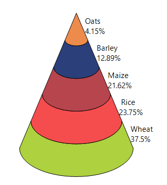

### Gap ratio

The [GapRatio](https://help.syncfusion.com/cr/windowsforms/Syncfusion.Windows.Forms.Chart.ChartPyramidConfigItem.html#Syncfusion_Windows_Forms_Chart_ChartPyramidConfigItem_GapRatio) property specifies the amount of space between the Pyramid chart segments. The default value is `0.0f`, which displays the segments without a gap.

Increasing the value increases the separation between the segments.

The following code sets the gap ratio to `0.2f`.



chartControl.Series[0].ConfigItems.PyramidItem.GapRatio = 0.2f;


chartControl.Series(0).ConfigItems.PyramidItem.GapRatio = 0.2F



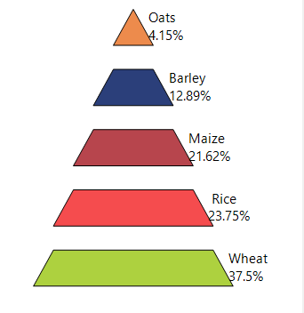

### Label placement

The [LabelPlacement](https://help.syncfusion.com/cr/windowsforms/Syncfusion.Windows.Forms.Chart.ChartPyramidConfigItem.html#Syncfusion_Windows_Forms_Chart_ChartPyramidConfigItem_LabelPlacement) property specifies the position of data labels relative to the Pyramid chart segments. This property works together with the [LabelStyle](https://help.syncfusion.com/cr/windowsforms/Syncfusion.Windows.Forms.Chart.ChartPyramidConfigItem.html#Syncfusion_Windows_Forms_Chart_ChartPyramidConfigItem_LabelStyle) property. [Right](https://help.syncfusion.com/cr/windowsforms/Syncfusion.Windows.Forms.Chart.ChartAccumulationLabelPlacement.html#Syncfusion_Windows_Forms_Chart_ChartAccumulationLabelPlacement_Right) is the default value.

The available label positions are:

- [Top](https://help.syncfusion.com/cr/windowsforms/Syncfusion.Windows.Forms.Chart.ChartAccumulationLabelPlacement.html#Syncfusion_Windows_Forms_Chart_ChartAccumulationLabelPlacement_Top): Positions the label at the top of the Pyramid chart segment.
- [Bottom](https://help.syncfusion.com/cr/windowsforms/Syncfusion.Windows.Forms.Chart.ChartAccumulationLabelPlacement.html#Syncfusion_Windows_Forms_Chart_ChartAccumulationLabelPlacement_Bottom): Positions the label at the bottom of the Pyramid chart segment.
- [Center](https://help.syncfusion.com/cr/windowsforms/Syncfusion.Windows.Forms.Chart.ChartAccumulationLabelPlacement.html#Syncfusion_Windows_Forms_Chart_ChartAccumulationLabelPlacement_Center): Positions the label at the center of the Pyramid chart segment.
- [Left](https://help.syncfusion.com/cr/windowsforms/Syncfusion.Windows.Forms.Chart.ChartAccumulationLabelPlacement.html#Syncfusion_Windows_Forms_Chart_ChartAccumulationLabelPlacement_Left): Positions the label to the left of the Pyramid chart segment.
- [Right](https://help.syncfusion.com/cr/windowsforms/Syncfusion.Windows.Forms.Chart.ChartAccumulationLabelPlacement.html#Syncfusion_Windows_Forms_Chart_ChartAccumulationLabelPlacement_Right): Positions the label to the right of the Pyramid chart segment.

The following code positions labels to the left of Pyramid chart segments.



chartControl.Series[0].ConfigItems.PyramidItem.LabelPlacement = ChartAccumulationLabelPlacement.Left;


chartControl.Series(0).ConfigItems.PyramidItem.LabelPlacement = ChartAccumulationLabelPlacement.Left



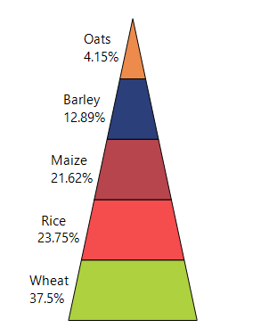

### Label style

The [LabelStyle](https://help.syncfusion.com/cr/windowsforms/Syncfusion.Windows.Forms.Chart.ChartPyramidConfigItem.html#Syncfusion_Windows_Forms_Chart_ChartPyramidConfigItem_LabelStyle) property specifies how data labels are displayed in the Pyramid chart. By default, labels are displayed outside the Pyramid chart segments using the [Outside](https://help.syncfusion.com/cr/windowsforms/Syncfusion.Windows.Forms.Chart.ChartAccumulationLabelStyle.html#Syncfusion_Windows_Forms_Chart_ChartAccumulationLabelStyle_Outside) style.

The available label styles are:

- [Disabled](https://help.syncfusion.com/cr/windowsforms/Syncfusion.Windows.Forms.Chart.ChartAccumulationLabelStyle.html#Syncfusion_Windows_Forms_Chart_ChartAccumulationLabelStyle_Disabled): Hides the data labels.
- [Inside](https://help.syncfusion.com/cr/windowsforms/Syncfusion.Windows.Forms.Chart.ChartAccumulationLabelStyle.html#Syncfusion_Windows_Forms_Chart_ChartAccumulationLabelStyle_Inside): Displays the labels inside the Pyramid chart segments.
- [Outside](https://help.syncfusion.com/cr/windowsforms/Syncfusion.Windows.Forms.Chart.ChartAccumulationLabelStyle.html#Syncfusion_Windows_Forms_Chart_ChartAccumulationLabelStyle_Outside): Displays the labels outside the Pyramid chart segments.
- [OutsideInArea](https://help.syncfusion.com/cr/windowsforms/Syncfusion.Windows.Forms.Chart.ChartAccumulationLabelStyle.html#Syncfusion_Windows_Forms_Chart_ChartAccumulationLabelStyle_OutsideInArea): Displays the labels outside the segments but within the chart area.
- [OutsideInColumn](https://help.syncfusion.com/cr/windowsforms/Syncfusion.Windows.Forms.Chart.ChartAccumulationLabelStyle.html#Syncfusion_Windows_Forms_Chart_ChartAccumulationLabelStyle_OutsideInColumn): Displays the labels outside the segments and arranges them in columns.

The following code displays data labels outside the Pyramid chart segments and arranges them in columns.



chartControl.Series[0].ConfigItems.PyramidItem.LabelStyle =
    ChartAccumulationLabelStyle.OutsideInColumn;


chartControl.Series(0).ConfigItems.PyramidItem.LabelStyle =
    ChartAccumulationLabelStyle.OutsideInColumn



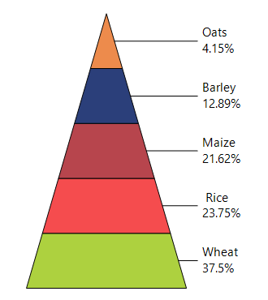

### Pyramid mode

The [PyramidMode](https://help.syncfusion.com/cr/windowsforms/Syncfusion.Windows.Forms.Chart.ChartPyramidConfigItem.html#Syncfusion_Windows_Forms_Chart_ChartPyramidConfigItem_PyramidMode) property specifies how Y-values determine the size of the Pyramid chart segments, with [Linear](https://help.syncfusion.com/cr/windowsforms/Syncfusion.Windows.Forms.Chart.ChartPyramidMode.html#Syncfusion_Windows_Forms_Chart_ChartPyramidMode_Linear) used as the default mode.

The available modes are:

- [Linear](https://help.syncfusion.com/cr/windowsforms/Syncfusion.Windows.Forms.Chart.ChartPyramidMode.html#Syncfusion_Windows_Forms_Chart_ChartPyramidMode_Linear): Makes the height of each segment proportional to its Y-value.
- [Surface](https://help.syncfusion.com/cr/windowsforms/Syncfusion.Windows.Forms.Chart.ChartPyramidMode.html#Syncfusion_Windows_Forms_Chart_ChartPyramidMode_Surface): Makes the surface area of each segment proportional to its Y-value.

The following code calculates the Pyramid chart segments based on their surface area.



chartControl.Series[0].ConfigItems.PyramidItem.PyramidMode = ChartPyramidMode.Surface;


chartControl.Series(0).ConfigItems.PyramidItem.PyramidMode = ChartPyramidMode.Surface



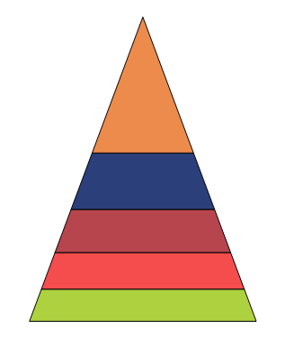

### Show databind labels

The [ShowDataBindLabels](https://help.syncfusion.com/cr/windowsforms/Syncfusion.Windows.Forms.Chart.ChartPyramidConfigItem.html#Syncfusion_Windows_Forms_Chart_ChartPyramidConfigItem_ShowDataBindLabels) property controls whether the bound data source are displayed on the Pyramid chart segments and is set to `false` by default.

The following code displays data-bound labels on Pyramid chart segments.



DataTable table = new DataTable("PyramidData");

table.Columns.Add("Position", typeof(int));
table.Columns.Add("Category", typeof(string));
table.Columns.Add("Value", typeof(double));
table.Rows.Add(0, "Oats", 4.15);
table.Rows.Add(1, "Barley", 12.89);
table.Rows.Add(2, "Maize", 21.62);
table.Rows.Add(3, "Rice", 23.75);
table.Rows.Add(4, "Wheat", 37.50);
// Binds the X-values and Y-values to the series.
ChartDataBindModel seriesModel =
new ChartDataBindModel(table);
            seriesModel.YNames = new string[] { "Value" };

            // Creates the Pyramid series.
            ChartSeries series = new ChartSeries(
"Pyramid chart",

ChartSeriesType.Pyramid);

series.SeriesModel = seriesModel;
series.Style.DisplayText = true;
series.Style.TextColor = Color.Black;

// Binds the category names as labels.
ChartDataBindAxisLabelModel labelModel =
new ChartDataBindAxisLabelModel(table);

labelModel.LabelName = "Category";

chartControl.PrimaryXAxis.LabelsImpl = labelModel;

// Displays the data-bound labels.

series.ConfigItems.PyramidItem.ShowDataBindLabels =
true;
series.ConfigItems.PyramidItem.LabelStyle =
ChartAccumulationLabelStyle.Inside;

series.ConfigItems.PyramidItem.LabelPlacement =
ChartAccumulationLabelPlacement.Center;

// Adds the data-bound series.
chartControl.Series.Add(series);
chartControl.Legend.Visible = false;




' Creates the data source.
Dim table As New DataTable("PyramidData")

table.Columns.Add("Position", GetType(Integer))
table.Columns.Add("Category", GetType(String))
table.Columns.Add("Value", GetType(Double))

table.Rows.Add(0, "Oats", 4.15)
table.Rows.Add(1, "Barley", 12.89)
table.Rows.Add(2, "Maize", 21.62)
table.Rows.Add(3, "Rice", 23.75)
table.Rows.Add(4, "Wheat", 37.5)

' Binds the Y-values to the series.
Dim seriesModel As New ChartDataBindModel(table)

seriesModel.YNames = New String() {"Value"}

' Creates the Pyramid series.
Dim series As New ChartSeries(
    "Pyramid chart",
    ChartSeriesType.Pyramid)

series.SeriesModel = seriesModel
series.Style.DisplayText = True
series.Style.TextColor = Color.Black

' Binds the category names as labels.
Dim labelModel As New ChartDataBindAxisLabelModel(table)

labelModel.LabelName = "Category"

chartControl.PrimaryXAxis.LabelsImpl = labelModel

' Displays the data-bound labels.
series.ConfigItems.PyramidItem.ShowDataBindLabels = True

series.ConfigItems.PyramidItem.LabelStyle =
    ChartAccumulationLabelStyle.Inside

series.ConfigItems.PyramidItem.LabelPlacement =
    ChartAccumulationLabelPlacement.Center

' Adds the data-bound series.
chartControl.Series.Add(series)

chartControl.Legend.Visible = False



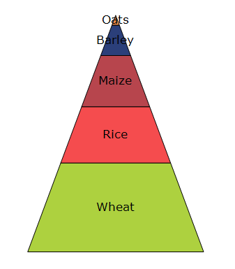

### Show series title

The [ShowSeriesTitle](https://help.syncfusion.com/cr/windowsforms/Syncfusion.Windows.Forms.Chart.ChartPyramidConfigItem.html#Syncfusion_Windows_Forms_Chart_ChartPyramidConfigItem_ShowSeriesTitle) property controls whether the series title is displayed in the pyramid chart. By default, this property is set to `false`.

The following code displays the series title in the Pyramid chart.



chartControl.Series[0].ConfigItems.PyramidItem.ShowSeriesTitle = true;


chartControl.Series(0).ConfigItems.PyramidItem.ShowSeriesTitle = True



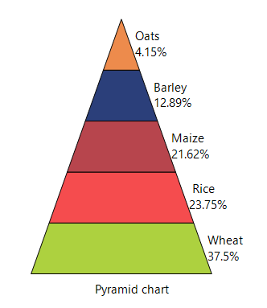

### Customization option

The following chart series properties are used as customization options for Pyramid chart:

- [Border](https://help.syncfusion.com/windowsforms/chart/chart-series#border)
- [DisplayText](https://help.syncfusion.com/windowsforms/chart/chart-series#displaytext)
- [DrawSeriesNameInDepth](https://help.syncfusion.com/windowsforms/chart/chart-series#drawseriesnameindepth)
- [FancyToolTip](https://help.syncfusion.com/windowsforms/chart/chart-series#fancytooltip)
- [FigureBase](https://help.syncfusion.com/windowsforms/chart/chart-series#figurebase)
- [Font](https://help.syncfusion.com/windowsforms/chart/chart-series#font)
- [GapRatio](https://help.syncfusion.com/windowsforms/chart/chart-series#gapratio)
- [HighlightInterior](https://help.syncfusion.com/windowsforms/chart/chart-series#highlightinterior)
- [Interior](https://help.syncfusion.com/windowsforms/chart/chart-series#interior)
- [LabelPlacement](https://help.syncfusion.com/windowsforms/chart/chart-series#labelplacement)
- [LabelStyle](https://help.syncfusion.com/windowsforms/chart/chart-series#labelstyle)
- [LegendItem](https://help.syncfusion.com/windowsforms/chart/chart-series#legenditem)
- [Name](https://help.syncfusion.com/windowsforms/chart/chart-series#name)
- [PointsToolTipFormat](https://help.syncfusion.com/windowsforms/chart/chart-series#pointstooltipformat)
- [PyramidMode](https://help.syncfusion.com/windowsforms/chart/chart-series#pyramidmode)
- [ShowDataBindLabels](https://help.syncfusion.com/windowsforms/chart/chart-series#showdatabindlabels)
- [SmartLabels](https://help.syncfusion.com/windowsforms/chart/chart-series#smartlabels)
- [Summary](https://help.syncfusion.com/windowsforms/chart/chart-series#summary)
- [Text](https://help.syncfusion.com/windowsforms/chart/chart-series#text-series)
- [TextColor](https://help.syncfusion.com/windowsforms/chart/chart-series#textcolor)
- [TextFormat](https://help.syncfusion.com/windowsforms/chart/chart-series#textformat)
- [TextOffset](https://help.syncfusion.com/windowsforms/chart/chart-series#textoffset)
- [TextOrientation](https://help.syncfusion.com/windowsforms/chart/chart-series#textorientation)
- [Visible](https://help.syncfusion.com/windowsforms/chart/chart-series#visible)

## Funnel chart

A Funnel Chart is a single-series chart that represents data as portions of 100% and does not use axes. It is commonly used to visualize stages in a process, such as a sales pipeline, and can be displayed in 2D or 3D mode.

N>
Chart details for funnel chart.
* Cannot be combined with - Any other chart types.

The following code example demonstrates how to create a Funnel chart.




ChartSeries series = new ChartSeries("Funnel chart", ChartSeriesType.Funnel);
series.Points.Add(0, 25);
series.Points.Add(1, 25);
series.Points.Add(2, 25);
series.Points.Add(3, 25);
series.Points.Add(4, 25);
chartControl.Series.Add(series);

series.Styles[0].Text = "Oats\n4.15%";
series.Styles[1].Text = "Barley\n12.89%";
series.Styles[2].Text = "Maize\n21.62%";
series.Styles[3].Text = " Rice\n23.75%";
series.Styles[4].Text = "Wheat\n37.5%";

series.Style.DisplayText = true;
series.Style.TextColor = Color.Black;

series.ConfigItems.FunnelItem.LabelStyle = ChartAccumulationLabelStyle.OutsideInColumn;
series.ConfigItems.FunnelItem.LabelPlacement = ChartAccumulationLabelPlacement.Center;

chartControl.Legend.Visible = false;




' Funnel Series
Dim series As New ChartSeries("Funnel chart", ChartSeriesType.Funnel)

series.Points.Add(0, 25)
series.Points.Add(1, 25)
series.Points.Add(2, 25)
series.Points.Add(3, 25)
series.Points.Add(4, 25)

chartControl.Series.Add(series)

' Data Labels
series.Styles(0).Text = "Oats" & vbLf & "4.15%"
series.Styles(1).Text = "Barley" & vbLf & "12.89%"
series.Styles(2).Text = "Maize" & vbLf & "21.62%"
series.Styles(3).Text = "Rice" & vbLf & "23.75%"
series.Styles(4).Text = "Wheat" & vbLf & "37.5%"

' Series Style
series.Style.DisplayText = True
series.Style.TextColor = Color.Black

' Funnel Configuration
series.ConfigItems.FunnelItem.LabelStyle = ChartAccumulationLabelStyle.OutsideInColumn
series.ConfigItems.FunnelItem.LabelPlacement = ChartAccumulationLabelPlacement.Center

' Legend
chartControl.Legend.Visible = False




### Figure base

The [FigureBase](https://help.syncfusion.com/cr/windowsforms/Syncfusion.Windows.Forms.Chart.ChartFunnelConfigItem.html#Syncfusion_Windows_Forms_Chart_ChartFunnelConfigItem_FigureBase) property specifies the funnel base when the chart is rendered in 3D mode.

The supported values are defined in the [ChartFigureBase](https://help.syncfusion.com/cr/windowsforms/Syncfusion.Windows.Forms.Chart.ChartPyramidMode.html) enumeration:

- [Circle](https://help.syncfusion.com/cr/windowsforms/Syncfusion.Windows.Forms.Chart.ChartFigureBase.html#Syncfusion_Windows_Forms_Chart_ChartFigureBase_Circle): Renders the Funnel chart with a circular base. This is the default value.
- [Square](https://help.syncfusion.com/cr/windowsforms/Syncfusion.Windows.Forms.Chart.ChartFigureBase.html#Syncfusion_Windows_Forms_Chart_ChartFigureBase_Square): Renders the Funnel chart with a square base.

The following code renders the Funnel chart with a square base when the chart is displayed in 3D mode.



chartControl.Series[0].ConfigItems.FunnelItem.FigureBase = ChartFigureBase.Square;


chartControl.Series(0).ConfigItems.FunnelItem.FigureBase = ChartFigureBase.Square



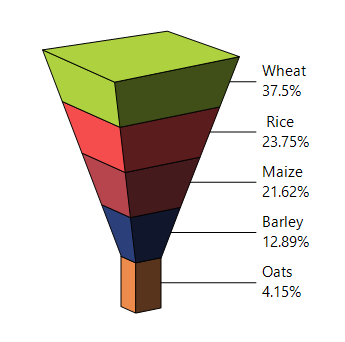

### Funnel mode

The [FunnelMode](https://help.syncfusion.com/cr/windowsforms/Syncfusion.Windows.Forms.Chart.ChartFunnelConfigItem.html#Syncfusion_Windows_Forms_Chart_ChartFunnelConfigItem_FunnelMode) property specifies whether the Y-values are used to calculate the height or width of the funnel blocks.

It supports the following values:

- [YIsHeight](https://help.syncfusion.com/cr/windowsforms/Syncfusion.Windows.Forms.Chart.ChartFunnelMode.html#Syncfusion_Windows_Forms_Chart_ChartFunnelMode_YIsHeight): Uses the Y-value to calculate the height of each funnel block. It is the default value of the Funnel mode.
- [YIsWidth](https://help.syncfusion.com/cr/windowsforms/Syncfusion.Windows.Forms.Chart.ChartFunnelMode.html#Syncfusion_Windows_Forms_Chart_ChartFunnelMode_YIsWidth): Uses the Y-value to calculate the width of each funnel block.

The following code calculates the width of each funnel block based on its Y-value.



chartControl.Series[0].ConfigItems.FunnelItem.FunnelMode = ChartFunnelMode.YIsWidth;


chartControl.Series(0).ConfigItems.FunnelItem.FunnelMode = ChartFunnelMode.YIsWidth



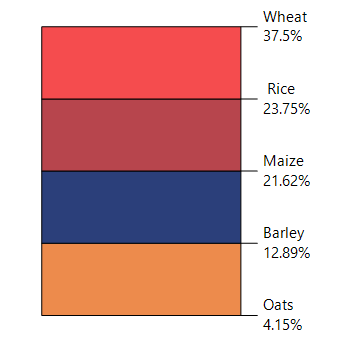

### Gap ratio

The [GapRatio](https://help.syncfusion.com/cr/windowsforms/Syncfusion.Windows.Forms.Chart.ChartFunnelConfigItem.html#Syncfusion_Windows_Forms_Chart_ChartFunnelConfigItem_GapRatio) property specifies the amount of space between funnel blocks. The default value is `0.0f`, which renders the blocks without any gap.

Increasing the GapRatio value increases the separation between adjacent funnel blocks.

The following code sets the gap ratio.



chartControl.Series[0].ConfigItems.FunnelItem.GapRatio = 0.2f;


chartControl.Series(0).ConfigItems.FunnelItem.GapRatio = 0.2F



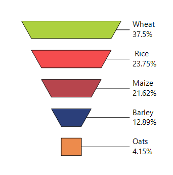

### Label placement

The [LabelPlacement](https://help.syncfusion.com/cr/windowsforms/Syncfusion.Windows.Forms.Chart.ChartFunnelConfigItem.html#Syncfusion_Windows_Forms_Chart_ChartFunnelConfigItem_LabelPlacement) determines the positioning of data labels in addition to the [LabelStyle](https://help.syncfusion.com/cr/windowsforms/Syncfusion.Windows.Forms.Chart.ChartFunnelConfigItem.html#Syncfusion_Windows_Forms_Chart_ChartFunnelConfigItem_LabelStyle) property. By default, labels are positioned to the [Right](https://help.syncfusion.com/cr/windowsforms/Syncfusion.Windows.Forms.Chart.ChartAccumulationLabelPlacement.html#Syncfusion_Windows_Forms_Chart_ChartAccumulationLabelPlacement_Right) of the Funnel chart segments.

This property supports the following values:

- [Top](https://help.syncfusion.com/cr/windowsforms/Syncfusion.Windows.Forms.Chart.ChartAccumulationLabelPlacement.html#Syncfusion_Windows_Forms_Chart_ChartAccumulationLabelPlacement_Top): Positions the label at the top of the segment.
- [Bottom](https://help.syncfusion.com/cr/windowsforms/Syncfusion.Windows.Forms.Chart.ChartAccumulationLabelPlacement.html#Syncfusion_Windows_Forms_Chart_ChartAccumulationLabelPlacement_Bottom): Positions the label at the bottom of the segment.
- [Center](https://help.syncfusion.com/cr/windowsforms/Syncfusion.Windows.Forms.Chart.ChartAccumulationLabelPlacement.html#Syncfusion_Windows_Forms_Chart_ChartAccumulationLabelPlacement_Center): Positions the label at the center of the segment.
- [Left](https://help.syncfusion.com/cr/windowsforms/Syncfusion.Windows.Forms.Chart.ChartAccumulationLabelPlacement.html#Syncfusion_Windows_Forms_Chart_ChartAccumulationLabelPlacement_Left): Positions the label to the left of the segment.
- [Right](https://help.syncfusion.com/cr/windowsforms/Syncfusion.Windows.Forms.Chart.ChartAccumulationLabelPlacement.html#Syncfusion_Windows_Forms_Chart_ChartAccumulationLabelPlacement_Right): Positions the label to the right of the segment. 

The following code positions labels to the left of funnel blocks.



chartControl.Series[0].ConfigItems.FunnelItem.LabelPlacement = ChartAccumulationLabelPlacement.Left;


chartControl.Series(0).ConfigItems.FunnelItem.LabelPlacement = ChartAccumulationLabelPlacement.Left



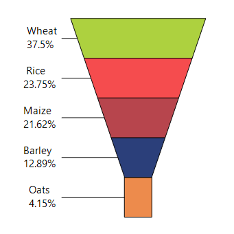

### Label style

The [LabelStyle](https://help.syncfusion.com/cr/windowsforms/Syncfusion.Windows.Forms.Chart.ChartFunnelConfigItem.html#Syncfusion_Windows_Forms_Chart_ChartFunnelConfigItem_LabelStyle) property specifies how data labels are displayed in the funnel chart.

It supports the following values:

- [Disabled](https://help.syncfusion.com/cr/windowsforms/Syncfusion.Windows.Forms.Chart.ChartAccumulationLabelStyle.html#Syncfusion_Windows_Forms_Chart_ChartAccumulationLabelStyle_Disabled): Hides the data labels.
- [Inside](https://help.syncfusion.com/cr/windowsforms/Syncfusion.Windows.Forms.Chart.ChartAccumulationLabelStyle.html#Syncfusion_Windows_Forms_Chart_ChartAccumulationLabelStyle_Inside): Displays labels inside the funnel blocks.
- [Outside](https://help.syncfusion.com/cr/windowsforms/Syncfusion.Windows.Forms.Chart.ChartAccumulationLabelStyle.html#Syncfusion_Windows_Forms_Chart_ChartAccumulationLabelStyle_Outside): Displays labels outside the funnel blocks. This is the default value.
- [OutsideInArea](https://help.syncfusion.com/cr/windowsforms/Syncfusion.Windows.Forms.Chart.ChartAccumulationLabelStyle.html#Syncfusion_Windows_Forms_Chart_ChartAccumulationLabelStyle_OutsideInArea): Displays labels outside the blocks but within the chart area.
- [OutsideInColumn](https://help.syncfusion.com/cr/windowsforms/Syncfusion.Windows.Forms.Chart.ChartAccumulationLabelStyle.html#Syncfusion_Windows_Forms_Chart_ChartAccumulationLabelStyle_OutsideInColumn): Displays labels outside the blocks and arranges them in columns.

The following code displays data labels outside the funnel blocks and arranges them in columns.



chartControl.Series[0].ConfigItems.FunnelItem.LabelStyle = ChartAccumulationLabelStyle.OutsideInColumn;


chartControl.Series(0).ConfigItems.FunnelItem.LabelStyle = ChartAccumulationLabelStyle.OutsideInColumn



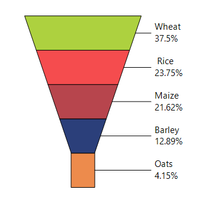

### Show databind labels

The [ShowDataBindLabels](https://help.syncfusion.com/cr/windowsforms/Syncfusion.Windows.Forms.Chart.ChartFunnelConfigItem.html#Syncfusion_Windows_Forms_Chart_ChartFunnelConfigItem_ShowDataBindLabels) property controls whether labels obtained from the bound data source are displayed on the funnel blocks. The default value is `false`, which hides data-bound labels on funnel blocks.

The following code displays data-bound labels on funnel blocks.



DataTable table = new DataTable("FunnelData");

table.Columns.Add("Position", typeof(int));
table.Columns.Add("Category", typeof(string));
table.Columns.Add("Value", typeof(double));

table.Rows.Add(0, "Oats", 25);
table.Rows.Add(1, "Barley", 25);
table.Rows.Add(2, "Maize", 25);
table.Rows.Add(3, "Rice", 25);
table.Rows.Add(4, "Wheat", 25);

// Bind values.
ChartDataBindModel seriesModel =
    new ChartDataBindModel(table);

seriesModel.YNames = new string[] { "Value" };

// Create Funnel series.
ChartSeries series = new ChartSeries(
    "Funnel chart",
    ChartSeriesType.Funnel);

series.SeriesModel = seriesModel;

series.Style.DisplayText = true;
series.Style.TextColor = Color.Black;

// Bind category names as labels.
ChartDataBindAxisLabelModel labelModel =
    new ChartDataBindAxisLabelModel(table);

labelModel.LabelName = "Category";

chartControl.PrimaryXAxis.LabelsImpl =
    labelModel;

// Display data-bound labels.
series.ConfigItems.FunnelItem.ShowDataBindLabels =
    true;

series.ConfigItems.FunnelItem.LabelStyle =
    ChartAccumulationLabelStyle.OutsideInColumn;

chartControl.Series.Add(series);

chartControl.Legend.Visible = false;



Dim table As New DataTable("FunnelData")

table.Columns.Add("Position", GetType(Integer))
table.Columns.Add("Category", GetType(String))
table.Columns.Add("Value", GetType(Double))

table.Rows.Add(0, "Oats", 25)
table.Rows.Add(1, "Barley", 25)
table.Rows.Add(2, "Maize", 25)
table.Rows.Add(3, "Rice", 25)
table.Rows.Add(4, "Wheat", 25)

Dim seriesModel As New ChartDataBindModel(table)

seriesModel.YNames =
    New String() {"Value"}

Dim series As New ChartSeries(
    "Funnel chart",
    ChartSeriesType.Funnel)

series.SeriesModel = seriesModel

series.Style.DisplayText = True
series.Style.TextColor = Color.Black

Dim labelModel As New ChartDataBindAxisLabelModel(table)

labelModel.LabelName = "Category"

chartControl.PrimaryXAxis.LabelsImpl =
    labelModel

series.ConfigItems.FunnelItem.ShowDataBindLabels =
    True

series.ConfigItems.FunnelItem.LabelStyle =
    ChartAccumulationLabelStyle.OutsideInColumn

chartControl.Series.Add(series)

chartControl.Legend.Visible = False



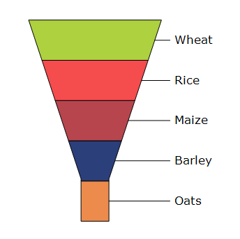

### Show series title

The [ShowSeriesTitle](https://help.syncfusion.com/cr/windowsforms/Syncfusion.Windows.Forms.Chart.ChartFunnelConfigItem.html#Syncfusion_Windows_Forms_Chart_ChartFunnelConfigItem_ShowSeriesTitle) property controls whether the series title is displayed in the funnel chart. By default, this property is set to `false`, so the series title is not displayed in the Funnel chart.

The following code displays the series title in the Funnel chart.



chartControl.Series[0].ConfigItems.FunnelItem.ShowSeriesTitle = true;



chartControl.Series(0).ConfigItems.FunnelItem.ShowSeriesTitle = True




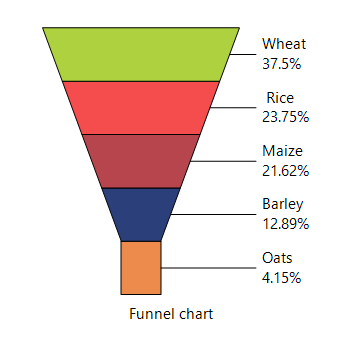

### Customization option

The following chart series properties are used as customization options for Funnel chart:

- [Border](https://help.syncfusion.com/windowsforms/chart/chart-series#border)
- [DisplayText](https://help.syncfusion.com/windowsforms/chart/chart-series#displaytext)
- [DrawSeriesNameInDepth](https://help.syncfusion.com/windowsforms/chart/chart-series#drawseriesnameindepth)
- [FancyToolTip](https://help.syncfusion.com/windowsforms/chart/chart-series#fancytooltip)
- [FigureBase](https://help.syncfusion.com/windowsforms/chart/chart-series#figurebase)
- [Font](https://help.syncfusion.com/windowsforms/chart/chart-series#font)
- [FunnelMode](https://help.syncfusion.com/windowsforms/chart/chart-series#funnelmode)
- [GapRatio](https://help.syncfusion.com/windowsforms/chart/chart-series#gapratio)
- [HighlightInterior](https://help.syncfusion.com/windowsforms/chart/chart-series#highlightinterior)
- [Interior](https://help.syncfusion.com/windowsforms/chart/chart-series#interior)
- [LabelPlacement](https://help.syncfusion.com/windowsforms/chart/chart-series#labelplacement)
- [LabelStyle](https://help.syncfusion.com/windowsforms/chart/chart-series#labelstyle)
- [LegendItem](https://help.syncfusion.com/windowsforms/chart/chart-series#legenditem)
- [Name](https://help.syncfusion.com/windowsforms/chart/chart-series#name)
- [PointsToolTipFormat](https://help.syncfusion.com/windowsforms/chart/chart-series#pointstooltipformat)
- [ShowDataBindLabels](https://help.syncfusion.com/windowsforms/chart/chart-series#showdatabindlabels)
- [SmartLabels](https://help.syncfusion.com/windowsforms/chart/chart-series#smartlabels)
- [Summary](https://help.syncfusion.com/windowsforms/chart/chart-series#summary)
- [Text](https://help.syncfusion.com/windowsforms/chart/chart-series#text-series)
- [TextColor](https://help.syncfusion.com/windowsforms/chart/chart-series#textcolor)
- [TextFormat](https://help.syncfusion.com/windowsforms/chart/chart-series#textformat)
- [TextOffset](https://help.syncfusion.com/windowsforms/chart/chart-series#textoffset)
- [TextOrientation](https://help.syncfusion.com/windowsforms/chart/chart-series#textorientation)
- [Visible](https://help.syncfusion.com/windowsforms/chart/chart-series#visible)