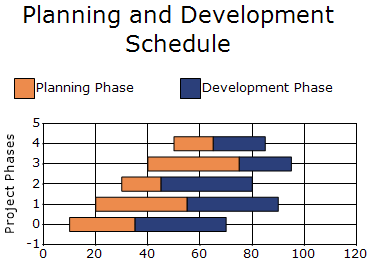

# Gantt Chart in Windows Forms Chart

A project management chart that displays tasks as horizontal bars along a timeline, showing their start dates, durations, end dates, and progress. It helps track schedules, dependencies, and overall project status at a glance.

The following features are supported in the Gantt chart:

* **Drag and Drop**: Dragging and dropping within a chart can be enabled by handling the appropriate `Chart Region Mouse` events.
* **Chart Custom Points**: Chart custom points are used to set custom points for a series so they can show employee task completion in terms of days.
* **Chart Strip Lines**: Strip lines are used to highlight the weekends on a calendar.

N>
chart details for gantt chart.
* Number of Y values per point - 2 (1st is beginning value and the 2nd is the ending value).
* Number of Series - One or More.
* Cannot be combined with - Pie, Bar, Polar, Radar.




ChartSeries planningPhase = new ChartSeries("Planning Phase", ChartSeriesType.Gantt);

planningPhase.Points.Add(0, 10, 35); // Duration 25
planningPhase.Points.Add(1, 20, 55); // Duration 35
planningPhase.Points.Add(2, 30, 45); // Duration 15
planningPhase.Points.Add(3, 40, 75); // Duration 35
planningPhase.Points.Add(4, 50, 65); // Duration 15

ChartSeries developmentPhase = new ChartSeries("Development Phase", ChartSeriesType.Gantt);

developmentPhase.Points.Add(0, 35, 70); // Duration 35
developmentPhase.Points.Add(1, 55, 90); // Duration 35
developmentPhase.Points.Add(2, 45, 80); // Duration 35
developmentPhase.Points.Add(3, 75, 95); // Duration 20
developmentPhase.Points.Add(4, 65, 85); // Duration 20

chartControl.Series.Add(planningPhase);
chartControl.Series.Add(developmentPhase);




Dim planningPhase As New ChartSeries("Planning Phase", ChartSeriesType.Gantt)

planningPhase.Points.Add(0, 10, 35) ' Duration 25
planningPhase.Points.Add(1, 20, 55) ' Duration 35
planningPhase.Points.Add(2, 30, 45) ' Duration 15
planningPhase.Points.Add(3, 40, 75) ' Duration 35
planningPhase.Points.Add(4, 50, 65) ' Duration 15

Dim developmentPhase As New ChartSeries("Development Phase", ChartSeriesType.Gantt)

developmentPhase.Points.Add(0, 35, 70) ' Duration 35
developmentPhase.Points.Add(1, 55, 90) ' Duration 35
developmentPhase.Points.Add(2, 45, 80) ' Duration 35
developmentPhase.Points.Add(3, 75, 95) ' Duration 20
developmentPhase.Points.Add(4, 65, 85) ' Duration 20

chartControl.Series.Add(planningPhase)
chartControl.Series.Add(developmentPhase)




## Customization Option

The following chart series properties are used as customize option to gantt chart:

[Border](/windowsforms/chart/chart-series#border), [ColumnDrawMode](/windowsforms/chart/chart-series#columndrawmode), [DisplayText](/windowsforms/chart/chart-series#displaytext), [DrawSeriesNameInDepth](/windowsforms/chart/chart-series#drawseriesnameindepth), [ElementBorders](/windowsforms/chart/chart-series#elementborders), [HighlightInterior](/windowsforms/chart/chart-series#highlightinterior), [ImageIndex](/windowsforms/chart/chart-series#imageindex), [Images](/windowsforms/chart/chart-series#images)
 [LightAngle](/windowsforms/chart/chart-series#lightangle), [LightColor](/windowsforms/chart/chart-series#lightcolor), [Rotate](/windowsforms/chart/chart-series#rotate), [Spacing](/windowsforms/chart/chart-series#spacing), [Spacing Between Series](/windowsforms/chart/chart-series#spacingbetweenseries), [ShadingMode](/windowsforms/chart/chart-series#shadingmode), [ShadowInterior](/windowsforms/chart/chart-series#shadowinterior), [ShadowOffset](/windowsforms/chart/chart-series#shadowoffset), [ZOrder](/windowsforms/chart/chart-series#zorder), [FancyToolTip](/windowsforms/chart/chart-series#fancytooltip), [Font](/windowsforms/chart/chart-series#font), [Interior](/windowsforms/chart/chart-series#interior), [LegendItem](/windowsforms/chart/chart-series#legenditem), [Name](/windowsforms/chart/chart-series#name), [PointsToolTipFormat](/windowsforms/chart/chart-series#pointstooltipformat), [SmartLabels](/windowsforms/chart/chart-series#smartlabels), [Summary](/windowsforms/chart/chart-series#summary), [Text](/windowsforms/chart/chart-series#text-series), [TextColor](/windowsforms/chart/chart-series#textcolor), [TextFormat](/windowsforms/chart/chart-series#textformat), [TextOffset](/windowsforms/chart/chart-series#textoffset), [TextOrientation](/windowsforms/chart/chart-series#textorientation), [Visible](/windowsforms/chart/chart-series#visible).