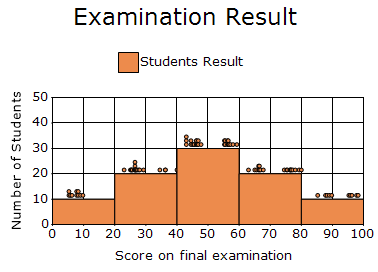

# Histogram Chart in Windows Forms Chart

A Histogram chart displays the frequency distribution of data by grouping values into continuous intervals and representing them with adjacent bars. It helps analyze the shape, spread, and patterns of a dataset, making trends and variations easier to understand.

The following feature is supported in the Histogram chart:

* **Chart 3-D Mode**: A histogram chart can be rendered in 3-D mode by enabling the [Series3D](https://help.syncfusion.com/cr/windowsforms/Syncfusion.Windows.Forms.Chart.ChartControl.html#Syncfusion_Windows_Forms_Chart_ChartControl_Series3D) property.

N>
chart details for histogram chart.
* Number of Y values per point - 1.
* Number of Series - One or more.
* Cannot be combined with - Pie, Bar, Polar, Radar.




double[] points = { 5.250, 7.750, 9.000, 8.275, 9.750, 7.750, 8.275, 6.250, 5.750, 5.250 };

double[] points1 = {  23.000,26.500,27.750,25.025,26.500,26.500,28.025,29.250,26.750,27.250,
                        26.250,25.250,34.500,25.625,25.500,26.625,36.275,36.250,26.875,40.000
                    };

double[] points2 = {  43.000,46.500,47.750,45.025,56.500,56.500,58.025,59.250,56.750,57.250,
                        46.250,55.250,44.500,45.525,55.500,46.625,46.275,56.250,46.875,43.000,
                        46.250,55.250,44.500,45.425,55.500,56.625,46.275,56.250,46.875,43.000,
                    };

double[] points3 = {  63.000,66.500,67.750,65.025,66.500,76.500,78.025,79.250,76.750,77.250,
                        66.250,75.250,74.500,65.625,75.500,76.625,76.275,66.250,66.875,80.000
                    };

double[] points4 = { 85.250, 87.750, 89.000, 88.275, 89.750, 97.750, 98.275, 96.250, 95.750, 95.250 };

for (int i = 1; i <= 1; i++)
{
    ChartSeries Histogram = new ChartSeries("Students Result", ChartSeriesType.Histogram);
    for (int j = 0; j < 10; j++)
    {
        Histogram.Points.Add(points[j], 10);
    }

    for (int j = 0; j < 20; j++)
    {
        Histogram.Points.Add(points1[j], 10);
    }

    for (int j = 0; j < 30; j++)
    {
        Histogram.Points.Add(points2[j], 10);
    }

    for (int j = 0; j < 20; j++)
    {
        Histogram.Points.Add(points3[j], 10);
    }

    for (int j = 0; j < 10; j++)
    {
        Histogram.Points.Add(points4[j], 10);
    }

    Histogram.Text = Histogram.Name;
    Histogram.ConfigItems.HistogramItem.NumberOfIntervals = 5;
    chartControl.Series.Add(Histogram);
}

chartControl.DropSeriesPoints = true;
chartControl.PrimaryXAxis.RangeType = ChartAxisRangeType.Set;
chartControl.PrimaryXAxis.Range = new MinMaxInfo(0, 100, 10);

chartControl.PrimaryYAxis.RangeType = ChartAxisRangeType.Set;
chartControl.PrimaryYAxis.Range = new MinMaxInfo(0, 50, 10);




Dim points() As Double = {5.25, 7.75, 9.0, 8.275, 9.75, 7.75, 8.275, 6.25, 5.75, 5.25}

Dim points1() As Double = {
23.0, 26.5, 27.75, 25.025, 26.5, 26.5, 28.025, 29.25, 26.75, 27.25,
26.25, 25.25, 34.5, 25.625, 25.5, 26.625, 36.275, 36.25, 26.875, 40.0
}

Dim points2() As Double = {
43.0, 46.5, 47.75, 45.025, 56.5, 56.5, 58.025, 59.25, 56.75, 57.25,
46.25, 55.25, 44.5, 45.525, 55.5, 46.625, 46.275, 56.25, 46.875, 43.0,
46.25, 55.25, 44.5, 45.425, 55.5, 56.625, 46.275, 56.25, 46.875, 43.0
}

Dim points3() As Double = {
63.0, 66.5, 67.75, 65.025, 66.5, 76.5, 78.025, 79.25, 76.75, 77.25,
66.25, 75.25, 74.5, 65.625, 75.5, 76.625, 76.275, 66.25, 66.875, 80.0
}

Dim points4() As Double = {
85.25, 87.75, 89.0, 88.275, 89.75,
97.75, 98.275, 96.25, 95.75, 95.25
}

For i As Integer = 1 To 1

    Dim histogram As New ChartSeries("Students Result", ChartSeriesType.Histogram)

    For j As Integer = 0 To 9
        histogram.Points.Add(points(j), 10)
    Next

    For j As Integer = 0 To 19
        histogram.Points.Add(points1(j), 10)
    Next

    For j As Integer = 0 To 29
        histogram.Points.Add(points2(j), 10)
    Next

    For j As Integer = 0 To 19
        histogram.Points.Add(points3(j), 10)
    Next

    For j As Integer = 0 To 9
        histogram.Points.Add(points4(j), 10)
    Next

    histogram.Text = histogram.Name
    histogram.ConfigItems.HistogramItem.NumberOfIntervals = 5

    chartControl.Series.Add(histogram)

Next

chartControl.DropSeriesPoints = True

chartControl.PrimaryXAxis.RangeType = ChartAxisRangeType.Set
chartControl.PrimaryXAxis.Range = New MinMaxInfo(0, 100, 10)

chartControl.PrimaryYAxis.RangeType = ChartAxisRangeType.Set
chartControl.PrimaryYAxis.Range = New MinMaxInfo(0, 50, 10)




## Customization Option

The following chart series properties are used as customize option to histogram chart:

[Border](https://help.syncfusion.com/windowsforms/chart/chart-series#border), [DisplayShadow](https://help.syncfusion.com/windowsforms/chart/chart-series#displayshadow), [DisplayText](https://help.syncfusion.com/windowsforms/chart/chart-series#displaytext), [DrawHistogramNormalDistribution](https://help.syncfusion.com/cr/windowsforms/Syncfusion.Windows.Forms.Chart.ChartSeries.html#Syncfusion_Windows_Forms_Chart_ChartSeries_DrawHistogramNormalDistribution), [FancyToolTip](https://help.syncfusion.com/windowsforms/chart/chart-series#fancytooltip), [Font](https://help.syncfusion.com/windowsforms/chart/chart-series#font), [Interior](https://help.syncfusion.com/windowsforms/chart/chart-series#interior), [LegendItem](https://help.syncfusion.com/windowsforms/chart/chart-series#legenditem), [LightAngle](https://help.syncfusion.com/windowsforms/chart/chart-series#lightangle), [LightColor](https://help.syncfusion.com/windowsforms/chart/chart-series#lightcolor), [Name](https://help.syncfusion.com/windowsforms/chart/chart-series#name), [NumberOfHistogramIntervals](https://help.syncfusion.com/cr/windowsforms/Syncfusion.Windows.Forms.Chart.ChartSeries.html#Syncfusion_Windows_Forms_Chart_ChartSeries_NumberOfHistogramIntervals), [PhongAlpha](https://help.syncfusion.com/windowsforms/chart/chart-series#phongalpha), [PointsToolTipFormat](https://help.syncfusion.com/windowsforms/chart/chart-series#pointstooltipformat), [Rotate](https://help.syncfusion.com/windowsforms/chart/chart-series#rotate), [ShadingMode](https://help.syncfusion.com/windowsforms/chart/chart-series#shadingmode), [ShadowInterior](https://help.syncfusion.com/windowsforms/chart/chart-series#shadowinterior), [ShadowOffset](https://help.syncfusion.com/windowsforms/chart/chart-series#shadowoffset), [ShowHistogramDataPoints](https://help.syncfusion.com/windowsforms/chart/chart-series#showhistogramdatapoints), [SmartLabels](https://help.syncfusion.com/windowsforms/chart/chart-series#smartlabels), [Spacing Between Series](https://help.syncfusion.com/windowsforms/chart/chart-series#spacingbetweenseries), [Summary](https://help.syncfusion.com/windowsforms/chart/chart-series#summary), [Text](https://help.syncfusion.com/windowsforms/chart/chart-series#text-series), [TextColor](https://help.syncfusion.com/windowsforms/chart/chart-series#textcolor), [TextFormat](https://help.syncfusion.com/windowsforms/chart/chart-series#textformat), [TextOffset](https://help.syncfusion.com/windowsforms/chart/chart-series#textoffset), [TextOrientation](https://help.syncfusion.com/windowsforms/chart/chart-series#textorientation), [Visible](https://help.syncfusion.com/windowsforms/chart/chart-series#visible).