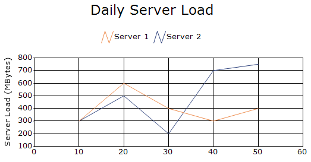
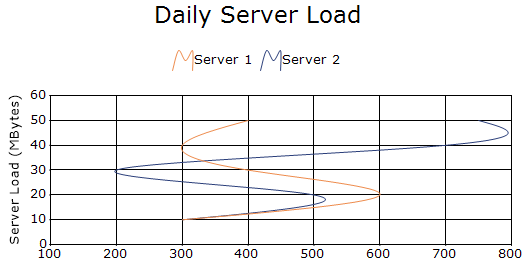
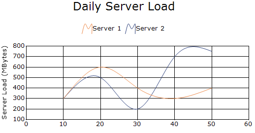
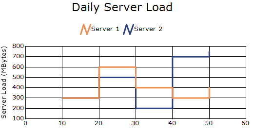

# Line Charts in Windows Forms Chart

Line charts typically connect data points in a series using lines. Depending on the chart type, the connecting lines can be straight, splines, or steps. Line charts are simpler and also allow you to visualize multiple series without the overlap that you may see in bar charts.

You can also customize the following features for line charts:
* Border Settings: Border width and border style of a line chart are customized through the [Width](https://help.syncfusion.com/cr/windowsforms/Syncfusion.Windows.Forms.Chart.ChartLineInfo.html#Syncfusion_Windows_Forms_Chart_ChartLineInfo_Width) and [DashStyle](https://help.syncfusion.com/cr/windowsforms/Syncfusion.Windows.Forms.Chart.ChartLineInfo.html#Syncfusion_Windows_Forms_Chart_ChartLineInfo_DashStyle) properties.
* Point Color Settings: Data points in a series can be set to different colors by listening to the [PrepareStyle](https://help.syncfusion.com/cr/windowsforms/Syncfusion.Windows.Forms.Chart.ChartSeries.html#Syncfusion_Windows_Forms_Chart_ChartSeries_PrepareStyle) event.

N>
Common chart details for line charts.
* Number of Y values per point - 1.
* Number of Series - One or More.
* Cannot be Combined with - Pie, Bar, Stacked Bar, Polar, Radar.

## Line Chart

Line chart connects data points on a plot using straight lines to show trends at equal intervals. The following code shows how to define a line chart in ChartControl.




// Create chart series and add data points into it.
ChartSeries firstServer = new ChartSeries("Server 1", ChartSeriesType.Line);
firstServer.Points.Add(10, 300);
firstServer.Points.Add(20, 600);
firstServer.Points.Add(30, 400);
firstServer.Points.Add(40, 300);
firstServer.Points.Add(50, 400);

ChartSeries secondServer = new ChartSeries("Server 2", ChartSeriesType.Line);
secondServer.Points.Add(10, 300);
secondServer.Points.Add(20, 500);
secondServer.Points.Add(30, 200);
secondServer.Points.Add(40, 700);
secondServer.Points.Add(50, 750);

chartControl.Series.Add(firstServer);
chartControl.Series.Add(secondServer);




// Create chart series and add data points into it.

Dim firstServer As New ChartSeries("Server 1", ChartSeriesType.Line)
firstServer.Points.Add(10, 300)
firstServer.Points.Add(20, 600)
firstServer.Points.Add(30, 400)
firstServer.Points.Add(40, 300)
firstServer.Points.Add(50, 400)

Dim secondServer As New ChartSeries("Server 2", ChartSeriesType.Line)
secondServer.Points.Add(10, 300)
secondServer.Points.Add(20, 500)
secondServer.Points.Add(30, 200)
secondServer.Points.Add(40, 700)
secondServer.Points.Add(50, 750)

chartControl.Series.Add(firstServer)
chartControl.Series.Add(secondServer)




## Rotated Spline Chart

A Rotated Spline Chart is similar to an ordinary Spline Chart. The only difference is that, it would be rotated. It plots one or several series of data, and joins each series by smooth, rotated spline curves instead of straight lines. The following code shows how to define rotated spline line chart in chart control.




// Create chart series and add data points into it.
ChartSeries firstServer = new ChartSeries("Server 1", ChartSeriesType.RotatedSpline);
firstServer.Points.Add(10, 300);
firstServer.Points.Add(20, 600);
firstServer.Points.Add(30, 400);
firstServer.Points.Add(40, 300);
firstServer.Points.Add(50, 400);

ChartSeries secondServer = new ChartSeries("Server 2", ChartSeriesType.RotatedSpline);
secondServer.Points.Add(10, 300);
secondServer.Points.Add(20, 500);
secondServer.Points.Add(30, 200);
secondServer.Points.Add(40, 700);
secondServer.Points.Add(50, 750);

chartControl.Series.Add(firstServer);
chartControl.Series.Add(secondServer);




// Create chart series and add data points into it.

Dim firstServer As New ChartSeries("Server 1", ChartSeriesType.RotatedSpline)
firstServer.Points.Add(10, 300)
firstServer.Points.Add(20, 600)
firstServer.Points.Add(30, 400)
firstServer.Points.Add(40, 300)
firstServer.Points.Add(50, 400)

Dim secondServer As New ChartSeries("Server 2", ChartSeriesType.RotatedSpline)
secondServer.Points.Add(10, 300)
secondServer.Points.Add(20, 500)
secondServer.Points.Add(30, 200)
secondServer.Points.Add(40, 700)
secondServer.Points.Add(50, 750)

chartControl.Series.Add(firstServer)
chartControl.Series.Add(secondServer)




## Spline Line Chart

Spline Chart is similar to a Line Chart except that it connects the different data points using splines instead of straight lines. The following code shows how to define spline chart in chart control.




// Create chart series and add data points into it.
ChartSeries firstServer = new ChartSeries("Server 1", ChartSeriesType.Spline);
firstServer.Points.Add(10, 300);
firstServer.Points.Add(20, 600);
firstServer.Points.Add(30, 400);
firstServer.Points.Add(40, 300);
firstServer.Points.Add(50, 400);

ChartSeries secondServer = new ChartSeries("Server 2", ChartSeriesType.Spline);
secondServer.Points.Add(10, 300);
secondServer.Points.Add(20, 500);
secondServer.Points.Add(30, 200);
secondServer.Points.Add(40, 700);
secondServer.Points.Add(50, 750);

chartControl.Series.Add(firstServer);
chartControl.Series.Add(secondServer);




// Create chart series and add data points into it.

Dim firstServer As New ChartSeries("Server 1", ChartSeriesType.Spline)
firstServer.Points.Add(10, 300)
firstServer.Points.Add(20, 600)
firstServer.Points.Add(30, 400)
firstServer.Points.Add(40, 300)
firstServer.Points.Add(50, 400)

Dim secondServer As New ChartSeries("Server 2", ChartSeriesType.Spline)
secondServer.Points.Add(10, 300)
secondServer.Points.Add(20, 500)
secondServer.Points.Add(30, 200)
secondServer.Points.Add(40, 700)
secondServer.Points.Add(50, 750)

chartControl.Series.Add(firstServer)
chartControl.Series.Add(secondServer)




## Step Line Chart

Step Line Charts use horizontal and vertical lines to connect data points resulting in a step like progression. The following code shows how to define step chart in chart control.




// Create chart series and add data points into it.
ChartSeries firstServer = new ChartSeries("Server 1", ChartSeriesType.StepLine);
firstServer.Points.Add(10, 300);
firstServer.Points.Add(20, 600);
firstServer.Points.Add(30, 400);
firstServer.Points.Add(40, 300);
firstServer.Points.Add(50, 400);

ChartSeries secondServer = new ChartSeries("Server 2", ChartSeriesType.StepLine);
secondServer.Points.Add(10, 300);
secondServer.Points.Add(20, 500);
secondServer.Points.Add(30, 200);
secondServer.Points.Add(40, 700);
secondServer.Points.Add(50, 750);

firstServer.Style.Border.Width = 3;
secondServer.Style.Border.Width = 3;
chartControl.Series.Add(firstServer);
chartControl.Series.Add(secondServer);




// Create chart series and add data points into it.

Dim firstServer As New ChartSeries("Server 1", ChartSeriesType.StepLine)
firstServer.Points.Add(10, 300)
firstServer.Points.Add(20, 600)
firstServer.Points.Add(30, 400)
firstServer.Points.Add(40, 300)
firstServer.Points.Add(50, 400)

Dim secondServer As New ChartSeries("Server 2", ChartSeriesType.StepLine)
secondServer.Points.Add(10, 300)
secondServer.Points.Add(20, 500)
secondServer.Points.Add(30, 200)
secondServer.Points.Add(40, 700)
secondServer.Points.Add(50, 750)

firstServer.Style.Border.Width = 3
secondServer.Style.Border.Width = 3
chartControl.Series.Add(firstServer)
chartControl.Series.Add(secondServer)




## Customization Option

The following chart series properties are used as customization options for all line chart types except `Line chart`.

[DisplayShadow](https://help.syncfusion.com/windowsforms/chart/chart-series#displayshadow), [DisplayText](https://help.syncfusion.com/windowsforms/chart/chart-series#displaytext), [DrawSeriesNameInDepth](https://help.syncfusion.com/windowsforms/chart/chart-series#drawseriesnameindepth), [ElementBorders](https://help.syncfusion.com/windowsforms/chart/chart-series#elementborders), [FancyToolTip](https://help.syncfusion.com/windowsforms/chart/chart-series#fancytooltip), [Font](https://help.syncfusion.com/windowsforms/chart/chart-series#font), [HighlightInterior](https://help.syncfusion.com/windowsforms/chart/chart-series#highlightinterior), [ImageIndex](https://help.syncfusion.com/windowsforms/chart/chart-series#imageindex), [Images](https://help.syncfusion.com/windowsforms/chart/chart-series#images), [Interior](https://help.syncfusion.com/windowsforms/chart/chart-series#interior), [LegendItem](https://help.syncfusion.com/windowsforms/chart/chart-series#legenditem), [Name](https://help.syncfusion.com/windowsforms/chart/chart-series#name), [PointsToolTipFormat](https://help.syncfusion.com/windowsforms/chart/chart-series#pointstooltipformat), [ShadowInterior](https://help.syncfusion.com/windowsforms/chart/chart-series#shadowinterior), [ShadowOffset](https://help.syncfusion.com/windowsforms/chart/chart-series#shadowoffset), [SmartLabels](https://help.syncfusion.com/windowsforms/chart/chart-series#smartlabels), [Spacing Between Series](https://help.syncfusion.com/windowsforms/chart/chart-series#spacingbetweenseries), [Summary](https://help.syncfusion.com/windowsforms/chart/chart-series#summary), [Text](https://help.syncfusion.com/windowsforms/chart/chart-series#text-series), [TextColor](https://help.syncfusion.com/windowsforms/chart/chart-series#textcolor), [TextFormat](https://help.syncfusion.com/windowsforms/chart/chart-series#textformat), [TextOffset](https://help.syncfusion.com/windowsforms/chart/chart-series#textoffset), [TextOrientation](https://help.syncfusion.com/windowsforms/chart/chart-series#textorientation), [Visible](https://help.syncfusion.com/windowsforms/chart/chart-series#visible)

N>
* [Rotate](https://help.syncfusion.com/windowsforms/chart/chart-series#rotate) used only in `Spline` and `Step Line` chart customization options.
* [HitTestRadius](https://help.syncfusion.com/windowsforms/chart/chart-series#hittestradius), [StepItem.Inverted](https://help.syncfusion.com/windowsforms/chart/chart-series#stepiteminverted) are used only in the customization options for `Step Line` charts.