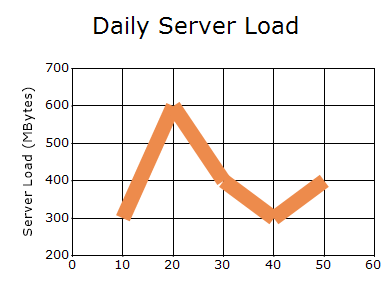
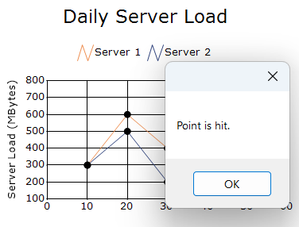
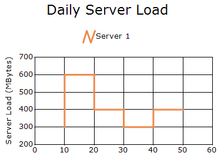

# Line Chart in Windows Forms Charts

## Line chart

A line chart connects data points using straight lines to visualize trends and changes over a continuous range.

The following code example demonstrates how to create a line chart.




// Create chart series and add data points into it.
ChartSeries firstServer = new ChartSeries("Server 1", ChartSeriesType.Line);
firstServer.Points.Add(10, 300);
firstServer.Points.Add(20, 600);
firstServer.Points.Add(30, 400);
firstServer.Points.Add(40, 300);
firstServer.Points.Add(50, 400);

ChartSeries secondServer = new ChartSeries("Server 2", ChartSeriesType.Line);
secondServer.Points.Add(10, 300);
secondServer.Points.Add(20, 500);
secondServer.Points.Add(30, 200);
secondServer.Points.Add(40, 700);
secondServer.Points.Add(50, 750);

chartControl.Series.Add(firstServer);
chartControl.Series.Add(secondServer);




' Create chart series and add data points into it.

Dim firstServer As New ChartSeries("Server 1", ChartSeriesType.Line)
firstServer.Points.Add(10, 300)
firstServer.Points.Add(20, 600)
firstServer.Points.Add(30, 400)
firstServer.Points.Add(40, 300)
firstServer.Points.Add(50, 400)

Dim secondServer As New ChartSeries("Server 2", ChartSeriesType.Line)
secondServer.Points.Add(10, 300)
secondServer.Points.Add(20, 500)
secondServer.Points.Add(30, 200)
secondServer.Points.Add(40, 700)
secondServer.Points.Add(50, 750)

chartControl.Series.Add(firstServer)
chartControl.Series.Add(secondServer)




### Disable line cap

The [DisableLineCap](https://help.syncfusion.com/cr/windowsforms/Syncfusion.Windows.Forms.Chart.ChartLineConfigItem.html#Syncfusion_Windows_Forms_Chart_ChartLineConfigItem_DisableLineCap) property controls whether line caps are disabled when rendering line and spline series. By default, this property is set to `false`, which renders line caps for line segments.

The following code example demonstrates how to disable line caps using the DisableLineCap property.



chartControl.Series[0].ConfigItems.LineItem.DisableLineCap = true;


chartControl.Series(0).ConfigItems.LineItem.DisableLineCap = True



### Disable line region

The [DisableLineRegion](https://help.syncfusion.com/cr/windowsforms/Syncfusion.Windows.Forms.Chart.ChartLineConfigItem.html#Syncfusion_Windows_Forms_Chart_ChartLineConfigItem_DisableLineRegion) property specifies whether interactive regions are generated for the line segments connecting adjacent data points in Line and Spline series. The default value is false. When set to true, the line segments remain visible, but their chart regions are disabled.

The following code example demonstrates how to disable line segments using the DisableLineRegion property.



chartControl.Series[0].ConfigItems.LineItem.DisableLineRegion = true;
chartControl.ChartRegionMouseMove += ChartControl_ChartRegionMouseMove;
private void ChartControl_ChartRegionMouseMove(
object sender,
ChartRegionMouseEventArgs e)
{
    if (e.Region != null && e.Region.SeriesIndex >= 0)
    {
        Text = "Line region detected";
        chartControl.Cursor = Cursors.Hand;
    }
    else
    {
        Text = "No line region";
        chartControl.Cursor = Cursors.Default;
    }
}


chartControl.Series(0).ConfigItems.LineItem.DisableLineRegion = True
chartControl.ChartRegionMouseMove += ChartControl_ChartRegionMouseMove;
Private Sub ChartControl_ChartRegionMouseMove(
ByVal sender As Object,
ByVal e As ChartRegionMouseEventArgs)

    If e.Region IsNot Nothing AndAlso e.Region.SeriesIndex >= 0 Then
        Me.Text = "Line region detected"
        chartControl.Cursor = Cursors.Hand
    Else
        Me.Text = "No line region"
        chartControl.Cursor = Cursors.Default
    End If

End Sub



### Error bars

The [Enabled](https://help.syncfusion.com/cr/windowsforms/Syncfusion.Windows.Forms.Chart.ChartErrorBarsConfigItem.html#Syncfusion_Windows_Forms_Chart_ChartErrorBarsConfigItem_Enabled) property controls whether error bars are displayed to indicate the uncertainty range of each data point. The default value is `false`.

N>
- The second Y-value, `Series.Points[i].YValues[1]`, specifies the error range. For example, a value of `5` indicates an error range of `-5` to `+5` from the primary Y-value.
- The [Enabled](https://help.syncfusion.com/cr/windowsforms/Syncfusion.Windows.Forms.Chart.ChartErrorBarsConfigItem.html#Syncfusion_Windows_Forms_Chart_ChartErrorBarsConfigItem_Enabled) property also applies to `Column` and `HiLo` charts.
- N> [DrawErrorBars](https://help.syncfusion.com/cr/windowsforms/Syncfusion.Windows.Forms.Chart.ChartSeries.html#Syncfusion_Windows_Forms_Chart_ChartSeries_DrawErrorBars) property is deprecated. Use the [Enabled](https://help.syncfusion.com/cr/windowsforms/Syncfusion.Windows.Forms.Chart.ChartErrorBarsConfigItem.html#Syncfusion_Windows_Forms_Chart_ChartErrorBarsConfigItem_Enabled) property instead.

The following code displays error bars for the Line series.



ChartSeries series = new ChartSeries(
    "Sales",
    ChartSeriesType.Line);

// The second Y-value indicates the error range.
series.Points.Add(1, new double[] { 20, 5 });
series.Points.Add(2, new double[] { 70, 6 });
series.Points.Add(3, new double[] { 10, 3 });
series.Points.Add(4, new double[] { 40, 6 });

series.Text = series.Name;

// Displays error bars in the Line series.
series.ConfigItems.ErrorBars.Enabled = true;

// Adds the series to the chart.
chartControl.Series.Add(series);


' Creates a Line series.
Dim series As New ChartSeries(
    "Sales",
    ChartSeriesType.Line)

' The second Y-value indicates the error range.
series.Points.Add(1, New Double() {20, 5})
series.Points.Add(2, New Double() {70, 6})
series.Points.Add(3, New Double() {10, 3})
series.Points.Add(4, New Double() {40, 6})

series.Text = series.Name

' Displays error bars in the Line series.
series.ConfigItems.ErrorBars.Enabled = True

' Adds the series to the chart.
chartControl.Series.Add(series)



### Hit test radius

The [HitTestRadius](https://help.syncfusion.com/cr/windowsforms/Syncfusion.Windows.Forms.Chart.ChartStyleInfo.html#Syncfusion_Windows_Forms_Chart_ChartStyleInfo_HitTestRadius) property specifies the radius around a data point that is considered part of the point during hit testing. Increasing the value makes the data point easier to detect during mouse interactions.

N> The `HitTestRadius` property also applies to `Step Line` charts.

The following code sets the hit-test radius and displays a message when the user clicks within the specified radius of a Line chart data point.



// Sets the hit-test radius for the first Line series.
chartControl.Series[0].Style.HitTestRadius = 20f;

// Displays visible symbols at the data points.
firstServer.Style.Symbol.Shape = ChartSymbolShape.Circle;
firstServer.Style.Symbol.Size = new Size(8, 8);
firstServer.Style.Symbol.Color = Color.Black;

// Subscribes to the chart-region click event.
chartControl.ChartRegionClick += chartControl_ChartRegionClick;

private void chartControl_ChartRegionClick(
    object sender,
    ChartRegionMouseEventArgs e)
{
    if (e.Region != null && e.Region.IsChartPoint)
    {
        MessageBox.Show("Point is hit.");
    }
}


' Sets the hit-test radius for the first Line series.
chartControl.Series(0).Style.HitTestRadius = 20.0F

' Displays visible symbols at the data points.
firstServer.Style.Symbol.Shape = ChartSymbolShape.Circle
firstServer.Style.Symbol.Size = New Size(8, 8)
firstServer.Style.Symbol.Color = Color.Black

' Subscribes to the chart-region click event.
AddHandler chartControl.ChartRegionClick,
    AddressOf chartControl_ChartRegionClick

Private Sub chartControl_ChartRegionClick(
    sender As Object,
    e As ChartRegionMouseEventArgs)

    If e.Region IsNot Nothing AndAlso e.Region.IsChartPoint Then
        MessageBox.Show("Point is hit.")
    End If
End Sub



## Rotated spline chart

The rotated spline chart is similar to an ordinary spline chart. The only difference is that, it would be rotated. It plots one or several series of data, and joins each series by smooth, rotated spline curves instead of straight lines.

The following code example demonstrates how to create a rotated spline line chart.




// Create chart series and add data points into it.
ChartSeries firstServer = new ChartSeries("Server 1", ChartSeriesType.RotatedSpline);
firstServer.Points.Add(10, 300);
firstServer.Points.Add(20, 600);
firstServer.Points.Add(30, 400);
firstServer.Points.Add(40, 300);
firstServer.Points.Add(50, 400);

ChartSeries secondServer = new ChartSeries("Server 2", ChartSeriesType.RotatedSpline);
secondServer.Points.Add(10, 300);
secondServer.Points.Add(20, 500);
secondServer.Points.Add(30, 200);
secondServer.Points.Add(40, 700);
secondServer.Points.Add(50, 750);

chartControl.Series.Add(firstServer);
chartControl.Series.Add(secondServer);




// Create chart series and add data points into it.

Dim firstServer As New ChartSeries("Server 1", ChartSeriesType.RotatedSpline)
firstServer.Points.Add(10, 300)
firstServer.Points.Add(20, 600)
firstServer.Points.Add(30, 400)
firstServer.Points.Add(40, 300)
firstServer.Points.Add(50, 400)

Dim secondServer As New ChartSeries("Server 2", ChartSeriesType.RotatedSpline)
secondServer.Points.Add(10, 300)
secondServer.Points.Add(20, 500)
secondServer.Points.Add(30, 200)
secondServer.Points.Add(40, 700)
secondServer.Points.Add(50, 750)

chartControl.Series.Add(firstServer)
chartControl.Series.Add(secondServer)




## Step line chart

A step line chart use horizontal and vertical lines to connect data points resulting in a step like progression.

The following code example demonstrates how to create a step line Chart.




// Create chart series and add data points into it.
ChartSeries firstServer = new ChartSeries("Server 1", ChartSeriesType.StepLine);
firstServer.Points.Add(10, 300);
firstServer.Points.Add(20, 600);
firstServer.Points.Add(30, 400);
firstServer.Points.Add(40, 300);
firstServer.Points.Add(50, 400);

ChartSeries secondServer = new ChartSeries("Server 2", ChartSeriesType.StepLine);
secondServer.Points.Add(10, 300);
secondServer.Points.Add(20, 500);
secondServer.Points.Add(30, 200);
secondServer.Points.Add(40, 700);
secondServer.Points.Add(50, 750);

firstServer.Style.Border.Width = 3;
secondServer.Style.Border.Width = 3;
chartControl.Series.Add(firstServer);
chartControl.Series.Add(secondServer);




// Create chart series and add data points into it.

Dim firstServer As New ChartSeries("Server 1", ChartSeriesType.StepLine)
firstServer.Points.Add(10, 300)
firstServer.Points.Add(20, 600)
firstServer.Points.Add(30, 400)
firstServer.Points.Add(40, 300)
firstServer.Points.Add(50, 400)

Dim secondServer As New ChartSeries("Server 2", ChartSeriesType.StepLine)
secondServer.Points.Add(10, 300)
secondServer.Points.Add(20, 500)
secondServer.Points.Add(30, 200)
secondServer.Points.Add(40, 700)
secondServer.Points.Add(50, 750)

firstServer.Style.Border.Width = 3
secondServer.Style.Border.Width = 3
chartControl.Series.Add(firstServer)
chartControl.Series.Add(secondServer)




### Inverted

The [Inverted](https://help.syncfusion.com/cr/windowsforms/Syncfusion.Windows.Forms.Chart.ChartStepConfigItem.html#Syncfusion_Windows_Forms_Chart_ChartStepConfigItem_Inverted) property specifies whether the step line is rendered in an inverted direction in a step chart, with `false` used as the default value.

N> The `Inverted` property also applies to `Step Area` charts.

The following code enables inverted step-line rendering.



ChartSeries series = new ChartSeries(
"Server 1",
ChartSeriesType.StepLine);

series.Points.Add(10, 300);
series.Points.Add(20, 600);
series.Points.Add(30, 400);
series.Points.Add(40, 300);
series.Points.Add(50, 400);

chartControl.Series.Add(series);
chartControl.Series[0].ConfigItems.StepItem.Inverted =
    true;


Dim series As New ChartSeries(
    "Server 1",
    ChartSeriesType.StepLine)

series.Points.Add(10, 300)
series.Points.Add(20, 600)
series.Points.Add(30, 400)
series.Points.Add(40, 300)
series.Points.Add(50, 400)

chartControl.Series.Add(series)

chartControl.Series(0).ConfigItems.StepItem.Inverted = True



## See also
- [How to display errorbars in WinForms Chart](https://support.syncfusion.com/kb/article/1185/how-to-display-errorbars-in-winforms-chart)