# Other Types in Windows Forms Charts

## Gantt chart

A gantt chart displays tasks or project phases as horizontal bars along a timeline. The position and length of each bar show when a task starts and how long it lasts.

The following code example demonstrates how to create a gantt Chart.




ChartSeries planningPhase = new ChartSeries("Planning Phase", ChartSeriesType.Gantt);

planningPhase.Points.Add(0, 10, 35); // Duration 25
planningPhase.Points.Add(1, 20, 55); // Duration 35
planningPhase.Points.Add(2, 30, 45); // Duration 15
planningPhase.Points.Add(3, 40, 75); // Duration 35
planningPhase.Points.Add(4, 50, 65); // Duration 15

ChartSeries developmentPhase = new ChartSeries("Development Phase", ChartSeriesType.Gantt);

developmentPhase.Points.Add(0, 35, 70); // Duration 35
developmentPhase.Points.Add(1, 55, 90); // Duration 35
developmentPhase.Points.Add(2, 45, 80); // Duration 35
developmentPhase.Points.Add(3, 75, 95); // Duration 20
developmentPhase.Points.Add(4, 65, 85); // Duration 20

chartControl.Series.Add(planningPhase);
chartControl.Series.Add(developmentPhase);




' Planning Phase Series
Dim planningPhase As New ChartSeries("Planning Phase", ChartSeriesType.Gantt)

planningPhase.Points.Add(0, 10, 35) ' Duration 25
planningPhase.Points.Add(1, 20, 55) ' Duration 35
planningPhase.Points.Add(2, 30, 45) ' Duration 15
planningPhase.Points.Add(3, 40, 75) ' Duration 35
planningPhase.Points.Add(4, 50, 65) ' Duration 15

' Development Phase Series
Dim developmentPhase As New ChartSeries("Development Phase", ChartSeriesType.Gantt)

developmentPhase.Points.Add(0, 35, 70) ' Duration 35
developmentPhase.Points.Add(1, 55, 90) ' Duration 35
developmentPhase.Points.Add(2, 45, 80) ' Duration 35
developmentPhase.Points.Add(3, 75, 95) ' Duration 20
developmentPhase.Points.Add(4, 65, 85) ' Duration 20

' Add Series to Chart
chartControl.Series.Add(planningPhase)
chartControl.Series.Add(developmentPhase)




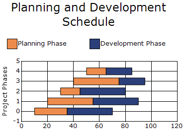

### Draw mode

The [DrawMode](https://help.syncfusion.com/cr/windowsforms/Syncfusion.Windows.Forms.Chart.ChartGanttConfigItem.html#Syncfusion_Windows_Forms_Chart_ChartGanttConfigItem_DrawMode) property specifies how the bars are arranged in a Gantt chart. The default value is [CustomPointWidthMode](https://help.syncfusion.com/cr/windowsforms/Syncfusion.Windows.Forms.Chart.ChartGanttDrawMode.html#Syncfusion_Windows_Forms_Chart_ChartGanttDrawMode_CustomPointWidthMode).

The supported values are defined in the [ChartGanttDrawMode](https://help.syncfusion.com/cr/windowsforms/Syncfusion.Windows.Forms.Chart.ChartGanttDrawMode.html) enumeration:

- [AutoSizeMode](https://help.syncfusion.com/cr/windowsforms/Syncfusion.Windows.Forms.Chart.ChartGanttDrawMode.html#Syncfusion_Windows_Forms_Chart_ChartGanttDrawMode_AutoSizeMode): Renders the Gantt bars side by side and automatically adjusts their width based on the available space.
- [CustomPointWidthMode](https://help.syncfusion.com/cr/windowsforms/Syncfusion.Windows.Forms.Chart.ChartGanttDrawMode.html#Syncfusion_Windows_Forms_Chart_ChartGanttDrawMode_CustomPointWidthMode): Renders the Gantt bars as overlapping bars using the configured point width.

N> The [GanttDrawMod](https://help.syncfusion.com/cr/windowsforms/Syncfusion.Windows.Forms.Chart.ChartSeries.html#Syncfusion_Windows_Forms_Chart_ChartSeries_GanttDrawMode) property is deprecated. Use [DrawMode](https://help.syncfusion.com/cr/windowsforms/Syncfusion.Windows.Forms.Chart.ChartGanttConfigItem.html#Syncfusion_Windows_Forms_Chart_ChartGanttConfigItem_DrawMode) instead.

The following code sets the Gantt drawing mode to `AutoSizeMode`.



chartControl.Series[0].ConfigItems.GanttItem.DrawMode =
    ChartGanttDrawMode.AutoSizeMode;


chartControl.Series(0).ConfigItems.GanttItem.DrawMode =
    ChartGanttDrawMode.AutoSizeMode



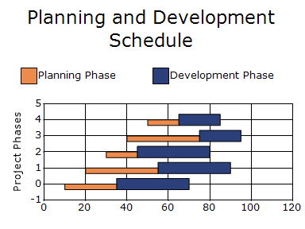

### Point width

The [PointWidth](https://help.syncfusion.com/cr/windowsforms/Syncfusion.Windows.Forms.Chart.ChartStyleInfo.html#Syncfusion_Windows_Forms_Chart_ChartStyleInfo_PointWidth) property specifies the width of Gantt data points relative to the available width. The default value is `1f`.

N> The [PointWidth](https://help.syncfusion.com/cr/windowsforms/Syncfusion.Windows.Forms.Chart.ChartStyleInfo.html#Syncfusion_Windows_Forms_Chart_ChartStyleInfo_PointWidth)  property is effective when the [DrawMode](https://help.syncfusion.com/cr/windowsforms/Syncfusion.Windows.Forms.Chart.ChartGanttConfigItem.html#Syncfusion_Windows_Forms_Chart_ChartGanttConfigItem_DrawMode) property is set to [CustomPointWidthMode](https://help.syncfusion.com/cr/windowsforms/Syncfusion.Windows.Forms.Chart.ChartGanttDrawMode.html#Syncfusion_Windows_Forms_Chart_ChartGanttDrawMode_CustomPointWidthMode).

The following code sets the point width for all data points in the Gantt series.



chartControl.Series[0].ConfigItems.GanttItem.DrawMode =
    ChartGanttDrawMode.CustomPointWidthMode;

chartControl.Series[0].Style.PointWidth = 1.2f;


chartControl.Series(0).ConfigItems.GanttItem.DrawMode =
    ChartGanttDrawMode.CustomPointWidthMode

chartControl.Series(0).Style.PointWidth = 1.2F



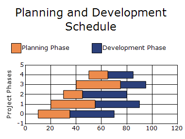

### Related points

The [RelatedPoints](https://help.syncfusion.com/cr/windowsforms/Syncfusion.Windows.Forms.Chart.ChartStyleInfo.html#Syncfusion_Windows_Forms_Chart_ChartStyleInfo_RelatedPoints) property specifies the relationship between data points in a Gantt chart and renders lines connecting the specified points.

The property returns a [ChartRelatedPointInfo](https://help.syncfusion.com/cr/windowsforms/Syncfusion.Windows.Forms.Chart.ChartRelatedPointInfo.html) object that provides the following options:

- `Color`: Specifies the color of the connecting line. The default value is the control text color.
- `Alignment`: Specifies the pen alignment of the connecting line. The default value is `Center`.
- `Points`: Specifies the indices of the data points to connect. The default value is `null`.
- `Count`: Gets the number of related points. The default value is `0`.
- `DashStyle`: Specifies the dash style of the connecting line. The default value is `Solid`.
- `DashPattern`: Specifies a custom dash pattern using a float array. The default value is `null`.
- `Width`: Specifies the width of the connecting line. The default value is `5.0f`.

N> The `RelatedPoints` property applies only to Gantt charts and can be configured for a series or an individual data point.

The following code connects the first Gantt data point to the second and third data points.



ChartRelatedPointInfo relatedPoints =
    chartControl.Series[0].Styles[0].RelatedPoints;

relatedPoints.Points = new int[] { 1, 2 };
relatedPoints.Color = Color.Red;
relatedPoints.DashStyle = DashStyle.Solid;
relatedPoints.Width = 3.0f;


Dim relatedPoints As ChartRelatedPointInfo =
    chartControl.Series(0).Styles(0).RelatedPoints

relatedPoints.Points = New Integer() {1, 2}
relatedPoints.Color = Color.Red
relatedPoints.DashStyle = DashStyle.Solid
relatedPoints.Width = 3.0F



## HeatMap chart

A heat map chart is a graphical representation of data where the values taken by a variable in two-dimensional map are represented as colors.

The following code example demonstrates how to create a heat map chart.




chartControl.Text = "Stocks - Sales and Expense details";

ChartTitle title = new ChartTitle() { Text = "Cell Size as Sales, Cell Color as Expense" };

chartControl.Titles.Add(title);
chartControl.Title.Font = new System.Drawing.Font("Segoe UI", 16F);
chartControl.Title.ForeColor = System.Drawing.Color.MidnightBlue;
chartControl.Title.Name = "Default";

title.Font = new System.Drawing.Font("Segoe UI", 8.5F, System.Drawing.FontStyle.Bold);
title.ForeColor = System.Drawing.Color.Black;

ChartSeries Stocks = new ChartSeries("Stocks", ChartSeriesType.HeatMap);
Stocks.Points.Add(7, 4, 10000);
Stocks.Points.Add(6, 3, 5541);
Stocks.Points.Add(5, 2, 6007);
Stocks.Points.Add(4, 2, 5022);
Stocks.Points.Add(3, 2.5, 6882);
Stocks.Points.Add(2, 1.5, 6584);
Stocks.Points.Add(1, 1, 2799);

Stocks.Styles[0].Text = "US";
Stocks.Styles[1].Text = "South Carolina";
Stocks.Styles[2].Text = "Florida";
Stocks.Styles[3].Text = "Mexico";
Stocks.Styles[4].Text = "Arizona";
Stocks.Styles[5].Text = "North Carolina";
Stocks.Styles[6].Text = "Utah";

Stocks.Style.DisplayText = true;
Stocks.Style.Font.Size = 9f;
chartControl.Series.Add(Stocks);
chartControl.ShowLegend = false;

Stocks.ConfigItems.HeatMapItem.DisplayTitle = true;
Stocks.ConfigItems.HeatMapItem.LowestValueColor = Color.FromArgb(255, 23, 0);
Stocks.ConfigItems.HeatMapItem.HighestValueColor = Color.FromArgb(81, 168, 0);
Stocks.ConfigItems.HeatMapItem.MiddleValueColor = Color.Gold;
Stocks.ConfigItems.HeatMapItem.StartText = "US";
Stocks.ConfigItems.HeatMapItem.EndText = "Utah";




' Chart Text
chartControl.Text = "Stocks - Sales and Expense details"

' Chart Title
Dim title As New ChartTitle() With {
.Text = "Cell Size as Sales, Cell Color as Expense"
}

chartControl.Titles.Add(title)

chartControl.Title.Font = New Font("Segoe UI", 16.0F)
chartControl.Title.ForeColor = Color.MidnightBlue
chartControl.Title.Name = "Default"

title.Font = New Font("Segoe UI", 8.5F, FontStyle.Bold)
title.ForeColor = Color.Black

' HeatMap Series
Dim Stocks As New ChartSeries("Stocks", ChartSeriesType.HeatMap)

Stocks.Points.Add(7, 4, 10000)
Stocks.Points.Add(6, 3, 5541)
Stocks.Points.Add(5, 2, 6007)
Stocks.Points.Add(4, 2, 5022)
Stocks.Points.Add(3, 2.5, 6882)
Stocks.Points.Add(2, 1.5, 6584)
Stocks.Points.Add(1, 1, 2799)

' Data Labels
Stocks.Styles(0).Text = "US"
Stocks.Styles(1).Text = "South Carolina"
Stocks.Styles(2).Text = "Florida"
Stocks.Styles(3).Text = "Mexico"
Stocks.Styles(4).Text = "Arizona"
Stocks.Styles(5).Text = "North Carolina"
Stocks.Styles(6).Text = "Utah"

Stocks.Style.DisplayText = True
Stocks.Style.Font.Size = 9.0F

chartControl.Series.Add(Stocks)

chartControl.ShowLegend = False

' HeatMap Settings
Stocks.ConfigItems.HeatMapItem.DisplayTitle = True
Stocks.ConfigItems.HeatMapItem.LowestValueColor = Color.FromArgb(255, 23, 0)
Stocks.ConfigItems.HeatMapItem.HighestValueColor = Color.FromArgb(81, 168, 0)
Stocks.ConfigItems.HeatMapItem.MiddleValueColor = Color.Gold

Stocks.ConfigItems.HeatMapItem.StartText = "US"
Stocks.ConfigItems.HeatMapItem.EndText = "Utah"




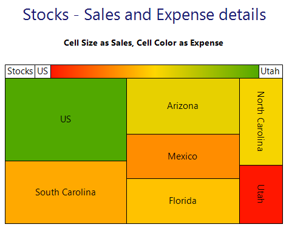

### Heat map style

The [HeatMapStyle](https://help.syncfusion.com/cr/windowsforms/Syncfusion.Windows.Forms.Chart.ChartHeatMapConfigItem.html#Syncfusion_Windows_Forms_Chart_ChartHeatMapConfigItem_HeatMapStyle) property specifies the layout style of the heat map chart, with [Rectangular](https://help.syncfusion.com/cr/windowsforms/Syncfusion.Windows.Forms.Chart.ChartHeatMapLayoutStyle.html#Syncfusion_Windows_Forms_Chart_ChartHeatMapLayoutStyle_Rectangular) as its default value.

The supported values are:

- [Rectangular](https://help.syncfusion.com/cr/windowsforms/Syncfusion.Windows.Forms.Chart.ChartHeatMapLayoutStyle.html#Syncfusion_Windows_Forms_Chart_ChartHeatMapLayoutStyle_Rectangular): Arranges the heat map cells in a rectangular layout.
- [Vertical](https://help.syncfusion.com/cr/windowsforms/Syncfusion.Windows.Forms.Chart.ChartHeatMapLayoutStyle.html#Syncfusion_Windows_Forms_Chart_ChartHeatMapLayoutStyle_Vertical): Arranges the heat map cells in a vertical layout.
- [Horizontal](https://help.syncfusion.com/cr/windowsforms/Syncfusion.Windows.Forms.Chart.ChartHeatMapLayoutStyle.html#Syncfusion_Windows_Forms_Chart_ChartHeatMapLayoutStyle_Horizontal): Arranges the heat map cells in a horizontal layout.

The following code applies the `Horizontal` layout style to the heat map chart.



chartControl.Series[0].ConfigItems.HeatMapItem.HeatMapStyle = ChartHeatMapLayoutStyle.Horizontal;


chartControl.Series(0).ConfigItems.HeatMapItem.HeatMapStyle = ChartHeatMapLayoutStyle.Horizontal



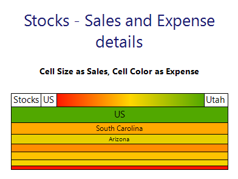

### Display color swatch

The [DisplayColorSwatch](https://help.syncfusion.com/cr/windowsforms/Syncfusion.Windows.Forms.Chart.ChartHeatMapConfigItem.html#Syncfusion_Windows_Forms_Chart_ChartHeatMapConfigItem_DisplayColorSwatch) property specifies whether the color swatch is displayed in the heat map chart, with `true` as its default value.

The following code hides the color swatch.



chartControl.Series[0].ConfigItems.HeatMapItem.DisplayColorSwatch = false;


chartControl.Series(0).ConfigItems.HeatMapItem.DisplayColorSwatch = False



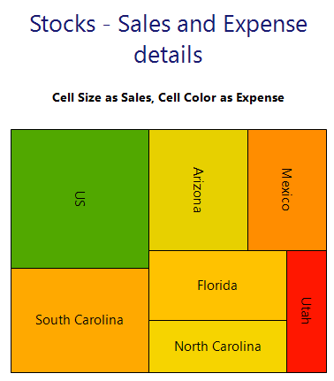

### Display title

The [DisplayTitle](https://help.syncfusion.com/cr/windowsforms/Syncfusion.Windows.Forms.Chart.ChartHeatMapConfigItem.html#Syncfusion_Windows_Forms_Chart_ChartHeatMapConfigItem_DisplayTitle) property specifies whether the series title is displayed in the color swatch, with `true` as its default value.

The following code hides the series title from the color swatch.



chartControl.Series[0].ConfigItems.HeatMapItem.DisplayTitle = false;


chartControl.Series(0).ConfigItems.HeatMapItem.DisplayTitle = False



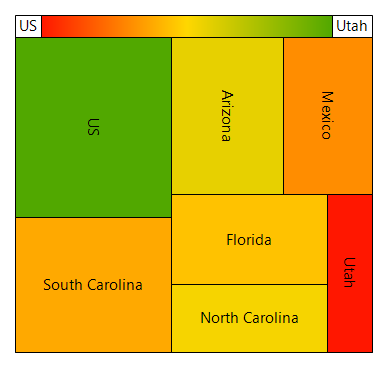

### Start text

The [StartText](https://help.syncfusion.com/cr/windowsforms/Syncfusion.Windows.Forms.Chart.ChartHeatMapConfigItem.html#Syncfusion_Windows_Forms_Chart_ChartHeatMapConfigItem_StartText) property specifies the text displayed at the start of the color swatch, with an `empty string` as its default value.

The following code displays **US** at the start of the color swatch.



chartControl.Series[0].ConfigItems.HeatMapItem.StartText = "US";


chartControl.Series(0).ConfigItems.HeatMapItem.StartText = "US"



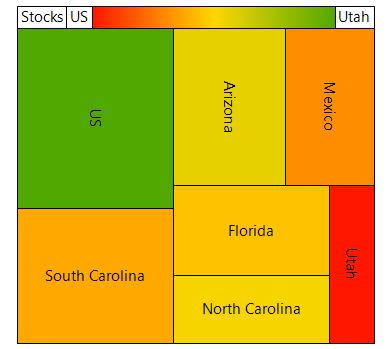

### End text

The [EndText](https://help.syncfusion.com/cr/windowsforms/Syncfusion.Windows.Forms.Chart.ChartHeatMapConfigItem.html#Syncfusion_Windows_Forms_Chart_ChartHeatMapConfigItem_EndText) property specifies the text displayed at the end of the color swatch, with an `empty string` as its default value.

The following code displays `Utah` at the end of the color swatch.



chartControl.Series[0].ConfigItems.HeatMapItem.EndText = Utah";


chartControl.Series(0).ConfigItems.HeatMapItem.EndText = "Utah"



### Lowest value color

The [LowestValueColor](https://help.syncfusion.com/cr/windowsforms/Syncfusion.Windows.Forms.Chart.ChartHeatMapConfigItem.html#Syncfusion_Windows_Forms_Chart_ChartHeatMapConfigItem_LowestValueColor) property specifies the color used to represent the lowest value in the heat map chart, with `Red` as its default value.

The following code sets the lowest-value color to **Green**.



chartControl.Series[0].ConfigItems.HeatMapItem.LowestValueColor = Color.Green;


chartControl.Series(0).ConfigItems.HeatMapItem.LowestValueColor = Color.Green



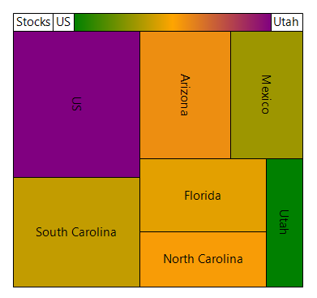

### Middle value color

The [MiddleValueColor](https://help.syncfusion.com/cr/windowsforms/Syncfusion.Windows.Forms.Chart.ChartHeatMapConfigItem.html#Syncfusion_Windows_Forms_Chart_ChartHeatMapConfigItem_MiddleValueColor) property specifies the color used to represent the middle value in the heat map chart, with `Yellow` as its default value.

The following code sets the middle-value color to `Orange`.



chartControl.Series[0].ConfigItems.HeatMapItem.MiddleValueColor = Color.Orange;


chartControl.Series(0).ConfigItems.HeatMapItem.MiddleValueColor = Color.Orange



### Highest value color

The [HighestValueColor](https://help.syncfusion.com/cr/windowsforms/Syncfusion.Windows.Forms.Chart.ChartHeatMapConfigItem.html#Syncfusion_Windows_Forms_Chart_ChartHeatMapConfigItem_HighestValueColor) property specifies the color used to represent the highest value in the heat map chart, with `Blue` as its default value.

The following code sets the highest-value color to `Purple`.



chartControl.Series[0].ConfigItems.HeatMapItem.HighestValueColor = Color.Purple;


chartControl.Series(0).ConfigItems.HeatMapItem.HighestValueColor = Color.Purple



### Label margins

The [LabelMargins](https://help.syncfusion.com/cr/windowsforms/Syncfusion.Windows.Forms.Chart.ChartHeatMapConfigItem.html#Syncfusion_Windows_Forms_Chart_ChartHeatMapConfigItem_LabelMargins) property specifies the margin applied to the start and end labels of the color swatch, with `2f` as its default value.

The following code sets the label margin to **15f**.



chartControl.Series[0].ConfigItems.HeatMapItem.LabelMargins = 15f;


chartControl.Series(0).ConfigItems.HeatMapItem.LabelMargins = 15.0F



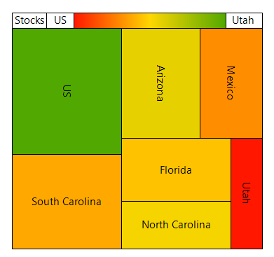

### Allow labels auto fit

The [AllowLabelsAutoFit](https://help.syncfusion.com/cr/windowsforms/Syncfusion.Windows.Forms.Chart.ChartHeatMapConfigItem.html#Syncfusion_Windows_Forms_Chart_ChartHeatMapConfigItem_AllowLabelsAutoFit) property specifies whether heat map labels are automatically resized to fit within the available space, with `true` as its default value.

The following code disables automatic label resizing.



chartControl.Series[0].ConfigItems.HeatMapItem.AllowLabelsAutoFit = false;


chartControl.Series(0).ConfigItems.HeatMapItem.AllowLabelsAutoFit = False



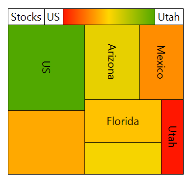

### Enable label rotation

The [EnableLabelRotation](https://help.syncfusion.com/cr/windowsforms/Syncfusion.Windows.Forms.Chart.ChartHeatMapConfigItem.html#Syncfusion_Windows_Forms_Chart_ChartHeatMapConfigItem_EnableLabelRotation) property specifies whether heat map labels can be rotated to fit within the available space, with `true` as its default value.

The following code disables label rotation.



chartControl.Series[0].ConfigItems.HeatMapItem.EnableLabelRotation =
    false;


chartControl.Series(0).ConfigItems.HeatMapItem.EnableLabelRotation =
    False



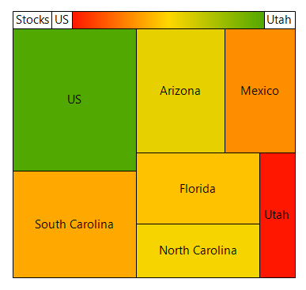

### Enable labels truncation

The [EnableLabelsTruncation](https://help.syncfusion.com/cr/windowsforms/Syncfusion.Windows.Forms.Chart.ChartHeatMapConfigItem.html#Syncfusion_Windows_Forms_Chart_ChartHeatMapConfigItem_EnableLabelsTruncation) property specifies whether labels are truncated when they exceed the available display space, with `false` as its default value.

The following code enables label truncation.



chartControl.Series[0].ConfigItems.HeatMapItem.EnableLabelsTruncation = true;


chartControl.Series(0).ConfigItems.HeatMapItem.EnableLabelsTruncation = True



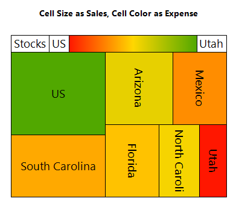

### Maximum characters

The [MaximumCharacters](https://help.syncfusion.com/cr/windowsforms/Syncfusion.Windows.Forms.Chart.ChartHeatMapConfigItem.html#Syncfusion_Windows_Forms_Chart_ChartHeatMapConfigItem_MaximumCharacters) property specifies the maximum number of characters displayed in a heat map label, with **-1** as its default value, indicating that no character limit is applied.

N> [MaximumCharacters](https://help.syncfusion.com/cr/windowsforms/Syncfusion.Windows.Forms.Chart.ChartHeatMapConfigItem.html#Syncfusion_Windows_Forms_Chart_ChartHeatMapConfigItem_MaximumCharacters) applicable only when [EnableLabelsTruncation](https://help.syncfusion.com/cr/windowsforms/Syncfusion.Windows.Forms.Chart.ChartHeatMapConfigItem.html#Syncfusion_Windows_Forms_Chart_ChartHeatMapConfigItem_EnableLabelsTruncation) is set to `true`.

The following code limits each heat map label to **3** characters.



chartControl.Series[0].ConfigItems.HeatMapItem.MaximumCharacters = 3;


chartControl.Series(0).ConfigItems.HeatMapItem.MaximumCharacters = 3



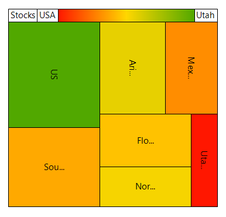

### Minimum font size

The [MinimumFontSize](https://help.syncfusion.com/cr/windowsforms/Syncfusion.Windows.Forms.Chart.ChartHeatMapConfigItem.html#Syncfusion_Windows_Forms_Chart_ChartHeatMapConfigItem_MinimumFontSize) property specifies the minimum font size used when heat map labels are automatically resized, with `6f` as its default value.

The following code sets the minimum label font size to **8f**.



chartControl.Series[0].ConfigItems.HeatMapItem.MinimumFontSize =
    8f;


chartControl.Series(0).ConfigItems.HeatMapItem.MinimumFontSize =
    8.0F



### Show large labels

The [ShowLargeLabels](https://help.syncfusion.com/cr/windowsforms/Syncfusion.Windows.Forms.Chart.ChartHeatMapConfigItem.html#Syncfusion_Windows_Forms_Chart_ChartHeatMapConfigItem_ShowLargeLabels) property specifies whether labels that exceed the available display area are displayed, with `false` as its default value.

The following code displays labels that exceed the available display area.



chartControl.Series[0].ConfigItems.HeatMapItem.ShowLargeLabels =
    true;


chartControl.Series(0).ConfigItems.HeatMapItem.ShowLargeLabels =
    True



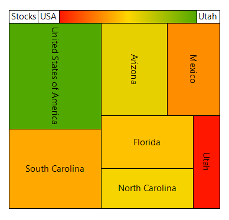

## Tornado chart

The tornado chart displays data points as horizontal bars that extend in different directions based on their values.

The following feature is supported in the tornado chart:

* **Chart Axis Labels**: The axis labels of a chart can be set by handling the [ChartFormatAxisLabel](https://help.syncfusion.com/cr/windowsforms/Syncfusion.Windows.Forms.Chart.ChartControl.html#Syncfusion_Windows_Forms_Chart_ChartControl_ChartFormatAxisLabel) event.

The following code example demonstrates how to create a tornado Chart.




ChartSeries positiveImpact = new ChartSeries("Positive Impact", ChartSeriesType.Tornado);
positiveImpact.Points.Add(1, 0, 48);
positiveImpact.Points.Add(2, 0, 42);
positiveImpact.Points.Add(3, 0, 27);
positiveImpact.Points.Add(4, 0, 20);
positiveImpact.Points.Add(5, 0, 9);

ChartSeries negativeImpact = new ChartSeries("Negative Impact", ChartSeriesType.Tornado);

negativeImpact.Points.Add(1, 0, -45);
negativeImpact.Points.Add(2, 0, -39);
negativeImpact.Points.Add(3, 0, -31);
negativeImpact.Points.Add(4, 0, -20);
negativeImpact.Points.Add(5, 0, -11);

chartControl.Series.Add(positiveImpact);
chartControl.Series.Add(negativeImpact);




' Positive Impact Series
Dim positiveImpact As New ChartSeries("Positive Impact", ChartSeriesType.Tornado)

positiveImpact.Points.Add(1, 0, 48)
positiveImpact.Points.Add(2, 0, 42)
positiveImpact.Points.Add(3, 0, 27)
positiveImpact.Points.Add(4, 0, 20)
positiveImpact.Points.Add(5, 0, 9)

' Negative Impact Series
Dim negativeImpact As New ChartSeries("Negative Impact", ChartSeriesType.Tornado)

negativeImpact.Points.Add(1, 0, -45)
negativeImpact.Points.Add(2, 0, -39)
negativeImpact.Points.Add(3, 0, -31)
negativeImpact.Points.Add(4, 0, -20)
negativeImpact.Points.Add(5, 0, -11)

' Add Series to Chart
chartControl.Series.Add(positiveImpact)
chartControl.Series.Add(negativeImpact)




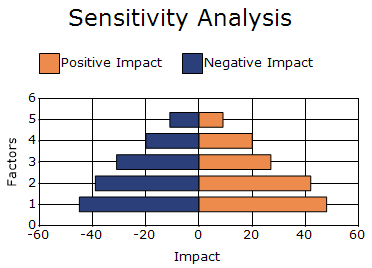