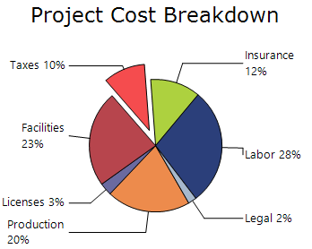
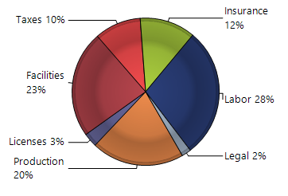
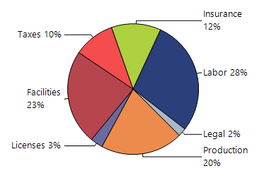
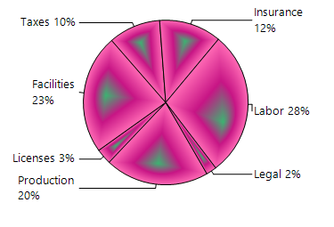
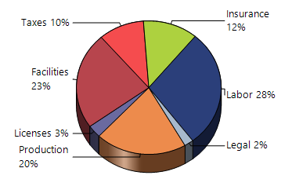
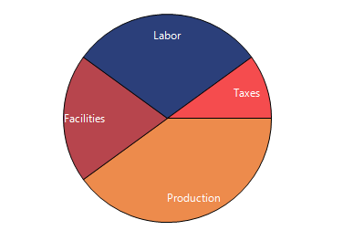
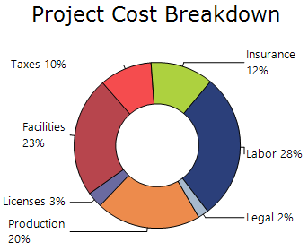
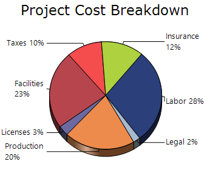

# Pie chart in windows forms chart

## Pie chart

A Pie Chart is used to display how different categories contribute to a whole. Each category is shown as a slice of a circle, and the size of each slice is proportional to its value. Pie charts are useful for comparing percentages or proportions of categories within a dataset. 

The X-values represent categories, while the Y-values determine the size of the slices. A Pie Chart can display only one data series at a time.

You can also customize the following features for pie chart:

* **Chart 3-D Mode**: A pie or doughnut chart can be rendered in 3-D mode by enabling the [Series3D](https://help.syncfusion.com/cr/windowsforms/Syncfusion.Windows.Forms.Chart.ChartControl.html#Syncfusion_Windows_Forms_Chart_ChartControl_Series3D) property.
* **Optimize Pie Point Positions**: Small pie slices can be arranged more effectively for better readability using the [OptimizePiePointPositions](https://help.syncfusion.com/windowsforms/chart/chart-series#optimizepiepointpositions) property.
* **Show Ticks**: Connector lines between slices and labels can be displayed using the [ShowTicks](https://help.syncfusion.com/windowsforms/chart/chart-series#showticks) property.
* **Explode Slices**: Pie and doughnut slices can be separated from the chart to emphasize specific data points using the [ExplodedAll](https://help.syncfusion.com/windowsforms/chart/chart-series#explodedall), [ExplodedIndex](https://help.syncfusion.com/windowsforms/chart/chart-series#explodedindex), and [ExplosionOffset](https://help.syncfusion.com/windowsforms/chart/chart-series#explosionoffset) properties.
* **Chart Rotation**: The starting angle of a pie or doughnut chart can be adjusted using the [AngleOffset](https://help.syncfusion.com/windowsforms/chart/chart-series#angleoffset) property.

N>
Chart Details
* Number of Y values per point - 1.
* Number of Series - One.
* Cannot be combined with - Any other chart types.

The following code example demonstrates how to create a Pie Chart.




ChartSeries series = new ChartSeries("Market", ChartSeriesType.Pie);
series.Points.Add(0, 20);
series.Points.Add(1, 28);
series.Points.Add(2, 23);
series.Points.Add(3, 10);
series.Points.Add(4, 12);
series.Points.Add(5, 3);
series.Points.Add(6, 2);

series.Styles[0].Text = string.Format("Production {0}%", series.Points[0].YValues[0]);
series.Styles[1].Text = string.Format("Labor {0}%", series.Points[1].YValues[0]);
series.Styles[2].Text = string.Format("Facilities {0}%", series.Points[2].YValues[0]);
series.Styles[3].Text = string.Format("Taxes {0}%", series.Points[3].YValues[0]);
series.Styles[4].Text = string.Format("Insurance {0}%", series.Points[4].YValues[0]);
series.Styles[5].Text = string.Format("Licenses {0}%", series.Points[5].YValues[0]);
series.Styles[6].Text = string.Format("Legal {0}%", series.Points[6].YValues[0]);
series.Style.DisplayText = true;

series.ConfigItems.PieItem.LabelStyle = ChartAccumulationLabelStyle.OutsideInColumn;
series.ConfigItems.PieItem.AngleOffset = 60;

series.ExplodedIndex = 3;
series.ConfigItems.PieItem.PieRadius = 100;
series.Style.Font.Size = 8.0f;

chartControl.Series.Add(series);
chartControl.Legend.Visible = false;




' Pie Series
Dim series As New ChartSeries("Market", ChartSeriesType.Pie)

series.Points.Add(0, 20)
series.Points.Add(1, 28)
series.Points.Add(2, 23)
series.Points.Add(3, 10)
series.Points.Add(4, 12)
series.Points.Add(5, 3)
series.Points.Add(6, 2)

' Data Labels
series.Styles(0).Text = String.Format("Production {0}%", series.Points(0).YValues(0))
series.Styles(1).Text = String.Format("Labor {0}%", series.Points(1).YValues(0))
series.Styles(2).Text = String.Format("Facilities {0}%", series.Points(2).YValues(0))
series.Styles(3).Text = String.Format("Taxes {0}%", series.Points(3).YValues(0))
series.Styles(4).Text = String.Format("Insurance {0}%", series.Points(4).YValues(0))
series.Styles(5).Text = String.Format("Licenses {0}%", series.Points(5).YValues(0))
series.Styles(6).Text = String.Format("Legal {0}%", series.Points(6).YValues(0))

series.Style.DisplayText = True

' Pie Settings
series.ConfigItems.PieItem.LabelStyle = ChartAccumulationLabelStyle.OutsideInColumn
series.ConfigItems.PieItem.AngleOffset = 60

series.ExplodedIndex = 3
series.ConfigItems.PieItem.PieRadius = 100

series.Style.Font.Size = 8.0F

chartControl.Series.Add(series)

' Hide Legend
chartControl.Legend.Visible = False




### Pie type

The [PieType](https://help.syncfusion.com/cr/windowsforms/Syncfusion.Windows.Forms.Chart.ChartPieConfigItem.html#Syncfusion_Windows_Forms_Chart_ChartPieConfigItem_PieType) property specifies the painting style used to render a Pie chart, with **None** used as the default value.

The available painting styles are:

* [None](https://help.syncfusion.com/cr/windowsforms/Syncfusion.Windows.Forms.Chart.ChartPieType.html#Syncfusion_Windows_Forms_Chart_ChartPieType_None): No painting style is applied.
* [Outside](https://help.syncfusion.com/cr/windowsforms/Syncfusion.Windows.Forms.Chart.ChartPieType.html#Syncfusion_Windows_Forms_Chart_ChartPieType_Outside): Applies the painting style to the outer surface of the pie chart.
* [Inside](https://help.syncfusion.com/cr/windowsforms/Syncfusion.Windows.Forms.Chart.ChartPieType.html#Syncfusion_Windows_Forms_Chart_ChartPieType_Inside): Applies the painting style to the inner surface of the pie chart.
* [Round](https://help.syncfusion.com/cr/windowsforms/Syncfusion.Windows.Forms.Chart.ChartPieType.html#Syncfusion_Windows_Forms_Chart_ChartPieType_Round): Applies a rounded painting style to the pie chart.
* [Bevel](https://help.syncfusion.com/cr/windowsforms/Syncfusion.Windows.Forms.Chart.ChartPieType.html#Syncfusion_Windows_Forms_Chart_ChartPieType_Bevel): Applies the painting style to a sloping edge or surface of the pie chart.
* [Custom](https://help.syncfusion.com/cr/windowsforms/Syncfusion.Windows.Forms.Chart.ChartPieType.html#Syncfusion_Windows_Forms_Chart_ChartPieType_Custom): Applies a custom painting style to the pie chart.

The following code renders the Pie chart using the `Bevel` painting style.



chartControl.Series[0].ConfigItems.PieItem.PieType =
    ChartPieType.Bevel;


chartControl.Series(0).ConfigItems.PieItem.PieType =
    ChartPieType.Bevel



### Angle offset

The [AngleOffset](https://help.syncfusion.com/cr/windowsforms/Syncfusion.Windows.Forms.Chart.ChartPieConfigItem.html#Syncfusion_Windows_Forms_Chart_ChartPieConfigItem_AngleOffset) property rotates the Pie chart by changing the starting angle of the first segment. Its default value is `0f`, which applies no rotation to the starting position.

The following code rotates the starting position of the first Pie segment by 45 degrees.



chartControl.Series[0].ConfigItems.PieItem.AngleOffset =
    45f;


chartControl.Series(0).ConfigItems.PieItem.AngleOffset =
    45.0F



### Fill mode

The [FillMode](https://help.syncfusion.com/cr/windowsforms/Syncfusion.Windows.Forms.Chart.ChartPieConfigItem.html#Syncfusion_Windows_Forms_Chart_ChartPieConfigItem_FillMode) property specifies how gradient colors are applied to the Pie chart, with **AllPie** used by default to apply one continuous gradient across the complete chart.

The available fill modes are:

- **AllPie**: Applies the gradient colors across the complete Pie chart as a single shape.
- **EveryPie**: Applies the gradient colors separately to each Pie segment.

The following code defines a custom gradient using the `Gradient` property. Set `PieType` to `Custom` to apply the gradient, and set `FillMode` to `EveryPie` to restart the complete gradient separately within each Pie segment.



series.ConfigItems.PieItem.PieType =
ChartPieType.Custom;
ColorBlend gradient = new ColorBlend();
gradient.Colors = new Color[]
{
Color.HotPink,
Color.MediumVioletRed,
Color.MediumSeaGreen
};
;
gradient.Positions = new float[]
{
0.0f,
0.5f,
1.0f
}
            ;

series.ConfigItems.PieItem.Gradient = gradient;
series.ConfigItems.PieItem.FillMode = ChartPieFillMode.EveryPie;


series.ConfigItems.PieItem.PieType =
    ChartPieType.Custom

Dim gradient As New ColorBlend()

gradient.Colors = New Color() {
    Color.HotPink,
    Color.MediumVioletRed,
    Color.MediumSeaGreen
}

gradient.Positions = New Single() {
    0.0F,
    0.5F,
    1.0F
}

series.ConfigItems.PieItem.Gradient = gradient
series.ConfigItems.PieItem.FillMode =
    ChartPieFillMode.EveryPie



### Gradient

The [Gradient](https://help.syncfusion.com/cr/windowsforms/Syncfusion.Windows.Forms.Chart.ChartPieConfigItem.html#Syncfusion_Windows_Forms_Chart_ChartPieConfigItem_Gradient) property specifies the gradient colors applied to the Pie chart when the [PieType](https://help.syncfusion.com/cr/windowsforms/Syncfusion.Windows.Forms.Chart.ChartPieConfigItem.html#Syncfusion_Windows_Forms_Chart_ChartPieConfigItem_PieType) property is set to [Custom](https://help.syncfusion.com/cr/windowsforms/Syncfusion.Windows.Forms.Chart.ChartPieType.html#Syncfusion_Windows_Forms_Chart_ChartPieType_Custom). Since the default value is `null`, the Pie chart is rendered without a custom gradient until gradient colors are assigned.

### Height by area depth

The [HeightByAreaDepth](https://help.syncfusion.com/cr/windowsforms/Syncfusion.Windows.Forms.Chart.ChartPieConfigItem.html#Syncfusion_Windows_Forms_Chart_ChartPieConfigItem_HeightByAreaDepth) property controls whether the height of a 3D Pie chart is determined by the chart area's `Depth` property. By default, this property is set to `false`, and the Pie chart height is determined using the `HeightCoefficient` property.

The following code configures the Pie chart height based on the chart area's depth.



chartControl.Series[0].ConfigItems.PieItem.HeightByAreaDepth = true;


chartControl.Series(0).ConfigItems.PieItem.HeightByAreaDepth = True



### Label style

The [LabelStyle](https://help.syncfusion.com/cr/windowsforms/Syncfusion.Windows.Forms.Chart.ChartPieConfigItem.html#Syncfusion_Windows_Forms_Chart_ChartPieConfigItem_LabelStyle) property specifies how data labels are displayed relative to the Pie chart segments, with **Outside** used as the default label style.

The available label styles are:

- [Disabled](https://help.syncfusion.com/cr/windowsforms/Syncfusion.Windows.Forms.Chart.ChartAccumulationLabelStyle.html#Syncfusion_Windows_Forms_Chart_ChartAccumulationLabelStyle_Disabled): Hides the data labels.
- [Inside](https://help.syncfusion.com/cr/windowsforms/Syncfusion.Windows.Forms.Chart.ChartAccumulationLabelStyle.html#Syncfusion_Windows_Forms_Chart_ChartAccumulationLabelStyle_Inside): Displays labels inside the Pie chart segments.
- [Outside](https://help.syncfusion.com/cr/windowsforms/Syncfusion.Windows.Forms.Chart.ChartAccumulationLabelStyle.html#Syncfusion_Windows_Forms_Chart_ChartAccumulationLabelStyle_Outside): Displays labels outside the Pie chart segments.
- [OutsideInArea](https://help.syncfusion.com/cr/windowsforms/Syncfusion.Windows.Forms.Chart.ChartAccumulationLabelStyle.html#Syncfusion_Windows_Forms_Chart_ChartAccumulationLabelStyle_OutsideInArea): Displays labels outside the segments but within the chart area.
- [OutsideInColumn](https://help.syncfusion.com/cr/windowsforms/Syncfusion.Windows.Forms.Chart.ChartAccumulationLabelStyle.html#Syncfusion_Windows_Forms_Chart_ChartAccumulationLabelStyle_OutsideInColumn): Displays labels outside the segments in a column layout.

The following code displays the data labels inside the Pie chart segments.



chartControl.Series[0].ConfigItems.PieItem.LabelStyle =
    ChartAccumulationLabelStyle.Inside;


chartControl.Series(0).ConfigItems.PieItem.LabelStyle = ChartAccumulationLabelStyle.Inside

### Pie height

The [PieHeight](https://help.syncfusion.com/cr/windowsforms/Syncfusion.Windows.Forms.Chart.ChartPieConfigItem.html#Syncfusion_Windows_Forms_Chart_ChartPieConfigItem_PieHeight) property specifies the height of an individual pie when multiple pies are enabled.



chartControl.Series[0].ConfigItems.PieItem.PieHeight = 100f;


chartControl.Series(0).ConfigItems.PieItem.PieHeight = 100.0F



### Pie radius

The [PieRadius](https://help.syncfusion.com/cr/windowsforms/Syncfusion.Windows.Forms.Chart.ChartPieConfigItem.html#Syncfusion_Windows_Forms_Chart_ChartPieConfigItem_PieRadius) property controls the radius of the pie chart, allowing its rendered size to be adjusted.



chartControl.Series[0].ConfigItems.PieItem.PieRadius = 100f;


chartControl.Series(0).ConfigItems.PieItem.PieRadius = 100.0F



### Pie size

The [PieSize](https://help.syncfusion.com/cr/windowsforms/Syncfusion.Windows.Forms.Chart.ChartPieConfigItem.html#Syncfusion_Windows_Forms_Chart_ChartPieConfigItem_PieSize) property specifies the width and height of an individual pie when multiple pies are enabled. This property is primarily intended for internal use.



chartControl.Series[0].ConfigItems.PieItem.PieSize = new SizeF(200f, 150f);


chartControl.Series(0).ConfigItems.PieItem.PieSize = New SizeF(200.0F, 150.0F)



### Pie tilt

The [PieTilt](https://help.syncfusion.com/cr/windowsforms/Syncfusion.Windows.Forms.Chart.ChartPieConfigItem.html#Syncfusion_Windows_Forms_Chart_ChartPieConfigItem_PieTilt) property specifies the tilte of an individual pie when multiple pies are enabled.



chartControl.Series[0].ConfigItems.PieItem.PieTilt = 30f;


chartControl.Series(0).ConfigItems.PieItem.PieTilt = 30.0F



### Pie with same radius

The [PieWithSameRadius](https://help.syncfusion.com/cr/windowsforms/Syncfusion.Windows.Forms.Chart.ChartPieConfigItem.html#Syncfusion_Windows_Forms_Chart_ChartPieConfigItem_PieWithSameRadius) property maintains the same pie radius when the **LabelStyle** property is set to **Outside** or **OutsideInColumn**.



chartControl.Series[0].ConfigItems.PieItem.PieWithSameRadius = true;


chartControl.Series(0).ConfigItems.PieItem.PieWithSameRadius = True



### Show databind labels

The [ShowDataBindLabels](https://help.syncfusion.com/cr/windowsforms/Syncfusion.Windows.Forms.Chart.ChartPieConfigItem.html#Syncfusion_Windows_Forms_Chart_ChartPieConfigItem_ShowDataBindLabels) property controls whether labels obtained from the bound data source are displayed on the pie segments.



chartControl.Series[0].ConfigItems.PieItem.ShowDataBindLabels = true;


chartControl.Series(0).ConfigItems.PieItem.ShowDataBindLabels = True



### Show series title

The [ShowSeriesTitle](https://help.syncfusion.com/cr/windowsforms/Syncfusion.Windows.Forms.Chart.ChartPieConfigItem.html#Syncfusion_Windows_Forms_Chart_ChartPieConfigItem_ShowSeriesTitle) property controls whether the series title is displayed in the pie chart.



chartControl.Series[0].ConfigItems.PieItem.ShowSeriesTitle = true;


chartControl.Series(0).ConfigItems.PieItem.ShowSeriesTitle = True



### Customization option

The following chart series properties are used as customization options for Pie chart:

- [AngleOffset](https://help.syncfusion.com/windowsforms/chart/chart-series#angleoffset)
- [Border](https://help.syncfusion.com/windowsforms/chart/chart-series#border)
- [DisplayShadow](https://help.syncfusion.com/windowsforms/chart/chart-series#displayshadow)
- [DisplayText](https://help.syncfusion.com/windowsforms/chart/chart-series#displaytext)
- [DoughnutCoefficient](https://help.syncfusion.com/windowsforms/chart/chart-series#doughnutcoefficient)
- [DrawSeriesNameInDepth](https://help.syncfusion.com/windowsforms/chart/chart-series#drawseriesnameindepth)
- [ElementBorders](https://help.syncfusion.com/windowsforms/chart/chart-series#elementborders)
- [ExplodedAll](https://help.syncfusion.com/windowsforms/chart/chart-series#explodedall)
- [ExplodedIndex](https://help.syncfusion.com/windowsforms/chart/chart-series#explodedindex)
- [ExplosionOffset](https://help.syncfusion.com/windowsforms/chart/chart-series#explosionoffset)
- [FancyToolTip](https://help.syncfusion.com/windowsforms/chart/chart-series#fancytooltip)
- [FillMode](https://help.syncfusion.com/windowsforms/chart/chart-series#fillmode)
- [Font](https://help.syncfusion.com/windowsforms/chart/chart-series#font)
- [Gradient](https://help.syncfusion.com/windowsforms/chart/chart-series#gradient)
- [HeightByAreaDepth](https://help.syncfusion.com/windowsforms/chart/chart-series#heightbyareadepth)
- [HeightCoefficient](https://help.syncfusion.com/windowsforms/chart/chart-series#heightcoefficient)
- [HighlightInterior](https://help.syncfusion.com/windowsforms/chart/chart-series#highlightinterior)
- [InSideRadius](https://help.syncfusion.com/windowsforms/chart/chart-series#insideradius)
- [Interior](https://help.syncfusion.com/windowsforms/chart/chart-series#interior)
- [LegendItem](https://help.syncfusion.com/windowsforms/chart/chart-series#legenditem)
- [Name](https://help.syncfusion.com/windowsforms/chart/chart-series#name)
- [OptimizePiePointPositions](https://help.syncfusion.com/windowsforms/chart/chart-series#optimizepiepointpositions)
- [PieType](https://help.syncfusion.com/windowsforms/chart/chart-series#pietype)
- [PointsToolTipFormat](https://help.syncfusion.com/windowsforms/chart/chart-series#pointstooltipformat)
- [ShadowInterior](https://help.syncfusion.com/windowsforms/chart/chart-series#shadowinterior)
- [ShadowOffset](https://help.syncfusion.com/windowsforms/chart/chart-series#shadowoffset)
- [ShowDataBindLabels](https://help.syncfusion.com/windowsforms/chart/chart-series#showdatabindlabels)
- [ShowTicks](https://help.syncfusion.com/windowsforms/chart/chart-series#showticks)
- [SmartLabels](https://help.syncfusion.com/windowsforms/chart/chart-series#smartlabels)
- [Summary](https://help.syncfusion.com/windowsforms/chart/chart-series#summary)
- [Text](https://help.syncfusion.com/windowsforms/chart/chart-series#text-series)
- [TextColor](https://help.syncfusion.com/windowsforms/chart/chart-series#textcolor)
- [TextFormat](https://help.syncfusion.com/windowsforms/chart/chart-series#textformat)
- [TextOffset](https://help.syncfusion.com/windowsforms/chart/chart-series#textoffset)
- [TextOrientation](https://help.syncfusion.com/windowsforms/chart/chart-series#textorientation)
- [Visible](https://help.syncfusion.com/windowsforms/chart/chart-series#visible)
- [VisibleAllPies](https://help.syncfusion.com/windowsforms/chart/chart-series#visibleallpies)

## Doughnut chart

A Doughnut Chart is a variation of a Pie Chart that displays data as slices in a ring-shaped circle with a hollow center. It is used to show the proportion or percentage contribution of categories to the whole dataset.

### Doughnut coefficient

The [DoughnutCoefficient](https://help.syncfusion.com/cr/windowsforms/Syncfusion.Windows.Forms.Chart.ChartPieConfigItem.html#Syncfusion_Windows_Forms_Chart_ChartPieConfigItem_DoughnutCoeficient) property is used to render a Pie Chart as a Doughnut Chart. It specifies the size of the hollow center as a fraction of the chart's radius. By default, the value is 0.0, which renders the chart as a full Pie Chart. Valid values range from 0.0 to 0.9.




series.ConfigItems.PieItem.DoughnutCoeficient = 0.5f;




series.ConfigItems.PieItem.DoughnutCoeficient = 0.5F




### Height coefficient

When the chart is displayed in 3D mode, the [HeightCoefficient](https://help.syncfusion.com/cr/windowsforms/Syncfusion.Windows.Forms.Chart.ChartPieConfigItem.html#Syncfusion_Windows_Forms_Chart_ChartPieConfigItem_HeightCoeficient) property controls the relative height of the Doughnut Chart. For this property to take effect, [HeightByAreaDepth](https://help.syncfusion.com/cr/windowsforms/Syncfusion.Windows.Forms.Chart.ChartPieConfigItem.html#Syncfusion_Windows_Forms_Chart_ChartPieConfigItem_HeightByAreaDepth) must be set to false. Valid values range from 0.1f to 0.5f, and the default value is 0.2f.




series.ConfigItems.PieItem.HeightByAreaDepth = false;

series.ConfigItems.PieItem.HeightCoeficient = 0.1f;




series.ConfigItems.PieItem.HeightByAreaDepth = False

series.ConfigItems.PieItem.HeightCoeficient = 0.1F




### Customization option

The following chart series properties are used as customization options for Doughnut chart:

- [AngleOffset](https://help.syncfusion.com/windowsforms/chart/chart-series#angleoffset)
- [Border](https://help.syncfusion.com/windowsforms/chart/chart-series#border)
- [DisplayShadow](https://help.syncfusion.com/windowsforms/chart/chart-series#displayshadow)
- [DisplayText](https://help.syncfusion.com/windowsforms/chart/chart-series#displaytext)
- [DoughnutCoefficient](https://help.syncfusion.com/windowsforms/chart/chart-series#doughnutcoefficient)
- [DrawSeriesNameInDepth](https://help.syncfusion.com/windowsforms/chart/chart-series#drawseriesnameindepth)
- [ElementBorders](https://help.syncfusion.com/windowsforms/chart/chart-series#elementborders)
- [ExplodedAll](https://help.syncfusion.com/windowsforms/chart/chart-series#explodedall)
- [ExplodedIndex](https://help.syncfusion.com/windowsforms/chart/chart-series#explodedindex)
- [ExplosionOffset](https://help.syncfusion.com/windowsforms/chart/chart-series#explosionoffset)
- [FancyToolTip](https://help.syncfusion.com/windowsforms/chart/chart-series#fancytooltip)
- [FillMode](https://help.syncfusion.com/windowsforms/chart/chart-series#fillmode)
- [Font](https://help.syncfusion.com/windowsforms/chart/chart-series#font)
- [Gradient](https://help.syncfusion.com/windowsforms/chart/chart-series#gradient)
- [HeightByAreaDepth](https://help.syncfusion.com/windowsforms/chart/chart-series#heightbyareadepth)
- [HeightCoefficient](https://help.syncfusion.com/windowsforms/chart/chart-series#heightcoefficient)
- [HighlightInterior](https://help.syncfusion.com/windowsforms/chart/chart-series#highlightinterior)
- [InSideRadius](https://help.syncfusion.com/windowsforms/chart/chart-series#insideradius)
- [Interior](https://help.syncfusion.com/windowsforms/chart/chart-series#interior)
- [LegendItem](https://help.syncfusion.com/windowsforms/chart/chart-series#legenditem)
- [Name](https://help.syncfusion.com/windowsforms/chart/chart-series#name)
- [OptimizePiePointPositions](https://help.syncfusion.com/windowsforms/chart/chart-series#optimizepiepointpositions)
- [PieType](https://help.syncfusion.com/windowsforms/chart/chart-series#pietype)
- [PointsToolTipFormat](https://help.syncfusion.com/windowsforms/chart/chart-series#pointstooltipformat)
- [ShadowInterior](https://help.syncfusion.com/windowsforms/chart/chart-series#shadowinterior)
- [ShadowOffset](https://help.syncfusion.com/windowsforms/chart/chart-series#shadowoffset)
- [ShowDataBindLabels](https://help.syncfusion.com/windowsforms/chart/chart-series#showdatabindlabels)
- [ShowTicks](https://help.syncfusion.com/windowsforms/chart/chart-series#showticks)
- [SmartLabels](https://help.syncfusion.com/windowsforms/chart/chart-series#smartlabels)
- [Summary](https://help.syncfusion.com/windowsforms/chart/chart-series#summary)
- [Text](https://help.syncfusion.com/windowsforms/chart/chart-series#text-series)
- [TextColor](https://help.syncfusion.com/windowsforms/chart/chart-series#textcolor)
- [TextFormat](https://help.syncfusion.com/windowsforms/chart/chart-series#textformat)
- [TextOffset](https://help.syncfusion.com/windowsforms/chart/chart-series#textoffset)
- [TextOrientation](https://help.syncfusion.com/windowsforms/chart/chart-series#textorientation)
- [Visible](https://help.syncfusion.com/windowsforms/chart/chart-series#visible)
- [VisibleAllPies](https://help.syncfusion.com/windowsforms/chart/chart-series#visibleallpies)