# Pie and Doughnut in Windows Forms Charts

## Pie chart

A pie chart displays data as slices of a circle to show how each value contributes to the whole. The X-values represent the categories, while the Y-values determine the size of each slice.

The following code example demonstrates how to create a pie Chart.




ChartSeries series = new ChartSeries("Market", ChartSeriesType.Pie);
series.Points.Add(0, 20);
series.Points.Add(1, 28);
series.Points.Add(2, 23);
series.Points.Add(3, 10);
series.Points.Add(4, 12);
series.Points.Add(5, 3);
series.Points.Add(6, 2);

series.Styles[0].Text = string.Format("Production {0}%", series.Points[0].YValues[0]);
series.Styles[1].Text = string.Format("Labor {0}%", series.Points[1].YValues[0]);
series.Styles[2].Text = string.Format("Facilities {0}%", series.Points[2].YValues[0]);
series.Styles[3].Text = string.Format("Taxes {0}%", series.Points[3].YValues[0]);
series.Styles[4].Text = string.Format("Insurance {0}%", series.Points[4].YValues[0]);
series.Styles[5].Text = string.Format("Licenses {0}%", series.Points[5].YValues[0]);
series.Styles[6].Text = string.Format("Legal {0}%", series.Points[6].YValues[0]);
series.Style.DisplayText = true;

series.ConfigItems.PieItem.LabelStyle = ChartAccumulationLabelStyle.OutsideInColumn;
series.ConfigItems.PieItem.AngleOffset = 60;

series.ExplodedIndex = 3;
series.ConfigItems.PieItem.PieRadius = 100;
series.Style.Font.Size = 8.0f;

chartControl.Series.Add(series);
chartControl.Legend.Visible = false;




' Pie Series
Dim series As New ChartSeries("Market", ChartSeriesType.Pie)

series.Points.Add(0, 20)
series.Points.Add(1, 28)
series.Points.Add(2, 23)
series.Points.Add(3, 10)
series.Points.Add(4, 12)
series.Points.Add(5, 3)
series.Points.Add(6, 2)

' Data Labels
series.Styles(0).Text = String.Format("Production {0}%", series.Points(0).YValues(0))
series.Styles(1).Text = String.Format("Labor {0}%", series.Points(1).YValues(0))
series.Styles(2).Text = String.Format("Facilities {0}%", series.Points(2).YValues(0))
series.Styles(3).Text = String.Format("Taxes {0}%", series.Points(3).YValues(0))
series.Styles(4).Text = String.Format("Insurance {0}%", series.Points(4).YValues(0))
series.Styles(5).Text = String.Format("Licenses {0}%", series.Points(5).YValues(0))
series.Styles(6).Text = String.Format("Legal {0}%", series.Points(6).YValues(0))

series.Style.DisplayText = True

' Pie Settings
series.ConfigItems.PieItem.LabelStyle = ChartAccumulationLabelStyle.OutsideInColumn
series.ConfigItems.PieItem.AngleOffset = 60

series.ExplodedIndex = 3
series.ConfigItems.PieItem.PieRadius = 100

series.Style.Font.Size = 8.0F

chartControl.Series.Add(series)

' Hide Legend
chartControl.Legend.Visible = False




### Pie type

The [PieType](https://help.syncfusion.com/cr/windowsforms/Syncfusion.Windows.Forms.Chart.ChartPieConfigItem.html#Syncfusion_Windows_Forms_Chart_ChartPieConfigItem_PieType) property specifies the painting style used to render a pie chart, with [None](https://help.syncfusion.com/cr/windowsforms/Syncfusion.Windows.Forms.Chart.ChartPieType.html#Syncfusion_Windows_Forms_Chart_ChartPieType_None) used as the default value.

The available painting styles are:

* [None](https://help.syncfusion.com/cr/windowsforms/Syncfusion.Windows.Forms.Chart.ChartPieType.html#Syncfusion_Windows_Forms_Chart_ChartPieType_None): No painting style is applied.
* [Outside](https://help.syncfusion.com/cr/windowsforms/Syncfusion.Windows.Forms.Chart.ChartPieType.html#Syncfusion_Windows_Forms_Chart_ChartPieType_Outside): Applies the painting style to the outer surface of the pie chart.
* [Inside](https://help.syncfusion.com/cr/windowsforms/Syncfusion.Windows.Forms.Chart.ChartPieType.html#Syncfusion_Windows_Forms_Chart_ChartPieType_Inside): Applies the painting style to the inner surface of the pie chart.
* [Round](https://help.syncfusion.com/cr/windowsforms/Syncfusion.Windows.Forms.Chart.ChartPieType.html#Syncfusion_Windows_Forms_Chart_ChartPieType_Round): Applies a rounded painting style to the pie chart.
* [Bevel](https://help.syncfusion.com/cr/windowsforms/Syncfusion.Windows.Forms.Chart.ChartPieType.html#Syncfusion_Windows_Forms_Chart_ChartPieType_Bevel): Applies the painting style to a sloping edge or surface of the pie chart.
* [Custom](https://help.syncfusion.com/cr/windowsforms/Syncfusion.Windows.Forms.Chart.ChartPieType.html#Syncfusion_Windows_Forms_Chart_ChartPieType_Custom): Applies a custom painting style to the pie chart.

The following code renders the pie chart using the `Bevel` painting style.



chartControl.Series[0].ConfigItems.PieItem.PieType =
    ChartPieType.Bevel;


chartControl.Series(0).ConfigItems.PieItem.PieType =
    ChartPieType.Bevel



### Angle offset

The [AngleOffset](https://help.syncfusion.com/cr/windowsforms/Syncfusion.Windows.Forms.Chart.ChartPieConfigItem.html#Syncfusion_Windows_Forms_Chart_ChartPieConfigItem_AngleOffset) property rotates the pie chart by changing the starting angle of the first segment. Its default value is `0f`, which applies no rotation to the starting position.

The following code rotates the starting position of the first pie segment by 45 degrees.



chartControl.Series[0].ConfigItems.PieItem.AngleOffset =
    45f;


chartControl.Series(0).ConfigItems.PieItem.AngleOffset =
    45.0F



### Fill mode

The [FillMode](https://help.syncfusion.com/cr/windowsforms/Syncfusion.Windows.Forms.Chart.ChartPieConfigItem.html#Syncfusion_Windows_Forms_Chart_ChartPieConfigItem_FillMode) property specifies how gradient colors are applied to the pie chart, with [AllPie](https://help.syncfusion.com/cr/windowsforms/Syncfusion.Windows.Forms.Chart.ChartPieFillMode.html#Syncfusion_Windows_Forms_Chart_ChartPieFillMode_AllPie) used by default to apply one continuous gradient across the complete chart.

The available fill modes are:

- [AllPie](https://help.syncfusion.com/cr/windowsforms/Syncfusion.Windows.Forms.Chart.ChartPieFillMode.html#Syncfusion_Windows_Forms_Chart_ChartPieFillMode_AllPie): Applies the gradient colors across the complete pie chart as a single shape.
- [EveryPie](https://help.syncfusion.com/cr/windowsforms/Syncfusion.Windows.Forms.Chart.ChartPieFillMode.html#Syncfusion_Windows_Forms_Chart_ChartPieFillMode_EveryPie): Applies the gradient colors separately to each pie segment.

The following code defines a custom gradient using the `Gradient` property. Set `PieType` to `Custom` to apply the gradient, and set `FillMode` to `EveryPie` to restart the complete gradient separately within each pie segment.



series.ConfigItems.PieItem.PieType =
ChartPieType.Custom;
ColorBlend gradient = new ColorBlend();
gradient.Colors = new Color[]
{
Color.HotPink,
Color.MediumVioletRed,
Color.MediumSeaGreen
};
;
gradient.Positions = new float[]
{
0.0f,
0.5f,
1.0f
}
;

series.ConfigItems.PieItem.Gradient = gradient;
series.ConfigItems.PieItem.FillMode = ChartPieFillMode.EveryPie;


series.ConfigItems.PieItem.PieType =
    ChartPieType.Custom

Dim gradient As New ColorBlend()

gradient.Colors = New Color() {
    Color.HotPink,
    Color.MediumVioletRed,
    Color.MediumSeaGreen
}

gradient.Positions = New Single() {
    0.0F,
    0.5F,
    1.0F
}

series.ConfigItems.PieItem.Gradient = gradient
series.ConfigItems.PieItem.FillMode =
    ChartPieFillMode.EveryPie



### Gradient

The [Gradient](https://help.syncfusion.com/cr/windowsforms/Syncfusion.Windows.Forms.Chart.ChartPieConfigItem.html#Syncfusion_Windows_Forms_Chart_ChartPieConfigItem_Gradient) property specifies the gradient colors applied to the pie chart when the [PieType](https://help.syncfusion.com/cr/windowsforms/Syncfusion.Windows.Forms.Chart.ChartPieConfigItem.html#Syncfusion_Windows_Forms_Chart_ChartPieConfigItem_PieType) property is set to [Custom](https://help.syncfusion.com/cr/windowsforms/Syncfusion.Windows.Forms.Chart.ChartPieType.html#Syncfusion_Windows_Forms_Chart_ChartPieType_Custom). Since the default value is `null`, the pie chart is rendered without a custom gradient until gradient colors are assigned.



ColorBlend gradient = new ColorBlend();
gradient.Colors = new Color[]
{
Color.HotPink,
Color.MediumVioletRed,
Color.MediumSeaGreen
};
;
gradient.Positions = new float[]
{
0.0f,
0.5f,
1.0f
}
;

series.ConfigItems.PieItem.Gradient = gradient;




Dim gradient As New ColorBlend()

gradient.Colors = New Color() {
    Color.HotPink,
    Color.MediumVioletRed,
    Color.MediumSeaGreen
}

gradient.Positions = New Single() {
    0.0F,
    0.5F,
    1.0F
}

series.ConfigItems.PieItem.Gradient = gradient




### Height by area depth

The [HeightByAreaDepth](https://help.syncfusion.com/cr/windowsforms/Syncfusion.Windows.Forms.Chart.ChartPieConfigItem.html#Syncfusion_Windows_Forms_Chart_ChartPieConfigItem_HeightByAreaDepth) property controls whether the height of a 3D pie chart is determined by the chart area's [Depth](https://help.syncfusion.com/cr/windowsforms/Syncfusion.Windows.Forms.Chart.ChartArea.html#Syncfusion_Windows_Forms_Chart_ChartArea_Depth) property. By default, this property is set to `false`, and the pie chart height is determined using the [HeightCoefficient](https://help.syncfusion.com/cr/windowsforms/Syncfusion.Windows.Forms.Chart.ChartPieConfigItem.html#Syncfusion_Windows_Forms_Chart_ChartPieConfigItem_HeightCoeficient) property.

The following code configures the pie chart height based on the chart area's depth.



chartControl.Series[0].ConfigItems.PieItem.HeightByAreaDepth = true;


chartControl.Series(0).ConfigItems.PieItem.HeightByAreaDepth = True



### Label style

The [LabelStyle](https://help.syncfusion.com/cr/windowsforms/Syncfusion.Windows.Forms.Chart.ChartPieConfigItem.html#Syncfusion_Windows_Forms_Chart_ChartPieConfigItem_LabelStyle) property specifies how data labels are displayed relative to the pie chart segments, with [Outside](https://help.syncfusion.com/cr/windowsforms/Syncfusion.Windows.Forms.Chart.ChartAccumulationLabelStyle.html#Syncfusion_Windows_Forms_Chart_ChartAccumulationLabelStyle_Outside) used as the default label style.

The available label styles are:

- [Disabled](https://help.syncfusion.com/cr/windowsforms/Syncfusion.Windows.Forms.Chart.ChartAccumulationLabelStyle.html#Syncfusion_Windows_Forms_Chart_ChartAccumulationLabelStyle_Disabled): Hides the data labels.
- [Inside](https://help.syncfusion.com/cr/windowsforms/Syncfusion.Windows.Forms.Chart.ChartAccumulationLabelStyle.html#Syncfusion_Windows_Forms_Chart_ChartAccumulationLabelStyle_Inside): Displays labels inside the pie chart segments.
- [Outside](https://help.syncfusion.com/cr/windowsforms/Syncfusion.Windows.Forms.Chart.ChartAccumulationLabelStyle.html#Syncfusion_Windows_Forms_Chart_ChartAccumulationLabelStyle_Outside): Displays labels outside the pie chart segments.
- [OutsideInArea](https://help.syncfusion.com/cr/windowsforms/Syncfusion.Windows.Forms.Chart.ChartAccumulationLabelStyle.html#Syncfusion_Windows_Forms_Chart_ChartAccumulationLabelStyle_OutsideInArea): Displays labels outside the segments but within the chart area.
- [OutsideInColumn](https://help.syncfusion.com/cr/windowsforms/Syncfusion.Windows.Forms.Chart.ChartAccumulationLabelStyle.html#Syncfusion_Windows_Forms_Chart_ChartAccumulationLabelStyle_OutsideInColumn): Displays labels outside the segments in a column layout.

The following code displays the data labels inside the pie chart segments.



chartControl.Series[0].ConfigItems.PieItem.LabelStyle = ChartAccumulationLabelStyle.Inside;


chartControl.Series(0).ConfigItems.PieItem.LabelStyle = ChartAccumulationLabelStyle.Inside



### Pie height

The [PieHeight](https://help.syncfusion.com/cr/windowsforms/Syncfusion.Windows.Forms.Chart.ChartPieConfigItem.html#Syncfusion_Windows_Forms_Chart_ChartPieConfigItem_PieHeight) property specifies the height of an individual pie chart when [MultiplePies](https://help.syncfusion.com/cr/windowsforms/Syncfusion.Windows.Forms.Chart.ChartArea.html#Syncfusion_Windows_Forms_Chart_ChartArea_MultiplePies) are enabled.

N> [PieHeight](https://help.syncfusion.com/cr/windowsforms/Syncfusion.Windows.Forms.Chart.ChartPieConfigItem.html#Syncfusion_Windows_Forms_Chart_ChartPieConfigItem_PieHeight) property is applicable when [Series3D](https://help.syncfusion.com/cr/windowsforms/Syncfusion.Windows.Forms.Chart.ChartControl) set to `true`.

The following code sets the pie height to `100f`.



chartControl.Series[0].ConfigItems.PieItem.PieHeight = 100f;


chartControl.Series(0).ConfigItems.PieItem.PieHeight = 100.0F



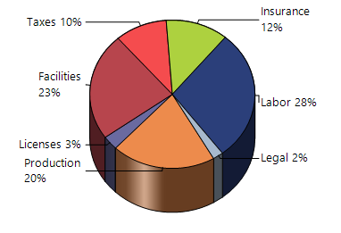

### Pie radius

The [PieRadius](https://help.syncfusion.com/cr/windowsforms/Syncfusion.Windows.Forms.Chart.ChartPieConfigItem.html#Syncfusion_Windows_Forms_Chart_ChartPieConfigItem_PieRadius) property controls the radius of the pie chart, allowing its rendered size to be adjusted, with `0f` used as the default value.

The following code sets the pie radius to `100f`.



chartControl.Series[0].ConfigItems.PieItem.PieRadius = 100f;


chartControl.Series(0).ConfigItems.PieItem.PieRadius = 100.0F



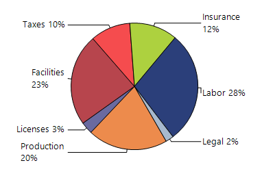

### Pie size

The [PieSize](https://help.syncfusion.com/cr/windowsforms/Syncfusion.Windows.Forms.Chart.ChartPieConfigItem.html#Syncfusion_Windows_Forms_Chart_ChartPieConfigItem_PieSize) property specifies the width and height of an individual pie chart when [MultiplePies](https://help.syncfusion.com/cr/windowsforms/Syncfusion.Windows.Forms.Chart.ChartArea.html#Syncfusion_Windows_Forms_Chart_ChartArea_MultiplePies) is enabled. This property is primarily intended for internal use, with `SizeF.Empty` used as the default value.

The following code sets the pie size to `new SizeF(100f, 80f)`.



chartControl.Series[0].ConfigItems.PieItem.PieSize = new SizeF(100f, 80f);


chartControl.Series(0).ConfigItems.PieItem.PieSize = New SizeF(100.0F, 80.0F)



### Pie tilt

The [PieTilt](https://help.syncfusion.com/cr/windowsforms/Syncfusion.Windows.Forms.Chart.ChartPieConfigItem.html#Syncfusion_Windows_Forms_Chart_ChartPieConfigItem_PieTilt) property specifies the tilt angle of an individual pie chart when [MultiplePies](https://help.syncfusion.com/cr/windowsforms/Syncfusion.Windows.Forms.Chart.ChartArea.html#Syncfusion_Windows_Forms_Chart_ChartArea_MultiplePies) is enabled, with `0f` used as the default value.

The following code sets the pie tilt angle to `30f`.



chartControl.Series[0].ConfigItems.PieItem.PieTilt =
    30f;


chartControl.Series(0).ConfigItems.PieItem.PieTilt =
    30.0F



### Pie with same radius

The [PieWithSameRadius](https://help.syncfusion.com/cr/windowsforms/Syncfusion.Windows.Forms.Chart.ChartPieConfigItem.html#Syncfusion_Windows_Forms_Chart_ChartPieConfigItem_PieWithSameRadius) property maintains the same pie radius when the [LabelStyle](https://help.syncfusion.com/cr/windowsforms/Syncfusion.Windows.Forms.Chart.ChartPieConfigItem.html#Syncfusion_Windows_Forms_Chart_ChartPieConfigItem_LabelStyle) property is set to [Outside](https://help.syncfusion.com/cr/windowsforms/Syncfusion.Windows.Forms.Chart.ChartAccumulationLabelStyle.html#Syncfusion_Windows_Forms_Chart_ChartAccumulationLabelStyle_Outside) or [OutsideInColumn](https://help.syncfusion.com/cr/windowsforms/Syncfusion.Windows.Forms.Chart.ChartAccumulationLabelStyle.html#Syncfusion_Windows_Forms_Chart_ChartAccumulationLabelStyle_OutsideInColumn). The default value is `false`.

N>
The `PieWithSameRadius` property also applies to `Doughnut` charts.

The following code enables the pie chart to maintain the same radius when labels are rendered outside the pie chart.



chartControl.Series[0].ConfigItems.PieItem.PieWithSameRadius = true;


chartControl.Series(0).ConfigItems.PieItem.PieWithSameRadius = True



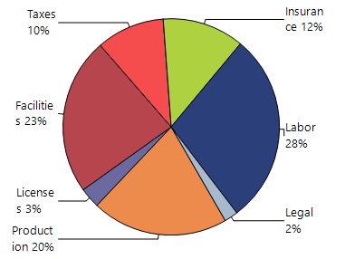

### Show databind labels

The [ShowDataBindLabels](https://help.syncfusion.com/cr/windowsforms/Syncfusion.Windows.Forms.Chart.ChartPieConfigItem.html#Syncfusion_Windows_Forms_Chart_ChartPieConfigItem_ShowDataBindLabels) property controls whether labels obtained from the bound data source are displayed on the pie segments, with `false` used as the default value.

N>
The `ShowDataBindLabels` property also applies to `Doughnut` charts.

The following code displays labels from the bound data source on the pie chart segments.



DataTable table = new DataTable("PieData");

table.Columns.Add("Category", typeof(string));
table.Columns.Add("Value", typeof(double));

table.Rows.Add("Production", 20);
table.Rows.Add("Labor", 28);
table.Rows.Add("Facilities", 23);
table.Rows.Add("Taxes", 10);
table.Rows.Add("Insurance", 12);
table.Rows.Add("Licenses", 3);
table.Rows.Add("Legal", 2);

// Bind values.
ChartDataBindModel seriesModel =
    new ChartDataBindModel(table);

seriesModel.YNames = new string[] { "Value" };

// Create Pie series.
ChartSeries series = new ChartSeries(
    "Market",
    ChartSeriesType.Pie);

series.SeriesModel = seriesModel;

// Bind category names as labels.
ChartDataBindAxisLabelModel labelModel =
    new ChartDataBindAxisLabelModel(table);

labelModel.LabelName = "Category";

chartControl.PrimaryXAxis.LabelsImpl =
    labelModel;
series.Style.DisplayText = true;

// Display bound labels.
series.ConfigItems.PieItem.ShowDataBindLabels =
    true;

series.ConfigItems.PieItem.LabelStyle =
    ChartAccumulationLabelStyle.OutsideInColumn;

series.ConfigItems.PieItem.AngleOffset = 60f;

chartControl.Series.Add(series);
chartControl.Legend.Visible = false;



Dim table As New DataTable("PieData")

table.Columns.Add("Category", GetType(String))
table.Columns.Add("Value", GetType(Double))

table.Rows.Add("Production", 20)
table.Rows.Add("Labor", 28)
table.Rows.Add("Facilities", 23)
table.Rows.Add("Taxes", 10)
table.Rows.Add("Insurance", 12)
table.Rows.Add("Licenses", 3)
table.Rows.Add("Legal", 2)

' Bind values.
Dim seriesModel As New ChartDataBindModel(table)

seriesModel.YNames = New String() {"Value"}

' Create Pie series.
Dim series As New ChartSeries(
    "Market",
    ChartSeriesType.Pie)

series.SeriesModel = seriesModel

' Bind category names as labels.
Dim labelModel As New ChartDataBindAxisLabelModel(table)

labelModel.LabelName = "Category"

chartControl.PrimaryXAxis.LabelsImpl =
    labelModel

series.Style.DisplayText = True

' Display bound labels.
series.ConfigItems.PieItem.ShowDataBindLabels =
    True

series.ConfigItems.PieItem.LabelStyle =
    ChartAccumulationLabelStyle.OutsideInColumn

series.ConfigItems.PieItem.AngleOffset =
    60.0F

chartControl.Series.Add(series)
chartControl.Legend.Visible = False




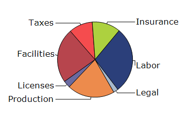

### Show series title

The [ShowSeriesTitle](https://help.syncfusion.com/cr/windowsforms/Syncfusion.Windows.Forms.Chart.ChartPieConfigItem.html#Syncfusion_Windows_Forms_Chart_ChartPieConfigItem_ShowSeriesTitle) property controls whether the series title is displayed in the pie chart and is set to `false` by default.

The following code displays the series title in the pie chart.



chartControl.Series[0].ConfigItems.PieItem.ShowSeriesTitle = true;


chartControl.Series(0).ConfigItems.PieItem.ShowSeriesTitle = True



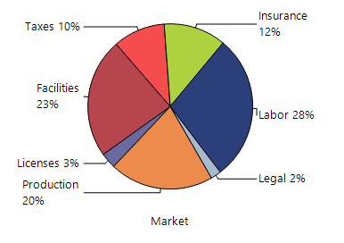

### Height coeficient

When the chart is displayed in 3D mode, the [HeightCoeficient](https://help.syncfusion.com/cr/windowsforms/Syncfusion.Windows.Forms.Chart.ChartPieConfigItem.html#Syncfusion_Windows_Forms_Chart_ChartPieConfigItem_HeightCoeficient) property controls the relative height of the pie chart. For this property to take effect, [HeightByAreaDepth](https://help.syncfusion.com/cr/windowsforms/Syncfusion.Windows.Forms.Chart.ChartPieConfigItem.html#Syncfusion_Windows_Forms_Chart_ChartPieConfigItem_HeightByAreaDepth) must be set to false. Valid values range from `0.1f` to `0.5f`, and the default value is `0.2f`.

The following code explain how to set the height coeficient.




series.ConfigItems.PieItem.HeightByAreaDepth = false;

series.ConfigItems.PieItem.HeightCoeficient = 0.1f;




series.ConfigItems.PieItem.HeightByAreaDepth = False

series.ConfigItems.PieItem.HeightCoeficient = 0.1F




### Explode all points

The [ExplodedAll](https://help.syncfusion.com/cr/windowsforms/Syncfusion.Windows.Forms.Chart.ChartSeries.html#Syncfusion_Windows_Forms_Chart_ChartSeries_ExplodedAll) property controls whether all segments are separated from the center of a pie chart. The default value is `false`.

N> The `ExplodedAll` property also applies to `Doughnut` charts.

The following code explodes all segments in the Pie series.



chartControl.Series[0].ExplodedAll = true;


chartControl.Series(0).ExplodedAll = True



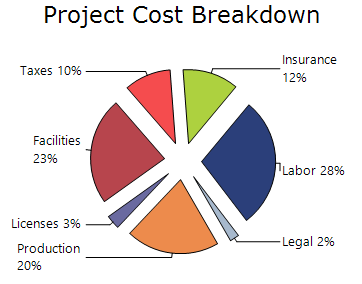

### Exploded index

The [ExplodedIndex](https://help.syncfusion.com/cr/windowsforms/Syncfusion.Windows.Forms.Chart.ChartSeries.html#Syncfusion_Windows_Forms_Chart_ChartSeries_ExplodedIndex) property specifies the index of the pie segment to separate from the center. The default value is `-1`, which indicates that no segment is exploded.

N>
- The `ExplodedIndex` property also applies to `Doughnut` charts.
- The point index is zero-based. For example, a value of `2` explodes the third segment.

The following code explodes the fourth segment in the Pie series.



chartControl.Series[0].ExplodedIndex = 2;


chartControl.Series(0).ExplodedIndex = 2



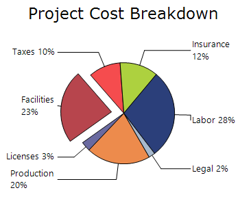

### Explosion offset

The [ExplosionOffset](https://help.syncfusion.com/cr/windowsforms/Syncfusion.Windows.Forms.Chart.ChartSeries.html#Syncfusion_Windows_Forms_Chart_ChartSeries_ExplosionOffset) property specifies the distance between an exploded segment and the center of the pie chart as a percentage. The default value is `20f`.

N>
- The `ExplosionOffset` property also applies to `Doughnut` charts.
- The explosion offset is applied only when `ExplodedAll` is set to `true` or a valid segment index is assigned to `ExplodedIndex`.

The following code explodes the fourth segment and sets the explosion offset to `30`.



chartControl.Series[0].ExplodedAll = true;
chartControl.Series[0].ExplosionOffset = 30f;


chartControl.Series[0].ExplodedAll = True
chartControl.Series(0).ExplosionOffset = 30.0F



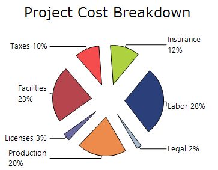

### Optimize pie point positions

The [OptimizePiePointPositions](https://help.syncfusion.com/cr/windowsforms/Syncfusion.Windows.Forms.Chart.ChartSeries.html#Syncfusion_Windows_Forms_Chart_ChartSeries_OptimizePiePointPositions) property controls whether the pie segments are optimized for positioning. The default value is `true`.

The following code enables position optimization for the Pie segments.



ChartSeries series = new ChartSeries("Series Name", ChartSeriesType.Pie);

series.Points.Add(0, 20);
series.Points.Add(1, 28);
series.Points.Add(2, 23);
series.Points.Add(3, 10);
series.Points.Add(4, 12);
series.Points.Add(5, 3);
series.Points.Add(6, 2);
series.ExplodedIndex = 2;

series.OptimizePiePointPositions = false;

chartControl.Series.Add(series);


Dim series As New ChartSeries(
    "Series Name",
    ChartSeriesType.Pie)

series.Points.Add(0, 20)
series.Points.Add(1, 28)
series.Points.Add(2, 23)
series.Points.Add(3, 10)
series.Points.Add(4, 12)
series.Points.Add(5, 3)
series.Points.Add(6, 2)

series.ExplodedIndex = 2
series.OptimizePiePointPositions = False

chartControl.Series.Add(series)



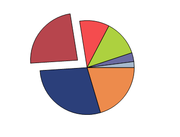

### Show ticks

The [ShowTicks](https://help.syncfusion.com/cr/windowsforms/Syncfusion.Windows.Forms.Chart.ChartSeries.html#Syncfusion_Windows_Forms_Chart_ChartSeries_ShowTicks) property controls whether tick lines are displayed between pie segments and their outside labels. The default value is `false`.

The following code displays tick lines for the pie series.



chartControl.Series[0].ShowTicks = false;


chartControl.Series(0).ShowTicks = False



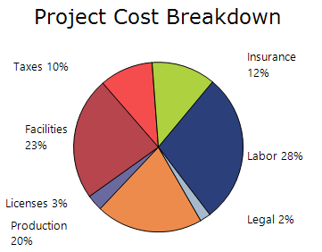

### Divide area

The [DivideArea](https://help.syncfusion.com/cr/windowsforms/Syncfusion.Windows.Forms.Chart.ChartSeries.html#Syncfusion_Windows_Forms_Chart_ChartSeries_DivideArea) property specifies whether the available chart area is divided among multiple pie series. The default value is `true`.

The following code displays multiple Pie series without dividing the chart area and arranges the legend items in three rows.



chartControl.Series[0].DivideArea = false;
chartControl.Legend.RowsCount = 3;


chartControl.Series(0).DivideArea = False
chartControl.Legend.RowsCount = 3



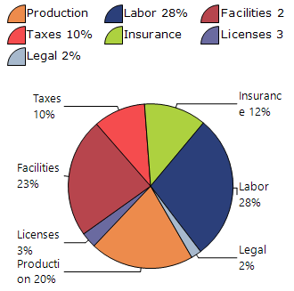

## Doughnut chart

Doughnut chart is a variation of a pie chart that displays data as slices in a ring-shaped circle with a hollow center. It is used to show the proportion or percentage contribution of categories to the whole dataset.

### Doughnut coeficient

The [DoughnutCoeficient](https://help.syncfusion.com/cr/windowsforms/Syncfusion.Windows.Forms.Chart.ChartPieConfigItem.html#Syncfusion_Windows_Forms_Chart_ChartPieConfigItem_DoughnutCoeficient) property is used to render a pie chart as a Doughnut Chart. It specifies the size of the hollow center as a fraction of the chart's radius. By default, the value is `0.0`, which renders the chart as a full pie chart. Valid values range from `0.0` to `0.9`.

The following code displays doughnut chart using DoughnutCoeficient property.



series.ConfigItems.PieItem.DoughnutCoeficient = 0.5f;




series.ConfigItems.PieItem.DoughnutCoeficient = 0.5F




