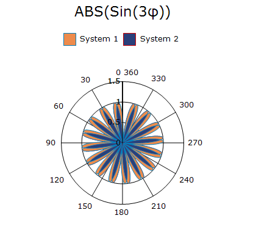
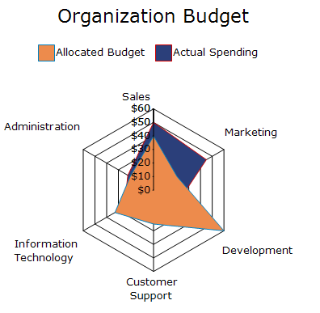

# Polar And Radar Charts in Windows Forms Chart

Polar and Radar charts are used to display values and angles in a graphical format, making it easy to compare data across multiple categories.

You can also customize the following features for Polar and Radar charts:

* **Draw Type**: The rendering style of the chart can be customized using the `RadarItem` property of `ConfigItems`.

* **Radar Axis Style**: The appearance of the radar axis can be customized using the [RadarStyle](https://help.syncfusion.com/cr/windowsforms/Syncfusion.Windows.Forms.Chart.ChartControl.html#Syncfusion_Windows_Forms_Chart_ChartControl_RadarStyle) property in Rader chart.

* **Inversed Polar and Radar Charts**: Polar and Radar charts can be rendered in the clockwise direction using the [Inversed](https://help.syncfusion.com/cr/windowsforms/Syncfusion.Windows.Forms.Chart.ChartAxis.html#Syncfusion_Windows_Forms_Chart_ChartAxis_Inversed) property in [ChartAxis](https://help.syncfusion.com/cr/windowsforms/Syncfusion.Windows.Forms.Chart.ChartAxis.html).

* **Line Style Customization**: The solid circular lines of Polar and Radar charts can be customized using the pen properties of the primary X and Y axes.

## Polar Chart
Polar Chart displays data using values and angles in a circular coordinate system. The X-values determine the angles of the data points, while the Y-values determine their distance from the center of the chart.

It is useful for visually comparing several quantitative or qualitative aspects of a situation and for comparing multiple data sets using the same axes.

N>
Chart Details
* Number of Y values per point - 1.
* Number of Series - One.
* Cannot be combined with - Any other chart types.

The following code example demonstrates how to create a Polar Chart.




ChartTitle title = new ChartTitle() { Text = "ABS(Sin(3φ))" };
chartControl.Titles.Add(title);

ChartSeries series1 = new ChartSeries(" System 1", ChartSeriesType.Polar);
series1.Text = series1.Name;
for (int i = 0; i <= 710; i++)
{
    double x = Math.Abs(Math.Sin(3 * i));
    series1.Points.Add(i, x);
}
series1.Style.Border.Color = Color.FromArgb(0, 128, 192);
chartControl.Series.Add(series1);

ChartSeries series2 = new ChartSeries(" System 2", ChartSeriesType.Polar);
series2.Text = series2.Name;
for (int i = 0; i < 355; i++)
{
    double x = Math.Abs(Math.Sin(3 * i));
    series2.Points.Add(i, x);
}
series2.Style.Border.Color = Color.FromArgb(209, 0, 0);
chartControl.Series.Add(series2);

chartControl.PrimaryYAxis.RangeType = ChartAxisRangeType.Set;
chartControl.PrimaryYAxis.Range = new MinMaxInfo(0, 1.5, 0.5);

chartControl.PrimaryXAxis.RangeType = ChartAxisRangeType.Set;
chartControl.PrimaryXAxis.Range = new MinMaxInfo(0, 360, 45);




Dim title As New ChartTitle() With {
    .Text = "ABS(Sin(3φ))"
}

chartControl.Titles.Add(title)

Dim series1 As New ChartSeries("System 1", ChartSeriesType.Polar)
series1.Text = series1.Name

For i As Integer = 0 To 710
    Dim x As Double = Math.Abs(Math.Sin(3 * i))
    series1.Points.Add(i, x)
Next

series1.Style.Border.Color = Color.FromArgb(0, 128, 192)

chartControl.Series.Add(series1)

Dim series2 As New ChartSeries("System 2", ChartSeriesType.Polar)
series2.Text = series2.Name

For i As Integer = 0 To 355
    Dim x As Double = Math.Abs(Math.Sin(3 * i))
    series2.Points.Add(i, x)
Next

series2.Style.Border.Color = Color.FromArgb(209, 0, 0)

chartControl.Series.Add(series2)

chartControl.PrimaryYAxis.RangeType = ChartAxisRangeType.Set
chartControl.PrimaryYAxis.Range = New MinMaxInfo(0, 1.5, 0.5)

chartControl.PrimaryXAxis.RangeType = ChartAxisRangeType.Set
chartControl.PrimaryXAxis.Range = New MinMaxInfo(0, 360, 45)




## Radar Chart

Radar Chart displays data using radial axes that extend from a central point. Each category is plotted along its own axis, and the data points are connected to form a shape. 

It is useful for comparing multiple data series, analyzing performance against ideal values, and visualizing data with a natural cyclic order, such as seasons or time periods.

N>
Chart Details
* Number of Y values per point - 1.
* Number of Series - One.
* Cannot be combined with - Any other chart types.

The following code example demonstrates how to create a Radar Chart.




string[] labels = new string[]{ "Sales",
    "Administration",
    "Information \nTechnology",
    "Customer\n Support",
    "Development",
    "Marketing"
};

ChartSeries series1 = new ChartSeries("Allocated Budget", ChartSeriesType.Radar);
series1.Text = series1.Name;
series1.Points.Add(0, 40);
series1.Points.Add(1, 20);
series1.Points.Add(2, 33);
series1.Points.Add(3, 25);
series1.Points.Add(4, 60);
series1.Points.Add(5, 20);
series1.Style.Border.Color = Color.FromArgb(0, 128, 192);

ChartSeries series2 = new ChartSeries("Actual Spending", ChartSeriesType.Radar);
series2.Text = series2.Name;
series2.Points.Add(0, 50);
series2.Points.Add(1, 22);
series2.Points.Add(2, 25);
series2.Points.Add(3, 20);
series2.Points.Add(4, 20);
series2.Points.Add(5, 45);

series2.Style.Border.Color = Color.FromArgb(209, 0, 0);
chartControl.ChartFormatAxisLabel += new ChartFormatAxisLabelEventHandler(OnChartControl1_ChartFormatAxisLabel);

chartControl.Series.Add(series1);
chartControl.Series.Add(series2);

chartControl.PrimaryYAxis.RangeType = ChartAxisRangeType.Set;
chartControl.PrimaryYAxis.Range = new MinMaxInfo(0, 60, 10);

chartControl.PrimaryXAxis.RangeType = ChartAxisRangeType.Set;
chartControl.PrimaryXAxis.Range = new MinMaxInfo(0, 6, 1);

void OnChartControl1_ChartFormatAxisLabel(object sender, ChartFormatAxisLabelEventArgs e)
{
    if (e.AxisOrientation == ChartOrientation.Vertical)
    {
        //Applying Formatted Y Axis label values.
        e.Label = string.Format("${0}", e.Value);
    }
    else
    {
        int index = (int)e.Value;

        if (index >= 0 && index < labels.Length)
        {
            //Applying custom label text for X Axis
            e.Label = labels[index];
        }
        else
        {
            e.Label = "";
        }
    }

    e.Handled = true;
}




Private labels() As String = {"Sales",
        "Administration",
        "Information \nTechnology",
        "Customer\n Support",
        "Development",
        "Marketing"}

Private Sub Form1_Load(ByVal sender As Object, ByVal e As EventArgs) Handles MyBase.Load

    Dim chartControl As New ChartControl()

    Dim series1 As New ChartSeries("Allocated Budget", ChartSeriesType.Radar)
    series1.Text = series1.Name

    series1.Points.Add(0, 40)
    series1.Points.Add(1, 20)
    series1.Points.Add(2, 33)
    series1.Points.Add(3, 25)
    series1.Points.Add(4, 60)
    series1.Points.Add(5, 20)

    series1.Style.Border.Color = Color.FromArgb(0, 128, 192)

    Dim series2 As New ChartSeries("Actual Spending", ChartSeriesType.Radar)
    series2.Text = series2.Name

    series2.Points.Add(0, 50)
    series2.Points.Add(1, 22)
    series2.Points.Add(2, 25)
    series2.Points.Add(3, 20)
    series2.Points.Add(4, 20)
    series2.Points.Add(5, 45)

    series2.Style.Border.Color = Color.FromArgb(209, 0, 0)

    AddHandler chartControl.ChartFormatAxisLabel, AddressOf OnChartControl1_ChartFormatAxisLabel

    chartControl.Series.Add(series1)
    chartControl.Series.Add(series2)

    chartControl.PrimaryYAxis.RangeType = ChartAxisRangeType.Set
    chartControl.PrimaryYAxis.Range = New MinMaxInfo(0, 60, 10)

    chartControl.PrimaryXAxis.RangeType = ChartAxisRangeType.Set
    chartControl.PrimaryXAxis.Range = New MinMaxInfo(0, 6, 1)

    chartControl.Dock = DockStyle.Fill

    Me.Controls.Add(chartControl)

End Sub

Private Sub OnChartControl1_ChartFormatAxisLabel(ByVal sender As Object, ByVal e As ChartFormatAxisLabelEventArgs)

    If e.AxisOrientation = ChartOrientation.Vertical Then

        e.Label = String.Format("${0}", e.Value)

    Else

        Dim index As Integer = CInt(e.Value)

        If index >= 0 AndAlso index < labels.Length Then
            e.Label = labels(index)
        Else
            e.Label = ""
        End If

    End If

    e.Handled = True

End Sub




## Customization Options

The following chart series properties are used as customization options for both **Polar** and **Radar** chart types.

[Border](https://help.syncfusion.com/windowsforms/chart/chart-series#border), [DisplayText](https://help.syncfusion.com/windowsforms/chart/chart-series#displaytext), [DrawSeriesNameInDepth](https://help.syncfusion.com/windowsforms/chart/chart-series#drawseriesnameindepth), [ElementBorders](https://help.syncfusion.com/windowsforms/chart/chart-series#elementborders), [ImageIndex](https://help.syncfusion.com/windowsforms/chart/chart-series#imageindex), [Images](https://help.syncfusion.com/windowsforms/chart/chart-series#images), [LightAngle](https://help.syncfusion.com/windowsforms/chart/chart-series#lightangle), [LightColor](https://help.syncfusion.com/windowsforms/chart/chart-series#lightcolor), [RadarType](https://help.syncfusion.com/windowsforms/chart/chart-series#radartype), [Rotate](https://help.syncfusion.com/windowsforms/chart/chart-series#rotate), [ShadingMode](https://help.syncfusion.com/windowsforms/chart/chart-series#shadingmode), [ShadowInterior](https://help.syncfusion.com/windowsforms/chart/chart-series#shadowinterior), [ShadowOffset](https://help.syncfusion.com/windowsforms/chart/chart-series#shadowoffset), [FancyToolTip](https://help.syncfusion.com/windowsforms/chart/chart-series#fancytooltip), [Font](https://help.syncfusion.com/windowsforms/chart/chart-series#font), [Interior](https://help.syncfusion.com/windowsforms/chart/chart-series#interior), [LegendItem](https://help.syncfusion.com/windowsforms/chart/chart-series#legenditem), [Name](https://help.syncfusion.com/windowsforms/chart/chart-series#name), [PointsToolTipFormat](https://help.syncfusion.com/windowsforms/chart/chart-series#pointstooltipformat), [SmartLabels](https://help.syncfusion.com/windowsforms/chart/chart-series#smartlabels), [Summary](https://help.syncfusion.com/windowsforms/chart/chart-series#summary), [Text](https://help.syncfusion.com/windowsforms/chart/chart-series#text-series), [TextColor](https://help.syncfusion.com/windowsforms/chart/chart-series#textcolor), [TextFormat](https://help.syncfusion.com/windowsforms/chart/chart-series#textformat), [TextOffset](https://help.syncfusion.com/windowsforms/chart/chart-series#textoffset), [TextOrientation](https://help.syncfusion.com/windowsforms/chart/chart-series#textorientation), [Visible](https://help.syncfusion.com/windowsforms/chart/chart-series#visible).

N>
* The [PhongAlpha](https://help.syncfusion.com/windowsforms/chart/chart-series#phongalpha) and [RadarStyle](https://help.syncfusion.com/cr/windowsforms/Syncfusion.Windows.Forms.Chart.ChartControl.html#Syncfusion_Windows_Forms_Chart_ChartControl_RadarStyle) properties are supported only in the `Radar Chart` as a customization option.
