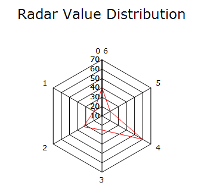
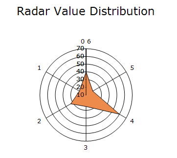

# Polar and Radar in Windows Forms Charts

## Polar chart

Polar chart displays data using values and angles in a circular coordinate system. The X-values determine the angles of the data points, while the Y-values determine their distance from the center of the chart.

The following code example demonstrates how to create a polar chart.




ChartSeries series1 = new ChartSeries(" System 1", ChartSeriesType.Polar);
series1.Text = series1.Name;
for (int i = 0; i <= 710; i++)
{
    double x = Math.Abs(Math.Sin(3 * i));
    series1.Points.Add(i, x);
}
series1.Style.Border.Color = Color.FromArgb(0, 128, 192);
chartControl.Series.Add(series1);

ChartSeries series2 = new ChartSeries(" System 2", ChartSeriesType.Polar);
series2.Text = series2.Name;
for (int i = 0; i < 355; i++)
{
    double x = Math.Abs(Math.Sin(3 * i));
    series2.Points.Add(i, x);
}
series2.Style.Border.Color = Color.FromArgb(209, 0, 0);
chartControl.Series.Add(series2);

chartControl.PrimaryYAxis.RangeType = ChartAxisRangeType.Set;
chartControl.PrimaryYAxis.Range = new MinMaxInfo(0, 1.5, 0.5);

chartControl.PrimaryXAxis.RangeType = ChartAxisRangeType.Set;
chartControl.PrimaryXAxis.Range = new MinMaxInfo(0, 360, 45);




' System 1 Series
Dim series1 As New ChartSeries(" System 1", ChartSeriesType.Polar)

series1.Text = series1.Name

For i As Integer = 0 To 710
    Dim x As Double = Math.Abs(Math.Sin(3 * i))
    series1.Points.Add(i, x)
Next

series1.Style.Border.Color = Color.FromArgb(0, 128, 192)

chartControl.Series.Add(series1)

' System 2 Series
Dim series2 As New ChartSeries(" System 2", ChartSeriesType.Polar)

series2.Text = series2.Name

For i As Integer = 0 To 355
    Dim x As Double = Math.Abs(Math.Sin(3 * i))
    series2.Points.Add(i, x)
Next

series2.Style.Border.Color = Color.FromArgb(209, 0, 0)

chartControl.Series.Add(series2)

' Y-Axis Settings
chartControl.PrimaryYAxis.RangeType = ChartAxisRangeType.Set
chartControl.PrimaryYAxis.Range = New MinMaxInfo(0, 1.5, 0.5)

' X-Axis Settings
chartControl.PrimaryXAxis.RangeType = ChartAxisRangeType.Set
chartControl.PrimaryXAxis.Range = New MinMaxInfo(0, 360, 45)




## Radar chart

Radar chart displays data using radial axes that extend from a central point. Each category is plotted along its own axis, and the data points are connected to form a shape. 

The following code example demonstrates how to create a radar Chart.




string[] labels = new string[]{ "Sales",
    "Administration",
    "Information \nTechnology",
    "Customer\n Support",
    "Development",
    "Marketing"
};

ChartSeries series1 = new ChartSeries("Allocated Budget", ChartSeriesType.Radar);
series1.Text = series1.Name;
series1.Points.Add(0, 40);
series1.Points.Add(1, 20);
series1.Points.Add(2, 33);
series1.Points.Add(3, 25);
series1.Points.Add(4, 60);
series1.Points.Add(5, 20);
series1.Style.Border.Color = Color.FromArgb(0, 128, 192);

ChartSeries series2 = new ChartSeries("Actual Spending", ChartSeriesType.Radar);
series2.Text = series2.Name;
series2.Points.Add(0, 50);
series2.Points.Add(1, 22);
series2.Points.Add(2, 25);
series2.Points.Add(3, 20);
series2.Points.Add(4, 20);
series2.Points.Add(5, 45);

series2.Style.Border.Color = Color.FromArgb(209, 0, 0);
chartControl.ChartFormatAxisLabel += new ChartFormatAxisLabelEventHandler(OnChartControl1_ChartFormatAxisLabel);

chartControl.Series.Add(series1);
chartControl.Series.Add(series2);

chartControl.PrimaryYAxis.RangeType = ChartAxisRangeType.Set;
chartControl.PrimaryYAxis.Range = new MinMaxInfo(0, 60, 10);

chartControl.PrimaryXAxis.RangeType = ChartAxisRangeType.Set;
chartControl.PrimaryXAxis.Range = new MinMaxInfo(0, 6, 1);

void OnChartControl1_ChartFormatAxisLabel(object sender, ChartFormatAxisLabelEventArgs e)
{
    if (e.AxisOrientation == ChartOrientation.Vertical)
    {
        //Applying Formatted Y Axis label values.
        e.Label = string.Format("${0}", e.Value);
    }
    else
    {
        int index = (int)e.Value;

        if (index >= 0 && index < labels.Length)
        {
            //Applying custom label text for X Axis
            e.Label = labels[index];
        }
        else
        {
            e.Label = "";
        }
    }

    e.Handled = true;
}




Private labels() As String = {"Sales",
        "Administration",
        "Information \nTechnology",
        "Customer\n Support",
        "Development",
        "Marketing"}

Private Sub Form1_Load(ByVal sender As Object, ByVal e As EventArgs) Handles MyBase.Load

    Dim chartControl As New ChartControl()

    Dim series1 As New ChartSeries("Allocated Budget", ChartSeriesType.Radar)
    series1.Text = series1.Name

    series1.Points.Add(0, 40)
    series1.Points.Add(1, 20)
    series1.Points.Add(2, 33)
    series1.Points.Add(3, 25)
    series1.Points.Add(4, 60)
    series1.Points.Add(5, 20)

    series1.Style.Border.Color = Color.FromArgb(0, 128, 192)

    Dim series2 As New ChartSeries("Actual Spending", ChartSeriesType.Radar)
    series2.Text = series2.Name

    series2.Points.Add(0, 50)
    series2.Points.Add(1, 22)
    series2.Points.Add(2, 25)
    series2.Points.Add(3, 20)
    series2.Points.Add(4, 20)
    series2.Points.Add(5, 45)

    series2.Style.Border.Color = Color.FromArgb(209, 0, 0)

    AddHandler chartControl.ChartFormatAxisLabel, AddressOf OnChartControl1_ChartFormatAxisLabel

    chartControl.Series.Add(series1)
    chartControl.Series.Add(series2)

    chartControl.PrimaryYAxis.RangeType = ChartAxisRangeType.Set
    chartControl.PrimaryYAxis.Range = New MinMaxInfo(0, 60, 10)

    chartControl.PrimaryXAxis.RangeType = ChartAxisRangeType.Set
    chartControl.PrimaryXAxis.Range = New MinMaxInfo(0, 6, 1)

    Me.Controls.Add(chartControl)

End Sub

Private Sub OnChartControl1_ChartFormatAxisLabel(ByVal sender As Object, ByVal e As ChartFormatAxisLabelEventArgs)

    If e.AxisOrientation = ChartOrientation.Vertical Then

        e.Label = String.Format("${0}", e.Value)

    Else

        Dim index As Integer = CInt(e.Value)

        If index >= 0 AndAlso index < labels.Length Then
            e.Label = labels(index)
        Else
            e.Label = ""
        End If

    End If

    e.Handled = True

End Sub




### Type

The [Type](https://help.syncfusion.com/cr/windowsforms/Syncfusion.Windows.Forms.Chart.ChartRadarConfigItem.html#Syncfusion_Windows_Forms_Chart_ChartRadarConfigItem_Type) property specifies how data points are rendered in Polar and Radar charts. The default value is `Area`.

The supported values are defined in the [ChartRadarDrawType](https://help.syncfusion.com/cr/windowsforms/Syncfusion.Windows.Forms.Chart.ChartRadarDrawType.html) enumeration:

- [Area](https://help.syncfusion.com/cr/windowsforms/Syncfusion.Windows.Forms.Chart.ChartRadarDrawType.html#Syncfusion_Windows_Forms_Chart_ChartRadarDrawType_Area): Connects the data points and fills the enclosed region.
- [Line](https://help.syncfusion.com/cr/windowsforms/Syncfusion.Windows.Forms.Chart.ChartRadarDrawType.html#Syncfusion_Windows_Forms_Chart_ChartRadarDrawType_Line): Connects the data points without filling the enclosed region.
- [Symbol](https://help.syncfusion.com/cr/windowsforms/Syncfusion.Windows.Forms.Chart.ChartRadarDrawType.html#Syncfusion_Windows_Forms_Chart_ChartRadarDrawType_Symbol): Displays a symbol at each data point without connecting the points.

N> The `Type` property applies to both `Polar` and `Radar` charts.

The following code renders the radar chart as a line chart.



chartControl.Series[0].ConfigItems.RadarItem.Type = ChartRadarDrawType.Line;
chartControl.Series[1].ConfigItems.RadarItem.Type = ChartRadarDrawType.Line;


chartControl.Series(0).ConfigItems.RadarItem.Type = ChartRadarDrawType.Line
chartControl.Series(1).ConfigItems.RadarItem.Type = ChartRadarDrawType.Line



### Radar style

The [RadarStyle](https://help.syncfusion.com/cr/windowsforms/Syncfusion.Windows.Forms.Chart.ChartControl.html#Syncfusion_Windows_Forms_Chart_ChartControl_RadarStyle) property determines the axis style used to render a radar chart. By default, the radar chart is rendered using the [Polygon](https://help.syncfusion.com/cr/windowsforms/Syncfusion.Windows.Forms.Chart.ChartRadarAxisStyle.html#Syncfusion_Windows_Forms_Chart_ChartRadarAxisStyle_Polygon) axis style.

The supported radar styles are:

- [Polygon](https://help.syncfusion.com/cr/windowsforms/Syncfusion.Windows.Forms.Chart.ChartRadarAxisStyle.html#Syncfusion_Windows_Forms_Chart_ChartRadarAxisStyle_Polygon): Renders the radar chart with polygonal grid lines, where each grid level is displayed as a multi-sided polygon.
- [Circle](https://help.syncfusion.com/cr/windowsforms/Syncfusion.Windows.Forms.Chart.ChartRadarAxisStyle.html#Syncfusion_Windows_Forms_Chart_ChartRadarAxisStyle_Circle): Renders the radar chart with circular grid lines, giving the chart a smoother and more rounded appearance.

The following code sets the radar chart axis style to `Circle`.



chartControl.RadarStyle = ChartRadarAxisStyle.Circle;


chartControl.RadarStyle = ChartRadarAxisStyle.Circle



