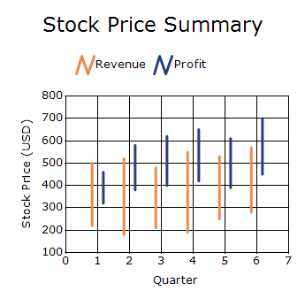
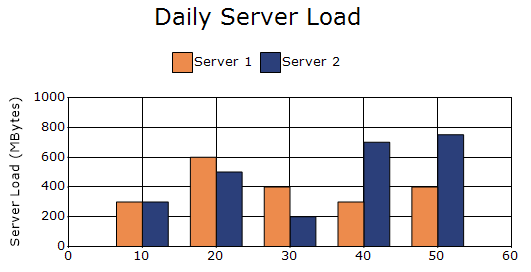
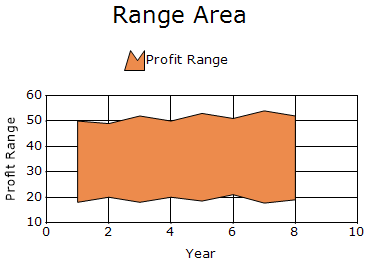

# Range Chart in Windows Forms Chart

## HiLo chart

HiLo Chart is a financial chart commonly used to display the trading range of a stock or other data over a period. It uses two Y-values `High` and `Low` to represent the maximum and minimum values, making it easy to visualize value ranges and fluctuations.

N>
Chart details for HiLo chart.
* Number of Y values per point - 2.
* Number of Series - One or More.
* Cannot be combined with - Pie, Bar, Polar, Radar, Stacked Bar.

The following code example demonstrates how to create a HiLo Chart.




ChartSeries revenue = new ChartSeries("Revenue", ChartSeriesType.HiLo);

revenue.Points.Add(1, 500, 220);
revenue.Points.Add(2, 520, 180);
revenue.Points.Add(3, 480, 210);
revenue.Points.Add(4, 550, 190);
revenue.Points.Add(5, 530, 250);
revenue.Points.Add(6, 570, 280);

ChartSeries profit = new ChartSeries("Profit", ChartSeriesType.HiLo);

profit.Points.Add(1, 460, 320);
profit.Points.Add(2, 580, 380);
profit.Points.Add(3, 620, 400);
profit.Points.Add(4, 650, 420);
profit.Points.Add(5, 610, 390);
profit.Points.Add(6, 700, 450);

chartControl.Series.Add(revenue);
chartControl.Series.Add(profit);

revenue.Style.Border.Width = 3;
profit.Style.Border.Width = 3;




Dim revenue As New ChartSeries("Revenue", ChartSeriesType.HiLo)

' X, High, Low
revenue.Points.Add(1, 500, 220)
revenue.Points.Add(2, 520, 180)
revenue.Points.Add(3, 480, 210)
revenue.Points.Add(4, 550, 190)
revenue.Points.Add(5, 530, 250)
revenue.Points.Add(6, 570, 280)

Dim profit As New ChartSeries("Profit", ChartSeriesType.HiLo)

' X, High, Low
profit.Points.Add(1, 460, 320)
profit.Points.Add(2, 580, 380)
profit.Points.Add(3, 620, 400)
profit.Points.Add(4, 650, 420)
profit.Points.Add(5, 610, 390)
profit.Points.Add(6, 700, 450)

chartControl.Series.Add(revenue)
chartControl.Series.Add(profit)

' Increase line thickness
revenue.Style.Border.Width = 3
profit.Style.Border.Width = 3




### Customization option

The following chart series properties are used as customization options for HiLo chart:

- [DisplayText](https://help.syncfusion.com/windowsforms/chart/chart-series#displaytext)
- [DrawErrorBars](https://help.syncfusion.com/windowsforms/chart/chart-series#drawerrorbars)
- [DrawSeriesNameInDepth](https://help.syncfusion.com/windowsforms/chart/chart-series#drawseriesnameindepth)
- [ErrorBarsSymbolShape](https://help.syncfusion.com/windowsforms/chart/chart-series#errorbarssymbolshape)
- [FancyToolTip](https://help.syncfusion.com/windowsforms/chart/chart-series#fancytooltip)
- [Font](https://help.syncfusion.com/windowsforms/chart/chart-series#font)
- [Interior](https://help.syncfusion.com/windowsforms/chart/chart-series#interior)
- [LegendItem](https://help.syncfusion.com/windowsforms/chart/chart-series#legenditem)
- [Name](https://help.syncfusion.com/windowsforms/chart/chart-series#name)
- [PhongAlpha](https://help.syncfusion.com/windowsforms/chart/chart-series#phongalpha)
- [PointsToolTipFormat](https://help.syncfusion.com/windowsforms/chart/chart-series#pointstooltipformat)
- [Rotate](https://help.syncfusion.com/windowsforms/chart/chart-series#rotate)
- [ShadingMode](https://help.syncfusion.com/windowsforms/chart/chart-series#shadingmode)
- [SmartLabels](https://help.syncfusion.com/windowsforms/chart/chart-series#smartlabels)
- [Spacing Between Series](https://help.syncfusion.com/windowsforms/chart/chart-series#spacingbetweenseries)
- [Summary](https://help.syncfusion.com/windowsforms/chart/chart-series#summary)
- [Text](https://help.syncfusion.com/windowsforms/chart/chart-series#text-series)
- [TextColor](https://help.syncfusion.com/windowsforms/chart/chart-series#textcolor)
- [TextFormat](https://help.syncfusion.com/windowsforms/chart/chart-series#textformat)
- [TextOffset](https://help.syncfusion.com/windowsforms/chart/chart-series#textoffset)
- [TextOrientation](https://help.syncfusion.com/windowsforms/chart/chart-series#textorientation)
- [Visible](https://help.syncfusion.com/windowsforms/chart/chart-series#visible)

## Range Column chart

Range Column Chart is similar to the Column Chart, except that each column is rendered over a range. Therefore, the user must specify the starting and ending Y-axis values for each data point. The following code shows how to define a column range chart in ChartControl.

N>
Chart details for column range chart.
* Number of Y values per point - 2.
* Number of Series - One or More.
* Cannot be combined with - Pie, Bar, Stacked Bar, Polar, Radar.

The following code example demonstrates how to create a Column Range Chart.




// Create chart series and add data points into it.
ChartSeries firstServer = new ChartSeries("Server 1", ChartSeriesType.ColumnRange);
firstServer.Points.Add(10, 300, 0);
firstServer.Points.Add(20, 600, 0);
firstServer.Points.Add(30, 400, 0);
firstServer.Points.Add(40, 300, 0);
firstServer.Points.Add(50, 400, 0);

ChartSeries secondServer = new ChartSeries("Server 2", ChartSeriesType.ColumnRange);

secondServer.Points.Add(10, 300, 0);
secondServer.Points.Add(20, 500, 0);
secondServer.Points.Add(30, 200, 0);
secondServer.Points.Add(40, 700, 0);
secondServer.Points.Add(50, 750, 0);

chartControl.Series.Add(firstServer);
chartControl.Series.Add(secondServer);




// Create chart series and add data points into it.
Dim firstServer As New ChartSeries("Server 1", ChartSeriesType.ColumnRange)
firstServer.Points.Add(10, 300, 0)
firstServer.Points.Add(20, 600, 0)
firstServer.Points.Add(30, 400, 0)
firstServer.Points.Add(40, 300, 0)
firstServer.Points.Add(50, 400, 0)

Dim secondServer As New ChartSeries("Server 2", ChartSeriesType.ColumnRange)

secondServer.Points.Add(10, 300, 0)
secondServer.Points.Add(20, 500, 0)
secondServer.Points.Add(30, 200, 0)
secondServer.Points.Add(40, 700, 0)
secondServer.Points.Add(50, 750, 0)

chartControl.Series.Add(firstServer)
chartControl.Series.Add(secondServer)




### Customization option

The following chart series properties are used as customization options for Column Range chart:

- [Border](https://help.syncfusion.com/windowsforms/chart/chart-series#border)
- [ColumnDrawMode](https://help.syncfusion.com/windowsforms/chart/chart-series#columndrawmode)
- [ColumnFixedWidth](https://help.syncfusion.com/windowsforms/chart/chart-series#columnfixedwidth)
- [ColumnWidthMode](https://help.syncfusion.com/windowsforms/chart/chart-series#columnwidthmode)
- [DisplayText](https://help.syncfusion.com/windowsforms/chart/chart-series#displaytext)
- [DrawSeriesNameInDepth](https://help.syncfusion.com/windowsforms/chart/chart-series#drawseriesnameindepth)
- [ElementBorders](https://help.syncfusion.com/windowsforms/chart/chart-series#elementborders)
- [FancyToolTip](https://help.syncfusion.com/windowsforms/chart/chart-series#fancytooltip)
- [Font](https://help.syncfusion.com/windowsforms/chart/chart-series#font)
- [ImageIndex](https://help.syncfusion.com/windowsforms/chart/chart-series#imageindex)
- [Images](https://help.syncfusion.com/windowsforms/chart/chart-series#images)
- [Interior](https://help.syncfusion.com/windowsforms/chart/chart-series#interior)
- [LegendItem](https://help.syncfusion.com/windowsforms/chart/chart-series#legenditem)
- [LightAngle](https://help.syncfusion.com/windowsforms/chart/chart-series#lightangle)
- [LightColor](https://help.syncfusion.com/windowsforms/chart/chart-series#lightcolor)
- [Name](https://help.syncfusion.com/windowsforms/chart/chart-series#name)
- [PointsToolTipFormat](https://help.syncfusion.com/windowsforms/chart/chart-series#pointstooltipformat)
- [Rotate](https://help.syncfusion.com/windowsforms/chart/chart-series#rotate)
- [ShadingMode](https://help.syncfusion.com/windowsforms/chart/chart-series#shadingmode)
- [ShadowInterior](https://help.syncfusion.com/windowsforms/chart/chart-series#shadowinterior)
- [ShadowOffset](https://help.syncfusion.com/windowsforms/chart/chart-series#shadowoffset)
- [SmartLabels](https://help.syncfusion.com/windowsforms/chart/chart-series#smartlabels)
- [Spacing](https://help.syncfusion.com/windowsforms/chart/chart-series#spacing)
- [Spacing Between Series](https://help.syncfusion.com/windowsforms/chart/chart-series#spacingbetweenseries)
- [Summary](https://help.syncfusion.com/windowsforms/chart/chart-series#summary)
- [Text](https://help.syncfusion.com/windowsforms/chart/chart-series#text-series)
- [TextColor](https://help.syncfusion.com/windowsforms/chart/chart-series#textcolor)
- [TextFormat](https://help.syncfusion.com/windowsforms/chart/chart-series#textformat)
- [TextOffset](https://help.syncfusion.com/windowsforms/chart/chart-series#textoffset)
- [TextOrientation](https://help.syncfusion.com/windowsforms/chart/chart-series#textorientation)
- [Visible](https://help.syncfusion.com/windowsforms/chart/chart-series#visible)

## Range area

A Range Area Chart is similar to an Area Chart, but it requires two Y-values for each X-value: a start (lower bound) and an end (upper bound). The chart fills the area between these two values, making it easy to visualize the range of data for each point.

It is commonly used to display value variations, such as the daily minimum and maximum temperature range.

You can also customize the following feature for range area charts:

* **Chart Custom Points**: Chart custom points are used to set custom points in a series using the [ChartCustomPoint](https://help.syncfusion.com/cr/windowsforms/Syncfusion.Windows.Forms.Chart.ChartCustomPoint.html) class.

N>
Chart Details for range area chart.
* Number of Y values per point - 2.
* Maximum Number of Series - Unlimited.
* Minimum Number of Series - 1.

The following code example demonstrates how to create a Range Area Chart.




ChartSeries series = new ChartSeries("Profit Range", ChartSeriesType.RangeArea);

series.Points.Add(1, 18, 50);
series.Points.Add(2, 20, 49);
series.Points.Add(3, 18, 52);
series.Points.Add(4, 20, 50);
series.Points.Add(5, 18.5, 53);
series.Points.Add(6, 21, 51);
series.Points.Add(7, 17.7, 54);
series.Points.Add(8, 19, 52);

chartControl.Series.Add(series);




' Range Area Series
Dim series As New ChartSeries("Profit Range", ChartSeriesType.RangeArea)

series.Points.Add(1, 18, 50)
series.Points.Add(2, 20, 49)
series.Points.Add(3, 18, 52)
series.Points.Add(4, 20, 50)
series.Points.Add(5, 18.5, 53)
series.Points.Add(6, 21, 51)
series.Points.Add(7, 17.7, 54)
series.Points.Add(8, 19, 52)

chartControl.Series.Add(series)




## Customization Options

The following chart series properties are used as customization options for the Range Area chart:

* [Border](https://help.syncfusion.com/windowsforms/chart/chart-series#border)
* [DisplayShadow](https://help.syncfusion.com/windowsforms/chart/chart-series#displayshadow)
* [DisplayText](https://help.syncfusion.com/windowsforms/chart/chart-series#displaytext)
* [DrawSeriesNameInDepth](https://help.syncfusion.com/windowsforms/chart/chart-series#drawseriesnameindepth)
* [ElementBorders](https://help.syncfusion.com/windowsforms/chart/chart-series#elementborders)
* [FancyToolTip](https://help.syncfusion.com/windowsforms/chart/chart-series#fancytooltip)
* [Font](https://help.syncfusion.com/windowsforms/chart/chart-series#font)
* [HighlightInterior](https://help.syncfusion.com/windowsforms/chart/chart-series#highlightinterior)
* [ImageIndex](https://help.syncfusion.com/windowsforms/chart/chart-series#imageindex)
* [Interior](https://help.syncfusion.com/windowsforms/chart/chart-series#interior)
* [LegendItem](https://help.syncfusion.com/windowsforms/chart/chart-series#legenditem)
* [Name](https://help.syncfusion.com/windowsforms/chart/chart-series#name)
* [PointsToolTipFormat](https://help.syncfusion.com/windowsforms/chart/chart-series#pointstooltipformat)
* [Rotate](https://help.syncfusion.com/windowsforms/chart/chart-series#rotate)
* [SeriesToolTipFormat](https://help.syncfusion.com/windowsforms/chart/chart-series#seriestooltipformat)
* [SmartLabels](https://help.syncfusion.com/windowsforms/chart/chart-series#smartlabels)
* [Spacing Between Series](https://help.syncfusion.com/windowsforms/chart/chart-series#spacingbetweenseries)
* [Summary](https://help.syncfusion.com/windowsforms/chart/chart-series#summary)
* [Text](https://help.syncfusion.com/windowsforms/chart/chart-series#text-series)
* [TextColor](https://help.syncfusion.com/windowsforms/chart/chart-series#textcolor)
* [TextFormat](https://help.syncfusion.com/windowsforms/chart/chart-series#textformat)
* [TextOffset](https://help.syncfusion.com/windowsforms/chart/chart-series#textoffset)
* [TextOrientation](https://help.syncfusion.com/windowsforms/chart/chart-series#textorientation)
* [Visible](https://help.syncfusion.com/windowsforms/chart/chart-series#visible)