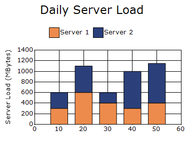
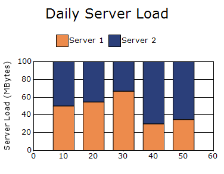
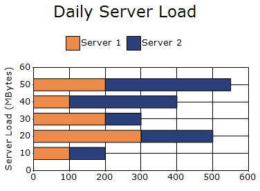
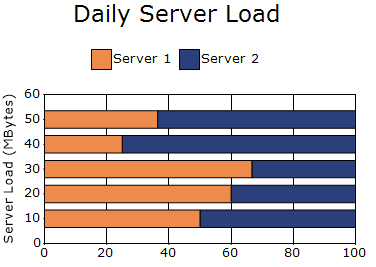
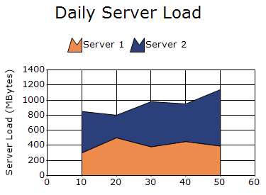
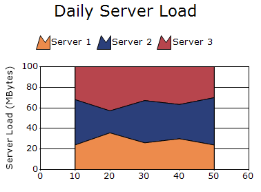

# Stacking Chart in Windows Forms Charts

## Stacking column chart

Stacking column chart are similar to regular column charts, except that the Y values are stacked on top of each other in the order of the series. This helps visualize how each part contributes to the whole.

The following code example demonstrates how to create a Stacking Column Chart.




// Create chart series and add data points into it.
ChartSeries firstServer = new ChartSeries("Server 1", ChartSeriesType.StackingColumn);
firstServer.Points.Add(10, 300);
firstServer.Points.Add(20, 600);
firstServer.Points.Add(30, 400);
firstServer.Points.Add(40, 300);
firstServer.Points.Add(50, 400);

ChartSeries secondServer = new ChartSeries("Server 2", ChartSeriesType.StackingColumn);

secondServer.Points.Add(10, 300);
secondServer.Points.Add(20, 500);
secondServer.Points.Add(30, 200);
secondServer.Points.Add(40, 700);
secondServer.Points.Add(50, 750);

chartControl.Series.Add(firstServer);
chartControl.Series.Add(secondServer);




// Create chart series and add data points into it.
Dim firstServer As New ChartSeries("Server 1", ChartSeriesType.StackingColumn)
firstServer.Points.Add(10, 300)
firstServer.Points.Add(20, 600)
firstServer.Points.Add(30, 400)
firstServer.Points.Add(40, 300)
firstServer.Points.Add(50, 400)

Dim secondServer As New ChartSeries("Server 2", ChartSeriesType.StackingColumn)
secondServer.Points.Add(10, 300)
secondServer.Points.Add(20, 500)
secondServer.Points.Add(30, 200)
secondServer.Points.Add(40, 700)
secondServer.Points.Add(50, 750)

chartControl.Series.Add(firstServer)
chartControl.Series.Add(secondServer)




### Customization options

The following chart series properties are used as customization options for Stacking Column chart:

- [Border](https://help.syncfusion.com/windowsforms/chart/chart-series#border)
- [ColumnFixedWidth](https://help.syncfusion.com/windowsforms/chart/chart-series#columnfixedwidth)
- [ColumnWidthMode](https://help.syncfusion.com/windowsforms/chart/chart-series#columnwidthmode)
- [DisplayShadow](https://help.syncfusion.com/windowsforms/chart/chart-series#displayshadow)
- [DisplayText](https://help.syncfusion.com/windowsforms/chart/chart-series#displaytext)
- [DrawSeriesNameInDepth](https://help.syncfusion.com/windowsforms/chart/chart-series#drawseriesnameindepth)
- [ElementBorders](https://help.syncfusion.com/windowsforms/chart/chart-series#elementborders)
- [FancyToolTip](https://help.syncfusion.com/windowsforms/chart/chart-series#fancytooltip)
- [Font](https://help.syncfusion.com/windowsforms/chart/chart-series#font)
- [ImageIndex](https://help.syncfusion.com/windowsforms/chart/chart-series#imageindex)
- [Images](https://help.syncfusion.com/windowsforms/chart/chart-series#images)
- [Interior](https://help.syncfusion.com/windowsforms/chart/chart-series#interior)
- [LegendItem](https://help.syncfusion.com/windowsforms/chart/chart-series#legenditem)
- [LightAngle](https://help.syncfusion.com/windowsforms/chart/chart-series#lightangle)
- [LightColor](https://help.syncfusion.com/windowsforms/chart/chart-series#lightcolor)
- [Name](https://help.syncfusion.com/windowsforms/chart/chart-series#name)
- [PointsToolTipFormat](https://help.syncfusion.com/windowsforms/chart/chart-series#pointstooltipformat)
- [Rotate](https://help.syncfusion.com/windowsforms/chart/chart-series#rotate)
- [ShadingMode](https://help.syncfusion.com/windowsforms/chart/chart-series#shadingmode)
- [ShadowInterior](https://help.syncfusion.com/windowsforms/chart/chart-series#shadowinterior)
- [ShadowOffset](https://help.syncfusion.com/windowsforms/chart/chart-series#shadowoffset)
- [SmartLabels](https://help.syncfusion.com/windowsforms/chart/chart-series#smartlabels)
- [Spacing](https://help.syncfusion.com/windowsforms/chart/chart-series#spacing)
- [Spacing Between Series](https://help.syncfusion.com/windowsforms/chart/chart-series#spacingbetweenseries)
- [Summary](https://help.syncfusion.com/windowsforms/chart/chart-series#summary)
- [Text](https://help.syncfusion.com/windowsforms/chart/chart-series#text-series)
- [TextColor](https://help.syncfusion.com/windowsforms/chart/chart-series#textcolor)
- [TextFormat](https://help.syncfusion.com/windowsforms/chart/chart-series#textformat)
- [TextOffset](https://help.syncfusion.com/windowsforms/chart/chart-series#textoffset)
- [TextOrientation](https://help.syncfusion.com/windowsforms/chart/chart-series#textorientation)
- [Visible](https://help.syncfusion.com/windowsforms/chart/chart-series#visible)
- [ZOrder](https://help.syncfusion.com/windowsforms/chart/chart-series#zorder)

## Stacking column 100 chart

A Stacking Column 100 chart is similar to a Stacking Column chart, except that the stacked values in each column always add up to 100%.

The following code example demonstrates how to create a Stacking Column 100 Chart.




// Create chart series and add data points into it.
ChartSeries firstServer = new ChartSeries("Server 1", ChartSeriesType.StackingColumn100);
firstServer.Points.Add(10, 300);
firstServer.Points.Add(20, 600);
firstServer.Points.Add(30, 400);
firstServer.Points.Add(40, 300);
firstServer.Points.Add(50, 400);

ChartSeries secondServer = new ChartSeries("Server 2", ChartSeriesType.StackingColumn100);

secondServer.Points.Add(10, 300);
secondServer.Points.Add(20, 500);
secondServer.Points.Add(30, 200);
secondServer.Points.Add(40, 700);
secondServer.Points.Add(50, 750);

chartControl.Series.Add(firstServer);
chartControl.Series.Add(secondServer);




// Create chart series and add data points into it.
Dim firstServer As New ChartSeries("Server 1", ChartSeriesType.StackingColumn100)
firstServer.Points.Add(10, 300)
firstServer.Points.Add(20, 600)
firstServer.Points.Add(30, 400)
firstServer.Points.Add(40, 300)
firstServer.Points.Add(50, 400)

Dim secondServer As New ChartSeries("Server 2", ChartSeriesType.StackingColumn100)
secondServer.Points.Add(10, 300)
secondServer.Points.Add(20, 500)
secondServer.Points.Add(30, 200)
secondServer.Points.Add(40, 700)
secondServer.Points.Add(50, 750)

chartControl.Series.Add(firstServer)
chartControl.Series.Add(secondServer)




### Customization options

The following chart series properties are used as customization options for Stacking Column 100 chart types:

- [Border](https://help.syncfusion.com/windowsforms/chart/chart-series#border)
- [ColumnFixedWidth](https://help.syncfusion.com/windowsforms/chart/chart-series#columnfixedwidth)
- [ColumnWidthMode](https://help.syncfusion.com/windowsforms/chart/chart-series#columnwidthmode)
- [DisplayShadow](https://help.syncfusion.com/windowsforms/chart/chart-series#displayshadow)
- [DisplayText](https://help.syncfusion.com/windowsforms/chart/chart-series#displaytext)
- [DrawSeriesNameInDepth](https://help.syncfusion.com/windowsforms/chart/chart-series#drawseriesnameindepth)
- [ElementBorders](https://help.syncfusion.com/windowsforms/chart/chart-series#elementborders)
- [FancyToolTip](https://help.syncfusion.com/windowsforms/chart/chart-series#fancytooltip)
- [Font](https://help.syncfusion.com/windowsforms/chart/chart-series#font)
- [ImageIndex](https://help.syncfusion.com/windowsforms/chart/chart-series#imageindex)
- [Images](https://help.syncfusion.com/windowsforms/chart/chart-series#images)
- [Interior](https://help.syncfusion.com/windowsforms/chart/chart-series#interior)
- [LegendItem](https://help.syncfusion.com/windowsforms/chart/chart-series#legenditem)
- [LightAngle](https://help.syncfusion.com/windowsforms/chart/chart-series#lightangle)
- [LightColor](https://help.syncfusion.com/windowsforms/chart/chart-series#lightcolor)
- [Name](https://help.syncfusion.com/windowsforms/chart/chart-series#name)
- [PointsToolTipFormat](https://help.syncfusion.com/windowsforms/chart/chart-series#pointstooltipformat)
- [Rotate](https://help.syncfusion.com/windowsforms/chart/chart-series#rotate)
- [ShadingMode](https://help.syncfusion.com/windowsforms/chart/chart-series#shadingmode)
- [ShadowInterior](https://help.syncfusion.com/windowsforms/chart/chart-series#shadowinterior)
- [ShadowOffset](https://help.syncfusion.com/windowsforms/chart/chart-series#shadowoffset)
- [SmartLabels](https://help.syncfusion.com/windowsforms/chart/chart-series#smartlabels)
- [Spacing](https://help.syncfusion.com/windowsforms/chart/chart-series#spacing)
- [Spacing Between Series](https://help.syncfusion.com/windowsforms/chart/chart-series#spacingbetweenseries)
- [Summary](https://help.syncfusion.com/windowsforms/chart/chart-series#summary)
- [Text](https://help.syncfusion.com/windowsforms/chart/chart-series#text-series)
- [TextColor](https://help.syncfusion.com/windowsforms/chart/chart-series#textcolor)
- [TextFormat](https://help.syncfusion.com/windowsforms/chart/chart-series#textformat)
- [TextOffset](https://help.syncfusion.com/windowsforms/chart/chart-series#textoffset)
- [TextOrientation](https://help.syncfusion.com/windowsforms/chart/chart-series#textorientation)
- [Visible](https://help.syncfusion.com/windowsforms/chart/chart-series#visible)
- [ZOrder](https://help.syncfusion.com/windowsforms/chart/chart-series#zorder)

## Stacking bar chart

Stacking bar chart are similar to regular bar chart, but the Y values are stacked on top of each other in the specified series order. This helps visualize the relationship of parts to a whole. 

The following code example demonstrates how to create a Stacking Bar Chart.




ChartSeries firstServer = new ChartSeries("Server 1", ChartSeriesType.StackingBar);
firstServer.Points.Add(10, 100);
firstServer.Points.Add(20, 300);
firstServer.Points.Add(30, 200);
firstServer.Points.Add(40, 100);
firstServer.Points.Add(50, 200);

ChartSeries secondServer = new ChartSeries("Server 2", ChartSeriesType.StackingBar);

secondServer.Points.Add(10, 100);
secondServer.Points.Add(20, 200);
secondServer.Points.Add(30, 100);
secondServer.Points.Add(40, 300);
secondServer.Points.Add(50, 350);

chartControl.Series.Add(firstServer);
chartControl.Series.Add(secondServer);




Dim firstServer As New ChartSeries("Server 1", ChartSeriesType.StackingBar)
firstServer.Points.Add(10, 100)
firstServer.Points.Add(20, 300)
firstServer.Points.Add(30, 200)
firstServer.Points.Add(40, 100)
firstServer.Points.Add(50, 200)

Dim secondServer As New ChartSeries("Server 2", ChartSeriesType.StackingBar)
secondServer.Points.Add(10, 100)
secondServer.Points.Add(20, 200)
secondServer.Points.Add(30, 100)
secondServer.Points.Add(40, 300)
secondServer.Points.Add(50, 350)

chartControl.Series.Add(firstServer)
chartControl.Series.Add(secondServer)




### Customization options

The following chart series properties are used as customization options for Stacking Bar chart:

- [Border](https://help.syncfusion.com/windowsforms/chart/chart-series#border)
- [ColumnDrawMode](https://help.syncfusion.com/windowsforms/chart/chart-series#columndrawmode)
- [DisplayText](https://help.syncfusion.com/windowsforms/chart/chart-series#displaytext)
- [DrawSeriesNameInDepth](https://help.syncfusion.com/windowsforms/chart/chart-series#drawseriesnameindepth)
- [ElementBorders](https://help.syncfusion.com/windowsforms/chart/chart-series#elementborders)
- [FancyToolTip](https://help.syncfusion.com/windowsforms/chart/chart-series#fancytooltip)
- [Font](https://help.syncfusion.com/windowsforms/chart/chart-series#font)
- [HighlightInterior](https://help.syncfusion.com/windowsforms/chart/chart-series#highlightinterior)
- [ImageIndex](https://help.syncfusion.com/windowsforms/chart/chart-series#imageindex)
- [Images](https://help.syncfusion.com/windowsforms/chart/chart-series#images)
- [Interior](https://help.syncfusion.com/windowsforms/chart/chart-series#interior)
- [LegendItem](https://help.syncfusion.com/windowsforms/chart/chart-series#legenditem)
- [LightAngle](https://help.syncfusion.com/windowsforms/chart/chart-series#lightangle)
- [LightColor](https://help.syncfusion.com/windowsforms/chart/chart-series#lightcolor)
- [Name](https://help.syncfusion.com/windowsforms/chart/chart-series#name)
- [PointsToolTipFormat](https://help.syncfusion.com/windowsforms/chart/chart-series#pointstooltipformat)
- [Rotate](https://help.syncfusion.com/windowsforms/chart/chart-series#rotate)
- [ShadingMode](https://help.syncfusion.com/windowsforms/chart/chart-series#shadingmode)
- [ShadowInterior](https://help.syncfusion.com/windowsforms/chart/chart-series#shadowinterior)
- [ShadowOffset](https://help.syncfusion.com/windowsforms/chart/chart-series#shadowoffset)
- [SmartLabels](https://help.syncfusion.com/windowsforms/chart/chart-series#smartlabels)
- [Spacing](https://help.syncfusion.com/windowsforms/chart/chart-series#spacing)
- [Spacing Between Series](https://help.syncfusion.com/windowsforms/chart/chart-series#spacingbetweenseries)
- [Summary](https://help.syncfusion.com/windowsforms/chart/chart-series#summary)
- [Text](https://help.syncfusion.com/windowsforms/chart/chart-series#text-series)
- [TextColor](https://help.syncfusion.com/windowsforms/chart/chart-series#textcolor)
- [TextFormat](https://help.syncfusion.com/windowsforms/chart/chart-series#textformat)
- [TextOffset](https://help.syncfusion.com/windowsforms/chart/chart-series#textoffset)
- [TextOrientation](https://help.syncfusion.com/windowsforms/chart/chart-series#textorientation)
- [Visible](https://help.syncfusion.com/windowsforms/chart/chart-series#visible)
- [ZOrder](https://help.syncfusion.com/windowsforms/chart/chart-series#zorder)

## Stacking bar100 chart

A Stacking Bar100 chart is similar to a Stacking Bar chart, except that the stacked values in each bar always add up to 100%.

The following code example demonstrates how to create a Stacking Bar 100 Chart.




ChartSeries firstServer = new ChartSeries("Server 1", ChartSeriesType.StackingBar100);
firstServer.Points.Add(10, 100);
firstServer.Points.Add(20, 300);
firstServer.Points.Add(30, 200);
firstServer.Points.Add(40, 100);
firstServer.Points.Add(50, 200);

ChartSeries secondServer = new ChartSeries("Server 2", ChartSeriesType.StackingBar100);

secondServer.Points.Add(10, 100);
secondServer.Points.Add(20, 200);
secondServer.Points.Add(30, 100);
secondServer.Points.Add(40, 300);
secondServer.Points.Add(50, 350);

chartControl.Series.Add(firstServer);
chartControl.Series.Add(secondServer);




Dim firstServer As New ChartSeries("Server 1", ChartSeriesType.StackingBar100)
firstServer.Points.Add(10, 100)
firstServer.Points.Add(20, 300)
firstServer.Points.Add(30, 200)
firstServer.Points.Add(40, 100)
firstServer.Points.Add(50, 200)

Dim secondServer As New ChartSeries("Server 2", ChartSeriesType.StackingBar100)
secondServer.Points.Add(10, 100)
secondServer.Points.Add(20, 200)
secondServer.Points.Add(30, 100)
secondServer.Points.Add(40, 300)
secondServer.Points.Add(50, 350)

chartControl.Series.Add(firstServer)
chartControl.Series.Add(secondServer)




### Customization options

The following chart series properties are used as customization options for Stacking Bar 100 chart:

- [Border](https://help.syncfusion.com/windowsforms/chart/chart-series#border)
- [ColumnDrawMode](https://help.syncfusion.com/windowsforms/chart/chart-series#columndrawmode)
- [DisplayText](https://help.syncfusion.com/windowsforms/chart/chart-series#displaytext)
- [DrawSeriesNameInDepth](https://help.syncfusion.com/windowsforms/chart/chart-series#drawseriesnameindepth)
- [ElementBorders](https://help.syncfusion.com/windowsforms/chart/chart-series#elementborders)
- [FancyToolTip](https://help.syncfusion.com/windowsforms/chart/chart-series#fancytooltip)
- [Font](https://help.syncfusion.com/windowsforms/chart/chart-series#font)
- [HighlightInterior](https://help.syncfusion.com/windowsforms/chart/chart-series#highlightinterior)
- [ImageIndex](https://help.syncfusion.com/windowsforms/chart/chart-series#imageindex)
- [Images](https://help.syncfusion.com/windowsforms/chart/chart-series#images)
- [Interior](https://help.syncfusion.com/windowsforms/chart/chart-series#interior)
- [LegendItem](https://help.syncfusion.com/windowsforms/chart/chart-series#legenditem)
- [LightAngle](https://help.syncfusion.com/windowsforms/chart/chart-series#lightangle)
- [LightColor](https://help.syncfusion.com/windowsforms/chart/chart-series#lightcolor)
- [Name](https://help.syncfusion.com/windowsforms/chart/chart-series#name)
- [PointsToolTipFormat](https://help.syncfusion.com/windowsforms/chart/chart-series#pointstooltipformat)
- [Rotate](https://help.syncfusion.com/windowsforms/chart/chart-series#rotate)
- [ShadingMode](https://help.syncfusion.com/windowsforms/chart/chart-series#shadingmode)
- [ShadowInterior](https://help.syncfusion.com/windowsforms/chart/chart-series#shadowinterior)
- [ShadowOffset](https://help.syncfusion.com/windowsforms/chart/chart-series#shadowoffset)
- [SmartLabels](https://help.syncfusion.com/windowsforms/chart/chart-series#smartlabels)
- [Spacing](https://help.syncfusion.com/windowsforms/chart/chart-series#spacing)
- [Spacing Between Series](https://help.syncfusion.com/windowsforms/chart/chart-series#spacingbetweenseries)
- [Summary](https://help.syncfusion.com/windowsforms/chart/chart-series#summary)
- [Text](https://help.syncfusion.com/windowsforms/chart/chart-series#text-series)
- [TextColor](https://help.syncfusion.com/windowsforms/chart/chart-series#textcolor)
- [TextFormat](https://help.syncfusion.com/windowsforms/chart/chart-series#textformat)
- [TextOffset](https://help.syncfusion.com/windowsforms/chart/chart-series#textoffset)
- [TextOrientation](https://help.syncfusion.com/windowsforms/chart/chart-series#textorientation)
- [Visible](https://help.syncfusion.com/windowsforms/chart/chart-series#visible)
- [ZOrder](https://help.syncfusion.com/windowsforms/chart/chart-series#zorder)

## Stacking area chart

A Stacking Area chart is similar to a standard Area chart, but the areas of each series are stacked on top of one another in a specified order.

The following code example demonstrates how to create a Stacking Area Chart.




ChartSeries firstServer = new ChartSeries("Server 1", ChartSeriesType.StackingArea);
firstServer.Points.Add(10, 300);
firstServer.Points.Add(20, 500);
firstServer.Points.Add(30, 380);
firstServer.Points.Add(40, 450);
firstServer.Points.Add(50, 390);

ChartSeries secondServer = new ChartSeries("Server 2", ChartSeriesType.StackingArea);

secondServer.Points.Add(10, 550);
secondServer.Points.Add(20, 300);
secondServer.Points.Add(30, 600);
secondServer.Points.Add(40, 500);
secondServer.Points.Add(50, 750);

chartControl.Series.Add(firstServer);
chartControl.Series.Add(secondServer);




Dim firstServer As New ChartSeries("Server 1", ChartSeriesType.StackingArea)
firstServer.Points.Add(10, 300)
firstServer.Points.Add(20, 500)
firstServer.Points.Add(30, 380)
firstServer.Points.Add(40, 450)
firstServer.Points.Add(50, 390)

chartControl.Series.Add(firstServer)

Dim secondServer As New ChartSeries("Server 2", ChartSeriesType.StackingArea)
secondServer.Points.Add(10, 550)
secondServer.Points.Add(20, 300)
secondServer.Points.Add(30, 600)
secondServer.Points.Add(40, 500)
secondServer.Points.Add(50, 750)

chartControl.Series.Add(firstServer)
chartControl.Series.Add(secondServer)




### Customization options

The following chart series properties are used as customization options for Stacked Area chart:

- [Border](https://help.syncfusion.com/windowsforms/chart/chart-series#border)
- [DisplayText](https://help.syncfusion.com/windowsforms/chart/chart-series#displaytext)
- [DrawSeriesNameInDepth](https://help.syncfusion.com/windowsforms/chart/chart-series#drawseriesnameindepth)
- [ElementBorders](https://help.syncfusion.com/windowsforms/chart/chart-series#elementborders)
- [FancyToolTip](https://help.syncfusion.com/windowsforms/chart/chart-series#fancytooltip)
- [Font](https://help.syncfusion.com/windowsforms/chart/chart-series#font)
- [HighlightInterior](https://help.syncfusion.com/windowsforms/chart/chart-series#highlightinterior)
- [ImageIndex](https://help.syncfusion.com/windowsforms/chart/chart-series#imageindex)
- [Interior](https://help.syncfusion.com/windowsforms/chart/chart-series#interior)
- [LegendItem](https://help.syncfusion.com/windowsforms/chart/chart-series#legenditem)
- [Name](https://help.syncfusion.com/windowsforms/chart/chart-series#name)
- [PointsToolTipFormat](https://help.syncfusion.com/windowsforms/chart/chart-series#pointstooltipformat)
- [Rotate](https://help.syncfusion.com/windowsforms/chart/chart-series#rotate)
- [SeriesToolTipFormat](https://help.syncfusion.com/windowsforms/chart/chart-series#seriestooltipformat)
- [SmartLabels](https://help.syncfusion.com/windowsforms/chart/chart-series#smartlabels)
- [Spacing Between Series](https://help.syncfusion.com/windowsforms/chart/chart-series#spacingbetweenseries)
- [Summary](https://help.syncfusion.com/windowsforms/chart/chart-series#summary)
- [Text](https://help.syncfusion.com/windowsforms/chart/chart-series#text-series)
- [TextColor](https://help.syncfusion.com/windowsforms/chart/chart-series#textcolor)
- [TextFormat](https://help.syncfusion.com/windowsforms/chart/chart-series#textformat)
- [TextOffset](https://help.syncfusion.com/windowsforms/chart/chart-series#textoffset)
- [TextOrientation](https://help.syncfusion.com/windowsforms/chart/chart-series#textorientation)
- [Visible](https://help.syncfusion.com/windowsforms/chart/chart-series#visible)
- [ZOrder](https://help.syncfusion.com/windowsforms/chart/chart-series#zorder)

## Stacking area100 chart

Stacking Area100 chart displays multiple data series as stacked areas, ensuring the cumulative proportion of each element always totals 100%. 

The following code example demonstrates how to create a Stacking Area100 Chart.




ChartSeries firstServer = new ChartSeries("Server 1", ChartSeriesType.StackingArea100);
firstServer.Points.Add(10, 300);
firstServer.Points.Add(20, 500);
firstServer.Points.Add(30, 380);
firstServer.Points.Add(40, 450);
firstServer.Points.Add(50, 390);

ChartSeries secondServer = new ChartSeries("Server 2", ChartSeriesType.StackingArea100);

secondServer.Points.Add(10, 550);
secondServer.Points.Add(20, 300);
secondServer.Points.Add(30, 600);
secondServer.Points.Add(40, 500);
secondServer.Points.Add(50, 750);
ChartSeries thirdServer = new ChartSeries("Server 3", ChartSeriesType.StackingArea100);

thirdServer.Points.Add(10, 400);
thirdServer.Points.Add(20, 600);
thirdServer.Points.Add(30, 480);
thirdServer.Points.Add(40, 550);
thirdServer.Points.Add(50, 490);

chartControl.Series.Add(firstServer);
chartControl.Series.Add(secondServer);
chartControl.Series.Add(thirdServer);




' Server 1
Dim firstServer As New ChartSeries("Server 1", ChartSeriesType.StackingArea100)

firstServer.Points.Add(10, 300)
firstServer.Points.Add(20, 500)
firstServer.Points.Add(30, 380)
firstServer.Points.Add(40, 450)
firstServer.Points.Add(50, 390)

' Server 2
Dim secondServer As New ChartSeries("Server 2", ChartSeriesType.StackingArea100)

secondServer.Points.Add(10, 550)
secondServer.Points.Add(20, 300)
secondServer.Points.Add(30, 600)
secondServer.Points.Add(40, 500)
secondServer.Points.Add(50, 750)

' Server 3
Dim thirdServer As New ChartSeries("Server 3", ChartSeriesType.StackingArea100)

thirdServer.Points.Add(10, 400)
thirdServer.Points.Add(20, 600)
thirdServer.Points.Add(30, 480)
thirdServer.Points.Add(40, 550)
thirdServer.Points.Add(50, 490)

' Add Series
chartControl.Series.Add(firstServer)
chartControl.Series.Add(secondServer)
chartControl.Series.Add(thirdServer)




### Customization options

The following chart series properties are used as customization options for Stacking Area 100 chart:

- [Border](https://help.syncfusion.com/windowsforms/chart/chart-series#border)
- [DisplayText](https://help.syncfusion.com/windowsforms/chart/chart-series#displaytext)
- [DrawSeriesNameInDepth](https://help.syncfusion.com/windowsforms/chart/chart-series#drawseriesnameindepth)
- [ElementBorders](https://help.syncfusion.com/windowsforms/chart/chart-series#elementborders)
- [FancyToolTip](https://help.syncfusion.com/windowsforms/chart/chart-series#fancytooltip)
- [Font](https://help.syncfusion.com/windowsforms/chart/chart-series#font)
- [HighlightInterior](https://help.syncfusion.com/windowsforms/chart/chart-series#highlightinterior)
- [ImageIndex](https://help.syncfusion.com/windowsforms/chart/chart-series#imageindex)
- [Interior](https://help.syncfusion.com/windowsforms/chart/chart-series#interior)
- [LegendItem](https://help.syncfusion.com/windowsforms/chart/chart-series#legenditem)
- [Name](https://help.syncfusion.com/windowsforms/chart/chart-series#name)
- [PointsToolTipFormat](https://help.syncfusion.com/windowsforms/chart/chart-series#pointstooltipformat)
- [Rotate](https://help.syncfusion.com/windowsforms/chart/chart-series#rotate)
- [SeriesToolTipFormat](https://help.syncfusion.com/windowsforms/chart/chart-series#seriestooltipformat)
- [SmartLabels](https://help.syncfusion.com/windowsforms/chart/chart-series#smartlabels)
- [Spacing Between Series](https://help.syncfusion.com/windowsforms/chart/chart-series#spacingbetweenseries)
- [Summary](https://help.syncfusion.com/windowsforms/chart/chart-series#summary)
- [Text](https://help.syncfusion.com/windowsforms/chart/chart-series#text-series)
- [TextColor](https://help.syncfusion.com/windowsforms/chart/chart-series#textcolor)
- [TextFormat](https://help.syncfusion.com/windowsforms/chart/chart-series#textformat)
- [TextOffset](https://help.syncfusion.com/windowsforms/chart/chart-series#textoffset)
- [TextOrientation](https://help.syncfusion.com/windowsforms/chart/chart-series#textorientation)
- [Visible](https://help.syncfusion.com/windowsforms/chart/chart-series#visible)
- [ZOrder](https://help.syncfusion.com/windowsforms/chart/chart-series#zorder)