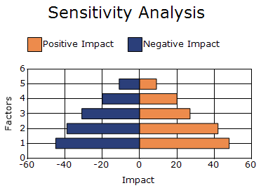

# Tornado Chart in Windows Forms Chart

A Tornado chart is a bar chart that illustrates how changes in different input variables affect an outcome. It is commonly used in sensitivity analysis to compare the impact of multiple factors and identify which variables have the greatest influence on the final result.

The following feature is supported in the Tornado chart:

* **Chart Axis Labels**: The axis labels of a chart can be set by handling the `ChartFormatAxisLabel` event.

N>
chart details for tornado chart.
* Number of Y values per point - 2.
* Number of Series - One or more.
* Cannot be combined with - Pie, Bar, Polar, Radar.




ChartSeries positiveImpact = new ChartSeries("Positive Impact", ChartSeriesType.Tornado);
positiveImpact.Points.Add(1, 0, 48);
positiveImpact.Points.Add(2, 0, 42);
positiveImpact.Points.Add(3, 0, 27);
positiveImpact.Points.Add(4, 0, 20);
positiveImpact.Points.Add(5, 0, 9);

ChartSeries negativeImpact = new ChartSeries("Negative Impact", ChartSeriesType.Tornado);

negativeImpact.Points.Add(1, 0, -45);
negativeImpact.Points.Add(2, 0, -39);
negativeImpact.Points.Add(3, 0, -31);
negativeImpact.Points.Add(4, 0, -20);
negativeImpact.Points.Add(5, 0, -11);

chartControl.Series.Add(positiveImpact);
chartControl.Series.Add(negativeImpact);




Dim positiveImpact As New ChartSeries("Positive Impact", ChartSeriesType.Tornado)

positiveImpact.Points.Add(1, 0, 48)
positiveImpact.Points.Add(2, 0, 42)
positiveImpact.Points.Add(3, 0, 27)
positiveImpact.Points.Add(4, 0, 20)
positiveImpact.Points.Add(5, 0, 9)

Dim negativeImpact As New ChartSeries("Negative Impact", ChartSeriesType.Tornado)

negativeImpact.Points.Add(1, 0, -45)
negativeImpact.Points.Add(2, 0, -39)
negativeImpact.Points.Add(3, 0, -31)
negativeImpact.Points.Add(4, 0, -20)
negativeImpact.Points.Add(5, 0, -11)

chartControl.Series.Add(positiveImpact)
chartControl.Series.Add(negativeImpact)




## Customization Option

The following chart series properties are used as customize option to tornado chart:

[Border](https://help.syncfusion.com/windowsforms/chart/chart-series#border), [DisplayShadow](https://help.syncfusion.com/windowsforms/chart/chart-series#displayshadow), [DisplayText](https://help.syncfusion.com/windowsforms/chart/chart-series#displaytext), [ElementBorders](https://help.syncfusion.com/windowsforms/chart/chart-series#elementborders), [FancyToolTip](https://help.syncfusion.com/windowsforms/chart/chart-series#fancytooltip), [Font](https://help.syncfusion.com/windowsforms/chart/chart-series#font), [HighlightInterior](https://help.syncfusion.com/windowsforms/chart/chart-series#highlightinterior), [ImageIndex](https://help.syncfusion.com/windowsforms/chart/chart-series#imageindex), [Images](https://help.syncfusion.com/windowsforms/chart/chart-series#images), [Interior](https://help.syncfusion.com/windowsforms/chart/chart-series#interior), [LegendItem](https://help.syncfusion.com/windowsforms/chart/chart-series#legenditem), [LightAngle](https://help.syncfusion.com/windowsforms/chart/chart-series#lightangle), [LightColor](https://help.syncfusion.com/windowsforms/chart/chart-series#lightcolor), [Name](https://help.syncfusion.com/windowsforms/chart/chart-series#name), [PhongAlpha](https://help.syncfusion.com/windowsforms/chart/chart-series#phongalpha), [PointsToolTipFormat](https://help.syncfusion.com/windowsforms/chart/chart-series#pointstooltipformat), [Rotate](https://help.syncfusion.com/windowsforms/chart/chart-series#rotate), [ShadingMode](https://help.syncfusion.com/windowsforms/chart/chart-series#shadingmode), [ShadowInterior](https://help.syncfusion.com/windowsforms/chart/chart-series#shadowinterior), [ShadowOffset](https://help.syncfusion.com/windowsforms/chart/chart-series#shadowoffset), [SmartLabels](https://help.syncfusion.com/windowsforms/chart/chart-series#smartlabels), [Spacing](https://help.syncfusion.com/windowsforms/chart/chart-series#spacing), [Spacing Between Series](https://help.syncfusion.com/windowsforms/chart/chart-series#spacingbetweenseries), [Summary](https://help.syncfusion.com/windowsforms/chart/chart-series#summary), [Text](https://help.syncfusion.com/windowsforms/chart/chart-series#text-series), [TextColor](https://help.syncfusion.com/windowsforms/chart/chart-series#textcolor), [TextFormat](https://help.syncfusion.com/windowsforms/chart/chart-series#textformat), [TextOffset](https://help.syncfusion.com/windowsforms/chart/chart-series#textoffset), [TextOrientation](https://help.syncfusion.com/windowsforms/chart/chart-series#textorientation), [Visible](https://help.syncfusion.com/windowsforms/chart/chart-series#visible).