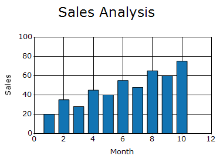
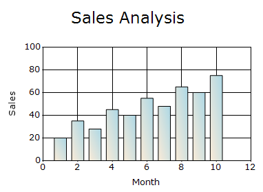
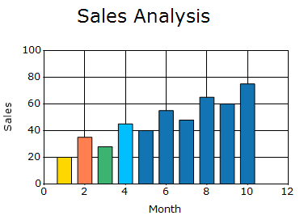

# Auto highlight in Windows Forms Chart

The [AutoHighlight](https://help.syncfusion.com/cr/windowsforms/Syncfusion.Windows.Forms.Chart.ChartControl.html#Syncfusion_Windows_Forms_Chart_ChartControl_AutoHighlight) property specifies whether a data point is automatically highlighted when the pointer hovers over it. The default value is `false`.

N> Automatic highlighting requires chart-region detection. Ensure that the [CalcRegions](https://help.syncfusion.com/cr/windowsforms/Syncfusion.Windows.Forms.Chart.ChartControl.html#Syncfusion_Windows_Forms_Chart_ChartControl_CalcRegions) property is set to `true`. [CalcRegions](https://help.syncfusion.com/cr/windowsforms/Syncfusion.Windows.Forms.Chart.ChartControl.html#Syncfusion_Windows_Forms_Chart_ChartControl_CalcRegions) specifies whether the chart calculates interactive regions used for features such as ToolTips, AutoHighlight, and region hit-testing. Disable it when these features are not needed to improve performance. It is default value is `true`.

The following code enables automatic highlighting.




chartControl.CalcRegions = true;
chartControl.AutoHighlight = true;




chartControl.CalcRegions = True
chartControl.AutoHighlight = True




## Highlight interior

The [HighlightInterior](https://help.syncfusion.com/cr/windowsforms/Syncfusion.Windows.Forms.Chart.ChartStyleInfo.html#Syncfusion_Windows_Forms_Chart_ChartStyleInfo_HighlightInterior) property specifies the interior appearance applied to a data point when it is highlighted. It supports solid colors and gradient brushes. The default value is an empty `BrushInfo`.

The following code applies a gradient highlight to all data points in a series.



using Syncfusion.Drawing;

chartControl.Series[0].Style.HighlightInterior =
    new Syncfusion.Drawing.BrushInfo(
        GradientStyle.BackwardDiagonal,
        Color.LightBlue,
        Color.AntiqueWhite);



Imports Syncfusion.Drawing

chartControl.Series(0).Style.HighlightInterior =
    New Syncfusion.Drawing.BrushInfo(
        GradientStyle.BackwardDiagonal,
        Color.LightBlue,
        Color.AntiqueWhite)




### Data point highlight

The [HighlightInterior](https://help.syncfusion.com/cr/windowsforms/Syncfusion.Windows.Forms.Chart.ChartStyleInfo.html#Syncfusion_Windows_Forms_Chart_ChartStyleInfo_HighlightInterior) property can also be configured for individual data points through the [Styles](https://help.syncfusion.com/cr/windowsforms/Syncfusion.Windows.Forms.Chart.ChartSeries.html#Syncfusion_Windows_Forms_Chart_ChartSeries_Styles)(get only) collection. A point-level setting overrides the series-level highlight appearance for that data point.

The following code applies different highlight colors to individual data points.



using Syncfusion.Drawing;

ChartSeries series = chartControl.Series[0];

series.Styles[0].HighlightInterior =
    new BrushInfo(Color.Gold);

series.Styles[1].HighlightInterior =
    new BrushInfo(Color.Coral);

series.Styles[2].HighlightInterior =
    new BrushInfo(Color.MediumSeaGreen);

series.Styles[3].HighlightInterior =
    new BrushInfo(Color.DeepSkyBlue);



Imports Syncfusion.Drawing

Dim series As ChartSeries =
    chartControl.Series(0)

series.Styles(0).HighlightInterior =
    New BrushInfo(Color.Gold)

series.Styles(1).HighlightInterior =
    New BrushInfo(Color.Coral)

series.Styles(2).HighlightInterior =
    New BrushInfo(Color.MediumSeaGreen)

series.Styles(3).HighlightInterior =
    New BrushInfo(Color.DeepSkyBlue)




## See also

- [How to highlight a series on mouse hover in WinForms Chart](https://support.syncfusion.com/kb/article/1219/how-to-highlight-a-series-on-mouse-hover-in-winforms-chart)