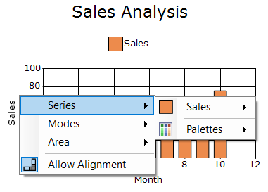
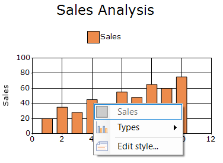
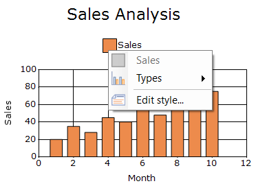
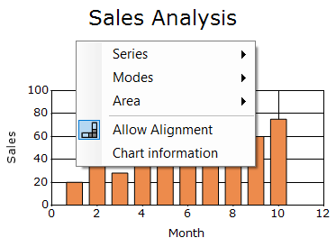
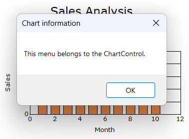

## Context menu

The Windows Forms Chart provides built-in context menus for the chart area, chart series, and legend items. This context menu will let the user change the chart type on a series, enable zooming, switch between 2D and 3D modes and so on.

The [ShowContextMenu](https://help.syncfusion.com/cr/windowsforms/Syncfusion.Windows.Forms.Chart.ChartControl.html#Syncfusion_Windows_Forms_Chart_ChartControl_ShowContextMenu) property specifies whether the chart-area and series context menus are available. By default it is `false`, so enable the showcontextmenu by set to true.

### Chart context menu

The [DisplayChartContextMenu](https://help.syncfusion.com/cr/windowsforms/Syncfusion.Windows.Forms.Chart.ChartControl.html#Syncfusion_Windows_Forms_Chart_ChartControl_DisplayChartContextMenu) property specifies whether the built-in context menu is displayed when users right-click the chart area. The default value is `true`.

The following code enables the chart-area context menu.




chartControl.ShowContextMenu = true;
chartControl.DisplayChartContextMenu = true;




chartControl.ShowContextMenu = True
chartControl.DisplayChartContextMenu = True




### Series context menu

The [DisplaySeriesContextMenu](https://help.syncfusion.com/cr/windowsforms/Syncfusion.Windows.Forms.Chart.ChartControl.html#Syncfusion_Windows_Forms_Chart_ChartControl_DisplaySeriesContextMenu) property specifies whether the built-in context menu is displayed when users right-click a chart series. The default value is `true`

N> The [DisplayChartContextMenu](https://help.syncfusion.com/cr/windowsforms/Syncfusion.Windows.Forms.Chart.ChartControl.html#Syncfusion_Windows_Forms_Chart_ChartControl_DisplayChartContextMenu) and [DisplaySeriesContextMenu](https://help.syncfusion.com/cr/windowsforms/Syncfusion.Windows.Forms.Chart.ChartControl.html#Syncfusion_Windows_Forms_Chart_ChartControl_DisplaySeriesContextMenu) properties take effect only when the [ShowContextMenu](https://help.syncfusion.com/cr/windowsforms/Syncfusion.Windows.Forms.Chart.ChartControl.html#Syncfusion_Windows_Forms_Chart_ChartControl_ShowContextMenu) property is set to `true`.

The following code enables the series context menu.




chartControl.ShowContextMenu = true;
chartControl.DisplaySeriesContextMenu = true;




chartControl.ShowContextMenu = True
chartControl.DisplaySeriesContextMenu = True




### Legend context menu

The [ShowContextMenuInLegend](https://help.syncfusion.com/cr/windowsforms/Syncfusion.Windows.Forms.Chart.ChartControl.html#Syncfusion_Windows_Forms_Chart_ChartControl_ShowContextMenuInLegend) property specifies whether a context menu is displayed when users right-click a legend item. The default value is `false`.

N> The chart legend must be visible to access the legend context menu. The [ShowContextMenuInLegend](https://help.syncfusion.com/cr/windowsforms/Syncfusion.Windows.Forms.Chart.ChartControl.html#Syncfusion_Windows_Forms_Chart_ChartControl_ShowContextMenuInLegend) property controls legend context-menu visibility separately from [ShowContextMenu](https://help.syncfusion.com/cr/windowsforms/Syncfusion.Windows.Forms.Chart.ChartControl.html#Syncfusion_Windows_Forms_Chart_ChartControl_ShowContextMenu).

The following code displays the chart legend and enables its context menu.




chartControl.ShowLegend = true;
chartControl.ShowContextMenuInLegend = true;




chartControl.ShowLegend = True
chartControl.ShowContextMenuInLegend = True




### Access the chart context menu

The [ChartContextMenu](https://help.syncfusion.com/cr/windowsforms/Syncfusion.Windows.Forms.Chart.ChartControl.html#Syncfusion_Windows_Forms_Chart_ChartControl_ChartContextMenu) property gets the built-in context menu associated with the ChartControl. This is a read-only property.

The returned [ChartContextMenu](https://help.syncfusion.com/cr/windowsforms/Syncfusion.Windows.Forms.Chart.ChartContextMenu.html) object inherits from [ContextMenuStrip](https://learn.microsoft.com/en-us/dotnet/desktop/winforms/controls/contextmenustrip-control-overview) and can be displayed programmatically at a specified location.

The following code displays the chart context menu at the specified point.




chartControl.ChartContextMenu.Show(
    chartControl,
    new Point(100, 100),
    chartControl);




chartControl.ChartContextMenu.Show(
    chartControl,
    New Point(100, 100),
    chartControl)




### Access the series context menu

The [SeriesContextMenu](https://help.syncfusion.com/cr/windowsforms/Syncfusion.Windows.Forms.Chart.ChartControl.html#Syncfusion_Windows_Forms_Chart_ChartControl_SeriesContextMenu) property gets the built-in context menu associated with chart series. This is a read-only property.

The returned [ChartSeriesContextMenu](https://help.syncfusion.com/cr/windowsforms/Syncfusion.Windows.Forms.Chart.ChartSeriesContextMenu.html) object inherits from [ContextMenuStrip](https://learn.microsoft.com/en-us/dotnet/desktop/winforms/controls/contextmenustrip-control-overview) and can be displayed for a specified series.

N> The [ChartContextMenu](https://help.syncfusion.com/cr/windowsforms/Syncfusion.Windows.Forms.Chart.ChartContextMenu.html) contains commands associated with the entire ChartControl, whereas the [SeriesContextMenu](https://help.syncfusion.com/cr/windowsforms/Syncfusion.Windows.Forms.Chart.ChartControl.html#Syncfusion_Windows_Forms_Chart_ChartControl_SeriesContextMenu) contains commands associated with a specific chart series.

The following code displays the context menu for the first series.




chartControl.SeriesContextMenu.Show(
    chartControl,
    new Point(100, 100),
    chartControl.Series[0]);




chartControl.SeriesContextMenu.Show(
    chartControl,
    New Point(100, 100),
    chartControl.Series(0))




### Customize context-menu items

The [ChartContextMenu](https://help.syncfusion.com/cr/windowsforms/Syncfusion.Windows.Forms.Chart.ChartContextMenu.html) and [SeriesContextMenu](https://help.syncfusion.com/cr/windowsforms/Syncfusion.Windows.Forms.Chart.ChartControl.html#Syncfusion_Windows_Forms_Chart_ChartControl_SeriesContextMenu) classes inherit from [ContextMenuStrip](https://learn.microsoft.com/en-us/dotnet/desktop/winforms/controls/contextmenustrip-control-overview). Therefore, custom menu items can be added through their `Items` collections.

The following code adds a custom item to the chart context menu.




chartControl.ChartContextMenu.Opening += (sender, e) =>
{
    if (chartControl.ChartContextMenu.Items["ChartInfo"] == null)
    {
        ToolStripMenuItem customItem =
            new ToolStripMenuItem("Chart information");

        customItem.Name = "ChartInfo";

        customItem.Click += (s, args) =>
        {
            MessageBox.Show(
                "This menu belongs to the ChartControl.",
                "Chart information");
        };

        chartControl.ChartContextMenu.Items.Add(customItem);
    }
};




AddHandler chartControl.ChartContextMenu.Opening,
    Sub(sender, e)

        If chartControl.ChartContextMenu.Items("ChartInfo") Is Nothing Then

            Dim customItem As New ToolStripMenuItem(
                "Chart information")

            customItem.Name = "ChartInfo"

            AddHandler customItem.Click,
                Sub(s, args)
                    MessageBox.Show(
                        "This menu belongs to the ChartControl.",
                        "Chart information")
                End Sub

            chartControl.ChartContextMenu.Items.Add(customItem)

        End If

    End Sub




The following code adds a custom item to the series context menu.




chartControl.SeriesContextMenu.Opening += (sender, e) =>
{
    if (chartControl.SeriesContextMenu.Items["SeriesInfo"] == null)
    {
        ToolStripMenuItem seriesItem =
            new ToolStripMenuItem("Series information");

        seriesItem.Name = "SeriesInfo";

        seriesItem.Click += (s, args) =>
        {
            MessageBox.Show(
                chartControl.Series[0].Name,
                "Series information");
        };

        chartControl.SeriesContextMenu.Items.Add(seriesItem);
    }
};




AddHandler chartControl.SeriesContextMenu.Opening,
    Sub(sender, e)

        If chartControl.SeriesContextMenu.Items("SeriesInfo") Is Nothing Then

            Dim seriesItem As New ToolStripMenuItem(
                "Series information")

            seriesItem.Name = "SeriesInfo"

            AddHandler seriesItem.Click,
                Sub(s, args)
                    MessageBox.Show(
                        chartControl.Series(0).Name,
                        "Series information")
                End Sub

            chartControl.SeriesContextMenu.Items.Add(seriesItem)

        End If

    End Sub




