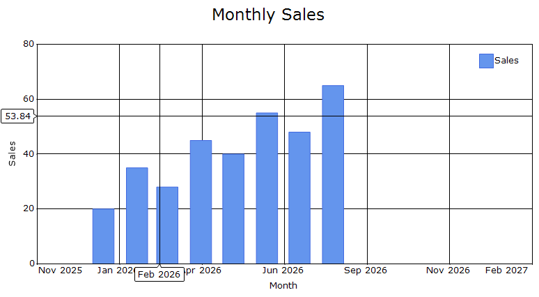
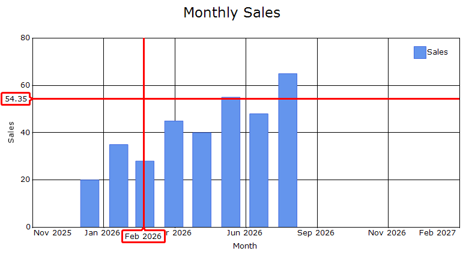
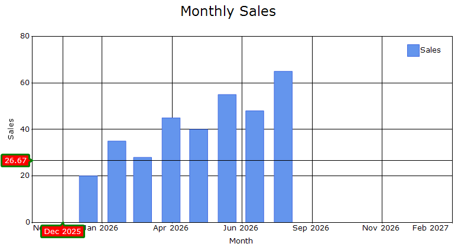

# Crosshair in Windows Forms Chart

The [Crosshair](https://help.syncfusion.com/cr/windowsforms/Syncfusion.Windows.Forms.Chart.ChartControl.html#Syncfusion_Windows_Forms_Chart_ChartControl_Crosshair) is used to view the chart values at the current mouse or touch position. Moving the crosshair horizontally displays the corresponding X-axis value, while moving it vertically displays the corresponding Y-axis value.

## Show crosshair

The [Visible](https://help.syncfusion.com/cr/windowsforms/Syncfusion.Windows.Forms.Chart.ChartCrosshair.html#Syncfusion_Windows_Forms_Chart_ChartCrosshair_Visible) property controls whether the crosshair is displayed in the chart. By default, it is set to `false`.

N> To display the crosshair tooltip, set the [ShowCrosshairTooltip](https://help.syncfusion.com/cr/windowsforms/Syncfusion.Windows.Forms.Chart.ChartAxis.html#Syncfusion_Windows_Forms_Chart_ChartAxis_ShowCrosshairTooltip) property to `true`.

The following code example demonstrates how to enable the crosshair and display tooltips on the primary X and Y axes.




// Enables the Crosshair.
chartControl.Crosshair.Visible = true;

// Displays the Crosshair tooltips on the axes.
chartControl.PrimaryXAxis.ShowCrosshairTooltip = true;
chartControl.PrimaryYAxis.ShowCrosshairTooltip = true;




' Enables the Crosshair.
chartControl.Crosshair.Visible = True

' Displays the Crosshair tooltips on the primary axes.
chartControl.PrimaryXAxis.ShowCrosshairTooltip = True
chartControl.PrimaryYAxis.ShowCrosshairTooltip = True




## Line

The [Line](https://help.syncfusion.com/cr/windowsforms/Syncfusion.Windows.Forms.Chart.ChartCrosshair.html#Syncfusion_Windows_Forms_Chart_ChartCrosshair_Line) property allows you to customize the appearance of the crosshair lines. By default, this property is initialized with a new instance of the [ChartLineInfo](https://help.syncfusion.com/cr/windowsforms/Syncfusion.Windows.Forms.Chart.ChartLineInfo.html) class.

The following code example demonstrates how to customize the color and width of the crosshair lines.




chartControl.Crosshair.Line.Color = Color.Red;
chartControl.Crosshair.Line.Width = 2;




chartControl.Crosshair.Line.Color = Color.Red
chartControl.Crosshair.Line.Width = 2




## Axis tooltip

The [AxisTooltip](https://help.syncfusion.com/cr/windowsforms/Syncfusion.Windows.Forms.Chart.ChartCrosshair.html#Syncfusion_Windows_Forms_Chart_ChartCrosshair_AxisTooltip) property provides options to customize the tooltips displayed on the chart axes at the current crosshair position. The default value is a new instance of the [TrackballTooltip](https://help.syncfusion.com/cr/windowsforms/Syncfusion.Windows.Forms.Chart.TrackballTooltip.html) class.

N> Create a [ChartLineInfo](https://help.syncfusion.com/cr/windowsforms/Syncfusion.Windows.Forms.Chart.ChartLineInfo.html) instance for the [Border](https://help.syncfusion.com/cr/windowsforms/Syncfusion.Windows.Forms.Chart.TrackballTooltip.html#Syncfusion_Windows_Forms_Chart_TrackballTooltip_Border) property before customizing it to avoid a null-reference exception.

The following code example demonstrates how to configure the crosshair axis tooltip.




chartControl.Crosshair.Line.Color = Color.Gray;
chartControl.Crosshair.Line.Width = 2;
chartControl.Crosshair.AxisTooltip.Border = new ChartLineInfo();

chartControl.Crosshair.AxisTooltip.Border.Color = Color.Green;

chartControl.Crosshair.AxisTooltip.Border.Width = 3;

chartControl.Crosshair.AxisTooltip.Interior = new BrushInfo(Color.Red);
chartControl.Crosshair.AxisTooltip.TextColor = Color.White;




' Customizes the Crosshair lines.
chartControl.Crosshair.Line.Color = Color.Gray
chartControl.Crosshair.Line.Width = 2

' Initializes and customizes the axis tooltip border.
chartControl.Crosshair.AxisTooltip.Border = New ChartLineInfo()
chartControl.Crosshair.AxisTooltip.Border.Color = Color.Green
chartControl.Crosshair.AxisTooltip.Border.Width = 3

' Customizes the axis tooltip appearance.
chartControl.Crosshair.AxisTooltip.Interior =
    New BrushInfo(Color.Red)
chartControl.Crosshair.AxisTooltip.TextColor = Color.White





## Events

The [AxisTooltipRendering](https://help.syncfusion.com/cr/windowsforms/Syncfusion.Windows.Forms.Chart.ChartCrosshair.html#Syncfusion_Windows_Forms_Chart_ChartCrosshair_AxisTooltipRendering) event is triggered once for each axis before its crosshair tooltip is displayed.

This event can be used to customize the text, background, border, or text color of an individual axis tooltip.