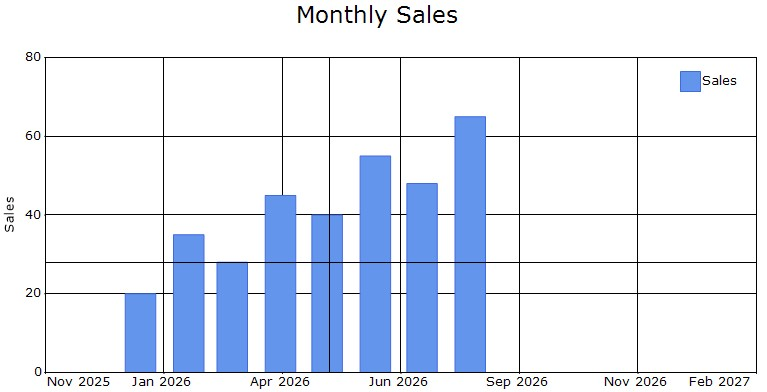
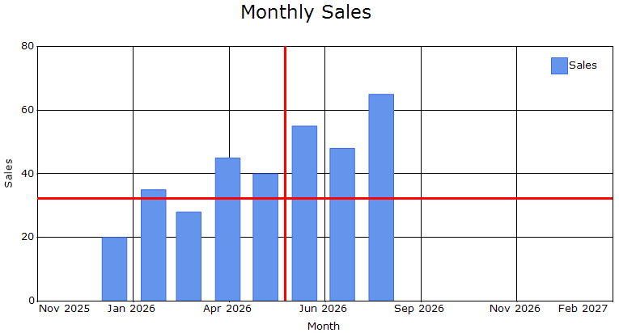
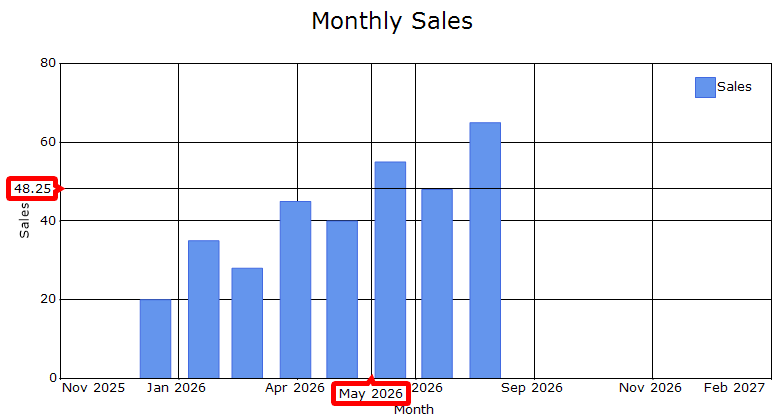

# Crosshair in Windows Forms Chart

## Crosshair

The [Crosshair](https://help.syncfusion.com/cr/windowsforms/Syncfusion.Windows.Forms.Chart.ChartControl.html#Syncfusion_Windows_Forms_Chart_ChartControl_Crosshair) displays horizontal and vertical lines at the current mouse or touch position. Axis tooltips display the corresponding chart coordinates, helping users inspect values at a specific location.

### Enable crosshair

The [Visible](https://help.syncfusion.com/cr/windowsforms/Syncfusion.Windows.Forms.Chart.ChartCrosshair.html#Syncfusion_Windows_Forms_Chart_ChartCrosshair_Visible) property controls whether the Crosshair is displayed in the chart.



chartControl.Crosshair.Visible = true;


chartControl.Crosshair.Visible = True



Move the mouse pointer across the chart area to display the Crosshair lines and the corresponding axis values.

## Crosshair line

The [Line](https://help.syncfusion.com/cr/windowsforms/Syncfusion.Windows.Forms.Chart.ChartCrosshair.html#Syncfusion_Windows_Forms_Chart_ChartCrosshair_Line) property controls the appearance of the Crosshair lines.

The line color and width can be customized.



chartControl.Crosshair.Line.Color = Color.Red;
chartControl.Crosshair.Line.Width = 2;


chartControl.Crosshair.Line.Color = Color.Red
chartControl.Crosshair.Line.Width = 2



## Axis tooltip

The [AxisTooltip]https://help.syncfusion.com/cr/windowsforms/Syncfusion.Windows.Forms.Chart.ChartCrosshair.html#Syncfusion_Windows_Forms_Chart_ChartCrosshair_AxisTooltip property provides options to customize the tooltips displayed on the chart axes at the current Crosshair position.

### Tooltip appearance

The tooltip background, text color, border, and corner radius can be customized.



chartControl.Crosshair.AxisTooltip.Interior =
    new BrushInfo(Color.White);
chartControl.Crosshair.AxisTooltip.TextColor = Color.Black;
chartControl.Crosshair.AxisTooltip.CornerRadius = 3;
chartControl.Crosshair.AxisTooltip.Border.Color = Color.Gray;
chartControl.Crosshair.AxisTooltip.Border.Width = 1;


chartControl.Crosshair.AxisTooltip.Interior =
    New BrushInfo(Color.White)
chartControl.Crosshair.AxisTooltip.TextColor = Color.Black
chartControl.Crosshair.AxisTooltip.CornerRadius = 3
chartControl.Crosshair.AxisTooltip.Border.Color = Color.Gray
chartControl.Crosshair.AxisTooltip.Border.Width = 1



### Tooltip format

The `XValueFormat` and `YValueFormat` properties specify how the X-axis and Y-axis values are displayed in the Crosshair tooltips.



chartControl.Crosshair.AxisTooltip.XValueFormat = "MMM, yyyy";
chartControl.Crosshair.AxisTooltip.YValueFormat = "n0";


chartControl.Crosshair.AxisTooltip.XValueFormat = "MMM, yyyy"
chartControl.Crosshair.AxisTooltip.YValueFormat = "n0"



N> Date-and-time formats such as `MMM, yyyy` are applicable when the corresponding axis contains `DateTime` values.

## Crosshair event

The [AxisTooltipRendering](https://help.syncfusion.com/cr/windowsforms/Syncfusion.Windows.Forms.Chart.ChartCrosshair.html) event is triggered once for each axis before its Crosshair tooltip is displayed.

This event can be used to customize the text, background, border, or text color of an individual axis tooltip.