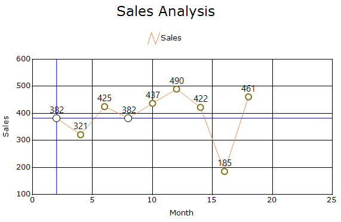
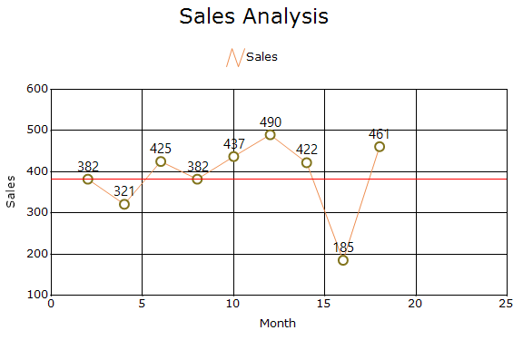
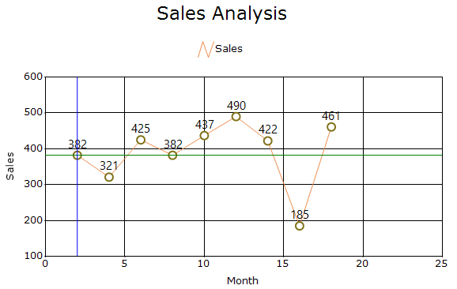
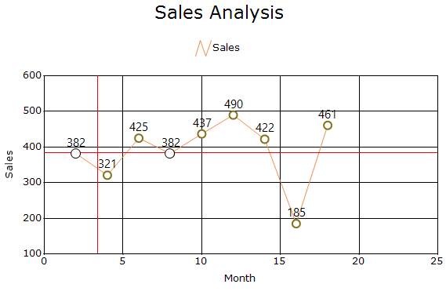
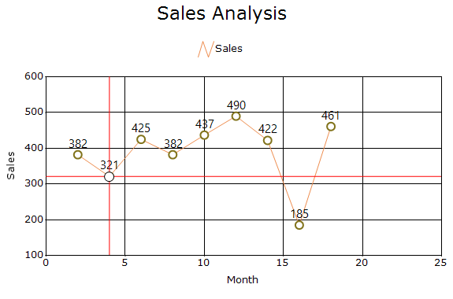
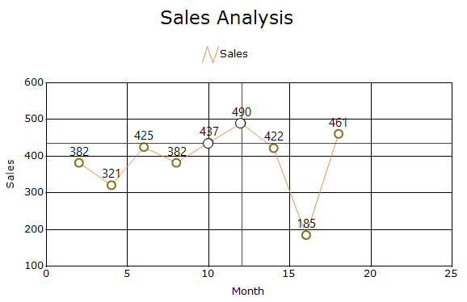
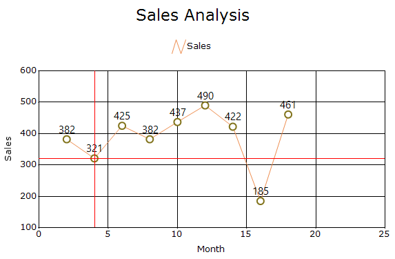
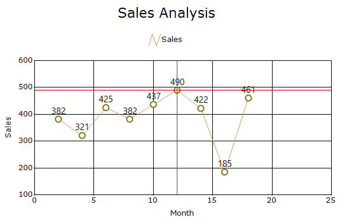
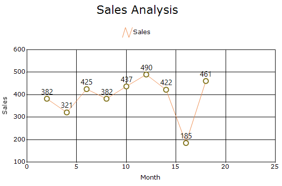

# Interactive cursor in Windows Forms Chart

The [ChartInteractiveCursor](https://help.syncfusion.com/cr/windowsforms/Syncfusion.Windows.Forms.Chart.ChartInteractiveCursor.html) displays movable horizontal and vertical cursor lines in the chart area. It allows users to drag the cursor and dock it to a data point to identify its X and Y values.

An interactive cursor tracks the data points of a specified series and must be added to the [ChartArea.InteractiveCursors](https://help.syncfusion.com/cr/windowsforms/Syncfusion.Windows.Forms.Chart.ChartArea.html#Syncfusion_Windows_Forms_Chart_ChartArea_InteractiveCursors) collection.

## Add an interactive cursor

The [ChartInteractiveCursor](https://help.syncfusion.com/cr/windowsforms/Syncfusion.Windows.Forms.Chart.ChartInteractiveCursor.html) class provides the following constructors:

- [ChartInteractiveCursor(ChartSeries)](https://help.syncfusion.com/cr/windowsforms/Syncfusion.Windows.Forms.Chart.ChartInteractiveCursor.html#Syncfusion_Windows_Forms_Chart_ChartInteractiveCursor__ctor_Syncfusion_Windows_Forms_Chart_ChartSeries_): Creates an interactive cursor for the specified series.
- [ChartInteractiveCursor(ChartSeries, Color)](https://help.syncfusion.com/cr/windowsforms/Syncfusion.Windows.Forms.Chart.ChartInteractiveCursor.html#Syncfusion_Windows_Forms_Chart_ChartInteractiveCursor__ctor_Syncfusion_Windows_Forms_Chart_ChartSeries_System_Drawing_Color_): Creates an interactive cursor for the specified series and applies the specified color.

The following code creates and adds an interactive cursor to the chart area.




ChartInteractiveCursor interactiveCursor =
    new ChartInteractiveCursor(
        chartControl.Series[0],
        Color.Blue);

chartControl.ChartArea.InteractiveCursors.Add(interactiveCursor);




Dim interactiveCursor As New ChartInteractiveCursor(
    chartControl.Series(0),
    Color.Blue)

chartControl.ChartArea.InteractiveCursors.Add(interactiveCursor)




## Cursor orientation

The [CursorOrientation](https://help.syncfusion.com/cr/windowsforms/Syncfusion.Windows.Forms.Chart.ChartInteractiveCursor.html#Syncfusion_Windows_Forms_Chart_ChartInteractiveCursor_CursorOrientation) property specifies which cursor lines are displayed. It is default value is [Both](https://help.syncfusion.com/cr/windowsforms/Syncfusion.Windows.Forms.Chart.InteractiveCursorOrientation.html#Syncfusion_Windows_Forms_Chart_InteractiveCursorOrientation_Both).

The [InteractiveCursorOrientation](https://help.syncfusion.com/cr/windowsforms/Syncfusion.Windows.Forms.Chart.InteractiveCursorOrientation.html) enumeration supports the following values:

- [Both](https://help.syncfusion.com/cr/windowsforms/Syncfusion.Windows.Forms.Chart.InteractiveCursorOrientation.html#Syncfusion_Windows_Forms_Chart_InteractiveCursorOrientation_Both): Displays both horizontal and vertical cursor lines.
- [Horizontal](https://help.syncfusion.com/cr/windowsforms/Syncfusion.Windows.Forms.Chart.InteractiveCursorOrientation.html#Syncfusion_Windows_Forms_Chart_InteractiveCursorOrientation_Horizontal): Displays only the horizontal cursor line.
- [Vertical](https://help.syncfusion.com/cr/windowsforms/Syncfusion.Windows.Forms.Chart.InteractiveCursorOrientation.html#Syncfusion_Windows_Forms_Chart_InteractiveCursorOrientation_Vertical): Displays only the vertical cursor line.

The following code displays only the horizontal cursor line.




interactiveCursor.CursorOrientation =
    InteractiveCursorOrientation.Horizontal;




interactiveCursor.CursorOrientation =
    InteractiveCursorOrientation.Horizontal




## Cursor color

The [Color](https://help.syncfusion.com/cr/windowsforms/Syncfusion.Windows.Forms.Chart.ChartInteractiveCursor.html) property specifies a common color for the cursor lines.

The [HorizontalCursorColor](https://help.syncfusion.com/cr/windowsforms/Syncfusion.Windows.Forms.Chart.ChartInteractiveCursor.html#Syncfusion_Windows_Forms_Chart_ChartInteractiveCursor_HorizontalCursorColor) and [VerticalCursorColor](https://help.syncfusion.com/cr/windowsforms/Syncfusion.Windows.Forms.Chart.ChartInteractiveCursor.html#Syncfusion_Windows_Forms_Chart_ChartInteractiveCursor_VerticalCursorColor) properties can be used to apply different colors to the individual cursor lines.

The following code applies different colors to the horizontal and vertical cursor lines.




interactiveCursor.HorizontalCursorColor = Color.Green;
interactiveCursor.VerticalCursorColor = Color.Blue;




interactiveCursor.HorizontalCursorColor = Color.Green
interactiveCursor.VerticalCursorColor = Color.Blue




## Move cursor within the chart area

The [MoveToChartArea](https://help.syncfusion.com/cr/windowsforms/Syncfusion.Windows.Forms.Chart.ChartInteractiveCursor.html#Syncfusion_Windows_Forms_Chart_ChartInteractiveCursor_MoveToChartArea) property specifies whether the cursor can move within the chart area. The default value is `false`

The following code allows the interactive cursor to move within the chart area.




interactiveCursor.MoveToChartArea = true;




interactiveCursor.MoveToChartArea = True




## Snap cursor to data points

The [SnapToPoints](https://help.syncfusion.com/cr/windowsforms/Syncfusion.Windows.Forms.Chart.ChartInteractiveCursor.html#Syncfusion_Windows_Forms_Chart_ChartInteractiveCursor_SnapToPoints) property specifies whether the cursor moves to the closest series data point after the mouse is released. The default value is `true`

N> To snap the cursor to the closest data point while moving within the chart area, set [MoveToChartArea](https://help.syncfusion.com/cr/windowsforms/Syncfusion.Windows.Forms.Chart.ChartInteractiveCursor.html) to `true`, specify an [XInterval](https://help.syncfusion.com/cr/windowsforms/Syncfusion.Windows.Forms.Chart.ChartInteractiveCursor.html#Syncfusion_Windows_Forms_Chart_ChartInteractiveCursor_XInterval) value greater than zero, and enable [SnapToPoints](https://help.syncfusion.com/cr/windowsforms/Syncfusion.Windows.Forms.Chart.ChartInteractiveCursor.html#Syncfusion_Windows_Forms_Chart_ChartInteractiveCursor_SnapToPoints).

The following code disables snapping to the closest data point.




interactiveCursor.SnapToPoints = false;




interactiveCursor.SnapToPoints = False




## Cursor intervals

The [XInterval](https://help.syncfusion.com/cr/windowsforms/Syncfusion.Windows.Forms.Chart.ChartInteractiveCursor.html#Syncfusion_Windows_Forms_Chart_ChartInteractiveCursor_XInterval) and [YInterval](https://help.syncfusion.com/cr/windowsforms/Syncfusion.Windows.Forms.Chart.ChartInteractiveCursor.html#Syncfusion_Windows_Forms_Chart_ChartInteractiveCursor_YInterval) properties specify the movement intervals of the interactive cursor.

- [XInterval](https://help.syncfusion.com/cr/windowsforms/Syncfusion.Windows.Forms.Chart.ChartInteractiveCursor.html#Syncfusion_Windows_Forms_Chart_ChartInteractiveCursor_XInterval): Specifies the movement interval along the X-axis. The default value is `0`.
- [YInterval](https://help.syncfusion.com/cr/windowsforms/Syncfusion.Windows.Forms.Chart.ChartInteractiveCursor.html#Syncfusion_Windows_Forms_Chart_ChartInteractiveCursor_YInterval): Specifies the movement interval along the Y-axis. The default value is `0`.

N> When [MoveToChartArea](https://help.syncfusion.com/cr/windowsforms/Syncfusion.Windows.Forms.Chart.ChartInteractiveCursor.html#Syncfusion_Windows_Forms_Chart_ChartInteractiveCursor_MoveToChartArea) is enabled, set [XInterval](https://help.syncfusion.com/cr/windowsforms/Syncfusion.Windows.Forms.Chart.ChartInteractiveCursor.html#Syncfusion_Windows_Forms_Chart_ChartInteractiveCursor_XInterval) to a value greater than zero to control movement along the X-axis. Set [YInterval](https://help.syncfusion.com/cr/windowsforms/Syncfusion.Windows.Forms.Chart.ChartInteractiveCursor.html#Syncfusion_Windows_Forms_Chart_ChartInteractiveCursor_YInterval) only when movement along the Y-axis must also be controlled.

The following code configures the cursor movement intervals.




interactiveCursor.XInterval = 2;
interactiveCursor.YInterval = 50;




interactiveCursor.XInterval = 2
interactiveCursor.YInterval = 50




## Display point symbol

The [ShowPointSymbol](https://help.syncfusion.com/cr/windowsforms/Syncfusion.Windows.Forms.Chart.ChartInteractiveCursor.html) property specifies whether a symbol is displayed at the data point tracked by the cursor. The default value is `true`.

The following code hides the point symbol.



interactiveCursor.ShowPointSymbol = false;


interactiveCursor.ShowPointSymbol = False



## Cursor position and location

The following properties provide information about the cursor position:

- [XPosition](https://help.syncfusion.com/cr/windowsforms/Syncfusion.Windows.Forms.Chart.ChartInteractiveCursor.html#Syncfusion_Windows_Forms_Chart_ChartInteractiveCursor_XPosition): Gets or sets the horizontal position of the cursor. The default value is `0`.
- [YPosition](https://help.syncfusion.com/cr/windowsforms/Syncfusion.Windows.Forms.Chart.ChartInteractiveCursor.html#Syncfusion_Windows_Forms_Chart_ChartInteractiveCursor_YPosition): Gets or sets the vertical position of the cursor. The default value is `0`.
- [LineLocation](https://help.syncfusion.com/cr/windowsforms/Syncfusion.Windows.Forms.Chart.ChartInteractiveCursor.html#Syncfusion_Windows_Forms_Chart_ChartInteractiveCursor_LineLocation): Gets or sets the cursor-line location. The default value is `PointF.Empty`.
- [Location](https://help.syncfusion.com/cr/windowsforms/Syncfusion.Windows.Forms.Chart.ChartInteractiveCursor.html#Syncfusion_Windows_Forms_Chart_ChartInteractiveCursor_Location): Gets the current location of the interactive cursor.

The following code sets the horizontal and vertical cursor positions.




interactiveCursor.XPosition = 200;
interactiveCursor.YPosition = 150;




interactiveCursor.XPosition = 200
interactiveCursor.YPosition = 150




## Redraw cursor lines

The [LineRedraw](https://help.syncfusion.com/cr/windowsforms/Syncfusion.Windows.Forms.Chart.ChartInteractiveCursor.html) property specifies whether the cursor lines must be redrawn when the cursor location changes. The default value is `false`.

The following code enables cursor-line redrawing.




interactiveCursor.LineRedraw = true;




interactiveCursor.LineRedraw = True




## Tracked series and point

The following read-only properties provide information about the data tracked by the cursor:

- [Series](https://help.syncfusion.com/cr/windowsforms/Syncfusion.Windows.Forms.Chart.ChartInteractiveCursor.html#Syncfusion_Windows_Forms_Chart_ChartInteractiveCursor_Series): Gets the series associated with the interactive cursor.
- [Point](https://help.syncfusion.com/cr/windowsforms/Syncfusion.Windows.Forms.Chart.ChartInteractiveCursor.html#Syncfusion_Windows_Forms_Chart_ChartInteractiveCursor_Point): Gets the data point currently tracked by the cursor.

## Move cursor programmatically

The [HorizontalMove](https://help.syncfusion.com/cr/windowsforms/Syncfusion.Windows.Forms.Chart.ChartInteractiveCursor.html#Syncfusion_Windows_Forms_Chart_ChartInteractiveCursor_VerticalMove_System_Boolean_) method moves the vertical cursor line along the X-axis.

- `HorizontalMove(true)`: Moves the cursor to the next data point on the right.
- `HorizontalMove(false)`: Moves the cursor to the next data point on the left.

The [VerticalMove](https://help.syncfusion.com/cr/windowsforms/Syncfusion.Windows.Forms.Chart.ChartInteractiveCursor.html#Syncfusion_Windows_Forms_Chart_ChartInteractiveCursor_VerticalMove_System_Boolean_) method moves the horizontal cursor line along the Y-axis.

- `VerticalMove(true)`: Moves the cursor to the next data point above.
- `VerticalMove(false)`: Moves the cursor to the next data point below.

The following code moves the cursor to the next data points along both axes.




interactiveCursor.HorizontalMove(true);
interactiveCursor.VerticalMove(true);




interactiveCursor.HorizontalMove(True)
interactiveCursor.VerticalMove(True)




The cursor can also be moved to the closest data point for a specified axis value.




int xPointIndex =
    interactiveCursor.HorizontalMove(3.0);

int yPointIndex =
    interactiveCursor.VerticalMove(40.0);




Dim xPointIndex As Integer =
    interactiveCursor.HorizontalMove(3.0)

Dim yPointIndex As Integer =
    interactiveCursor.VerticalMove(40.0)




These methods return the index of the closest data point or `-1` when no nearby data point is found.

## Find the closest data point

The [GetClosestXPoint](https://help.syncfusion.com/cr/windowsforms/Syncfusion.Windows.Forms.Chart.ChartInteractiveCursor.html#Syncfusion_Windows_Forms_Chart_ChartInteractiveCursor_GetClosestXPoint_System_Double_) and [GetClosestYPoint](https://help.syncfusion.com/cr/windowsforms/Syncfusion.Windows.Forms.Chart.ChartInteractiveCursor.html#Syncfusion_Windows_Forms_Chart_ChartInteractiveCursor_GetClosestYPoint_System_Double_) methods return the index of the data point closest to a specified axis value without requiring directional movement.

- [GetClosestXPoint](https://help.syncfusion.com/cr/windowsforms/Syncfusion.Windows.Forms.Chart.ChartInteractiveCursor.html#Syncfusion_Windows_Forms_Chart_ChartInteractiveCursor_GetClosestXPoint_System_Double_): Finds the data point closest to the specified X value.
- [GetClosestYPoint](https://help.syncfusion.com/cr/windowsforms/Syncfusion.Windows.Forms.Chart.ChartInteractiveCursor.html#Syncfusion_Windows_Forms_Chart_ChartInteractiveCursor_GetClosestYPoint_System_Double_): Finds the data point closest to the specified Y value.

The following code retrieves the indexes of the data points closest to the specified X and Y values.




int xPointIndex =
    interactiveCursor.GetClosestXPoint(3.0);

int yPointIndex =
    interactiveCursor.GetClosestYPoint(40.0);




Dim xPointIndex As Integer =
    interactiveCursor.GetClosestXPoint(3.0)

Dim yPointIndex As Integer =
    interactiveCursor.GetClosestYPoint(40.0)




These methods return `-1` when no nearby data point is found.

## Check a location near the cursor

The [IsXLocation](https://help.syncfusion.com/cr/windowsforms/Syncfusion.Windows.Forms.Chart.ChartInteractiveCursor.html#Syncfusion_Windows_Forms_Chart_ChartInteractiveCursor_IsXLocation_System_Drawing_Point_) and [IsYLocation](https://help.syncfusion.com/cr/windowsforms/Syncfusion.Windows.Forms.Chart.ChartInteractiveCursor.html#Syncfusion_Windows_Forms_Chart_ChartInteractiveCursor_IsYLocation_System_Drawing_Point_) methods determine whether a specified point is near the current cursor lines.

- [IsXLocation](https://help.syncfusion.com/cr/windowsforms/Syncfusion.Windows.Forms.Chart.ChartInteractiveCursor.html#Syncfusion_Windows_Forms_Chart_ChartInteractiveCursor_IsXLocation_System_Drawing_Point_): Returns `true` when the point is near the vertical cursor line.
- [IsYLocation](https://help.syncfusion.com/cr/windowsforms/Syncfusion.Windows.Forms.Chart.ChartInteractiveCursor.html#Syncfusion_Windows_Forms_Chart_ChartInteractiveCursor_IsYLocation_System_Drawing_Point_): Returns `true` when the point is near the horizontal cursor line.

The following code checks whether the current pointer location is near the vertical or horizontal cursor line.




Point mousePoint =
    chartControl.PointToClient(Cursor.Position);

bool nearVerticalCursor =
    interactiveCursor.IsXLocation(mousePoint);

bool nearHorizontalCursor =
    interactiveCursor.IsYLocation(mousePoint);




Dim mousePoint As Point =
    chartControl.PointToClient(Cursor.Position)

Dim nearVerticalCursor As Boolean =
    interactiveCursor.IsXLocation(mousePoint)

Dim nearHorizontalCursor As Boolean =
    interactiveCursor.IsYLocation(mousePoint)




## Manage interactive cursors

The [InteractiveCursors](https://help.syncfusion.com/cr/windowsforms/Syncfusion.Windows.Forms.Chart.ChartArea.html#Syncfusion_Windows_Forms_Chart_ChartArea_InteractiveCursors) property provides access to the [ChartAreaCursorCollection](https://help.syncfusion.com/cr/windowsforms/Syncfusion.Windows.Forms.Chart.ChartAreaCursorCollection.html). This collection can be used to add, access, insert, or remove interactive cursors.

The following code adds, retrieves, and removes an interactive cursor.




chartControl.ChartArea.InteractiveCursors.Add(interactiveCursor);

if (chartControl.ChartArea.InteractiveCursors.Count > 0)
{
    ChartInteractiveCursor firstCursor =
        chartControl.ChartArea.InteractiveCursors[0];
}

chartControl.ChartArea.InteractiveCursors.Remove(
    interactiveCursor);




chartControl.ChartArea.InteractiveCursors.Add(
    interactiveCursor)

If chartControl.ChartArea.InteractiveCursors.Count > 0 Then

    Dim firstCursor As ChartInteractiveCursor =
        chartControl.ChartArea.InteractiveCursors(0)

End If

chartControl.ChartArea.InteractiveCursors.Remove(
    interactiveCursor)




## Detect cursor changes

The [Changed](https://help.syncfusion.com/cr/windowsforms/Syncfusion.Windows.Forms.Chart.ChartInteractiveCursor.html#Syncfusion_Windows_Forms_Chart_ChartInteractiveCursor_Changed) event occurs when the interactive cursor state changes. Use the [Point](https://help.syncfusion.com/cr/windowsforms/Syncfusion.Windows.Forms.Chart.ChartInteractiveCursor.html#Syncfusion_Windows_Forms_Chart_ChartInteractiveCursor_Point) property in the event handler to retrieve the currently tracked data point.

The following code retrieves the data point tracked by the cursor when its state changes.




interactiveCursor.Changed +=
    InteractiveCursor_Changed;

private void InteractiveCursor_Changed(
    object sender,
    EventArgs e)
{
    ChartInteractiveCursor cursor =
        (ChartInteractiveCursor)sender;

    ChartPoint currentPoint = cursor.Point;
}




AddHandler interactiveCursor.Changed,
    AddressOf InteractiveCursor_Changed

Private Sub InteractiveCursor_Changed(
    ByVal sender As Object,
    ByVal e As EventArgs)

    Dim cursor As ChartInteractiveCursor =
        DirectCast(sender, ChartInteractiveCursor)

    Dim currentPoint As ChartPoint =
        cursor.Point

End Sub




## See also

- [How to implement interactive cursor in WinForms Chart?](https://support.syncfusion.com/kb/article/1053/how-to-implement-interactive-cursor-in-winforms-chart)