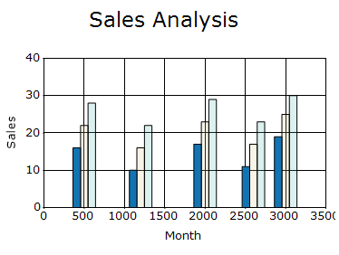
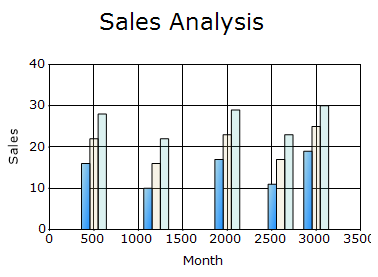
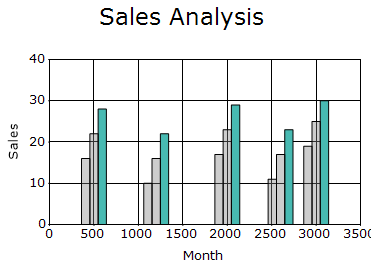
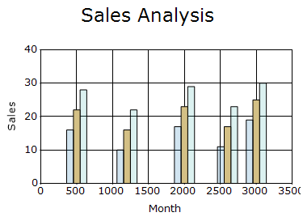

# Chart Series Highlight in Windows Forms Chart

The [SeriesHighlight](https://help.syncfusion.com/cr/windowsforms/Syncfusion.Windows.Forms.Chart.ChartControl.html#Syncfusion_Windows_Forms_Chart_ChartControl_SeriesHighlight) property specifies whether an entire series is highlighted when the pointer hovers over the series or its legend item. The default value is `false`.

When a series is highlighted, the remaining series are displayed using their dimmed appearance.

N> 
- Series highlighting requires chart-region detection.
- Ensure that the [CalcRegions](https://help.syncfusion.com/cr/windowsforms/Syncfusion.Windows.Forms.Chart.ChartControl.html#Syncfusion_Windows_Forms_Chart_ChartControl_CalcRegions) property is set to `true`.
- The [AutoHighlight](https://help.syncfusion.com/cr/windowsforms/Syncfusion.Windows.Forms.Chart.ChartControl.html#Syncfusion_Windows_Forms_Chart_ChartControl_AutoHighlight) property should be disabled to enable this chart series highlighting feature.

The following code enables series highlighting.




chartControl.CalcRegions = true;
chartControl.SeriesHighlight = true;




chartControl.CalcRegions = True
chartControl.SeriesHighlight = True




## Series highlight appearance

The [HighlightInterior](https://help.syncfusion.com/cr/windowsforms/Syncfusion.Windows.Forms.Chart.ChartStyleInfo.html#Syncfusion_Windows_Forms_Chart_ChartStyleInfo_HighlightInterior) property specifies the interior appearance of the highlighted series. It supports solid colors and gradient brushes. The default value is an empty `BrushInfo`.

The following code applies a gradient appearance to the highlighted series.



using Syncfusion.Drawing;

chartControl.Series[0].Style.HighlightInterior =
    new BrushInfo(
        GradientStyle.ForwardDiagonal,
        Color.LightBlue,
        Color.DodgerBlue);



Imports Syncfusion.Drawing

chartControl.Series(0).Style.HighlightInterior =
    New BrushInfo(
        GradientStyle.ForwardDiagonal,
        Color.LightBlue,
        Color.DodgerBlue)




## Dimmed series appearance

The [DimmedInterior](https://help.syncfusion.com/cr/windowsforms/Syncfusion.Windows.Forms.Chart.ChartStyleInfo.html#Syncfusion_Windows_Forms_Chart_ChartStyleInfo_DimmedInterior) property specifies the interior appearance applied to the other series when a particular series is highlighted. The default value is an empty `BrushInfo`.

N> The alpha component of the color controls the transparency of the dimmed appearance. A lower alpha value makes the series more transparent.

The following code applies a semitransparent gray appearance to the dimmed series.



using Syncfusion.Drawing;

chartControl.Series[0].Style.DimmedInterior =
    new BrushInfo(Color.FromArgb(100, Color.Gray));

chartControl.Series[1].Style.DimmedInterior =
    new BrushInfo(Color.FromArgb(100, Color.Gray));

chartControl.Series[2].Style.DimmedInterior =
    new BrushInfo(Color.FromArgb(100, Color.Gray));



Imports Syncfusion.Drawing

chartControl.Series(0).Style.DimmedInterior =
    New BrushInfo(Color.FromArgb(100, Color.Gray))

chartControl.Series(1).Style.DimmedInterior =
    New BrushInfo(Color.FromArgb(100, Color.Gray))

chartControl.Series(2).Style.DimmedInterior =
    New BrushInfo(Color.FromArgb(100, Color.Gray))




## Highlight a specific series

The [SeriesHighlightIndex](https://help.syncfusion.com/cr/windowsforms/Syncfusion.Windows.Forms.Chart.ChartControl.html#Syncfusion_Windows_Forms_Chart_ChartControl_SeriesHighlightIndex) property specifies the zero-based index of the series to highlight. The default value is `-1`, which indicates that no series is highlighted. When set explicitly, only the specified series is highlighted.

The following code highlights the second series.




chartControl.SeriesHighlightIndex = 1;




chartControl.SeriesHighlightIndex = 1




