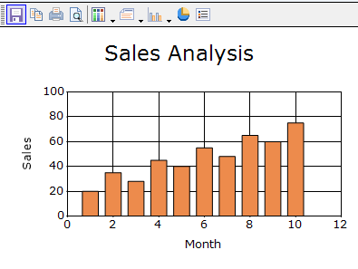
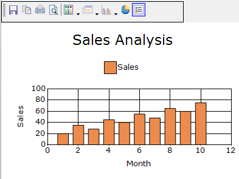
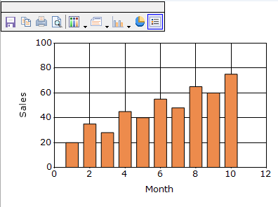
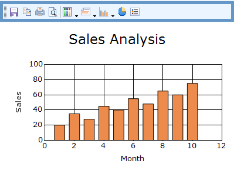
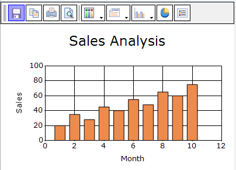
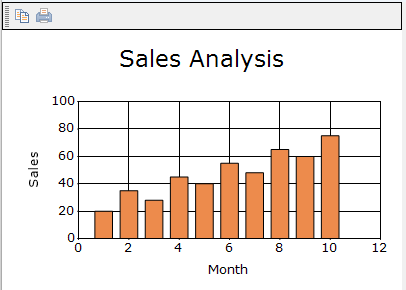
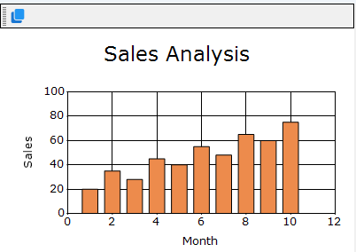
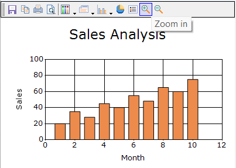
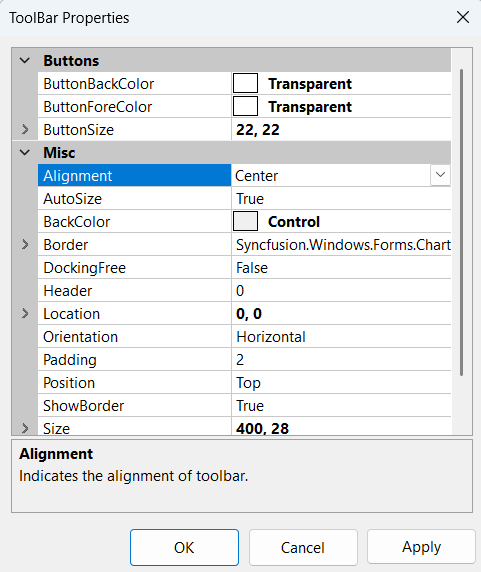
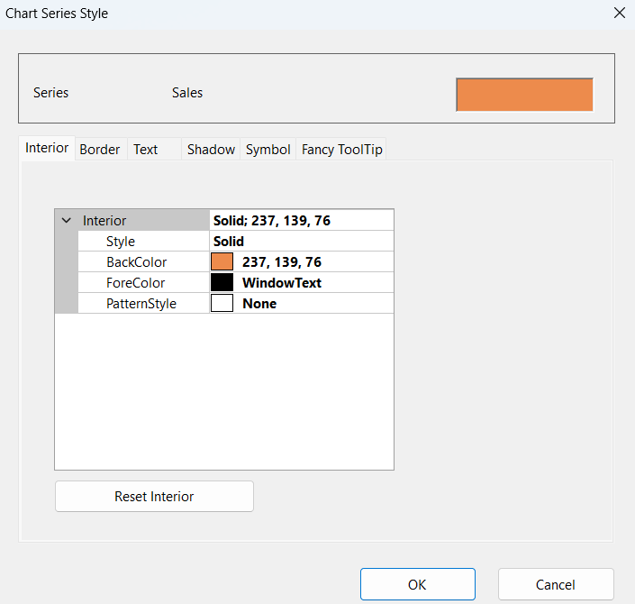

# Toolbar in Windows Forms Chart

The toolbar provides built-in commands for interacting with the Windows Forms Chart at runtime. It allows user to do the following during runtime.

- Save the chart as an image.
- Copy the image to clipboard.
- Print the chart.
- Print Preview of the Chart.
- Change the color palette of the chart.
- Affects the style of the chart.
- Change the Chart Type.
- Toggle 3D style of the Chart.
- Toggle Legend Appearance.

The toolbar commands and their functionalities are described below.

<table>
<tr>
<th>
Chart toolbar Commands</th><th>
Chart toolbar Items name</th><th>
Description</th></tr>
<tr>
<td>

{{'[Save](https://help.syncfusion.com/cr/windowsforms/Syncfusion.Windows.Forms.Chart.ChartCommands.html#Syncfusion_Windows_Forms_Chart_ChartCommands_Save)'| markdownify }}
</td><td>

{{'[ChartToolBarSaveItem](https://help.syncfusion.com/cr/windowsforms/Syncfusion.Windows.Forms.Chart.ChartToolBarSaveItem.html)'| markdownify }}
</td><td>
Using this command, user can save the chart to a specific location.</td></tr>
<tr>
<td>
{{'[Copy](https://help.syncfusion.com/cr/windowsforms/Syncfusion.Windows.Forms.Chart.ChartCommands.html#Syncfusion_Windows_Forms_Chart_ChartCommands_Copy)'| markdownify }}
</td><td>
{{'[ChartToolBarCopyItem](https://help.syncfusion.com/cr/windowsforms/Syncfusion.Windows.Forms.Chart.ChartToolBarCopyItem.html)'| markdownify }}
</td><td>
Clicking this toolbar command will copy the chart to the clipboard.</td></tr>
<tr>
<td>
{{'[Styles](https://help.syncfusion.com/cr/windowsforms/Syncfusion.Windows.Forms.Chart.ChartSeries.html#Syncfusion_Windows_Forms_Chart_ChartSeries_Styles)'| markdownify }}
</td><td>
{{'[ChartToolBarStyleItem](https://help.syncfusion.com/cr/windowsforms/Syncfusion.Windows.Forms.Chart.ChartToolBarStyleItem.html)'| markdownify }}
</td><td>
This pops up a Chart Series Style dialog window, using which various properties and chart styles can be set. </td></tr>
<tr>
<td>
{{'[Print](https://help.syncfusion.com/cr/windowsforms/Syncfusion.Windows.Forms.Chart.ChartCommands.html#Syncfusion_Windows_Forms_Chart_ChartCommands_Print)'| markdownify }}
</td><td>
{{'[ChartToolBarPrintItem](https://help.syncfusion.com/cr/windowsforms/Syncfusion.Windows.Forms.Chart.ChartToolBarPrintItem.html)'| markdownify }}
</td><td>
This toolbar command is used to print the Chart.</td></tr>
<tr>
<td>
{{'[Palette](https://help.syncfusion.com/cr/windowsforms/Syncfusion.Windows.Forms.Chart.ChartControl.html#Syncfusion_Windows_Forms_Chart_ChartControl_Palette)'| markdownify }}
</td><td>
{{'[ChartToolBarPaletteItem](https://help.syncfusion.com/cr/windowsforms/Syncfusion.Windows.Forms.Chart.ChartToolBarPaletteItem.html)'| markdownify }}
</td><td>
Palette for the series can be chosen at run time using this command. All palette colors available in the designer will be available in this Palette option also.</td></tr>
<tr>
<td>
{{'[Chart Types](https://help.syncfusion.com/windowsforms/chart/chart-types)'| markdownify }}
</td><td>
{{'[ChartToolBarTypeItem](https://help.syncfusion.com/cr/windowsforms/Syncfusion.Windows.Forms.Chart.ChartToolBarTypeItem.html)'| markdownify }}
</td><td>
Any chart type can be set for the chart at run time using this command.</td></tr>
<tr>
<td>
{{'[PrintPreview](https://help.syncfusion.com/cr/windowsforms/Syncfusion.Windows.Forms.Chart.ChartCommands.html#Syncfusion_Windows_Forms_Chart_ChartCommands_PrintPriview)'| markdownify }}
</td><td>
{{'[ChartToolBarPrintPreviewItem](https://help.syncfusion.com/cr/windowsforms/Syncfusion.Windows.Forms.Chart.ChartToolBarPrintPreviewItem.html)'| markdownify }}
</td><td>
This toolbar command is used to see a print preview of the Chart.</td></tr>
<tr>
<td>
{{'[Toggle3D](https://help.syncfusion.com/cr/windowsforms/Syncfusion.Windows.Forms.Chart.ChartCommands.html#Syncfusion_Windows_Forms_Chart_ChartCommands_Toggle3D)'| markdownify }}
</td><td>
{{'[ChartToolBarSeries3DItem](https://help.syncfusion.com/cr/windowsforms/Syncfusion.Windows.Forms.Chart.ChartToolBarSeries3DItem.html)'| markdownify }}
</td><td>
This command is used to toggle the 3D mode of the chart.</td></tr>
<tr>
<td>
{{'[Toggle Legend Appearance](https://help.syncfusion.com/cr/windowsforms/Syncfusion.Windows.Forms.Chart.ChartCommands.html#Syncfusion_Windows_Forms_Chart_ChartCommands_ShowLegend)</td><td>
'[ChartToolBarShowLegendItem](https://help.syncfusion.com/cr/windowsforms/Syncfusion.Windows.Forms.Chart.ChartToolBarShowLegendItem.html)'| markdownify }}
</td><td>
This command is used to toggle the legend appearance.</td></tr>
<tr>
<td>
Splitter</td><td>
{{'[ChartToolBarSplitter](https://help.syncfusion.com/cr/windowsforms/Syncfusion.Windows.Forms.Chart.ChartToolBarSplitter.html)'| markdownify }}
</td><td>
This item provides a logical split between the collection of commands.</td></tr>
</table>

## Show toolbar

The [ShowToolbar](https://help.syncfusion.com/cr/windowsforms/Syncfusion.Windows.Forms.Chart.ChartControl.html#Syncfusion_Windows_Forms_Chart_ChartControl_ShowToolbar) property controls whether the toolbar is displayed in the chart. The default value is `false`.

The following code example displays the chart toolbar.



chartControl.ShowToolbar = true;


chartControl.ShowToolbar = True



## Toolbar position and layout

The following properties control the position and layout of the toolbar:

- [Position](https://help.syncfusion.com/cr/windowsforms/Syncfusion.Windows.Forms.Chart.ChartToolBarInfo.html#Syncfusion_Windows_Forms_Chart_ChartToolBarInfo_Position): Specifies the toolbar docking position. The default value is [Top](https://help.syncfusion.com/cr/windowsforms/Syncfusion.Windows.Forms.Chart.ChartDock.html#Syncfusion_Windows_Forms_Chart_ChartDock_Top). The supported [ChartDock](https://help.syncfusion.com/cr/windowsforms/Syncfusion.Windows.Forms.Chart.ChartDock.html) values are:
    - [Top](https://help.syncfusion.com/cr/windowsforms/Syncfusion.Windows.Forms.Chart.ChartDock.html#Syncfusion_Windows_Forms_Chart_ChartDock_Top): Docks the toolbar to the top of the chart.
    - [Bottom](https://help.syncfusion.com/cr/windowsforms/Syncfusion.Windows.Forms.Chart.ChartDock.html#Syncfusion_Windows_Forms_Chart_ChartDock_Bottom): Docks the toolbar to the bottom of the chart.
    - [Left](https://help.syncfusion.com/cr/windowsforms/Syncfusion.Windows.Forms.Chart.ChartDock.html#Syncfusion_Windows_Forms_Chart_ChartDock_Left): Docks the toolbar to the left side of the chart.
    - [Right](https://help.syncfusion.com/cr/windowsforms/Syncfusion.Windows.Forms.Chart.ChartDock.html#Syncfusion_Windows_Forms_Chart_ChartDock_Right): Docks the toolbar to the right side of the chart.
    - [Floating](https://help.syncfusion.com/cr/windowsforms/Syncfusion.Windows.Forms.Chart.ChartDock.html#Syncfusion_Windows_Forms_Chart_ChartDock_Right): Displays the toolbar without docking it to a chart edge.
- [Alignment](https://help.syncfusion.com/cr/windowsforms/Syncfusion.Windows.Forms.Chart.ChartToolBarInfo.html#Syncfusion_Windows_Forms_Chart_ChartToolBarInfo_Alignment): Specifies the toolbar alignment within its docking area. The default value is [Center](https://help.syncfusion.com/cr/windowsforms/Syncfusion.Windows.Forms.Chart.ChartAlignment.html#Syncfusion_Windows_Forms_Chart_ChartAlignment_Center). The supported [ChartAlignment](https://help.syncfusion.com/cr/windowsforms/Syncfusion.Windows.Forms.Chart.ChartAlignment.html) values are:
    - [Near](https://help.syncfusion.com/cr/windowsforms/Syncfusion.Windows.Forms.Chart.ChartAlignment.html#Syncfusion_Windows_Forms_Chart_ChartAlignment_Near): Aligns the toolbar near the starting edge of the docking area.
    - [Center](https://help.syncfusion.com/cr/windowsforms/Syncfusion.Windows.Forms.Chart.ChartAlignment.html#Syncfusion_Windows_Forms_Chart_ChartAlignment_Center): Aligns the toolbar at the center of the docking area.
    - [Far](https://help.syncfusion.com/cr/windowsforms/Syncfusion.Windows.Forms.Chart.ChartAlignment.html#Syncfusion_Windows_Forms_Chart_ChartAlignment_Far): Aligns the toolbar near the ending edge of the docking area.
- [Orientation](https://help.syncfusion.com/cr/windowsforms/Syncfusion.Windows.Forms.Chart.ChartToolBarInfo.html#Syncfusion_Windows_Forms_Chart_ChartToolBarInfo_Orientation): Specifies the direction in which the toolbar items are arranged. The default value is [Horizontal](https://help.syncfusion.com/cr/windowsforms/Syncfusion.Windows.Forms.Chart.ChartOrientation.html#Syncfusion_Windows_Forms_Chart_ChartOrientation_Horizontal). The supported [ChartOrientation](https://help.syncfusion.com/cr/windowsforms/Syncfusion.Windows.Forms.Chart.ChartOrientation.html) values are:
    - [Horizontal](https://help.syncfusion.com/cr/windowsforms/Syncfusion.Windows.Forms.Chart.ChartOrientation.html#Syncfusion_Windows_Forms_Chart_ChartOrientation_Horizontal): Arranges the toolbar items horizontally.
    - [Vertical](https://help.syncfusion.com/cr/windowsforms/Syncfusion.Windows.Forms.Chart.ChartOrientation.html#Syncfusion_Windows_Forms_Chart_ChartOrientation_Vertical): Arranges the toolbar items vertically.
- [Location](https://help.syncfusion.com/cr/windowsforms/Syncfusion.Windows.Forms.Chart.ChartToolBarInfo.html#Syncfusion_Windows_Forms_Chart_ChartToolBarInfo_Location): Specifies the location of the toolbar. The default value is `Point.Empty`.
- [AutoSize](https://help.syncfusion.com/cr/windowsforms/Syncfusion.Windows.Forms.Chart.ChartToolBarInfo.html#Syncfusion_Windows_Forms_Chart_ChartToolBarInfo_AutoSize): Controls whether the toolbar is resized automatically. he default value is `true`.
- [Size](https://help.syncfusion.com/cr/windowsforms/Syncfusion.Windows.Forms.Chart.ChartToolBarInfo.html#Syncfusion_Windows_Forms_Chart_ChartToolBarInfo_Size): Specifies the size of the toolbar. This property is applied when [AutoSize](https://help.syncfusion.com/cr/windowsforms/Syncfusion.Windows.Forms.Chart.ChartToolBarInfo.html#Syncfusion_Windows_Forms_Chart_ChartToolBarInfo_AutoSize) is set to `false`.

The following code example customizes the position and layout of the toolbar.



chartControl.ToolBar.Position = ChartDock.Top;
chartControl.ToolBar.Alignment = ChartAlignment.Near;
chartControl.ToolBar.Orientation = ChartOrientation.Horizontal;
chartControl.ToolBar.Location = new Point(20, 20);
chartControl.ToolBar.AutoSize = false;
chartControl.ToolBar.Size = new Size(300, 35);


chartControl.ToolBar.Position = ChartDock.Top
chartControl.ToolBar.Alignment = ChartAlignment.Near
chartControl.ToolBar.Orientation = ChartOrientation.Horizontal
chartControl.ToolBar.Location = New Point(20, 20)
chartControl.ToolBar.AutoSize = False
chartControl.ToolBar.Size = New Size(300, 35)



## Toolbar docking

The following properties control the docking behavior of the toolbar:

- [Behavior](https://help.syncfusion.com/cr/windowsforms/Syncfusion.Windows.Forms.Chart.ChartToolBarInfo.html#Syncfusion_Windows_Forms_Chart_ChartToolBarInfo_Behavior): Specifies the toolbar movement and docking behavior using one of the following [ChartDockingFlags](https://help.syncfusion.com/cr/windowsforms/Syncfusion.Windows.Forms.Chart.ChartDockingFlags.html) values:
  - [All](https://help.syncfusion.com/cr/windowsforms/Syncfusion.Windows.Forms.Chart.ChartDockingFlags.html#Syncfusion_Windows_Forms_Chart_ChartDockingFlags_All): Allows the toolbar to be moved and docked.
  - [Dockable](https://help.syncfusion.com/cr/windowsforms/Syncfusion.Windows.Forms.Chart.ChartDockingFlags.html#Syncfusion_Windows_Forms_Chart_ChartDockingFlags_Dockable): Allows the toolbar to be docked.
  - [Movable](https://help.syncfusion.com/cr/windowsforms/Syncfusion.Windows.Forms.Chart.ChartDockingFlags.html#Syncfusion_Windows_Forms_Chart_ChartDockingFlags_Movable): Allows the toolbar to be moved.
  - [None](https://help.syncfusion.com/cr/windowsforms/Syncfusion.Windows.Forms.Chart.ChartDockingFlags.html#Syncfusion_Windows_Forms_Chart_ChartDockingFlags_None): Prevents the toolbar from being moved or docked.
- [DockingFree](https://help.syncfusion.com/cr/windowsforms/Syncfusion.Windows.Forms.Chart.ChartToolBarInfo.html#Syncfusion_Windows_Forms_Chart_ChartToolBarInfo_DockingFree): Controls whether the toolbar remains docked or can be placed at a free location when docking behavior is enabled. The default value is `false`.
- [ShowGrip](https://help.syncfusion.com/cr/windowsforms/Syncfusion.Windows.Forms.Chart.ChartToolBarInfo.html#Syncfusion_Windows_Forms_Chart_ChartToolBarInfo_ShowGrip): Specifies whether the toolbar grip is displayed. Users can drag the toolbar using the grip when movement is enabled. The default value is `true`.
- [Header](https://help.syncfusion.com/cr/windowsforms/Syncfusion.Windows.Forms.Chart.ChartToolBarInfo.html#Syncfusion_Windows_Forms_Chart_ChartToolBarInfo_Header): Specifies the height of the toolbar header. The default value is `0`.

The following code example customizes the toolbar docking options.



chartControl.ToolBar.Behavior = ChartDockingFlags.Dockable;
chartControl.ToolBar.DockingFree = true;
chartControl.ToolBar.ShowGrip = false;
chartControl.ToolBar.Header = 15;


chartControl.ToolBar.Behavior = ChartDockingFlags.Dockable
chartControl.ToolBar.DockingFree = True
chartControl.ToolBar.ShowGrip = False
chartControl.ToolBar.Header = 15



## Toolbar appearance

The following properties customize the appearance of the toolbar:

- [BackColor](https://help.syncfusion.com/cr/windowsforms/Syncfusion.Windows.Forms.Chart.ChartToolBarInfo.html#Syncfusion_Windows_Forms_Chart_ChartToolBarInfo_BackColor): Specifies the background color of the toolbar. The default value is `Color.Empty`.
- [Border](https://help.syncfusion.com/cr/windowsforms/Syncfusion.Windows.Forms.Chart.ChartToolBarInfo.html#Syncfusion_Windows_Forms_Chart_ChartToolBarInfo_Border): Gets the line settings used to draw the toolbar border. By default, this property is initialized with a new [LineInfo](https://help.syncfusion.com/cr/windowsforms/Syncfusion.Windows.Forms.Chart.LineInfo.html) instance.
- [ShowBorder](https://help.syncfusion.com/cr/windowsforms/Syncfusion.Windows.Forms.Chart.ChartToolBarInfo.html#Syncfusion_Windows_Forms_Chart_ChartToolBarInfo_ShowBorder): Controls whether the toolbar border is displayed. The default value is `true`.

N> The [Border](https://help.syncfusion.com/cr/windowsforms/Syncfusion.Windows.Forms.Chart.ChartToolBarInfo.html#Syncfusion_Windows_Forms_Chart_ChartToolBarInfo_Border) property is get-only. Customize its individual line settings directly.

The following code example customizes the toolbar background and border.



chartControl.ToolBar.BackColor = Color.FromArgb(235, 245, 255);
chartControl.ToolBar.ShowBorder = true;
chartControl.ToolBar.Border.ForeColor = Color.FromArgb(100, 150, 200);
chartControl.ToolBar.Border.Width = 5;


chartcontrol.ToolBar.BackColor = Color.FromArgb(235, 245, 255)
chartcontrol.ToolBar.ShowBorder = True
chartcontrol.ToolBar.Border.ForeColor = Color.FromArgb(100, 150, 200)
chartcontrol.ToolBar.Border.Width = 5



## Toolbar button appearance

The following properties customize the appearance, size, and spacing of toolbar buttons:

- [ButtonBackColor](https://help.syncfusion.com/cr/windowsforms/Syncfusion.Windows.Forms.Chart.ChartToolBarInfo.html#Syncfusion_Windows_Forms_Chart_ChartToolBarInfo_ButtonBackColor): Specifies the background color of toolbar buttons. The default value is `Color.Transparent`.
- [ButtonForeColor](https://help.syncfusion.com/cr/windowsforms/Syncfusion.Windows.Forms.Chart.ChartToolBarInfo.html#Syncfusion_Windows_Forms_Chart_ChartToolBarInfo_ButtonForeColor): Specifies the foreground color of toolbar buttons. The default value is `Color.Transparent`.
- [ButtonSize](https://help.syncfusion.com/cr/windowsforms/Syncfusion.Windows.Forms.Chart.ChartToolBarInfo.html#Syncfusion_Windows_Forms_Chart_ChartToolBarInfo_ButtonSize): Specifies the size of toolbar buttons. The default value is `22 × 22`.
- [IconPadding](https://help.syncfusion.com/cr/windowsforms/Syncfusion.Windows.Forms.Chart.ChartToolBarInfo.html#Syncfusion_Windows_Forms_Chart_ChartToolBarInfo_IconPadding): Specifies the padding around toolbar item icons. The default value is `2`.
- [Padding](https://help.syncfusion.com/cr/windowsforms/Syncfusion.Windows.Forms.Chart.ChartToolBarInfo.html#Syncfusion_Windows_Forms_Chart_ChartToolBarInfo_Padding): Specifies the padding within the toolbar. The default value is `2`.
- [Spacing](https://help.syncfusion.com/cr/windowsforms/Syncfusion.Windows.Forms.Chart.ChartToolBarInfo.html#Syncfusion_Windows_Forms_Chart_ChartToolBarInfo_Spacing): Specifies the spacing between toolbar items. The default value is `0`.

N> The [ButtonFlatStyle](https://help.syncfusion.com/cr/windowsforms/Syncfusion.Windows.Forms.Chart.ChartToolBarInfo.html#Syncfusion_Windows_Forms_Chart_ChartToolBarInfo_ButtonFlatStyle) property is obsolete and is no longer used.

The following code example customizes the toolbar buttons.



chartControl.ToolBar.ButtonBackColor = Color.White;
chartControl.ToolBar.ButtonForeColor = Color.Black;
chartControl.ToolBar.ButtonSize = new Size(28, 28);
chartControl.ToolBar.IconPadding = 4;
chartControl.ToolBar.Padding = 4;
chartControl.ToolBar.Spacing = 2;


chartControl.ToolBar.ButtonBackColor = Color.White
chartControl.ToolBar.ButtonForeColor = Color.Black
chartControl.ToolBar.ButtonSize = New Size(28, 28)
chartControl.ToolBar.IconPadding = 4
chartControl.ToolBar.Padding = 4
chartControl.ToolBar.Spacing = 2



## Default toolbar items

The [EnableDefaultItems](https://help.syncfusion.com/cr/windowsforms/Syncfusion.Windows.Forms.Chart.ChartToolBarInfo.html#Syncfusion_Windows_Forms_Chart_ChartToolBarInfo_EnableDefaultItems) property controls whether the built-in toolbar items are included in the toolbar. The default value is `true`.

The following code example disables the default toolbar items.



chartControl.ToolBar.EnableDefaultItems = false;


chartControl.ToolBar.EnableDefaultItems = False



## Customize toolbar items

The [Items](https://help.syncfusion.com/cr/windowsforms/Syncfusion.Windows.Forms.Chart.ChartToolBarInfo.html#Syncfusion_Windows_Forms_Chart_ChartToolBarInfo_Items) property gets the collection of toolbar items. By default, this property is initialized with a new [ChartToolBarItemCollection](https://help.syncfusion.com/cr/windowsforms/Syncfusion.Windows.Forms.Chart.ChartToolBarItemCollection.html) instance. Use the collection to add, remove, or arrange toolbar items.

N>
- The [Items](https://help.syncfusion.com/cr/windowsforms/Syncfusion.Windows.Forms.Chart.ChartToolBarInfo.html#Syncfusion_Windows_Forms_Chart_ChartToolBarInfo_Items) property is get-only. Modify toolbar items through the returned [ChartToolBarItemCollection](https://help.syncfusion.com/cr/windowsforms/Syncfusion.Windows.Forms.Chart.ChartToolBarItemCollection.html).
- The [Buttons](https://help.syncfusion.com/cr/windowsforms/Syncfusion.Windows.Forms.Chart.ChartToolBarInfo.html#Syncfusion_Windows_Forms_Chart_ChartToolBarInfo_Buttons) property is obsolete. Use the [Items](https://help.syncfusion.com/cr/windowsforms/Syncfusion.Windows.Forms.Chart.ChartToolBarInfo.html#Syncfusion_Windows_Forms_Chart_ChartToolBarInfo_Items) collection to add, remove, or arrange toolbar items.

The following code example adds and removes toolbar items.



chartControl.ToolBar.EnableDefaultItems = false;
chartControl.ToolBar.Items.Clear();

ChartToolBarCopyItem copyItem = new ChartToolBarCopyItem();
ChartToolBarSaveItem saveItem = new ChartToolBarSaveItem();
ChartToolBarPrintItem printItem = new ChartToolBarPrintItem();

chartControl.ToolBar.Items.Add(copyItem);
chartControl.ToolBar.Items.Add(saveItem);
chartControl.ToolBar.Items.Insert(1, printItem);
chartControl.ToolBar.Items.Remove(saveItem);


chartControl.ToolBar.EnableDefaultItems = False
chartControl.ToolBar.Items.Clear()

Dim copyItem As New ChartToolBarCopyItem()
Dim saveItem As New ChartToolBarSaveItem()
Dim printItem As New ChartToolBarPrintItem()

chartControl.ToolBar.Items.Add(copyItem)
chartControl.ToolBar.Items.Add(saveItem)
chartControl.ToolBar.Items.Insert(1, printItem)
chartControl.ToolBar.Items.Remove(saveItem)



## Toolbar item customization

The [ChartToolBarItemBase](https://help.syncfusion.com/cr/windowsforms/Syncfusion.Windows.Forms.Chart.ChartToolBarItemBase.html) and [ChartToolBarItem](https://help.syncfusion.com/cr/windowsforms/Syncfusion.Windows.Forms.Chart.ChartToolBarItem.html) classes provide the following properties to customize individual toolbar items:

- [Name](https://help.syncfusion.com/cr/windowsforms/Syncfusion.Windows.Forms.Chart.ChartToolBarItemBase.html#Syncfusion_Windows_Forms_Chart_ChartToolBarItemBase_Name): Specifies the name of the toolbar item. The default value is an `empty`.
- [Tag](https://help.syncfusion.com/cr/windowsforms/Syncfusion.Windows.Forms.Chart.ChartToolBarItemBase.html#Syncfusion_Windows_Forms_Chart_ChartToolBarItemBase_Tag): Specifies custom data associated with the toolbar item. The default value is `null`.
- [ToolTip](https://help.syncfusion.com/cr/windowsforms/Syncfusion.Windows.Forms.Chart.ChartToolBarItemBase.html#Syncfusion_Windows_Forms_Chart_ChartToolBarItemBase_ToolTip): Specifies the tooltip displayed for the toolbar item. The default value is an `empty`.
- [Image](https://help.syncfusion.com/cr/windowsforms/Syncfusion.Windows.Forms.Chart.ChartToolBarItem.html#Syncfusion_Windows_Forms_Chart_ChartToolBarItem_Image): Specifies the image displayed by the toolbar item. The default value is `null`.
- [IsCheckable](https://help.syncfusion.com/cr/windowsforms/Syncfusion.Windows.Forms.Chart.ChartToolBarItem.html#Syncfusion_Windows_Forms_Chart_ChartToolBarItem_IsCheckable): Controls whether the toolbar item can be checked. The default value is `false`.
- [Checked](https://help.syncfusion.com/cr/windowsforms/Syncfusion.Windows.Forms.Chart.ChartToolBarItem.html#Syncfusion_Windows_Forms_Chart_ChartToolBarItem_Checked): Controls whether the toolbar item is checked. The default value is `false`.

The following code example customizes a toolbar item.



ChartToolBarCopyItem copyItem = new ChartToolBarCopyItem();
copyItem.Name = "CopyChart";
copyItem.ToolTip = "Copy the chart";
copyItem.Tag = "Copy";
copyItem.IsCheckable = true;
copyItem.Checked = false;
copyItem.Image = Image.FromFile("copy.png");

chartControl.ToolBar.Items.Add(copyItem);


Dim copyItem As New ChartToolBarCopyItem()
copyItem.Name = "CopyChart"
copyItem.ToolTip = "Copy the chart"
copyItem.Tag = "Copy"
copyItem.IsCheckable = True
copyItem.Checked = False
copyItem.Image = Image.FromFile("copy.png")

chartControl.ToolBar.Items.Add(copyItem)



## Custom toolbar command

The [ChartToolBarCommandItem](https://help.syncfusion.com/cr/windowsforms/Syncfusion.Windows.Forms.Chart.ChartToolBarCommandItem.html) class creates a toolbar item associated with a chart command.

The class provides the following command-specific properties:

- [Command](https://help.syncfusion.com/cr/windowsforms/Syncfusion.Windows.Forms.Chart.ChartToolBarCommandItem.html#Syncfusion_Windows_Forms_Chart_ChartToolBarCommandItem_Command): Specifies the chart command associated with the toolbar item.
- [Parameter](https://help.syncfusion.com/cr/windowsforms/Syncfusion.Windows.Forms.Chart.ChartToolBarCommandItem.html#Syncfusion_Windows_Forms_Chart_ChartToolBarCommandItem_Parameter): Specifies the parameter passed to the chart command.

The [ChartCommands](https://help.syncfusion.com/cr/windowsforms/Syncfusion.Windows.Forms.Chart.ChartCommands.html) enum lists the commands that can be added. The following table describes those commands.

<table>
<tr>
<th>
Chart toolbar Custom Commands</th><th>
Description</th></tr>
<tr>
<td>

{{'[ZoomIn](https://help.syncfusion.com/cr/windowsforms/Syncfusion.Windows.Forms.Chart.ChartControl.html#Syncfusion_Windows_Forms_Chart_ChartControl_ZoomIn)'| markdownify }}
</td><td>
Using this command, user can zoom the chart.</td></tr>
<tr>
<td>
{{'[ZoomOut](https://help.syncfusion.com/cr/windowsforms/Syncfusion.Windows.Forms.Chart.ChartControl.html#Syncfusion_Windows_Forms_Chart_ChartControl_ZoomOut)'| markdownify }}
</td><td>
This command zooms out the chart.</td></tr>
<tr>
<td>
{{'[ResetZooming](https://help.syncfusion.com/cr/windowsforms/Syncfusion.Windows.Forms.Chart.ChartCommands.html#Syncfusion_Windows_Forms_Chart_ChartCommands_ResetZooming)'| markdownify }}
</td><td>
The zooming is reset using this command.</td></tr>
<tr>
<td>
{{'[AutoHighlight](https://help.syncfusion.com/cr/windowsforms/Syncfusion.Windows.Forms.Chart.ChartCommands.html#Syncfusion_Windows_Forms_Chart_ChartCommands_AutoHighlight)'| markdownify }}
</td><td>
This command is used to enable the auto highlight feature in the chart series.</td></tr>
<tr>
<td>
{{'[ToggleXZooming](https://help.syncfusion.com/cr/windowsforms/Syncfusion.Windows.Forms.Chart.ChartCommands.html#Syncfusion_Windows_Forms_Chart_ChartCommands_ToggleXZooming)'| markdownify }}
</td><td>
This toolbar command enables zooming in x-axis.</td></tr>
<tr>
<td>
{{'[ToggleYZooming](https://help.syncfusion.com/cr/windowsforms/Syncfusion.Windows.Forms.Chart.ChartCommands.html#Syncfusion_Windows_Forms_Chart_ChartCommands_ToggleYZooming)'| markdownify }}
</td><td>
This toolbar command enables zooming in y-axis.</td></tr>
<tr>
<td>
{{'[TogglePanning](https://help.syncfusion.com/cr/windowsforms/Syncfusion.Windows.Forms.Chart.ChartCommands.html#Syncfusion_Windows_Forms_Chart_ChartCommands_TogglePanning)'| markdownify }}
</td><td>
This command enables panning of the zoomed chart.</td></tr>
</table>

The following code example creates and adds chart command items to the toolbar. The associated command is performed when the toolbar item is selected.




ChartToolBarCommandItem zoomInItem =
    new ChartToolBarCommandItem();

zoomInItem.Command = ChartCommands.ZoomIn;
zoomInItem.ToolTip = "Zoom in";

ChartToolBarCommandItem zoomOutItem =
    new ChartToolBarCommandItem();

zoomOutItem.Command = ChartCommands.ZoomOut;
zoomOutItem.ToolTip = "Zoom out";

chartControl.ToolBar.Items.Add(zoomInItem);
chartControl.ToolBar.Items.Add(zoomOutItem);



Dim zoomInItem As New ChartToolBarCommandItem()
zoomInItem.Command = ChartCommands.ZoomIn
zoomInItem.ToolTip = "Zoom in"

Dim zoomOutItem As New ChartToolBarCommandItem()
zoomOutItem.Command = ChartCommands.ZoomOut
zoomOutItem.ToolTip = "Zoom out"

chartControl.ToolBar.Items.Add(zoomInItem)
chartControl.ToolBar.Items.Add(zoomOutItem)



## Toolbar property dialog

The [ShowDialog](https://help.syncfusion.com/cr/windowsforms/Syncfusion.Windows.Forms.Chart.ChartToolBarInfo.html#Syncfusion_Windows_Forms_Chart_ChartToolBarInfo_ShowDialog) property controls whether the toolbar property dialog is displayed when users double-click the toolbar.

The following code example enables the toolbar property dialog.



chartControl.ToolBar.ShowDialog = true;


chartControl.ToolBar.ShowDialog = True



{height:"350", width="350"}

## Chart series style dialog

The [Styles](https://help.syncfusion.com/cr/windowsforms/Syncfusion.Windows.Forms.Chart.ChartSeries.html#Syncfusion_Windows_Forms_Chart_ChartSeries_Styles) command in the toolbar opens the Chart Series Style dialog box. Use this dialog box to customize the appearance and behavior of a chart series at runtime.

The following customization options are available in the Chart Series Style dialog box:

- **Interior**: Specifies the fill color and brush settings for the series.
- **Border**: Specifies the border color, style, and width for the series.
- **Text**: Enables and customizes the series text and labels.
- **Shadow**: Enables and customizes the shadow effects applied to the series.
- **Symbol**: Specifies custom symbols for series points.
- **Fancy ToolTip**: Enables and customizes the fancy tooltip displayed for series points.

The following image shows the **Interior** tab of the Chart Series Style dialog box.

{height:"350", width="350"}

## Include toolbar in exported chart

The [IncludeInExportedChart](https://help.syncfusion.com/cr/windowsforms/Syncfusion.Windows.Forms.Chart.ChartToolBarInfo.html#Syncfusion_Windows_Forms_Chart_ChartToolBarInfo_IncludeInExportedChart) property controls whether the toolbar is included in exported chart content.

The [ShowToolbarInImage](https://help.syncfusion.com/cr/windowsforms/Syncfusion.Windows.Forms.Chart.ChartControl.html#Syncfusion_Windows_Forms_Chart_ChartControl_ShowToolbarInImage) property controls whether the toolbar is displayed when the chart is saved as an image.

n> You can display or hide a toolbar while printing a Chart. See Printing And Print Preview topic for more details.

The following code example includes the toolbar in an exported chart image.



chartControl.ToolBar.IncludeInExportedChart = false;
chartControl.ShowToolbarInImage = false;


chartControl.ToolBar.IncludeInExportedChart = False
chartControl.ShowToolbarInImage = False



## See also

- [How to work with WinForms Chart ToolBars](https://support.syncfusion.com/kb/article/1168/how-to-work-with-winforms-chart-toolbars)
- [How to copy the chart to clipboard](https://support.syncfusion.com/kb/article/8319/how-to-copy-the-chart-to-clipboard)
- [How to customize toolbar items in WinForms Chart control](https://support.syncfusion.com/kb/article/1171/how-to-customize-toolbar-items-in-winforms-chart-control)