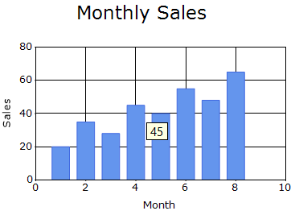
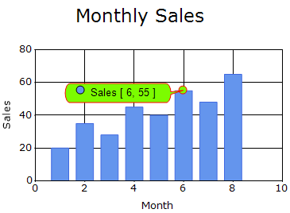
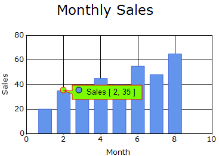
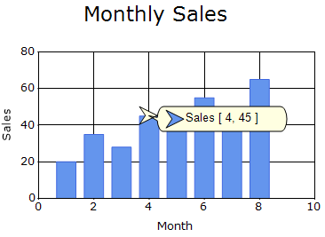

# Tooltips in Windows Forms Chart

## Tooltips

Tooltips display additional information when the mouse pointer hovers over chart elements, including the chart area, empty chart regions, and series data points.

### Enable tooltips

The [ShowToolTips](https://help.syncfusion.com/cr/windowsforms/Syncfusion.Windows.Forms.Chart.ChartControl.html#Syncfusion_Windows_Forms_Chart_ChartControl_ShowToolTips) property controls whether tooltips are displayed in the chart. The default value is **false**.



chartControl.ShowToolTips = true;


chartControl.ShowToolTips = True



## Chart tooltip

The [ChartToolTip](https://help.syncfusion.com/cr/windowsforms/Syncfusion.Windows.Forms.Chart.ChartControl.html#Syncfusion_Windows_Forms_Chart_ChartControl_ChartToolTip) property specifies the tooltip displayed when the mouse pointer hovers over the Chart control without being positioned over another chart element. The default value is **Empty**.



chartControl.ChartToolTip = "Sales chart";


chartControl.ChartToolTip = "Sales chart"



## Chart-area tooltip

The [ChartAreaToolTip](https://help.syncfusion.com/cr/windowsforms/Syncfusion.Windows.Forms.Chart.ChartArea.html#Syncfusion_Windows_Forms_Chart_ChartArea_ChartAreaToolTip) property specifies the tooltip displayed when the mouse pointer hovers over the chart plotting area. The default value is **Empty**.



chartControl.ChartArea.ChartAreaToolTip = "Sales data area";


chartControl.ChartArea.ChartAreaToolTip = "Sales data area"



## Series-point tooltip

The [PointsToolTipFormat](https://help.syncfusion.com/cr/windowsforms/Syncfusion.Windows.Forms.Chart.ChartSeries.html#Syncfusion_Windows_Forms_Chart_ChartSeries_PointsToolTipFormat) property specifies the information displayed when the mouse pointer hovers over a series data point. By default, the tooltip displays the first Y-value using the `{4}` placeholder.

The following placeholders can be used:

- `{0}`: Displays the series name.
- `{1}`: Displays the tooltip defined in the series style.
- `{2}`: Displays the tooltip defined for an individual data point.
- `{3}`: Displays the X-value.
- `{4}`: Displays the first Y-value. This is the default tooltip content.
- `{5}`: Displays the second Y-value, when available.
- `{6}` and subsequent placeholders: Display additional Y-values, when available.



chartControl.Series[0].PointsToolTipFormat =
    "{0} - X: {3}, Y: {4}";


chartControl.Series(0).PointsToolTipFormat =
    "{0} - X: {3}, Y: {4}"



## Tooltip appearance

The [Tooltip](https://help.syncfusion.com/cr/windowsforms/Syncfusion.Windows.Forms.Chart.ChartTooltip.html) property provides options to customize the appearance of standard chart tooltips.

The `ChartTooltip` class provides the following properties:

- [BackgroundColor](https://help.syncfusion.com/cr/windowsforms/Syncfusion.Windows.Forms.Chart.ChartTooltip.html#Syncfusion_Windows_Forms_Chart_ChartTooltip_BackgroundColor): Specifies the background brush of the tooltip. The API does not specify a default value.
- [BackgroundImage](https://help.syncfusion.com/cr/windowsforms/Syncfusion.Windows.Forms.Chart.ChartTooltip.html#Syncfusion_Windows_Forms_Chart_ChartTooltip_BackgroundImage): Specifies the background image of the tooltip. The API does not specify a default value.
- [BorderStyle](https://help.syncfusion.com/cr/windowsforms/Syncfusion.Windows.Forms.Chart.ChartTooltip.html#Syncfusion_Windows_Forms_Chart_ChartTooltip_BorderStyle): Specifies the border style of the tooltip. The API does not specify a default value.
- [Font](https://help.syncfusion.com/cr/windowsforms/Syncfusion.Windows.Forms.Chart.ChartTooltip.html#Syncfusion_Windows_Forms_Chart_ChartTooltip_Font): Specifies the font used to render the tooltip text. The API does not specify a default value.
- [ForeColor](https://help.syncfusion.com/cr/windowsforms/Syncfusion.Windows.Forms.Chart.ChartTooltip.html#Syncfusion_Windows_Forms_Chart_ChartTooltip_ForeColor): Specifies the color of the tooltip text. The API does not specify a default value.
- [Padding](hhttps://help.syncfusion.com/cr/windowsforms/Syncfusion.Windows.Forms.Chart.ChartTooltip.html#Syncfusion_Windows_Forms_Chart_ChartTooltip_Padding): Specifies the space between the tooltip content and its edges. The API does not specify a default value.



chartControl.Tooltip.BackgroundColor =
    new BrushInfo(Color.White);
chartControl.Tooltip.BorderStyle =
    BorderStyle.FixedSingle;
chartControl.Tooltip.ForeColor =
    Color.Black;
chartControl.Tooltip.Font =
    new Font("Segoe UI", 10);
chartControl.Tooltip.Padding =
    new Padding(4);


chartControl.Tooltip.BackgroundColor =
    New BrushInfo(Color.White)
chartControl.Tooltip.BorderStyle =
    BorderStyle.FixedSingle
chartControl.Tooltip.ForeColor =
    Color.Black
chartControl.Tooltip.Font =
    New Font("Segoe UI", 10)
chartControl.Tooltip.Padding =
    New Padding(4)



## Fancy ToolTip

A Fancy ToolTip displays data-point information in a balloon-style tooltip. The [FancyToolTip](https://help.syncfusion.com/cr/windowsforms/Syncfusion.Windows.Forms.Chart.ChartFancyToolTipInfo.html) property provides options to customize the background color, text color, border, shape, and symbol.

### Enable Fancy ToolTip

The [Visible](https://help.syncfusion.com/cr/windowsforms/Syncfusion.Windows.Forms.Chart.ChartFancyToolTipInfo.html#Syncfusion_Windows_Forms_Chart_ChartFancyToolTipInfo_Visible) property controls whether the Fancy ToolTip is displayed for a chart series. The default value is **false**.



chartControl.Series[0].FancyToolTip.Visible = true;


chartControl.Series(0).FancyToolTip.Visible = True



### Fancy ToolTip appearance

The [BackColor](https://help.syncfusion.com/cr/windowsforms/Syncfusion.Windows.Forms.Chart.ChartFancyToolTipInfo.html#Syncfusion_Windows_Forms_Chart_ChartFancyToolTipInfo_BackColor), [ForeColor](https://help.syncfusion.com/cr/windowsforms/Syncfusion.Windows.Forms.Chart.ChartFancyToolTipInfo.html#Syncfusion_Windows_Forms_Chart_ChartFancyToolTipInfo_ForeColor), and [Border](https://help.syncfusion.com/cr/windowsforms/Syncfusion.Windows.Forms.Chart.ChartFancyToolTipInfo.html#Syncfusion_Windows_Forms_Chart_ChartFancyToolTipInfo_Border) properties customize the colors and border of the Fancy ToolTip.

The default value of `BackColor` is **Color.Info**, and the default value of `ForeColor` is **Color.Black**. The API does not specify a default value for `Border`.



chartControl.Series[0].FancyToolTip.BackColor =
    Color.LawnGreen;
chartControl.Series[0].FancyToolTip.ForeColor =
    Color.Black;
chartControl.Series[0].FancyToolTip.Border.ForeColor =
    Color.Red;
chartControl.Series[0].FancyToolTip.Border.Width = 1;


chartControl.Series(0).FancyToolTip.BackColor =
    Color.LawnGreen
chartControl.Series(0).FancyToolTip.ForeColor =
    Color.Black
chartControl.Series(0).FancyToolTip.Border.ForeColor =
    Color.Red
chartControl.Series(0).FancyToolTip.Border.Width = 1



### Fancy ToolTip style

The [Style](https://help.syncfusion.com/cr/windowsforms/Syncfusion.Windows.Forms.Chart.ChartFancyToolTipInfo.html#Syncfusion_Windows_Forms_Chart_ChartFancyToolTipInfo_Style) property specifies the shape used to render the Fancy ToolTip. The default value is **SmoothRectangle**.

The supported styles are defined in the [MarkerStyle](https://help.syncfusion.com/cr/windowsforms/Syncfusion.Windows.Forms.Chart.MarkerStyle.html) enumeration and include **Ellipse**, **Rectangle**, and **SmoothRectangle**.



chartControl.Series[0].FancyToolTip.Style =
    MarkerStyle.Rectangle;


chartControl.Series(0).FancyToolTip.Style =
    MarkerStyle.Rectangle



### Fancy ToolTip symbol

The symbol displayed in the Fancy ToolTip can be customized using the following properties:

- [Symbol](https://help.syncfusion.com/cr/windowsforms/Syncfusion.Windows.Forms.Chart.ChartFancyToolTipInfo.html#Syncfusion_Windows_Forms_Chart_ChartFancyToolTipInfo_Symbol): Specifies the shape of the symbol. The default value is **Circle**.
- [SymbolSize](https://help.syncfusion.com/cr/windowsforms/Syncfusion.Windows.Forms.Chart.ChartFancyToolTipInfo.html#Syncfusion_Windows_Forms_Chart_ChartFancyToolTipInfo_SymbolSize): Specifies the width and height of the symbol. The default value is **10 × 10**.
- [ResizeInsideSymbol](https://help.syncfusion.com/cr/windowsforms/Syncfusion.Windows.Forms.Chart.ChartFancyToolTipInfo.html#Syncfusion_Windows_Forms_Chart_ChartFancyToolTipInfo_ResizeInsideSymbol): Controls whether the inner portion of the Fancy ToolTip symbol is resized according to the configured symbol size. The default value is **false**.

The `Symbol` property supports the following [ChartSymbolShape](https://help.syncfusion.com/cr/windowsforms/Syncfusion.Windows.Forms.Chart.ChartSymbolShape.html) values:

- **Arrow**: Displays an arrow.
- **Circle**: Displays a circle.
- **Cross**: Displays a cross.
- **Diamond**: Displays a diamond.
- **Hexagon**: Displays a hexagon.
- **HorizLine**: Displays a horizontal line.
- **Image**: Represents an image-based symbol.
- **InvertedArrow**: Displays an inverted arrow.
- **InvertedTriangle**: Displays an inverted triangle.
- **None**: Hides the symbol.
- **Pentagon**: Displays a pentagon.
- **Square**: Displays a square.
- **Star**: Displays a star.
- **Triangle**: Displays a triangle.
- **VertLine**: Displays a vertical line.



chartControl.Series[0].FancyToolTip.Symbol =
    ChartSymbolShape.Arrow;
chartControl.Series[0].FancyToolTip.SymbolSize =
    new Size(20, 20);
chartControl.Series[0].FancyToolTip.ResizeInsideSymbol =
    true;


chartControl.Series(0).FancyToolTip.Symbol =
    ChartSymbolShape.Arrow
chartControl.Series(0).FancyToolTip.SymbolSize =
    New Size(20, 20)
chartControl.Series(0).FancyToolTip.ResizeInsideSymbol =
    True



### Additional Fancy ToolTip properties

The following properties provide additional options to customize the position and appearance of the Fancy ToolTip:

- [Alignment](https://help.syncfusion.com/cr/windowsforms/Syncfusion.Windows.Forms.Chart.ChartFancyToolTipInfo.html#Syncfusion_Windows_Forms_Chart_ChartFancyToolTipInfo_Alignment): Specifies the alignment of the Fancy ToolTip pointer. The default value is **Left**.
- [Angle](https://help.syncfusion.com/cr/windowsforms/Syncfusion.Windows.Forms.Chart.ChartFancyToolTipInfo.html#Syncfusion_Windows_Forms_Chart_ChartFancyToolTipInfo_Angle): Specifies the angle of the pointer displayed with the Fancy ToolTip. The default value is **15f**.
- [CheckLocation](https://help.syncfusion.com/cr/windowsforms/Syncfusion.Windows.Forms.Chart.ChartFancyToolTipInfo.html#Syncfusion_Windows_Forms_Chart_ChartFancyToolTipInfo_CheckLocation): Controls whether the Fancy ToolTip is automatically repositioned when it is close to the chart boundary. The default value is **true**.
- [Font](https://help.syncfusion.com/cr/windowsforms/Syncfusion.Windows.Forms.Chart.ChartFancyToolTipInfo.html#Syncfusion_Windows_Forms_Chart_ChartFancyToolTipInfo_Font): Specifies the font used to display the Fancy ToolTip text. The API does not specify a default value.
- [Spacing](https://help.syncfusion.com/cr/windowsforms/Syncfusion.Windows.Forms.Chart.ChartFancyToolTipInfo.html#Syncfusion_Windows_Forms_Chart_ChartFancyToolTipInfo_Spacing): Specifies the space between the Fancy ToolTip border and its text. The default value is **4f**.
- [ToTarget](https://help.syncfusion.com/cr/windowsforms/Syncfusion.Windows.Forms.Chart.ChartFancyToolTipInfo.html#Syncfusion_Windows_Forms_Chart_ChartFancyToolTipInfo_ToTarget): Specifies the distance between the Fancy ToolTip and its target data point. The default value is **20f**.



chartControl.Series[0].FancyToolTip.Alignment =
    TabAlignment.Top;
chartControl.Series[0].FancyToolTip.Angle = 20f;
chartControl.Series[0].FancyToolTip.CheckLocation = true;
chartControl.Series[0].FancyToolTip.Font =
    new Font("Segoe UI", 10);
chartControl.Series[0].FancyToolTip.Spacing = 6f;
chartControl.Series[0].FancyToolTip.ToTarget = 25f;


chartControl.Series(0).FancyToolTip.Alignment =
    TabAlignment.Top
chartControl.Series(0).FancyToolTip.Angle = 20.0F
chartControl.Series(0).FancyToolTip.CheckLocation = True
chartControl.Series(0).FancyToolTip.Font =
    New Font("Segoe UI", 10)
chartControl.Series(0).FancyToolTip.Spacing = 6.0F
chartControl.Series(0).FancyToolTip.ToTarget = 25.0F



## See also

- [How to display tooltips in WinForms Chart](https://support.syncfusion.com/kb/article/1178/how-to-display-winforms-chart-tooltips)
