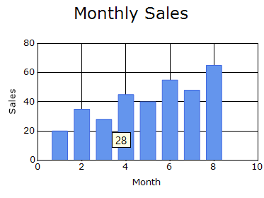
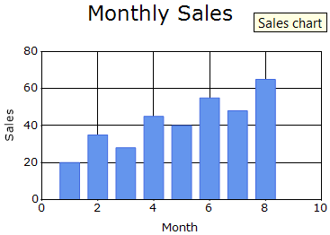
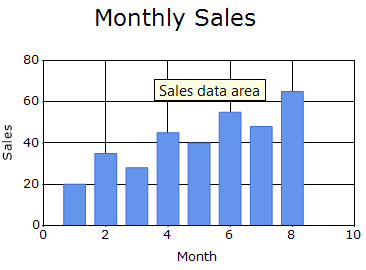
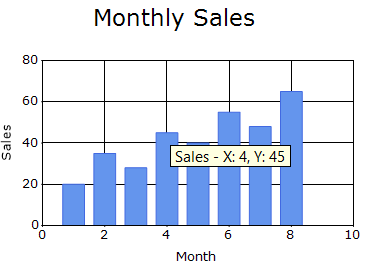
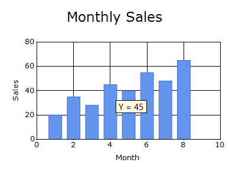
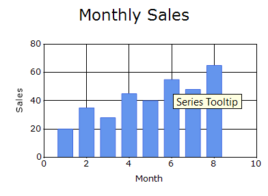
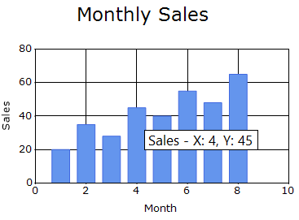
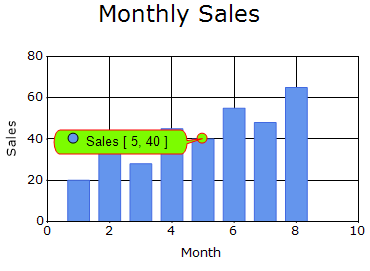

# Tooltips in Windows Forms Chart

Tooltips display information when the mouse pointer hovers over chart elements, including the chart area, empty chart regions, and series data points.

## Show tooltips

The [ShowToolTips](https://help.syncfusion.com/cr/windowsforms/Syncfusion.Windows.Forms.Chart.ChartControl.html#Syncfusion_Windows_Forms_Chart_ChartControl_ShowToolTips) property controls whether tooltips are displayed in the chart. The default value is `false`.



chartControl.ShowToolTips = true;


chartControl.ShowToolTips = True



## Chart tooltip

The [ChartToolTip](https://help.syncfusion.com/cr/windowsforms/Syncfusion.Windows.Forms.Chart.ChartControl.html#Syncfusion_Windows_Forms_Chart_ChartControl_ChartToolTip) property specifies the tooltip displayed when the mouse pointer hovers over the Chart control. The default value is `Empty`.



chartControl.ChartToolTip = "Sales chart";


chartControl.ChartToolTip = "Sales chart"



## Chart area tooltip

The [ChartAreaToolTip](https://help.syncfusion.com/cr/windowsforms/Syncfusion.Windows.Forms.Chart.ChartArea.html#Syncfusion_Windows_Forms_Chart_ChartArea_ChartAreaToolTip) property specifies the tooltip displayed when the mouse pointer hovers over the chart plotting area. The default value is `Empty`.



chartControl.ChartArea.ChartAreaToolTip = "Sales data area";


chartControl.ChartArea.ChartAreaToolTip = "Sales data area"



## Series tooltip format

The [SeriesToolTipFormat](https://help.syncfusion.com/cr/windowsforms/Syncfusion.Windows.Forms.Chart.ChartSeries.html#Syncfusion_Windows_Forms_Chart_ChartSeries_SeriesToolTipFormat) property specifies the format used to display the series tooltip. The default value is `{0}`.

The following placeholders can be used:

- `{0}`: Displays the series name.
- `{1}`: Displays the tooltip text defined in the series style.

The following code example sets the series tooltip format to display the series name.



chartControl.Series[0].SeriesToolTipFormat = "{0}";


chartControl.Series[0].SeriesToolTipFormat = "{0}"



## Points tooltip format

The [PointsToolTipFormat](https://help.syncfusion.com/cr/windowsforms/Syncfusion.Windows.Forms.Chart.ChartSeries.html#Syncfusion_Windows_Forms_Chart_ChartSeries_PointsToolTipFormat) property specifies the format of the tooltip displayed when the mouse pointer hovers over a data point in the series. The default value is `"{4}"`, which displays the first Y-value of the data point.

The following placeholders can be used:

- `{0}`: Displays the series name.
- `{1}`: Displays the tooltip text defined in the series style.
- `{2}`: Displays the tooltip text defined for an individual data point.
- `{3}`: Displays the X-value of the data point.
- `{4}`: Displays the first Y-value of the data point.
- `{5}`: Displays the second Y-value, when available.
- `{6}` and subsequent placeholders: Display additional Y-values, when available.

The following code example displays the series name, X-value, and first Y-value in the series-point tooltip.



chartControl.Series[0].PointsToolTipFormat = "{0} - X: {3}, Y: {4}";


chartControl.Series(0).PointsToolTipFormat = "{0} - X: {3}, Y: {4}"



### Tooltip format

The [ToolTipFormat](https://help.syncfusion.com/cr/windowsforms/Syncfusion.Windows.Forms.Chart.ChartStyleInfo.html#Syncfusion_Windows_Forms_Chart_ChartStyleInfo_ToolTipFormat) property specifies the tooltip format associated with a series or an individual data point. The default value is an `Empty`.

The format can contain `{0}` as a placeholder for the Y-value.

The following code example demonstrates how to customize the tooltip format for a series or an individual data point.



chartControl.Series[0].ToolTipFormat = "Y = {0}";


chartControl.Series(0).ToolTipFormat = "Y = {0}"



### Series tooltip

The [ToolTip](https://help.syncfusion.com/cr/windowsforms/Syncfusion.Windows.Forms.Chart.ChartStyleInfo.html#Syncfusion_Windows_Forms_Chart_ChartStyleInfo_ToolTip) property of the series style specifies the tooltip text displayed for the corresponding series. The default value is an `Empty`.

The following code example assigns tooltip text to the series style.



chartControl.Series[0].PointsToolTipFormat = "{1}";
chartControl.Series[0].Style.ToolTip = "Series Tooltip";


chartControl.Series[0].PointsToolTipFormat = "{1}"
chartControl.Series[0].Style.ToolTip = "Series Tooltip"



## Tooltip appearance

The [Tooltip](https://help.syncfusion.com/cr/windowsforms/Syncfusion.Windows.Forms.Chart.ChartControl.html#Syncfusion_Windows_Forms_Chart_ChartControl_Tooltip) property provides options to customize the appearance of chart tooltips. By default, the property is initialized with a [ChartTooltip](https://help.syncfusion.com/cr/windowsforms/Syncfusion.UI.Xaml.Charts.ChartTooltip.html) instance.

The following code example demonstrates how to customize chart tooltips.




chartControl.Tooltip.BackgroundColor = new BrushInfo(Color.White);
chartControl.Tooltip.BorderStyle = BorderStyle.FixedSingle;
chartControl.Tooltip.ForeColor = Color.Black;
chartControl.Tooltip.Font = new Font("Segoe UI", 10);
chartControl.Tooltip.Padding = new Padding(4);




chartControl.Tooltip.BackgroundColor = New BrushInfo(Color.White)
chartControl.Tooltip.BorderStyle = BorderStyle.FixedSingle
chartControl.Tooltip.ForeColor = Color.Black
chartControl.Tooltip.Font = New Font("Segoe UI", 10)
chartControl.Tooltip.Padding = New Padding(4)




## Fancy tooltip

The [FancyToolTip](https://help.syncfusion.com/cr/windowsforms/Syncfusion.Windows.Forms.Chart.ChartSeries.html#Syncfusion_Windows_Forms_Chart_ChartSeries_FancyToolTip) property provides options to customize the fancy tooltip displayed when the mouse pointer hovers over a data point. By default, the property is initialized with a [ChartFancyToolTipInfo](https://help.syncfusion.com/cr/windowsforms/Syncfusion.Windows.Forms.Chart.ChartFancyToolTipInfo.html) instance.

The following properties are available in the `ChartFancyToolTipInfo` class to customize the appearance of the fancy tooltip:

- [Alignment](https://help.syncfusion.com/cr/windowsforms/Syncfusion.Windows.Forms.Chart.ChartFancyToolTipInfo.html#Syncfusion_Windows_Forms_Chart_ChartFancyToolTipInfo_Alignment): Indicates the alignment of the marker relative to the fancy tooltip.
- [Angle](https://help.syncfusion.com/cr/windowsforms/Syncfusion.Windows.Forms.Chart.ChartFancyToolTipInfo.html#Syncfusion_Windows_Forms_Chart_ChartFancyToolTipInfo_Angle): Specifies the angle of the arrow in the fancy tooltip.
- [BackColor](https://help.syncfusion.com/cr/windowsforms/Syncfusion.Windows.Forms.Chart.ChartFancyToolTipInfo.html#Syncfusion_Windows_Forms_Chart_ChartFancyToolTipInfo_BackColor): Specifies the background color of the fancy tooltip.
- [Border](https://help.syncfusion.com/cr/windowsforms/Syncfusion.Windows.Forms.Chart.ChartFancyToolTipInfo.html#Syncfusion_Windows_Forms_Chart_ChartFancyToolTipInfo_Border): Provides customization options for the tooltip border, including color, width, and style.
- [CheckLocation](https://help.syncfusion.com/cr/windowsforms/Syncfusion.Windows.Forms.Chart.ChartFancyToolTipInfo.html#Syncfusion_Windows_Forms_Chart_ChartFancyToolTipInfo_CheckLocation): Specifies whether the tooltip should auto align when shown for data points close to the chart border.
- [Font](https://help.syncfusion.com/cr/windowsforms/Syncfusion.Windows.Forms.Chart.ChartFancyToolTipInfo.html#Syncfusion_Windows_Forms_Chart_ChartFancyToolTipInfo_Font): Specifies the font used to render the tooltip text.
- [ForeColor](https://help.syncfusion.com/cr/windowsforms/Syncfusion.Windows.Forms.Chart.ChartFancyToolTipInfo.html#Syncfusion_Windows_Forms_Chart_ChartFancyToolTipInfo_ForeColor): Specifies the color of the tooltip text.
- [ResizeInsideSymbol](https://help.syncfusion.com/cr/windowsforms/Syncfusion.Windows.Forms.Chart.ChartFancyToolTipInfo.html#Syncfusion_Windows_Forms_Chart_ChartFancyToolTipInfo_ResizeInsideSymbol): Controls whether the inner portion of the fancy tooltip symbol is resized.
- [Spacing](https://help.syncfusion.com/cr/windowsforms/Syncfusion.Windows.Forms.Chart.ChartFancyToolTipInfo.html#Syncfusion_Windows_Forms_Chart_ChartFancyToolTipInfo_Spacing): Specifies the spacing between the tooltip text and its border.
- [Style](https://help.syncfusion.com/cr/windowsforms/Syncfusion.Windows.Forms.Chart.ChartFancyToolTipInfo.html#Syncfusion_Windows_Forms_Chart_ChartFancyToolTipInfo_Style): Specifies the marker style of the fancy tooltip.
- [Symbol](https://help.syncfusion.com/cr/windowsforms/Syncfusion.Windows.Forms.Chart.ChartFancyToolTipInfo.html#Syncfusion_Windows_Forms_Chart_ChartFancyToolTipInfo_Symbol): Specifies the symbol shape used in the fancy tooltip.
- [SymbolColor](https://help.syncfusion.com/cr/windowsforms/Syncfusion.Windows.Forms.Chart.ChartFancyToolTipInfo.html#Syncfusion_Windows_Forms_Chart_ChartFancyToolTipInfo_SymbolColor): Specifies the inner color of the fancy tooltip symbol.
- [SymbolSize](https://help.syncfusion.com/cr/windowsforms/Syncfusion.Windows.Forms.Chart.ChartFancyToolTipInfo.html#Syncfusion_Windows_Forms_Chart_ChartFancyToolTipInfo_SymbolSize): Specifies the size of the fancy tooltip symbol.
- [ToTarget](https://help.syncfusion.com/cr/windowsforms/Syncfusion.Windows.Forms.Chart.ChartFancyToolTipInfo.html#Syncfusion_Windows_Forms_Chart_ChartFancyToolTipInfo_ToTarget): Specifies the distance between the fancy tooltip and its target.
- [Visible](https://help.syncfusion.com/cr/windowsforms/Syncfusion.Windows.Forms.Chart.ChartFancyToolTipInfo.html#Syncfusion_Windows_Forms_Chart_ChartFancyToolTipInfo_Visible): Controls whether the fancy tooltip is displayed.

N> To display the fancy tooltip, set the [Visible](https://help.syncfusion.com/cr/windowsforms/Syncfusion.Windows.Forms.Chart.ChartFancyToolTipInfo.html#Syncfusion_Windows_Forms_Chart_ChartFancyToolTipInfo_Visible) property to `true`. The default value is `false`.

The following code example demonstrates how to customize the fancy tooltip.




chartControl.Series[0].FancyToolTip.Visible = true;
chartControl.Series[0].FancyToolTip.BackColor = Color.LawnGreen;
chartControl.Series[0].FancyToolTip.ForeColor =  Color.Black;
chartControl.Series[0].FancyToolTip.Border.ForeColor = Color.Red;
chartControl.Series[0].FancyToolTip.Border.Width = 1;




chartControl.Series(0).FancyToolTip.Visible = True
chartControl.Series(0).FancyToolTip.BackColor = Color.LawnGreen
chartControl.Series(0).FancyToolTip.ForeColor = Color.Black
chartControl.Series(0).FancyToolTip.Border.ForeColor = Color.Red
chartControl.Series(0).FancyToolTip.Border.Width = 1




## See also

- [How to display tooltip over Histogram Chart columns](https://help.syncfusion.com/windowsforms/chart/faq/how-to-display-custom-tooltip-over-histogram-chart)
- [How to display tooltips in WinForms Chart](https://support.syncfusion.com/kb/article/1178/how-to-display-winforms-chart-tooltips)
- [How to display fancytooltips in WinForms Chart](https://support.syncfusion.com/kb/article/1176/how-to-display-fancytooltips-in-winforms-chart)
- [How to format tooltips in WinForms Chart series?](https://support.syncfusion.com/kb/article/1226/how-to-format-tooltips-in-winforms-chart-series)