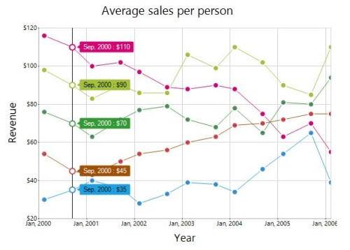

# Trackball in Windows Forms Chart

## Trackball

The [ChartTrackball](https://help.syncfusion.com/cr/windowsforms/Syncfusion.Windows.Forms.Chart.ChartTrackball.html) displays information about the data point close to the current mouse position. The closest point can also be highlighted with a symbol or marker. The x values of an axis are determined from the position of the vertical line of the axis, and y values are determined from the points touching the vertical line in the series.

### Enable trackball

The [Visible](https://help.syncfusion.com/cr/windowsforms/Syncfusion.Windows.Forms.Chart.ChartCrosshair.html#Syncfusion_Windows_Forms_Chart_ChartCrosshair_Visible) property controls whether the Trackball is displayed in the chart.



chartControl.Trackball.Visible = true;


chartControl.Trackball.Visible = True



Move the mouse pointer across the chart area to display information about the closest data point.

## Trackball tooltip

The [Tooltip](https://help.syncfusion.com/cr/windowsforms/Syncfusion.Windows.Forms.Chart.ChartTrackball.html#Syncfusion_Windows_Forms_Chart_ChartTrackball_Tooltip) property provides options to customize the tooltip displayed for the data point closest to the current mouse position.

### Text format

The [TextFormat](https://help.syncfusion.com/cr/windowsforms/Syncfusion.Windows.Forms.Chart.TrackballTooltip.html#Syncfusion_Windows_Forms_Chart_TrackballTooltip_TextFormat) property specifies the format used to display the X-value and Y-value of the data point in the Trackball tooltip.

The following placeholders can be used:

- `{1}`: Represents the X-value of the data point.
- `{2}`: Represents the Y-value of the data point.



chartControl.Trackball.Tooltip.TextFormat = "{1} : {2}";


chartControl.Trackball.Tooltip.TextFormat = "{1} : {2}"



### X-value format

The [XValueFormat](https://help.syncfusion.com/cr/windowsforms/Syncfusion.Windows.Forms.Chart.TrackballTooltip.html#Syncfusion_Windows_Forms_Chart_TrackballTooltip_XValueFormat) property specifies the format applied to X-values in the Trackball tooltip.

For an X-axis containing `DateTime` values, a standard date-and-time format can be used.



chartControl.PrimaryXAxis.ValueType = ChartValueType.DateTime;
chartControl.Trackball.Tooltip.XValueFormat = "MMM, yyyy";


chartControl.PrimaryXAxis.ValueType = ChartValueType.DateTime
chartControl.Trackball.Tooltip.XValueFormat = "MMM, yyyy"



N> Date-and-time formats such as `MMM, yyyy` are applicable when the X-axis contains `DateTime` values.

### Y-value format

The [YValueFormat](https://help.syncfusion.com/cr/windowsforms/Syncfusion.Windows.Forms.Chart.TrackballTooltip.html#Syncfusion_Windows_Forms_Chart_TrackballTooltip_YValueFormat) property specifies the numeric format applied to Y-values in the Trackball tooltip.



chartControl.Trackball.Tooltip.YValueFormat = "n0";


chartControl.Trackball.Tooltip.YValueFormat = "n0"



### Corner radius

The [CornerRadius](https://help.syncfusion.com/cr/windowsforms/Syncfusion.Windows.Forms.Chart.TrackballTooltip.html#Syncfusion_Windows_Forms_Chart_TrackballTooltip_CornerRadius) property specifies the radius used to render rounded corners for the Trackball tooltip.



chartControl.Trackball.Tooltip.CornerRadius = 3;


chartControl.Trackball.Tooltip.CornerRadius = 3



### Border width

The [Border](https://help.syncfusion.com/cr/windowsforms/Syncfusion.Windows.Forms.Chart.TrackballTooltip.html#Syncfusion_Windows_Forms_Chart_TrackballTooltip_Border) property provides access to the Trackball tooltip border settings, including its width, color, and style.



chartControl.Trackball.Tooltip.Border.Width = 1;
chartControl.Trackball.Tooltip.Border.Color = Color.Gray;


chartControl.Trackball.Tooltip.Border.Width = 1
chartControl.Trackball.Tooltip.Border.Color = Color.Gray



### Tooltip appearance

The [Interior](https://help.syncfusion.com/cr/windowsforms/Syncfusion.Windows.Forms.Chart.TrackballTooltip.html#Syncfusion_Windows_Forms_Chart_TrackballTooltip_Interior) and [TextColor](https://help.syncfusion.com/cr/windowsforms/Syncfusion.Windows.Forms.Chart.TrackballTooltip.html#Syncfusion_Windows_Forms_Chart_TrackballTooltip_TextColor) properties customize the background and text colors of the Trackball tooltip.



chartControl.Trackball.Tooltip.Interior =
    new BrushInfo(Color.White);
chartControl.Trackball.Tooltip.TextColor = Color.Black;


chartControl.Trackball.Tooltip.Interior =
    New BrushInfo(Color.White)
chartControl.Trackball.Tooltip.TextColor = Color.Black



## Display mode

The [DisplayMode](https://help.syncfusion.com/cr/windowsforms/Syncfusion.Windows.Forms.Chart.ChartTrackball.html#Syncfusion_Windows_Forms_Chart_ChartTrackball_DisplayMode) property specifies how Trackball tooltips are displayed when the chart contains multiple series.

The supported values are defined in the [TrackballTooltipDisplayMode](https://help.syncfusion.com/cr/windowsforms/Syncfusion.Windows.Forms.Chart.TrackballTooltipDisplayMode.html) enumeration:

- **Float**: Displays an individual tooltip near the highlighted data point of each series.
- **Group**: Displays the values of all applicable series in a combined tooltip.



chartControl.Trackball.DisplayMode =
    TrackballTooltipDisplayMode.Float;


chartControl.Trackball.DisplayMode =
    TrackballTooltipDisplayMode.Float



## Trackball line

The [Line](https://help.syncfusion.com/cr/windowsforms/Syncfusion.Windows.Forms.Chart.ChartCrosshair.html#Syncfusion_Windows_Forms_Chart_ChartCrosshair_Line) property controls the appearance of the Trackball line displayed at the current mouse position.



chartControl.Trackball.Line.Color = Color.Gray;
chartControl.Trackball.Line.Width = 2;


chartControl.Trackball.Line.Color = Color.Gray
chartControl.Trackball.Line.Width = 2



## Trackball symbol

The [Symbol](https://help.syncfusion.com/cr/windowsforms/Syncfusion.Windows.Forms.Chart.ChartTrackball.html#Syncfusion_Windows_Forms_Chart_ChartTrackball_Symbol) property provides options to customize the marker used to highlight the closest data point.

The symbol shape, size, interior color, border color, and border width can be customized.



chartControl.Trackball.Symbol.Shape = ChartSymbolShape.Circle;
chartControl.Trackball.Symbol.Size = new Size(12, 12);
chartControl.Trackball.Symbol.Color = Color.CornflowerBlue;
chartControl.Trackball.Symbol.Border.Color = Color.White;
chartControl.Trackball.Symbol.Border.Width = 2;


chartControl.Trackball.Symbol.Shape = ChartSymbolShape.Circle
chartControl.Trackball.Symbol.Size = New Size(12, 12)
chartControl.Trackball.Symbol.Color = Color.CornflowerBlue
chartControl.Trackball.Symbol.Border.Color = Color.White
chartControl.Trackball.Symbol.Border.Width = 2



## Axis tooltip

The [AxisTooltip](https://help.syncfusion.com/cr/windowsforms/Syncfusion.Windows.Forms.Chart.ChartCrosshair.html#Syncfusion_Windows_Forms_Chart_ChartCrosshair_AxisTooltip) property provides options to customize the tooltip displayed on the horizontal axis at the current Trackball position.



chartControl.Trackball.AxisTooltip.TextFormat = "{1}";
chartControl.Trackball.AxisTooltip.XValueFormat = "MMM, yyyy";
chartControl.Trackball.AxisTooltip.CornerRadius = 3;
chartControl.Trackball.AxisTooltip.Border.Width = 1;
chartControl.Trackball.AxisTooltip.Border.Color = Color.Gray;
chartControl.Trackball.AxisTooltip.Interior =
    new BrushInfo(Color.White);
chartControl.Trackball.AxisTooltip.TextColor = Color.Black;


chartControl.Trackball.AxisTooltip.TextFormat = "{1}"
chartControl.Trackball.AxisTooltip.XValueFormat = "MMM, yyyy"
chartControl.Trackball.AxisTooltip.CornerRadius = 3
chartControl.Trackball.AxisTooltip.Border.Width = 1
chartControl.Trackball.AxisTooltip.Border.Color = Color.Gray
chartControl.Trackball.AxisTooltip.Interior =
    New BrushInfo(Color.White)
chartControl.Trackball.AxisTooltip.TextColor = Color.Black



## Trackball events

The Trackball provides rendering events that allow individual tooltips to be customized before they are displayed:

- [TrackballTooltipRendering](https://help.syncfusion.com/cr/windowsforms/Syncfusion.Windows.Forms.Chart.ChartTrackball.html#Syncfusion_Windows_Forms_Chart_ChartTrackball_TrackballTooltipRendering): Triggered once for each chart series. This event can be used to customize the text, background, border, and text color of an individual series tooltip.
- [AxisTooltipRendering](https://help.syncfusion.com/cr/windowsforms/Syncfusion.Windows.Forms.Chart.ChartTrackball.html#Syncfusion_Windows_Forms_Chart_ChartTrackball_AxisTooltipRendering): Triggered once for each axis. This event can be used to customize the text and appearance of an individual axis tooltip.

These events are useful when different tooltip styles or text formats are required for individual series or axes.