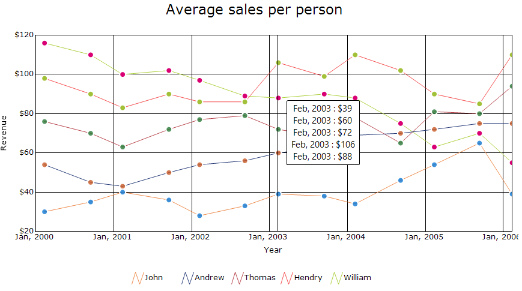
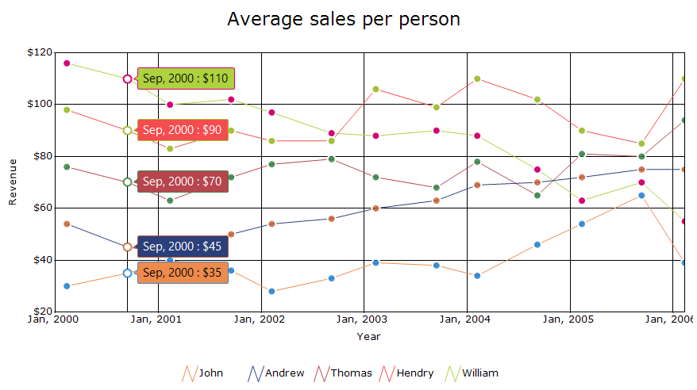
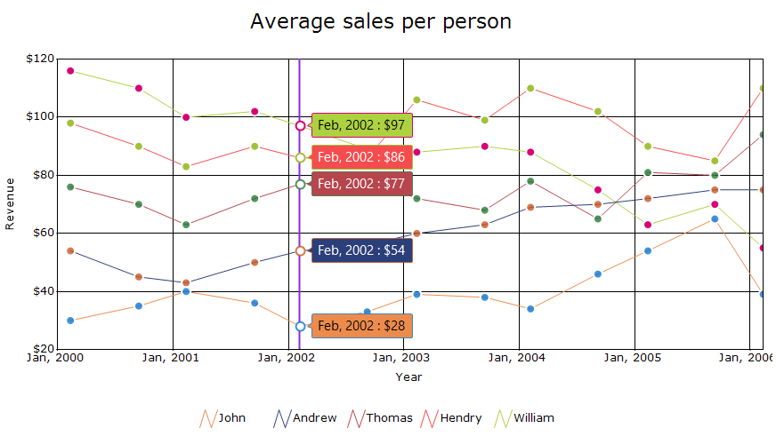
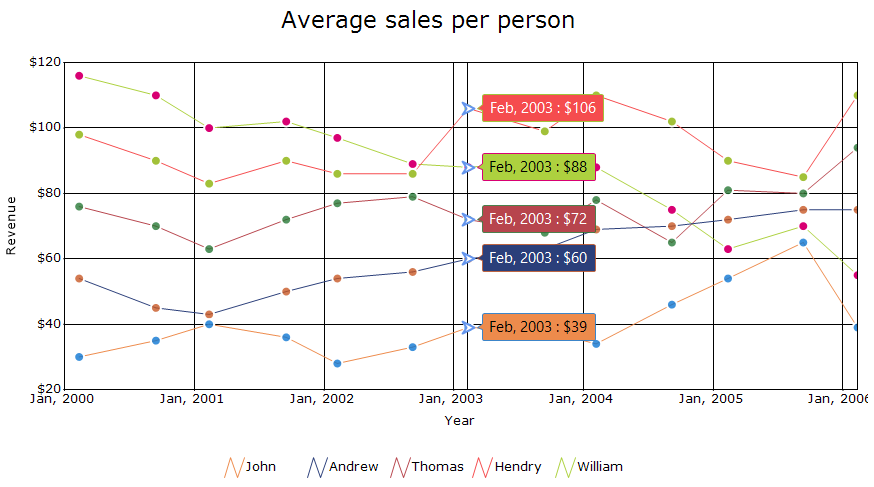
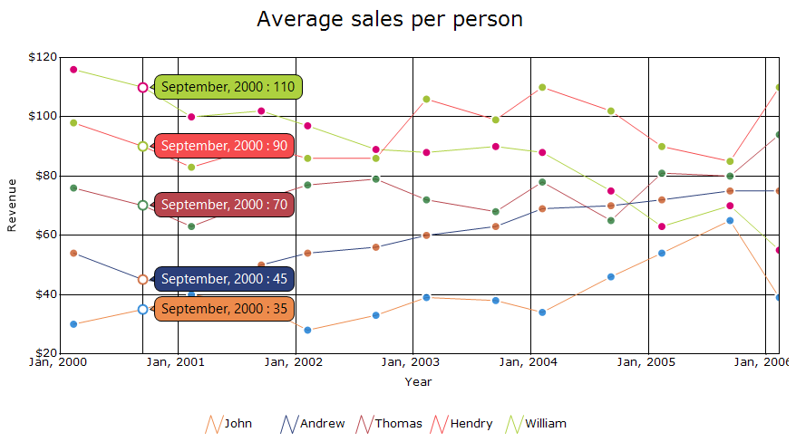
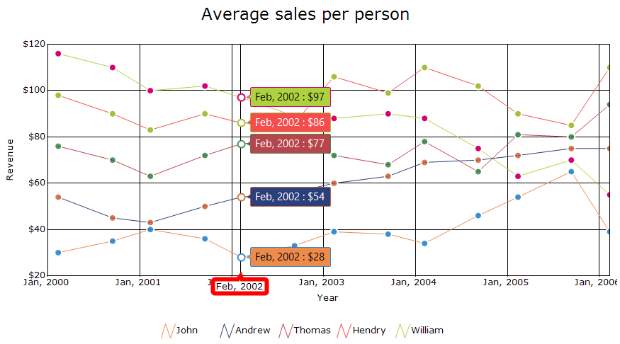

# Trackball in Windows Forms Chart

The [ChartTrackball](https://help.syncfusion.com/cr/windowsforms/Syncfusion.Windows.Forms.Chart.ChartTrackball.html) displays information about the data point close to the current mouse position. The x values of an axis are determined from the position of the vertical line of the axis, and y values are determined from the points touching the vertical line in the series.

## Show trackball

The [Visible](https://help.syncfusion.com/cr/windowsforms/Syncfusion.Windows.Forms.Chart.ChartCrosshair.html#Syncfusion_Windows_Forms_Chart_ChartCrosshair_Visible) property controls whether the trackball is displayed in the chart. The default value is `false`.

The following code example enables the trackball.



chartControl.Trackball.Visible = true;


chartControl.Trackball.Visible = True



## Display mode

The [DisplayMode](https://help.syncfusion.com/cr/windowsforms/Syncfusion.Windows.Forms.Chart.ChartTrackball.html#Syncfusion_Windows_Forms_Chart_ChartTrackball_DisplayMode) property specifies whether trackball tooltips are displayed individually for the closest data point in each series or grouped into a single tooltip. The default value is [Group](https://help.syncfusion.com/cr/windowsforms/Syncfusion.Windows.Forms.Chart.TrackballTooltipDisplayMode.html#Syncfusion_Windows_Forms_Chart_TrackballTooltipDisplayMode_Group).

The following options are available for this property:

- [Float](https://help.syncfusion.com/cr/windowsforms/Syncfusion.Windows.Forms.Chart.TrackballTooltipDisplayMode.html#Syncfusion_Windows_Forms_Chart_TrackballTooltipDisplayMode_Float): Displays an individual tooltip for the closest data point in each series.
- [Group](https://help.syncfusion.com/cr/windowsforms/Syncfusion.Windows.Forms.Chart.TrackballTooltipDisplayMode.html#Syncfusion_Windows_Forms_Chart_TrackballTooltipDisplayMode_Group): Displays the tooltips for all series in a single grouped tooltip.

The following code example sets the trackball tooltip display mode to `Float`.



chartControl.Trackball.DisplayMode = TrackballTooltipDisplayMode.Float;


chartControl.Trackball.DisplayMode = TrackballTooltipDisplayMode.Float



## Line

The [Line](https://help.syncfusion.com/cr/windowsforms/Syncfusion.Windows.Forms.Chart.ChartCrosshair.html#Syncfusion_Windows_Forms_Chart_ChartCrosshair_Line) property provides options to customize the appearance of the trackball line displayed at the current mouse position. By default, the property is initialized with a new instance of the [ChartLineInfo](https://help.syncfusion.com/cr/windowsforms/Syncfusion.Windows.Forms.Chart.ChartLineInfo.html) class.

The [ChartLineInfo](https://help.syncfusion.com/cr/windowsforms/Syncfusion.Windows.Forms.Chart.ChartLineInfo.html) class contains the following properties:

- [Alignment](https://help.syncfusion.com/cr/windowsforms/Syncfusion.Windows.Forms.Chart.ChartLineInfo.html#Syncfusion_Windows_Forms_Chart_ChartLineInfo_Alignment): Specifies the alignment of the pen.
- [Color](https://help.syncfusion.com/cr/windowsforms/Syncfusion.Windows.Forms.Chart.ChartLineInfo.html#Syncfusion_Windows_Forms_Chart_ChartLineInfo_Color): Specifies the color of the line.
- [DashPattern](https://help.syncfusion.com/cr/windowsforms/Syncfusion.Windows.Forms.Chart.ChartLineInfo.html#Syncfusion_Windows_Forms_Chart_ChartLineInfo_DashPattern): Specifies the custom dash pattern of the line.
- [DashStyle](https://help.syncfusion.com/cr/windowsforms/Syncfusion.Windows.Forms.Chart.ChartLineInfo.html#Syncfusion_Windows_Forms_Chart_ChartLineInfo_DashStyle): Specifies the dash style of the line.
- [Default](https://help.syncfusion.com/cr/windowsforms/Syncfusion.Windows.Forms.Chart.ChartLineInfo.html#Syncfusion_Windows_Forms_Chart_ChartLineInfo_Default): Gets the default line information used by the default chart style.
- [GdipPen](https://help.syncfusion.com/cr/windowsforms/Syncfusion.Windows.Forms.Chart.ChartLineInfo.html#Syncfusion_Windows_Forms_Chart_ChartLineInfo_GdipPen): Gets the pen created from the current line settings.
- [HasAlignment](https://help.syncfusion.com/cr/windowsforms/Syncfusion.Windows.Forms.Chart.ChartLineInfo.html#Syncfusion_Windows_Forms_Chart_ChartLineInfo_HasAlignment): Gets whether the `Alignment` property has been initialized.
- [HasColor](https://help.syncfusion.com/cr/windowsforms/Syncfusion.Windows.Forms.Chart.ChartLineInfo.html#Syncfusion_Windows_Forms_Chart_ChartLineInfo_HasColor): Gets whether the `Color` property has been initialized.
- [HasDashPattern](https://help.syncfusion.com/cr/windowsforms/Syncfusion.Windows.Forms.Chart.ChartLineInfo.html#Syncfusion_Windows_Forms_Chart_ChartLineInfo_HasDashPattern): Gets whether the `DashPattern` property has been initialized.
- [HasDashStyle](https://help.syncfusion.com/cr/windowsforms/Syncfusion.Windows.Forms.Chart.ChartLineInfo.html#Syncfusion_Windows_Forms_Chart_ChartLineInfo_HasDashStyle): Gets whether the `DashStyle` property has been initialized.
- [HasWidth](https://help.syncfusion.com/cr/windowsforms/Syncfusion.Windows.Forms.Chart.ChartLineInfo.html#Syncfusion_Windows_Forms_Chart_ChartLineInfo_HasWidth): Gets whether the `Width` property has been initialized.
- [Width](https://help.syncfusion.com/cr/windowsforms/Syncfusion.Windows.Forms.Chart.ChartLineInfo.html#Syncfusion_Windows_Forms_Chart_ChartLineInfo_Width): Specifies the width of the line in pixels.

The following code example customizes the color and width of the trackball line.




chartControl.Trackball.Line.Color = Color.BlueViolet;
chartControl.Trackball.Line.Width = 2;




chartControl.Trackball.Line.Color = Color.BlueViolet
chartControl.Trackball.Line.Width = 2




## Symbol

The [Symbol](https://help.syncfusion.com/cr/windowsforms/Syncfusion.Windows.Forms.Chart.ChartTrackball.html#Syncfusion_Windows_Forms_Chart_ChartTrackball_Symbol) property provides options to customize the marker used to highlight the closest data point. By default, the property is initialized with a new instance of the [ChartSymbolInfo](https://help.syncfusion.com/cr/windowsforms/Syncfusion.Windows.Forms.Chart.ChartSymbolInfo.html) class.

The `ChartSymbolInfo` class contains the following properties:

- [Border](https://help.syncfusion.com/cr/windowsforms/Syncfusion.Windows.Forms.Chart.ChartSymbolInfo.html#Syncfusion_Windows_Forms_Chart_ChartSymbolInfo_Border): Provides options to customize the border of the symbol.
- [Color](https://help.syncfusion.com/cr/windowsforms/Syncfusion.Windows.Forms.Chart.ChartSymbolInfo.html#Syncfusion_Windows_Forms_Chart_ChartSymbolInfo_Color): Specifies the color of the symbol.
- [Default](https://help.syncfusion.com/cr/windowsforms/Syncfusion.Windows.Forms.Chart.ChartSymbolInfo.html#Syncfusion_Windows_Forms_Chart_ChartSymbolInfo_Default): Gets the default symbol information used by the default chart style.
- [DimmedColor](https://help.syncfusion.com/cr/windowsforms/Syncfusion.Windows.Forms.Chart.ChartSymbolInfo.html#Syncfusion_Windows_Forms_Chart_ChartSymbolInfo_DimmedColor): Specifies the color of the dimmed symbol.
- [HasBorder](https://help.syncfusion.com/cr/windowsforms/Syncfusion.Windows.Forms.Chart.ChartSymbolInfo.html#Syncfusion_Windows_Forms_Chart_ChartSymbolInfo_HasBorder): Gets whether the `Border` property has been initialized.
- [HasColor](https://help.syncfusion.com/cr/windowsforms/Syncfusion.Windows.Forms.Chart.ChartSymbolInfo.html#Syncfusion_Windows_Forms_Chart_ChartSymbolInfo_HasColor): Gets whether the `Color` property has been initialized.
- [HasDimmedColor](https://help.syncfusion.com/cr/windowsforms/Syncfusion.Windows.Forms.Chart.ChartSymbolInfo.html#Syncfusion_Windows_Forms_Chart_ChartSymbolInfo_HasDimmedColor): Gets whether the `DimmedColor` property has been initialized.
- [HasHighlightColor](https://help.syncfusion.com/cr/windowsforms/Syncfusion.Windows.Forms.Chart.ChartSymbolInfo.html#Syncfusion_Windows_Forms_Chart_ChartSymbolInfo_HasHighlightColor): Gets whether the `HighlightColor` property has been initialized.
- [HasImageIndex](https://help.syncfusion.com/cr/windowsforms/Syncfusion.Windows.Forms.Chart.ChartSymbolInfo.html#Syncfusion_Windows_Forms_Chart_ChartSymbolInfo_HasImageIndex): Gets whether the `ImageIndex` property has been initialized.
- [HasMarker](https://help.syncfusion.com/cr/windowsforms/Syncfusion.Windows.Forms.Chart.ChartSymbolInfo.html#Syncfusion_Windows_Forms_Chart_ChartSymbolInfo_HasMarker): Gets whether the `Marker` property has been initialized.
- [HasOffset](https://help.syncfusion.com/cr/windowsforms/Syncfusion.Windows.Forms.Chart.ChartSymbolInfo.html#Syncfusion_Windows_Forms_Chart_ChartSymbolInfo_HasOffset): Gets whether the `Offset` property has been initialized.
- [HasShape](https://help.syncfusion.com/cr/windowsforms/Syncfusion.Windows.Forms.Chart.ChartSymbolInfo.html#Syncfusion_Windows_Forms_Chart_ChartSymbolInfo_HasShape): Gets whether the `Shape` property has been initialized.
- [HasSize](https://help.syncfusion.com/cr/windowsforms/Syncfusion.Windows.Forms.Chart.ChartSymbolInfo.html#Syncfusion_Windows_Forms_Chart_ChartSymbolInfo_HasSize): Gets whether the `Size` property has been initialized.
- [HighlightColor](https://help.syncfusion.com/cr/windowsforms/Syncfusion.Windows.Forms.Chart.ChartSymbolInfo.html#Syncfusion_Windows_Forms_Chart_ChartSymbolInfo_HighlightColor): Specifies the color of the highlighted symbol.
- [ImageIndex](https://help.syncfusion.com/cr/windowsforms/Syncfusion.Windows.Forms.Chart.ChartSymbolInfo.html#Syncfusion_Windows_Forms_Chart_ChartSymbolInfo_ImageIndex): Specifies the index used to retrieve the symbol image from the associated image list.
- [Marker](https://help.syncfusion.com/cr/windowsforms/Syncfusion.Windows.Forms.Chart.ChartSymbolInfo.html#Syncfusion_Windows_Forms_Chart_ChartSymbolInfo_Marker): Specifies the marker associated with the symbol.
- [Offset](https://help.syncfusion.com/cr/windowsforms/Syncfusion.Windows.Forms.Chart.ChartSymbolInfo.html#Syncfusion_Windows_Forms_Chart_ChartSymbolInfo_Offset): Specifies the offset of the symbol from its default position.
- [Shape](https://help.syncfusion.com/cr/windowsforms/Syncfusion.Windows.Forms.Chart.ChartSymbolInfo.html#Syncfusion_Windows_Forms_Chart_ChartSymbolInfo_Shape): Specifies the shape of the symbol.
- [Size](https://help.syncfusion.com/cr/windowsforms/Syncfusion.Windows.Forms.Chart.ChartSymbolInfo.html#Syncfusion_Windows_Forms_Chart_ChartSymbolInfo_Size): Specifies the size of the symbol.

The following code example customizes the shape, size, color, and border of the trackball symbol.




chartControl.Trackball.Symbol.Shape = ChartSymbolShape.Arrow;
chartControl.Trackball.Symbol.Size = new Size(12, 12);
chartControl.Trackball.Symbol.Color = Color.CornflowerBlue;
chartControl.Trackball.Symbol.Border.Color = Color.White;
chartControl.Trackball.Symbol.Border.Width = 2;




chartControl.Trackball.Symbol.Shape = ChartSymbolShape.Arrow
chartControl.Trackball.Symbol.Size = New Size(12, 12)
chartControl.Trackball.Symbol.Color = Color.CornflowerBlue
chartControl.Trackball.Symbol.Border.Color = Color.White
chartControl.Trackball.Symbol.Border.Width = 2




## Tooltip

The [Tooltip](https://help.syncfusion.com/cr/windowsforms/Syncfusion.Windows.Forms.Chart.ChartTrackball.html#Syncfusion_Windows_Forms_Chart_ChartTrackball_Tooltip) property provides options to customize the appearance and content of the trackball tooltip. By default, the property is initialized with a new instance of the [TrackballTooltip](https://help.syncfusion.com/cr/windowsforms/Syncfusion.Windows.Forms.Chart.TrackballTooltip.html) class.

The `TrackballTooltip` class contains the following properties:

- [Border](https://help.syncfusion.com/cr/windowsforms/Syncfusion.Windows.Forms.Chart.TrackballTooltip.html#Syncfusion_Windows_Forms_Chart_TrackballTooltip_Border): Provides options to customize the tooltip border, including its color, width, and style.
- [CornerRadius](https://help.syncfusion.com/cr/windowsforms/Syncfusion.Windows.Forms.Chart.TrackballTooltip.html#Syncfusion_Windows_Forms_Chart_TrackballTooltip_CornerRadius): Specifies the corner radius of the trackball tooltip.
- [Font](https://help.syncfusion.com/cr/windowsforms/Syncfusion.Windows.Forms.Chart.TrackballTooltip.html#Syncfusion_Windows_Forms_Chart_TrackballTooltip_Font): Specifies the font used to render the tooltip text.
- [Interior](https://help.syncfusion.com/cr/windowsforms/Syncfusion.Windows.Forms.Chart.TrackballTooltip.html#Syncfusion_Windows_Forms_Chart_TrackballTooltip_Interior): Specifies the background of the trackball tooltip.
- [Margin](https://help.syncfusion.com/cr/windowsforms/Syncfusion.Windows.Forms.Chart.TrackballTooltip.html#Syncfusion_Windows_Forms_Chart_TrackballTooltip_Margin): Specifies the spacing between the tooltip text and its border.
- [Offset](https://help.syncfusion.com/cr/windowsforms/Syncfusion.Windows.Forms.Chart.TrackballTooltip.html#Syncfusion_Windows_Forms_Chart_TrackballTooltip_Offset): Specifies the padding between the highlighted symbol and the trackball tooltip.
- [TextColor](https://help.syncfusion.com/cr/windowsforms/Syncfusion.Windows.Forms.Chart.TrackballTooltip.html#Syncfusion_Windows_Forms_Chart_TrackballTooltip_TextColor): Specifies the color of the tooltip text.
- [TextFormat](https://help.syncfusion.com/cr/windowsforms/Syncfusion.Windows.Forms.Chart.TrackballTooltip.html#Syncfusion_Windows_Forms_Chart_TrackballTooltip_TextFormat): Specifies the format used to display the tooltip text.
- [Visible](https://help.syncfusion.com/cr/windowsforms/Syncfusion.Windows.Forms.Chart.TrackballTooltip.html#Syncfusion_Windows_Forms_Chart_TrackballTooltip_Visible): Controls whether the trackball tooltip is displayed.
- [XValueFormat](https://help.syncfusion.com/cr/windowsforms/Syncfusion.Windows.Forms.Chart.TrackballTooltip.html#Syncfusion_Windows_Forms_Chart_TrackballTooltip_XValueFormat): Specifies the format applied to the X-values displayed in the trackball tooltip.
- [YValueFormat](https://help.syncfusion.com/cr/windowsforms/Syncfusion.Windows.Forms.Chart.TrackballTooltip.html#Syncfusion_Windows_Forms_Chart_TrackballTooltip_YValueFormat): Specifies the format applied to the Y-values displayed in the trackball tooltip.

The following code example formats and customizes the trackball tooltip.




// Displays values such as "September, 2002 : 89".
chartControl.Trackball.Tooltip.TextFormat = "{1} : {2}";
chartControl.Trackball.Tooltip.XValueFormat = "MMMM, yyyy";
chartControl.Trackball.Tooltip.YValueFormat = "n0";

// Customizes the tooltip shape and position.
chartControl.Trackball.Tooltip.CornerRadius = 15;

// Initializes and customizes the tooltip border.
chartControl.Trackball.Tooltip.Border = new ChartLineInfo() { Width = 1 };

// Uses white text over the series-colored tooltip backgrounds.
chartControl.Trackball.Tooltip.TextColor = Color.White;




' Displays values such as "September, 2002 : 89".
chartControl.Trackball.Tooltip.TextFormat = "{1} : {2}"
chartControl.Trackball.Tooltip.XValueFormat = "MMMM, yyyy"
chartControl.Trackball.Tooltip.YValueFormat = "n0"

' Customizes the tooltip shape.
chartControl.Trackball.Tooltip.CornerRadius = 15

' Initializes and customizes the tooltip border.
chartControl.Trackball.Tooltip.Border = New ChartLineInfo() With {
.Width = 1
}

' Uses white text over the series-colored tooltip backgrounds.
chartControl.Trackball.Tooltip.TextColor = Color.White




## Axis tooltip

The [AxisTooltip](https://help.syncfusion.com/cr/windowsforms/Syncfusion.Windows.Forms.Chart.ChartCrosshair.html#Syncfusion_Windows_Forms_Chart_ChartCrosshair_AxisTooltip) property provides options to customize the tooltip displayed on a chart axis at the current trackball position.

N> N> To display the axis tooltip, set the [ShowCrosshairTooltip](https://help.syncfusion.com/cr/windowsforms/Syncfusion.Windows.Forms.Chart.ChartAxis.html#Syncfusion_Windows_Forms_Chart_ChartAxis_ShowCrosshairTooltip) property of the corresponding axis to `true`.

The following code example enables and customizes the axis tooltip.




chartControl.PrimaryXAxis.ShowCrosshairTooltip = true;
chartControl.Trackball.AxisTooltip.CornerRadius = 6;
chartControl.Trackball.AxisTooltip.Border = new ChartLineInfo() { Width = 6, Color = Color.Red };

chartControl.Trackball.AxisTooltip.Interior =
    new BrushInfo(Color.White);
chartControl.Trackball.AxisTooltip.TextColor = Color.Black;




chartControl.PrimaryXAxis.ShowCrosshairTooltip = True
chartControl.Trackball.AxisTooltip.CornerRadius = 6

chartControl.Trackball.AxisTooltip.Border = New ChartLineInfo() With {
.Width = 6,
.Color = Color.Red
}

chartControl.Trackball.AxisTooltip.Interior = New BrushInfo(Color.White)
chartControl.Trackball.AxisTooltip.TextColor = Color.Black




## Events

The trackball provides rendering events that allow individual tooltips to be customized before they are displayed:

- [TrackballTooltipRendering](https://help.syncfusion.com/cr/windowsforms/Syncfusion.Windows.Forms.Chart.ChartTrackball.html#Syncfusion_Windows_Forms_Chart_ChartTrackball_TrackballTooltipRendering): Triggered once for each chart series. This event can be used to customize the text, background, border, and text color of an individual series tooltip.
- [AxisTooltipRendering](https://help.syncfusion.com/cr/windowsforms/Syncfusion.Windows.Forms.Chart.ChartTrackball.html#Syncfusion_Windows_Forms_Chart_ChartTrackball_AxisTooltipRendering): Triggered once for each axis. This event can be used to customize the text and appearance of an individual axis tooltip.

These events are useful when different tooltip styles or text formats are required for individual series or axes.