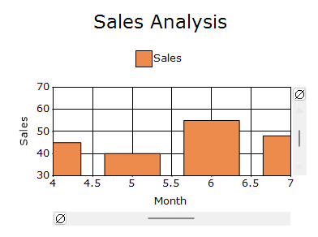

# Zooming and Panning in Windows Forms Chart
## Zooming and panning

The Windows Forms Chart supports interactive zooming, scrolling, and panning, allowing users to inspect and navigate through specific portions of chart data.

## Zooming

Zooming can be enabled independently for the horizontal and vertical axes. After zooming, scroll bars can be used to access chart regions outside the visible range.

### Enable zooming

The [EnableXZooming](https://help.syncfusion.com/cr/windowsforms/Syncfusion.Windows.Forms.Chart.ChartControl.html#Syncfusion_Windows_Forms_Chart_ChartControl_EnableXZooming) and [EnableYZooming](https://help.syncfusion.com/cr/windowsforms/Syncfusion.Windows.Forms.Chart.ChartControl.html#Syncfusion_Windows_Forms_Chart_ChartControl_EnableYZooming) properties enable zooming along the horizontal and vertical axes, respectively.



chartControl.EnableXZooming = true;
chartControl.EnableYZooming = true;


chartControl.EnableXZooming = True
chartControl.EnableYZooming = True



### Zoom button

The zoom buttons appear near the horizontal and vertical scroll bars and allow users to zoom out from the currently displayed range. The `ZoomButton.Size` property specifies the size of the zoom buttons.



chartControl.GetHScrollBar(chartControl.PrimaryXAxis).ZoomButton.Size =
    new Size(16, 16);
chartControl.GetVScrollBar(chartControl.PrimaryYAxis).ZoomButton.Size =
    new Size(16, 16);


chartControl.GetHScrollBar(chartControl.PrimaryXAxis).ZoomButton.Size =
    New Size(16, 16)
chartControl.GetVScrollBar(chartControl.PrimaryYAxis).ZoomButton.Size =
    New Size(16, 16)



### Reset on double-click

The [ResetOnDoubleClick](https://help.syncfusion.com/cr/windowsforms/Syncfusion.Windows.Forms.Chart.ChartControl.html#Syncfusion_Windows_Forms_Chart_ChartControl_ResetOnDoubleClick) property controls whether the chart returns to its original range when the chart area is double-clicked or double-tapped.



chartControl.ResetOnDoubleClick = true;


chartControl.ResetOnDoubleClick = True



## Zoom-area appearance

The [Zooming](https://help.syncfusion.com/cr/windowsforms/Syncfusion.Windows.Forms.Chart.ChartControl.html#Syncfusion_Windows_Forms_Chart_ChartControl_Zooming) property provides access to the appearance settings of the interactive zoom-selection area.

### Zoom-area border

The [Border](https://help.syncfusion.com/cr/windowsforms/Syncfusion.Windows.Forms.Chart.ChartZooming.html#Syncfusion_Windows_Forms_Chart_ChartZooming_Border) property specifies the line used to draw the border around the selected zoom area. The border can be customized using its width, color, and dash style.

The [ShowBorder](https://help.syncfusion.com/cr/windowsforms/Syncfusion.Windows.Forms.Chart.ChartZooming.html#Syncfusion_Windows_Forms_Chart_ChartZooming_ShowBorder) property controls whether the border is displayed.



chartControl.Zooming.ShowBorder = true;
chartControl.Zooming.Border.Width = 1;
chartControl.Zooming.Border.ForeColor = Color.Orange;
chartControl.Zooming.Border.BackColor = Color.Transparent;
chartControl.Zooming.Border.DashStyle = DashStyle.Solid;




chartControl.Zooming.ShowBorder = True
chartControl.Zooming.Border.Width = 1
chartControl.Zooming.Border.ForeColor = Color.Orange
chartControl.Zooming.Border.BackColor = Color.Transparent
chartControl.Zooming.Border.DashStyle = DashStyle.Solid




### Zoom-area interior

The [Interior](https://help.syncfusion.com/cr/windowsforms/Syncfusion.Windows.Forms.Chart.ChartZooming.html#Syncfusion_Windows_Forms_Chart_ChartZooming_Interior) property specifies the brush used to fill the selected zoom area. The brush can use foreground and background colors with a gradient style.

The [Opacity](https://help.syncfusion.com/cr/windowsforms/Syncfusion.Windows.Forms.Chart.ChartZooming.html#Syncfusion_Windows_Forms_Chart_ChartZooming_Opacity) property controls the transparency of the selected zoom area.



chartControl.Zooming.Opacity = 0.7f;
chartControl.Zooming.Interior = new BrushInfo(
    GradientStyle.ForwardDiagonal,
    Color.Red,
    Color.Yellow);


chartControl.Zooming.Opacity = 0.7F
chartControl.Zooming.Interior = New BrushInfo(
    GradientStyle.ForwardDiagonal,
    Color.Red,
    Color.Yellow)



## Programmatic zooming

Programmatic zooming allows the zoom level and visible position to be configured without requiring mouse interaction.

### Zoom factor

The [ZoomFactorX](https://help.syncfusion.com/cr/windowsforms/Syncfusion.Windows.Forms.Chart.ChartControl.html#Syncfusion_Windows_Forms_Chart_ChartControl_ZoomFactorX) and [ZoomFactorY](https://help.syncfusion.com/cr/windowsforms/Syncfusion.Windows.Forms.Chart.ChartControl.html#Syncfusion_Windows_Forms_Chart_ChartControl_ZoomFactorY) properties specify the portion of the horizontal and vertical ranges displayed after zooming.

A value of `1` displays the original range. A smaller value displays a smaller portion of the range and produces a higher zoom level.



chartControl.ZoomFactorX = 0.5;
chartControl.ZoomFactorY = 0.5;


chartControl.ZoomFactorX = 0.5
chartControl.ZoomFactorY = 0.5



### Zoom position

The [ZoomPositionX](https://help.syncfusion.com/cr/windowsforms/Syncfusion.Windows.Forms.Chart.ChartControl.html#Syncfusion_Windows_Forms_Chart_ChartControl_ZoomPositionX) and [ZoomPositionY](https://help.syncfusion.com/cr/windowsforms/Syncfusion.Windows.Forms.Chart.ChartControl.html#Syncfusion_Windows_Forms_Chart_ChartControl_ZoomPositionY) properties specify which portion of the horizontal and vertical ranges is displayed after zooming.



chartControl.ZoomFactorX = 0.5;
chartControl.ZoomFactorY = 0.5;
chartControl.ZoomPositionX = 0.25;
chartControl.ZoomPositionY = 0.25;


chartControl.ZoomFactorX = 0.5
chartControl.ZoomFactorY = 0.5
chartControl.ZoomPositionX = 0.25
chartControl.ZoomPositionY = 0.25



### Minimum zoom factor

The [MinZoomFactorX](https://help.syncfusion.com/cr/windowsforms/Syncfusion.Windows.Forms.Chart.ChartControl.html#Syncfusion_Windows_Forms_Chart_ChartControl_MinZoomFactorX) and [MinZoomFactorY](https://help.syncfusion.com/cr/windowsforms/Syncfusion.Windows.Forms.Chart.ChartControl.html#Syncfusion_Windows_Forms_Chart_ChartControl_MinZoomFactorY) properties limit how far users can zoom into the chart along each axis.



chartControl.MinZoomFactorX = 0.1;
chartControl.MinZoomFactorY = 0.1;


chartControl.MinZoomFactorX = 0.1
chartControl.MinZoomFactorY = 0.1



### Zoom-out increment

The [ZoomOutIncrement](https://help.syncfusion.com/cr/windowsforms/Syncfusion.Windows.Forms.Chart.ChartControl.html#Syncfusion_Windows_Forms_Chart_ChartControl_ZoomOutIncrement) property specifies the amount by which the chart zooms out for each zoom-out action.



chartControl.ZoomOutIncrement = 0.2;


chartControl.ZoomOutIncrement = 0.2



## Keyboard zooming and navigation

The [KeyZoom](https://help.syncfusion.com/cr/windowsforms/Syncfusion.Windows.Forms.Chart.ChartControl.html#Syncfusion_Windows_Forms_Chart_ChartControl_KeyZoom) property enables keyboard-based zooming and navigation.

The following properties specify the keyboard shortcuts used to control a zoomed chart:

- [ZoomIn](https://help.syncfusion.com/cr/windowsforms/Syncfusion.Windows.Forms.Chart.ChartControl.html#Syncfusion_Windows_Forms_Chart_ChartControl_ZoomIn): Zooms into the chart.
- [ZoomOut](https://help.syncfusion.com/cr/windowsforms/Syncfusion.Windows.Forms.Chart.ChartControl.html#Syncfusion_Windows_Forms_Chart_ChartControl_ZoomOut): Zooms out of the chart.
- [ZoomLeft](https://help.syncfusion.com/cr/windowsforms/Syncfusion.Windows.Forms.Chart.ChartControl.html#Syncfusion_Windows_Forms_Chart_ChartControl_ZoomLeft): Moves the visible zoomed range to the left.
- [ZoomRight](https://help.syncfusion.com/cr/windowsforms/Syncfusion.Windows.Forms.Chart.ChartControl.html#Syncfusion_Windows_Forms_Chart_ChartControl_ZoomRight): Moves the visible zoomed range to the right.
- [ZoomUp](https://help.syncfusion.com/cr/windowsforms/Syncfusion.Windows.Forms.Chart.ChartControl.html#Syncfusion_Windows_Forms_Chart_ChartControl_ZoomUp): Moves the visible zoomed range upward.
- [ZoomDown](https://help.syncfusion.com/cr/windowsforms/Syncfusion.Windows.Forms.Chart.ChartControl.html#Syncfusion_Windows_Forms_Chart_ChartControl_ZoomDown): Moves the visible zoomed range downward.
- [ZoomCancel](https://help.syncfusion.com/cr/windowsforms/Syncfusion.Windows.Forms.Chart.ChartControl.html#Syncfusion_Windows_Forms_Chart_ChartControl_ZoomCancel): Cancels the current zoom operation.



chartControl.KeyZoom = true;
chartControl.ZoomIn = Keys.Add;
chartControl.ZoomOut = Keys.Subtract;
chartControl.ZoomLeft = Keys.Left;
chartControl.ZoomRight = Keys.Right;
chartControl.ZoomUp = Keys.Up;
chartControl.ZoomDown = Keys.Down;
chartControl.ZoomCancel = Keys.Escape;


chartControl.KeyZoom = True
chartControl.ZoomIn = Keys.Add
chartControl.ZoomOut = Keys.Subtract
chartControl.ZoomLeft = Keys.Left
chartControl.ZoomRight = Keys.Right
chartControl.ZoomUp = Keys.Up
chartControl.ZoomDown = Keys.Down
chartControl.ZoomCancel = Keys.Escape



> **Note:** The chart must have keyboard focus for the configured keyboard shortcuts to respond.

## Zoom type

The [ZoomType](https://help.syncfusion.com/cr/windowsforms/Syncfusion.Windows.Forms.Chart.ChartControl.html#Syncfusion_Windows_Forms_Chart_ChartControl_ZoomType) property specifies how users zoom the chart.

The `ZoomType` property supports the following values:

- **Selection**: Zooms into a range selected by dragging over the chart area.
- **MouseWheelZooming**: Zooms according to mouse-wheel movement.
- **PinchZooming**: Zooms according to pinch and spread gestures on touch-enabled devices.

The supported values are defined in the [ZoomType](https://help.syncfusion.com/cr/windowsforms/Syncfusion.Windows.Forms.Chart.ZoomType.html) enumeration. Because `ZoomType` is a flagged enumeration, multiple zoom types can be enabled together.



chartControl.ZoomType = ZoomType.Selection |
                        ZoomType.MouseWheelZooming |
                        ZoomType.PinchZooming;


chartControl.ZoomType = ZoomType.Selection Or
                        ZoomType.MouseWheelZooming Or
                        ZoomType.PinchZooming



### Selection zooming

Selection zooming allows users to drag over the chart area and zoom into the selected range.



chartControl.EnableXZooming = true;
chartControl.EnableYZooming = true;
chartControl.ZoomType = ZoomType.Selection;


chartControl.EnableXZooming = True
chartControl.EnableYZooming = True
chartControl.ZoomType = ZoomType.Selection



### Mouse-wheel zooming

Mouse-wheel zooming allows users to zoom in or out by rotating the mouse wheel over the chart area.



chartControl.EnableXZooming = true;
chartControl.EnableYZooming = true;
chartControl.ZoomType = ZoomType.MouseWheelZooming;


chartControl.EnableXZooming = True
chartControl.EnableYZooming = True
chartControl.ZoomType = ZoomType.MouseWheelZooming



### Pinch zooming

Pinch zooming allows users to zoom the chart using pinch and spread gestures on touch-enabled devices.

**Spread**

**Pinch**



chartControl.EnableXZooming = true;
chartControl.EnableYZooming = true;
chartControl.ZoomType = ZoomType.PinchZooming;


chartControl.EnableXZooming = True
chartControl.EnableYZooming = True
chartControl.ZoomType = ZoomType.PinchZooming



## Scrolling

Scrolling allows users to navigate through chart regions that become hidden after zooming.

### Show scroll bars

The [ShowScrollBars](https://help.syncfusion.com/cr/windowsforms/Syncfusion.Windows.Forms.Chart.ChartControl.html#Syncfusion_Windows_Forms_Chart_ChartControl_ShowScrollBars) property controls whether scroll bars are displayed for navigating through the zoomed chart.



chartControl.ShowScrollBars = true;


chartControl.ShowScrollBars = True



### Scroll precision

The [ScrollPrecision](https://help.syncfusion.com/cr/windowsforms/Syncfusion.Windows.Forms.Chart.ChartControl.html#Syncfusion_Windows_Forms_Chart_ChartControl_ScrollPrecision) property specifies the movement precision of the chart scroll bars.



chartControl.ScrollPrecision = 20;


chartControl.ScrollPrecision = 20



> **Note:** Keyboard navigation through a zoomed range is configured using `ZoomLeft`, `ZoomRight`, `ZoomUp`, and `ZoomDown` in the **Keyboard zooming and navigation** section.

## Panning

Panning allows users to drag a zoomed chart to navigate through hidden data ranges. The chart must be zoomed before panning can produce a visible effect.

### Enable panning

The [MouseAction](https://help.syncfusion.com/cr/windowsforms/Syncfusion.Windows.Forms.Chart.ChartControl.html#Syncfusion_Windows_Forms_Chart_ChartControl_MouseAction) property enables mouse-based panning.

The [ZoomActions](https://help.syncfusion.com/cr/windowsforms/Syncfusion.Windows.Forms.Chart.ChartAxis.html#Syncfusion_Windows_Forms_Chart_ChartAxis_ZoomActions) property controls panning independently for each axis.

The supported values are defined in the [ChartZoomingAction](https://help.syncfusion.com/cr/windowsforms/Syncfusion.Windows.Forms.Chart.ChartZoomingAction.html) enumeration:

- **Panning**: Enables panning along the corresponding axis.
- **None**: Disables panning along the corresponding axis.



chartControl.EnableXZooming = true;
chartControl.EnableYZooming = true;

// Applies an initial zoom so that panning can be demonstrated.
chartControl.ZoomFactorX = 0.5;
chartControl.ZoomFactorY = 0.5;

chartControl.MouseAction = ChartMouseAction.Panning;
chartControl.PrimaryXAxis.ZoomActions = ChartZoomingAction.Panning;
chartControl.PrimaryYAxis.ZoomActions = ChartZoomingAction.Panning;


chartControl.EnableXZooming = True
chartControl.EnableYZooming = True

' Applies an initial zoom so that panning can be demonstrated.
chartControl.ZoomFactorX = 0.5
chartControl.ZoomFactorY = 0.5

chartControl.MouseAction = ChartMouseAction.Panning
chartControl.PrimaryXAxis.ZoomActions = ChartZoomingAction.Panning
chartControl.PrimaryYAxis.ZoomActions = ChartZoomingAction.Panning



Press and hold the left mouse button within the zoomed chart area, and then drag the chart to navigate through hidden data ranges.

> **Note:** Panning works only after the chart has been zoomed. Enable zooming for the required axes before enabling panning.

### Disable panning

Panning can be disabled by setting the mouse action and axis zoom actions to `None`.



chartControl.MouseAction = ChartMouseAction.Panning;
chartControl.PrimaryXAxis.ZoomActions = ChartZoomingAction.None;
chartControl.PrimaryYAxis.ZoomActions = ChartZoomingAction.None;


chartControl.MouseAction = ChartMouseAction.Panning
chartControl.PrimaryXAxis.ZoomActions = ChartZoomingAction.None
chartControl.PrimaryYAxis.ZoomActions = ChartZoomingAction.None



## Formatted labels in a zoomed DateTime axis

The [SmartDateZoom](https://help.syncfusion.com/cr/windowsforms/Syncfusion.Windows.Forms.Chart.ChartAxis.html#Syncfusion_Windows_Forms_Chart_ChartAxis_SmartDateZoom) property enables formatted axis labels when a DateTime axis is zoomed.



chartControl.PrimaryXAxis.ValueType = ChartValueType.DateTime;
chartControl.PrimaryXAxis.SmartDateZoom = true;
chartControl.PrimaryXAxis.SmartDateZoomDayLevelLabelFormat = "dd MM/yy HH.00";


chartControl.PrimaryXAxis.ValueType = ChartValueType.DateTime
chartControl.PrimaryXAxis.SmartDateZoom = True
chartControl.PrimaryXAxis.SmartDateZoomDayLevelLabelFormat = "dd MM/yy HH.00"



> **Note:** The axis value type must be set to `DateTime` to use smart date labels.

## See also

- [How to hide the Chart ZoomButton](https://help.syncfusion.com/windowsforms/chart/faq/how-to-hide-the-chart-zoombutton)
- [How to enable zooming with scrollbars in WinForms Chart](https://support.syncfusion.com/kb/article/4129/how-to-enable-zooming-with-scrollbars-in-syncfusion-winforms-chart)
- [How to implement zooming with keyboard shortcuts in WinForms Chart](https://support.syncfusion.com/kb/article/3871/how-to-implement-zooming-with-keyboard-shortcuts-in-winforms-chart)
