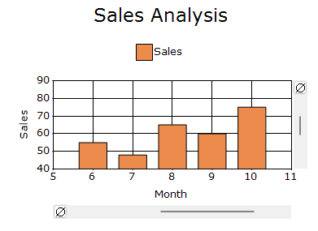
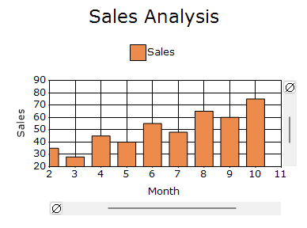

# Zooming and Panning in Windows Forms Chart

The Windows Forms Chart allows you to zoom the chart area with the help of the zoom feature. This behavior is mostly used to view data points in a specific area when the chart contains many data points.

Zooming and panning allow you to take a close-up look at the data points plotted in the series.

## Enable zooming

The [EnableXZooming](https://help.syncfusion.com/cr/windowsforms/Syncfusion.Windows.Forms.Chart.ChartControl.html#Syncfusion_Windows_Forms_Chart_ChartControl_EnableXZooming) and [EnableYZooming](https://help.syncfusion.com/cr/windowsforms/Syncfusion.Windows.Forms.Chart.ChartControl.html#Syncfusion_Windows_Forms_Chart_ChartControl_EnableYZooming) properties enable zooming along the horizontal and vertical axes, respectively. The default value of both properties is `false`.

The following code example demonstrates how to enable zooming.



chartControl.EnableXZooming = true;
chartControl.EnableYZooming = true;


chartControl.EnableXZooming = True
chartControl.EnableYZooming = True



## Zoom area appearance

The [Zooming](https://help.syncfusion.com/cr/windowsforms/Syncfusion.Windows.Forms.Chart.ChartControl.html#Syncfusion_Windows_Forms_Chart_ChartControl_Zooming) property provides access to the appearance settings of the interactive zoom-selection area. By default, the property is initialized with a new instance of the [ChartZooming](https://help.syncfusion.com/cr/windowsforms/Syncfusion.Windows.Forms.Chart.ChartZooming.html) class.

The `ChartZooming` class provides the [Border](https://help.syncfusion.com/cr/windowsforms/Syncfusion.Windows.Forms.Chart.ChartZooming.html#Syncfusion_Windows_Forms_Chart_ChartZooming_Border), [Interior](https://help.syncfusion.com/cr/windowsforms/Syncfusion.Windows.Forms.Chart.ChartZooming.html#Syncfusion_Windows_Forms_Chart_ChartZooming_Interior), [Opacity](https://help.syncfusion.com/cr/windowsforms/Syncfusion.Windows.Forms.Chart.ChartZooming.html#Syncfusion_Windows_Forms_Chart_ChartZooming_Opacity), and [ShowBorder](https://help.syncfusion.com/cr/windowsforms/Syncfusion.Windows.Forms.Chart.ChartZooming.html#Syncfusion_Windows_Forms_Chart_ChartZooming_ShowBorder) properties to customize the zoom-selection area.

### Zoom area border

The [Border](https://help.syncfusion.com/cr/windowsforms/Syncfusion.Windows.Forms.Chart.ChartZooming.html#Syncfusion_Windows_Forms_Chart_ChartZooming_Border) property specifies the line used to draw the border around the selected zoom area. The border can be customized using its width, color, and dash style. By default, a new [LineInfo](https://help.syncfusion.com/cr/windowsforms/Syncfusion.Windows.Forms.Chart.LineInfo.html) instance is used.

The [ShowBorder](https://help.syncfusion.com/cr/windowsforms/Syncfusion.Windows.Forms.Chart.ChartZooming.html#Syncfusion_Windows_Forms_Chart_ChartZooming_ShowBorder) property controls whether the border is displayed. By default, this property is `false`.

N> To display the border, set the [ShowBorder](https://help.syncfusion.com/cr/windowsforms/Syncfusion.Windows.Forms.Chart.ChartZooming.html#Syncfusion_Windows_Forms_Chart_ChartZooming_ShowBorder) property to `true`.

The following code example demonstrates how to display and customize the zoom-area border.



chartControl.Zooming.ShowBorder = true;
chartControl.Zooming.Border.Width = 5;
chartControl.Zooming.Border.ForeColor = Color.Green;
chartControl.Zooming.Border.BackColor = Color.Transparent;
chartControl.Zooming.Border.DashStyle = DashStyle.Solid;




chartControl.Zooming.ShowBorder = True
chartControl.Zooming.Border.Width = 5
chartControl.Zooming.Border.ForeColor = Color.Green
chartControl.Zooming.Border.BackColor = Color.Transparent
chartControl.Zooming.Border.DashStyle = DashStyle.Solid




### Zoom area interior

The [Interior](https://help.syncfusion.com/cr/windowsforms/Syncfusion.Windows.Forms.Chart.ChartZooming.html#Syncfusion_Windows_Forms_Chart_ChartZooming_Interior) property specifies the brush used to fill the selected zoom area. The brush can use foreground and background colors with a gradient style. Its default brush is a `BrushInfo` initialized with `SystemColors.Highlight`.

The [Opacity](https://help.syncfusion.com/cr/windowsforms/Syncfusion.Windows.Forms.Chart.ChartZooming.html#Syncfusion_Windows_Forms_Chart_ChartZooming_Opacity) property controls the transparency of the selected zoom area. The default opacity value is `0.5f`.

The following code example demonstrates how to customize the zoom-area interior and opacity.



chartControl.Zooming.Opacity = 0.7f;
chartControl.Zooming.Interior = new BrushInfo(
    GradientStyle.ForwardDiagonal,
    Color.Red,
    Color.Yellow);


chartControl.Zooming.Opacity = 0.7F
chartControl.Zooming.Interior = New BrushInfo(
    GradientStyle.ForwardDiagonal,
    Color.Red,
    Color.Yellow)



## Programmatic zooming

Programmatic zooming allows the zoom level and visible position to be configured without requiring mouse interaction.

### Zoom factor

The [ZoomFactorX](https://help.syncfusion.com/cr/windowsforms/Syncfusion.Windows.Forms.Chart.ChartControl.html#Syncfusion_Windows_Forms_Chart_ChartControl_ZoomFactorX) and [ZoomFactorY](https://help.syncfusion.com/cr/windowsforms/Syncfusion.Windows.Forms.Chart.ChartControl.html#Syncfusion_Windows_Forms_Chart_ChartControl_ZoomFactorY) properties specify the portion of the horizontal and vertical ranges displayed after zooming. The default value of both properties is `1.0`.

N> The zoom factor ranges from `0` to `1`. A value of `1.0` displays the original range without zooming, while a smaller value displays a smaller portion of the range and produces a higher zoom level. For example, a value of `0.5` displays half of the original range.

The following code example sets the zoom factor to `0.5`.



chartControl.ZoomFactorX = 0.5;
chartControl.ZoomFactorY = 0.5;


chartControl.ZoomFactorX = 0.5
chartControl.ZoomFactorY = 0.5



### Zoom position

The [ZoomPositionX](https://help.syncfusion.com/cr/windowsforms/Syncfusion.Windows.Forms.Chart.ChartControl.html#Syncfusion_Windows_Forms_Chart_ChartControl_ZoomPositionX) and [ZoomPositionY](https://help.syncfusion.com/cr/windowsforms/Syncfusion.Windows.Forms.Chart.ChartControl.html#Syncfusion_Windows_Forms_Chart_ChartControl_ZoomPositionY) properties specify which portion of the horizontal and vertical ranges is displayed after zooming. The default value of both properties is `0.0`.

N> Set the corresponding zoom factor using the `ZoomFactorX` and `ZoomFactorY` properties before setting the zoom position. The zoom position does not take effect when the zoom factor is `1.0`.

The following code example demonstrates how to set the zoom position.



chartControl.ZoomFactorX = 0.5;
chartControl.ZoomFactorY = 0.5;
chartControl.ZoomPositionX = 0.40;
chartControl.ZoomPositionY = 0.40;


chartControl.ZoomFactorX = 0.5
chartControl.ZoomFactorY = 0.5
chartControl.ZoomPositionX = 0.40
chartControl.ZoomPositionY = 0.40



### Axis level zooming

The [ZoomFactor](https://help.syncfusion.com/cr/windowsforms/Syncfusion.Windows.Forms.Chart.ChartAxis.html#Syncfusion_Windows_Forms_Chart__ChartAxis_ZoomFactor) and [ZoomPosition](https://help.syncfusion.com/cr/windowsforms/Syncfusion.Windows.Forms.Chart.ChartAxis.html#Syncfusion_Windows_Forms_Chart_ChartAxis_ZoomPosition) properties specify the zoom level and position of an individual axis.

The [VisibleRange](https://help.syncfusion.com/cr/windowsforms/Syncfusion.Windows.Forms.Chart.ChartAxis.html#Syncfusion_Windows_Forms_Chart_ChartAxis_VisibleRange) property gets the range currently visible on the axis, while the [ZoomedRange](https://help.syncfusion.com/cr/windowsforms/Syncfusion.Windows.Forms.Chart.ChartAxis.html#Syncfusion_Windows_Forms_Chart_ChartAxis_ZoomedRange) property gets the range displayed after zooming. Both are get-only properties and are updated automatically when the zoom factor or zoom position changes.

N> The `ZoomFactorX` and `ZoomFactorY` properties apply to the primary X and Y axes, respectively. Use the `ZoomFactor` property of an individual `ChartAxis` to configure the zoom factor of an additional axis.

The following code example sets the zoom factor and position directly on the primary axes.




chartControl.PrimaryXAxis.ZoomFactor = 0.5;
chartControl.PrimaryYAxis.ZoomFactor = 0.5;
chartControl.PrimaryXAxis.ZoomPosition = 0.40;
chartControl.PrimaryYAxis.ZoomPosition = 0.40;




chartControl.PrimaryXAxis.ZoomFactor = 0.5
chartControl.PrimaryYAxis.ZoomFactor = 0.5
chartControl.PrimaryXAxis.ZoomPosition = 0.4
chartControl.PrimaryYAxis.ZoomPosition = 0.4




### Minimum zoom factor

The [MinZoomFactorX](https://help.syncfusion.com/cr/windowsforms/Syncfusion.Windows.Forms.Chart.ChartControl.html#Syncfusion_Windows_Forms_Chart_ChartControl_MinZoomFactorX) and [MinZoomFactorY](https://help.syncfusion.com/cr/windowsforms/Syncfusion.Windows.Forms.Chart.ChartControl.html#Syncfusion_Windows_Forms_Chart_ChartControl_MinZoomFactorY) properties restrict the zoom-in level on the horizontal and vertical axes. The default value of both properties is `0.01`.

N> The minimum zoom factor ranges from `0` to `1`. A value closer to `0` allows a higher zoom level, while a value of `1` prevents zooming. Set the corresponding zoom factor using the `ZoomFactorX` and `ZoomFactorY` properties for the minimum zoom factor to take effect.

The following code example sets the minimum zoom factor to `0.7`.



chartControl.MinZoomFactorX = 0.7;
chartControl.MinZoomFactorY = 0.7;


chartControl.MinZoomFactorX = 0.7
chartControl.MinZoomFactorY = 0.7



### Zoom out increment

The [ZoomOutIncrement](https://help.syncfusion.com/cr/windowsforms/Syncfusion.Windows.Forms.Chart.ChartControl.html#Syncfusion_Windows_Forms_Chart_ChartControl_ZoomOutIncrement) property specifies the amount by which the chart zooms out for each zoom-out action. The default value of this property is `0.2`.

The following code example demonstrates how to set the zoom-out increment.



chartControl.ZoomOutIncrement = 0.5;


chartControl.ZoomOutIncrement = 0.5



## Keyboard zooming and navigation

The [KeyZoom](https://help.syncfusion.com/cr/windowsforms/Syncfusion.Windows.Forms.Chart.ChartControl.html#Syncfusion_Windows_Forms_Chart_ChartControl_KeyZoom) property enables keyboard-based zooming and navigation. By default, this property is `false`.

The following properties specify the keyboard shortcuts used to control a zoomed chart:

- [ZoomIn](https://help.syncfusion.com/cr/windowsforms/Syncfusion.Windows.Forms.Chart.ChartControl.html#Syncfusion_Windows_Forms_Chart_ChartControl_ZoomIn): Zooms into the chart.
- [ZoomOut](https://help.syncfusion.com/cr/windowsforms/Syncfusion.Windows.Forms.Chart.ChartControl.html#Syncfusion_Windows_Forms_Chart_ChartControl_ZoomOut): Zooms out of the chart.
- [ZoomLeft](https://help.syncfusion.com/cr/windowsforms/Syncfusion.Windows.Forms.Chart.ChartControl.html#Syncfusion_Windows_Forms_Chart_ChartControl_ZoomLeft): Moves the visible zoomed range to the left.
- [ZoomRight](https://help.syncfusion.com/cr/windowsforms/Syncfusion.Windows.Forms.Chart.ChartControl.html#Syncfusion_Windows_Forms_Chart_ChartControl_ZoomRight): Moves the visible zoomed range to the right.
- [ZoomUp](https://help.syncfusion.com/cr/windowsforms/Syncfusion.Windows.Forms.Chart.ChartControl.html#Syncfusion_Windows_Forms_Chart_ChartControl_ZoomUp): Moves the visible zoomed range upward.
- [ZoomDown](https://help.syncfusion.com/cr/windowsforms/Syncfusion.Windows.Forms.Chart.ChartControl.html#Syncfusion_Windows_Forms_Chart_ChartControl_ZoomDown): Moves the visible zoomed range downward.
- [ZoomCancel](https://help.syncfusion.com/cr/windowsforms/Syncfusion.Windows.Forms.Chart.ChartControl.html#Syncfusion_Windows_Forms_Chart_ChartControl_ZoomCancel): Cancels the current zoom operation.




chartControl.KeyZoom = true;
chartControl.ZoomIn = Keys.Add;
chartControl.ZoomOut = Keys.Subtract;
chartControl.ZoomLeft = Keys.Left;
chartControl.ZoomRight = Keys.Right;
chartControl.ZoomUp = Keys.Up;
chartControl.ZoomDown = Keys.Down;
chartControl.ZoomCancel = Keys.Escape;




chartControl.KeyZoom = True
chartControl.ZoomIn = Keys.Add
chartControl.ZoomOut = Keys.Subtract
chartControl.ZoomLeft = Keys.Left
chartControl.ZoomRight = Keys.Right
chartControl.ZoomUp = Keys.Up
chartControl.ZoomDown = Keys.Down
chartControl.ZoomCancel = Keys.Escape




## Zoom type

The [ZoomType](https://help.syncfusion.com/cr/windowsforms/Syncfusion.Windows.Forms.Chart.ChartControl.html#Syncfusion_Windows_Forms_Chart_ChartControl_ZoomType) property specifies how users zoom the chart. The default zoom type is `Selection`.

The `ZoomType` property supports the following values:

- [Selection](https://help.syncfusion.com/cr/windowsforms/Syncfusion.Windows.Forms.Chart.ZoomType.html#Syncfusion_Windows_Forms_Chart_ZoomType_Selection): Zooms into a range selected by dragging over the chart area.
- [MouseWheelZooming](https://help.syncfusion.com/cr/windowsforms/Syncfusion.Windows.Forms.Chart.ZoomType.html#Syncfusion_Windows_Forms_Chart_ZoomType_MouseWheelZooming): Zooms according to mouse-wheel movement.
- [PinchZooming](https://help.syncfusion.com/cr/windowsforms/Syncfusion.Windows.Forms.Chart.ZoomType.html#Syncfusion_Windows_Forms_Chart_ZoomType_PinchZooming): Zooms according to pinch and spread gestures on touch-enabled devices.

The following code example sets the zoom type to `Selection`.



chartControl.ZoomType = ZoomType.Selection;


chartControl.ZoomType = ZoomType.Selection



**Illustrates the Selection of Chart Region for Zooming**

**Displays the Zoomed Region of the chart**

## Show scroll bars

The [ShowScrollBars](https://help.syncfusion.com/cr/windowsforms/Syncfusion.Windows.Forms.Chart.ChartControl.html#Syncfusion_Windows_Forms_Chart_ChartControl_ShowScrollBars) property controls whether scroll bars are displayed for navigating through the zoomed chart. The default value of this property is `true`.

The following code example demonstrates how to hide scroll bars.



chartControl.ShowScrollBars = false;


chartControl.ShowScrollBars = False



## Scroll precision

The [ScrollPrecision](https://help.syncfusion.com/cr/windowsforms/Syncfusion.Windows.Forms.Chart.ChartControl.html#Syncfusion_Windows_Forms_Chart_ChartControl_ScrollPrecision) property specifies the movement precision of the horizontal and vertical scroll bars displayed after zooming. The default value is `100`.

The following code example demonstrates how to set the scroll precision.



chartControl.ScrollPrecision = 20;


chartControl.ScrollPrecision = 20



## Enable panning

The [MouseAction](https://help.syncfusion.com/cr/windowsforms/Syncfusion.Windows.Forms.Chart.ChartControl.html#Syncfusion_Windows_Forms_Chart_ChartControl_MouseAction) property specifies the action performed when users drag the mouse over the chart. The default value is [Zooming](https://help.syncfusion.com/cr/windowsforms/Syncfusion.Windows.Forms.Chart.ChartMouseAction.html#Syncfusion_Windows_Forms_Chart_ChartMouseAction_Zooming).

The following options are available:

- [Panning](https://help.syncfusion.com/cr/windowsforms/Syncfusion.Windows.Forms.Chart.ChartMouseAction.html#Syncfusion_Windows_Forms_Chart_ChartMouseAction_Panning): Allows users to navigate through the zoomed chart by dragging the mouse.
- [Zooming](https://help.syncfusion.com/cr/windowsforms/Syncfusion.Windows.Forms.Chart.ChartMouseAction.html#Syncfusion_Windows_Forms_Chart_ChartMouseAction_Zooming): Allows users to select and zoom into a chart region by dragging the mouse.

The [ZoomActions](https://help.syncfusion.com/cr/windowsforms/Syncfusion.Windows.Forms.Chart.ChartAxis.html#Syncfusion_Windows_Forms_Chart_ChartAxis_ZoomActions) property controls panning independently for each axis. The default value of this property is `None`.

The supported values are defined in the [ChartZoomingAction](https://help.syncfusion.com/cr/windowsforms/Syncfusion.Windows.Forms.Chart.ChartZoomingAction.html) enumeration:

- [Panning](https://help.syncfusion.com/cr/windowsforms/Syncfusion.Windows.Forms.Chart.ChartZoomingAction.html#Syncfusion_Windows_Forms_Chart_ChartZoomingAction_Panning): Enables panning along the corresponding axis.
- [None](https://help.syncfusion.com/cr/windowsforms/Syncfusion.Windows.Forms.Chart.ChartZoomingAction.html#Syncfusion_Windows_Forms_Chart_ChartZoomingAction_None): Disables panning along the corresponding axis.

Press and hold the left mouse button within the zoomed chart area, and then drag the chart to navigate through hidden data ranges.

N> Panning works only after the chart is zoomed. Enable zooming on both axes using the [EnableXZooming](https://help.syncfusion.com/cr/windowsforms/Syncfusion.Windows.Forms.Chart.ChartControl.html#Syncfusion_Windows_Forms_Chart_ChartControl_EnableXZooming) and [EnableYZooming](https://help.syncfusion.com/cr/windowsforms/Syncfusion.Windows.Forms.Chart.ChartControl.html#Syncfusion_Windows_Forms_Chart_ChartControl_EnableYZooming) properties before using panning.




chartControl.EnableXZooming = true;
chartControl.EnableYZooming = true;

// Applies an initial zoom so that panning can be demonstrated.
chartControl.ZoomFactorX = 0.5;
chartControl.ZoomFactorY = 0.5;

chartControl.MouseAction = ChartMouseAction.Panning;
chartControl.PrimaryXAxis.ZoomActions = ChartZoomingAction.Panning;
chartControl.PrimaryYAxis.ZoomActions = ChartZoomingAction.Panning;




chartControl.EnableXZooming = True
chartControl.EnableYZooming = True

' Applies an initial zoom so that panning can be demonstrated.
chartControl.ZoomFactorX = 0.5
chartControl.ZoomFactorY = 0.5

chartControl.MouseAction = ChartMouseAction.Panning
chartControl.PrimaryXAxis.ZoomActions = ChartZoomingAction.Panning
chartControl.PrimaryYAxis.ZoomActions = ChartZoomingAction.Panning




## Reset on double-click

The [ResetOnDoubleClick](https://help.syncfusion.com/cr/windowsforms/Syncfusion.Windows.Forms.Chart.ChartControl.html#Syncfusion_Windows_Forms_Chart_ChartControl_ResetOnDoubleClick) property controls whether the chart returns to its original range when the chart area is double-clicked or double-tapped. By default, this property is `false`.

The following code example demonstrates how to reset the chart.



chartControl.ResetOnDoubleClick = true;


chartControl.ResetOnDoubleClick = True



## Formatted labels in a zoomed DateTime axis

The [SmartDateZoom](https://help.syncfusion.com/cr/windowsforms/Syncfusion.Windows.Forms.Chart.ChartAxis.html#Syncfusion_Windows_Forms_Chart_ChartAxis_SmartDateZoom) property enables formatted axis labels when a DateTime axis is zoomed. The default value is `false`.

You can set any one of the following custom label formats to the chart axis.

- [SmartDateZoomDayLevelLabelFormat](https://help.syncfusion.com/cr/windowsforms/Syncfusion.Windows.Forms.Chart.ChartAxis.html#Syncfusion_Windows_Forms_Chart_ChartAxis_SmartDateZoomDayLevelLabelFormat)
- [SmartDateZoomHourLevelLabelFormat](https://help.syncfusion.com/cr/windowsforms/Syncfusion.Windows.Forms.Chart.ChartAxis.html#Syncfusion_Windows_Forms_Chart_ChartAxis_SmartDateZoomHourLevelLabelFormat)
- [SmartDateZoomMinuteLevelLabelFormat](https://help.syncfusion.com/cr/windowsforms/Syncfusion.Windows.Forms.Chart.ChartAxis.html#Syncfusion_Windows_Forms_Chart_ChartAxis_SmartDateZoomMinuteLevelLabelFormat)
- [SmartDateZoomMonthLevelLabelFormat](https://help.syncfusion.com/cr/windowsforms/Syncfusion.Windows.Forms.Chart.ChartAxis.html#Syncfusion_Windows_Forms_Chart_ChartAxis_SmartDateZoomMonthLevelLabelFormat)
- [SmartDateZoomSecondLevelLabelFormat](https://help.syncfusion.com/cr/windowsforms/Syncfusion.Windows.Forms.Chart.ChartAxis.html#Syncfusion_Windows_Forms_Chart_ChartAxis_SmartDateZoomSecondLevelLabelFormat)
- [SmartDateZoomWeekLevelLabelFormat](https://help.syncfusion.com/cr/windowsforms/Syncfusion.Windows.Forms.Chart.ChartAxis.html#Syncfusion_Windows_Forms_Chart_ChartAxis_SmartDateZoomWeekLevelLabelFormat)
- [SmartDateZoomYearLevelLabelFormat](https://help.syncfusion.com/cr/windowsforms/Syncfusion.Windows.Forms.Chart.ChartAxis.html#Syncfusion_Windows_Forms_Chart_ChartAxis_SmartDateZoomYearLevelLabelFormat)

N> The axis value type must be set to `DateTime` to use smart date labels.



chartControl.PrimaryXAxis.ValueType = ChartValueType.DateTime;
chartControl.PrimaryXAxis.SmartDateZoom = true;
chartControl.PrimaryXAxis.SmartDateZoomDayLevelLabelFormat = "dd MM/yy HH.00";


chartControl.PrimaryXAxis.ValueType = ChartValueType.DateTime
chartControl.PrimaryXAxis.SmartDateZoom = True
chartControl.PrimaryXAxis.SmartDateZoomDayLevelLabelFormat = "dd MM/yy HH.00"



{height:"350", width="350"}

## Zoom events

The following events notify changes to the visible chart range during zooming:

- [VisibleRangeChanging](https://help.syncfusion.com/cr/windowsforms/Syncfusion.Windows.Forms.Chart.ChartControl.html#Syncfusion_Windows_Forms_Chart_ChartControl_VisibleRangeChanging): Occurs while the visible range is changing during zooming.
- [VisibleRangeChanged](https://help.syncfusion.com/cr/windowsforms/Syncfusion.Windows.Forms.Chart.ChartControl.html#Syncfusion_Windows_Forms_Chart_ChartControl_VisibleRangeChanged): Occurs after the visible range has changed during zooming.

## See also

- [How to hide the Chart ZoomButton](https://help.syncfusion.com/windowsforms/chart/faq/how-to-hide-the-chart-zoombutton)
- [How to enable zooming with scrollbars in WinForms Chart](https://support.syncfusion.com/kb/article/4129/how-to-enable-zooming-with-scrollbars-in-syncfusion-winforms-chart)
- [How to implement zooming with keyboard shortcuts in WinForms Chart](https://support.syncfusion.com/kb/article/3871/how-to-implement-zooming-with-keyboard-shortcuts-in-winforms-chart)
 - [How to display the scrollbar even after clicking the reset button in a WinForms Chart](https://support.syncfusion.com/kb/article/6700/how-to-display-the-scrollbar-even-after-clicking-the-reset-button-in-a-winforms-chart)