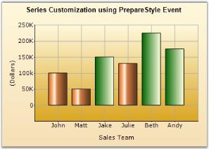

# Events in Windows Forms Chart

## Chart region events

Chart region events are raised when the user interacts with regions such as data points, axis labels, or custom chart regions.

The following chart region events are supported:

- [ChartRegionClick](https://help.syncfusion.com/cr/windowsforms/Syncfusion.Windows.Forms.Chart.ChartControl.html#Syncfusion_Windows_Forms_Chart_ChartControl_ChartRegionClick)
- [ChartRegionDoubleClick](https://help.syncfusion.com/cr/windowsforms/Syncfusion.Windows.Forms.Chart.ChartControl.html#Syncfusion_Windows_Forms_Chart_ChartControl_ChartRegionDoubleClick)
- [ChartRegionMouseDown](https://help.syncfusion.com/cr/windowsforms/Syncfusion.Windows.Forms.Chart.ChartControl.html#Syncfusion_Windows_Forms_Chart_ChartControl_ChartRegionMouseDown)
- [ChartRegionMouseUp](https://help.syncfusion.com/cr/windowsforms/Syncfusion.Windows.Forms.Chart.ChartControl.html#Syncfusion_Windows_Forms_Chart_ChartControl_ChartRegionMouseUp)
- [ChartRegionMouseEnter](https://help.syncfusion.com/cr/windowsforms/Syncfusion.Windows.Forms.Chart.ChartControl.html#Syncfusion_Windows_Forms_Chart_ChartControl_ChartRegionMouseEnter)
- [ChartRegionMouseHover](https://help.syncfusion.com/cr/windowsforms/Syncfusion.Windows.Forms.Chart.ChartControl.html#Syncfusion_Windows_Forms_Chart_ChartControl_ChartRegionMouseHover)
- [ChartRegionMouseMove](https://help.syncfusion.com/cr/windowsforms/Syncfusion.Windows.Forms.Chart.ChartControl.html#Syncfusion_Windows_Forms_Chart_ChartControl_ChartRegionMouseMove)
- [ChartRegionMouseLeave](https://help.syncfusion.com/cr/windowsforms/Syncfusion.Windows.Forms.Chart.ChartControl.html#Syncfusion_Windows_Forms_Chart_ChartControl_ChartRegionMouseLeave)

These events provide a [ChartRegionMouseEventArgs](https://help.syncfusion.com/cr/windowsforms/Syncfusion.Windows.Forms.Chart.ChartRegionMouseEventArgs.html) instance with the following properties:

- [Point](https://help.syncfusion.com/cr/windowsforms/Syncfusion.Windows.Forms.Chart.ChartRegionMouseEventArgs.html#Syncfusion_Windows_Forms_Chart_ChartRegionMouseEventArgs_Point) gets the client coordinate at which the event occurred.
- [Region](https://help.syncfusion.com/cr/windowsforms/Syncfusion.Windows.Forms.Chart.ChartRegionMouseEventArgs.html#Syncfusion_Windows_Forms_Chart_ChartRegionMouseEventArgs_Region) gets information about the chart region associated with the event.
- [Button](https://help.syncfusion.com/cr/windowsforms/Syncfusion.Windows.Forms.Chart.ChartRegionMouseEventArgs.html#Syncfusion_Windows_Forms_Chart_ChartRegionMouseEventArgs_Button) gets the mouse button actions.

The [Region](https://help.syncfusion.com/cr/windowsforms/Syncfusion.Windows.Forms.Chart.ChartRegionMouseEventArgs.html#Syncfusion_Windows_Forms_Chart_ChartRegionMouseEventArgs_Region)  provides useful information about the chart region with which the user is currently interacting.

The [ChartRegion](https://help.syncfusion.com/cr/windowsforms/Syncfusion.Windows.Forms.Chart.ChartRegion.html) object provides the following properties:

- [Description](https://help.syncfusion.com/cr/windowsforms/Syncfusion.Windows.Forms.Chart.ChartRegion.html#Syncfusion_Windows_Forms_Chart_ChartRegion_Description) - Gets the description of the chart region.
- [Type](https://help.syncfusion.com/cr/windowsforms/Syncfusion.Windows.Forms.Chart.ChartRegion.html#Syncfusion_Windows_Forms_Chart_ChartRegion_Type) - Gets the type of chart region, such as a series point, horizontal axis label, vertical axis label, or custom region. It support the following values:
  - [Axis](https://help.syncfusion.com/cr/windowsforms/Syncfusion.Windows.Forms.Chart.ChartRegionType.html#Syncfusion_Windows_Forms_Chart_ChartRegionType_Axis) 
  - [CalloutLabel](https://help.syncfusion.com/cr/windowsforms/Syncfusion.Windows.Forms.Chart.ChartRegionType.html#Syncfusion_Windows_Forms_Chart_ChartRegionType_CalloutLabel)
  - [ChartCustom](https://help.syncfusion.com/cr/windowsforms/Syncfusion.Windows.Forms.Chart.ChartRegionType.html#Syncfusion_Windows_Forms_Chart_ChartRegionType_ChartCustom)
  - [HorAxisLabel](https://help.syncfusion.com/cr/windowsforms/Syncfusion.Windows.Forms.Chart.ChartRegionType.html#Syncfusion_Windows_Forms_Chart_ChartRegionType_HorAxisLabel)
  - [SeriesPoint](https://help.syncfusion.com/cr/windowsforms/Syncfusion.Windows.Forms.Chart.ChartRegionType.html#Syncfusion_Windows_Forms_Chart_ChartRegionType_SeriesPoint)
  - [Unknown](https://help.syncfusion.com/cr/windowsforms/Syncfusion.Windows.Forms.Chart.ChartRegionType.html#Syncfusion_Windows_Forms_Chart_ChartRegionType_Unknown)
  - [VerAxisLabel](https://help.syncfusion.com/cr/windowsforms/Syncfusion.Windows.Forms.Chart.ChartRegionType.html#Syncfusion_Windows_Forms_Chart_ChartRegionType_VerAxisLabel)

- [IsChartPoint](https://help.syncfusion.com/cr/windowsforms/Syncfusion.Windows.Forms.Chart.ChartRegion.html#Syncfusion_Windows_Forms_Chart_ChartRegion_IsChartPoint) - Indicates whether the region represents a data point in a chart series.
- [SeriesIndex](https://help.syncfusion.com/cr/windowsforms/Syncfusion.Windows.Forms.Chart.ChartRegion.html#Syncfusion_Windows_Forms_Chart_ChartRegion_SeriesIndex) - Gets the index of the series that contains the interacted data point.
- [PointIndex](https://help.syncfusion.com/cr/windowsforms/Syncfusion.Windows.Forms.Chart.ChartRegion.html#Syncfusion_Windows_Forms_Chart_ChartRegion_PointIndex) - Gets the index of the interacted data point within the series.
- [Region](https://help.syncfusion.com/cr/windowsforms/Syncfusion.Windows.Forms.Chart.ChartRegion.html#Syncfusion_Windows_Forms_Chart_ChartRegion_Region) - Gets the client area occupied by the chart region.
- [ToolTip](https://help.syncfusion.com/cr/windowsforms/Syncfusion.Windows.Forms.Chart.ChartRegion.html#Syncfusion_Windows_Forms_Chart_ChartRegion_ToolTip) - Specifies the tooltip text associated with the chart region.

N> The [SeriesIndex](https://help.syncfusion.com/cr/windowsforms/Syncfusion.Windows.Forms.Chart.ChartRegion.html#Syncfusion_Windows_Forms_Chart_ChartRegion_SeriesIndex) and [PointIndex](https://help.syncfusion.com/cr/windowsforms/Syncfusion.Windows.Forms.Chart.ChartRegion.html#Syncfusion_Windows_Forms_Chart_ChartRegion_PointIndex) properties are applicable when the region [Type](https://help.syncfusion.com/cr/windowsforms/Syncfusion.Windows.Forms.Chart.ChartRegion.html#Syncfusion_Windows_Forms_Chart_ChartRegion_Type) is `SeriesPoint`.

The following code example demonstrates how to handle the `ChartRegionDoubleClick` and `ChartRegionMouseDown` events.



this.chartControl.ChartRegionDoubleClick += chartControl_ChartRegionDoubleClick;

private void chartControl_ChartRegionDoubleClick(
    object sender, ChartRegionMouseEventArgs e)
{
if (this.chartRegionDoubleClick.Checked)
    {
        if (e.Region.SeriesIndex == 0)
        {
            OutputText(String.Format("Double Click over Series 1 Column {0} Point : {1}", e.Region.PointIndex,e.Point));
            ShowChartRegion("ChartSeries");
        }
        else
        {
            OutputText(String.Format("Double Click over {0}", e.Region.Description.ToString()));
            ShowChartRegion(e.Region.Description.ToString());
        }
    }
}

this.chartControl.ChartRegionMouseDown += chartControl_ChartRegionMouseDown;

private void chartControl_ChartRegionMouseDown(object sender, ChartRegionMouseEventArgs e)
{
    if (e.Button == MouseButtons.Right)
    {
        Console.WriteLine("Chart region mouse down: " + e.Point);
    }
}




'ChartRegionDoubleClick Event
AddHandler Me.chartControl.ChartRegionDoubleClick, AddressOf chartControl_ChartRegionDoubleClick

Private Sub chartControl_ChartRegionDoubleClick(ByVal sender As Object, ByVal e As ChartRegionMouseEventArgs)
    If Me.chartRegionDoubleClick.Checked Then
        If e.Region.SeriesIndex = 0 Then
            OutputText([String].Format("Double Click over Series 1 Column {0} Point : {1}", e.Region.PointIndex, e.Point))
            ShowChartRegion("ChartSeries")
        Else
            OutputText([String].Format("Double Click over {0}", e.Region.Description.ToString()))
            ShowChartRegion(e.Region.Description.ToString())
        End If
    End If
End Sub

'Usage of Button property in ChartRegionMouseDown Event
AddHandler Me.chartControl.ChartRegionMouseDown, AddressOf chartControl_ChartRegionMouseDown

Private Sub chartControl_ChartRegionMouseDown(ByVal sender As Object, ByVal e As ChartRegionMouseEventArgs)
      If e.Button = MouseButtons.Right Then
        Console.WriteLine("Chart Region Mouse Down:="+e.Point.ToString())
    End If
End Sub



## VisibleRangeChanged

The [VisibleRangeChanged](https://help.syncfusion.com/cr/windowsforms/Syncfusion.Windows.Forms.Chart.ChartControl.html#Syncfusion_Windows_Forms_Chart_ChartControl_VisibleRangeChanged) event is raised when the visible range of the chart changes during zooming.

The following code example demonstrates how to handle the `VisibleRangeChanged` event.



this.chartControl.VisibleRangeChanged += chartControl_VisibleRangeChanged;

private void chartControl_VisibleRangeChanged(object sender, EventArgs e)
{
    Console.WriteLine("Visible range changed event is raised.");
}


AddHandler Me.chartControl.VisibleRangeChanged, AddressOf chartControl_VisibleRangeChanged

Private Sub chartControl_VisibleRangeChanged(ByVal sender As Object, ByVal e As EventArgs)
    Console.WriteLine("Visible range changed event is raised.")
End Sub



## PrepareStyle

The [PrepareStyle](https://help.syncfusion.com/cr/windowsforms/Syncfusion.Windows.Forms.Chart.ChartSeries.html#Syncfusion_Windows_Forms_Chart_ChartSeries_PrepareStyle) event is raised before a series point is rendered. Use the event arguments to customize the style of an individual data point.

The following code example changes the appearance of points that meet the specified sales quota.



series.PrepareStyle += new ChartPrepareStyleInfoHandler(series_PrepareStyle);

private void series_PrepareStyle(object sender, ChartPrepareStyleInfoEventArgs args)
{
    ChartSeries series = sender as ChartSeries ;
        if(series != null)    
    {
        //Condition to select members (data points) who made 100 % quota in sales
        if(((series.Points[args.Index].YValues[0] / 150) * 100) >= 100)
            {
                args.Style.Interior = new Syncfusion.Drawing.BrushInfo(Syncfusion.Drawing.GradientStyle.Horizontal, System.Drawing.Color.DarkGreen, System.Drawing.Color.LightYellow);
            }
    }
}


AddHandler series.PrepareStyle, AddressOf series_PrepareStyle

Private Sub series_PrepareStyle(ByVal sender As Object, ByVal args As ChartPrepareStyleInfoEventArgs)
    Dim series As ChartSeries = TryCast(sender, ChartSeries)
    If series IsNot Nothing Then
        'Condition to select members (data points) who made 100 % quota in sales
        If ((series.Points(args.Index).YValues(0) / 150) * 100) >= 100 Then
            args.Style.Interior = New Syncfusion.Drawing.BrushInfo(Syncfusion.Drawing.GradientStyle.Horizontal, System.Drawing.Color.DarkGreen, System.Drawing.Color.LightYellow)
        End If
    End If
End Sub



## SeriesIncompatible

The [SeriesIncompatible](https://help.syncfusion.com/cr/windowsforms/Syncfusion.Windows.Forms.Chart.ChartControl.html#Syncfusion_Windows_Forms_Chart_ChartControl_SeriesIncompatible) event is raised when the Chart control detects that one or more series cannot be rendered together because their chart types or configurations are incompatible.

The following code example demonstrates how to handle the `SeriesIncompatible` event.



this.chartControl.SeriesIncompatible += chartControl_SeriesIncompatible;

private void chartControl_SeriesIncompatible(object sender, EventArgs e)
{
    Console.WriteLine("An incompatible series combination was detected.");
}


AddHandler Me.chartControl.SeriesIncompatible,
    AddressOf chartControl_SeriesIncompatible

Private Sub chartControl_SeriesIncompatible(ByVal sender As Object, ByVal e As EventArgs)
    Console.WriteLine("An incompatible series combination was detected.")
End Sub



## LayoutCompleted

The [LayoutCompleted](https://help.syncfusion.com/cr/windowsforms/Syncfusion.Windows.Forms.Chart.ChartControl.html#Syncfusion_Windows_Forms_Chart_ChartControl_LayoutCompleted) event is raised when the chart is resized or re-rendered. This event is useful for rendering custom images or positioning custom controls over the chart after the layout is completed.

The following code example demonstrates how to handle the `LayoutCompleted` event.



this.chartControl.LayoutCompleted += chartControl_LayoutCompleted;

private void chartControl_LayoutCompleted(object sender, EventArgs e)
{
    Console.WriteLine("Layout Completed event is raised.");
}


AddHandler Me.chartControl.LayoutCompleted, AddressOf chartControl_LayoutCompleted

Private Sub chartControl_LayoutCompleted(ByVal sender As Object, ByVal e As EventArgs)
    Console.WriteLine("Layout Completed event is raised.")
End Sub



## PreChartAreaPaint event

The [PreChartAreaPaint](https://help.syncfusion.com/cr/windowsforms/Syncfusion.Windows.Forms.Chart.ChartControl.html#Syncfusion_Windows_Forms_Chart_ChartControl_PreChartAreaPaint) event is raised before the chart area is painted.

The following code example changes the background color before the chart area is painted.



this.chartControl.PreChartAreaPaint += new System.Windows.Forms.PaintEventHandler(this.chartControl1_PreChartAreaPaint);;

private void chartControl_PreChartAreaPaint(object sender, PaintEventArgs e)
{
    this.chartControl.BackColor = Color.Yellow;
}


AddHandler Me.chartControl.PreChartAreaPaint, AddressOf chartControl_PreChartAreaPaint

Private Sub chartControl_PreChartAreaPaint(ByVal sender As Object, ByVal e As PaintEventArgs)
    Me.chartControl.BackColor = Color.Yellow
End Sub



## See also

- [How to drag chart series points at runtime in Windows Forms Chart](https://help.syncfusion.com/windowsforms/chart/faq/how-to-drag-the-chart-series-points-at-run-time)
- [How to drag and drop chart series points at runtime in WinForms Chart](https://support.syncfusion.com/kb/article/1193/how-to-drag-and-drop-chart-series-points-at-runtime-in-winforms-chart)
- [How to trigger the ChartRegionEvents in the WinForms Chart](https://support.syncfusion.com/kb/article/1194/how-to-trigger-the-chartregionevents-in-the-winforms-chart)
- [How to implement drill down effect in WinForms Chart](https://support.syncfusion.com/kb/article/1017/how-to-implement-drill-down-effect-in-winforms-chart)