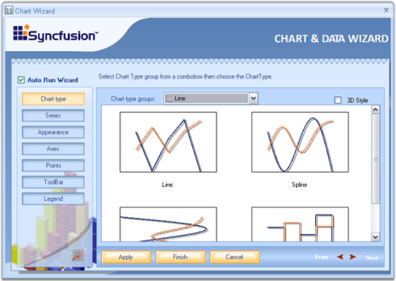
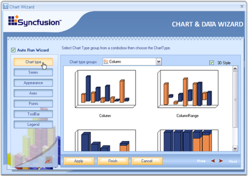
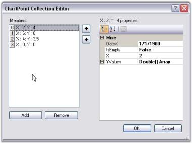
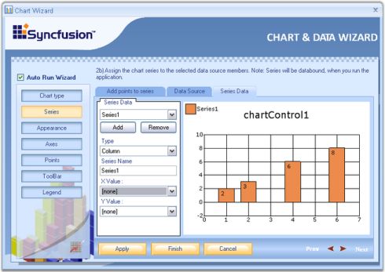
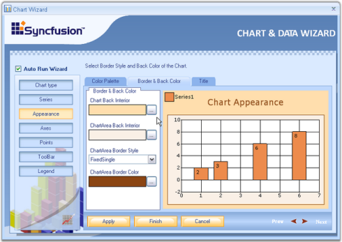
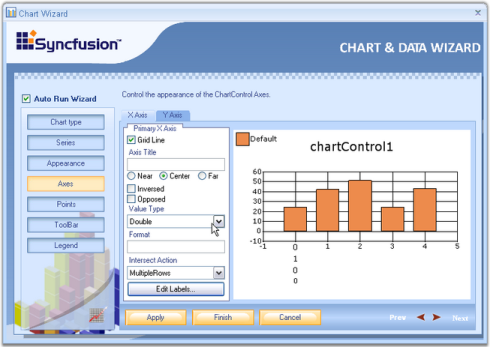
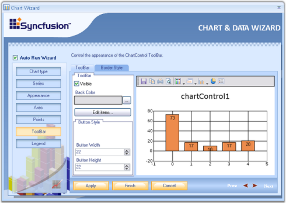
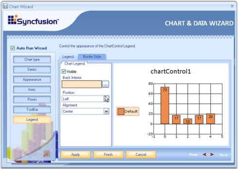
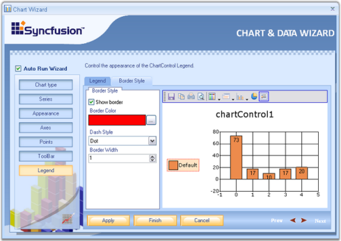
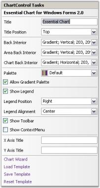

# Design Time Features

The design time features are discussed in the below topics:

## Chart Wizard

The Chart Wizard is a very convenient tool to setup the Chart during design-time.

The Wizard neatly categorizes the different portions of the Chart, and lets you customize the most common properties of these different portions easily.

### Key features of the Chart wizard

1. Can create various types of chart.
2. Add series dynamically when the application is running.
3. Change the appearance of the chart with the various options that are provided to change the color palette, back color and title of the chart.
4. Customize the axes of the chart such as changing the range and labels.
5. Provides support for customization of the chart legend.
6. Customize the chart control's toolbar.
7. Lets you customize the point labels.

This section describes about the functionality of the chart wizard. 

### Design Time

To display the chart wizard at design-time, follow the below steps.

1. Add a [ChartControl](https://help.syncfusion.com/cr/cref_files/windowsforms/Syncfusion.Chart.Windows~Syncfusion.Windows.Forms.Chart.ChartControl.html) to your form.
2. Right-click anywhere in the chart to see a context menu.
3. Select the chart wizard item from the context menu.

### At Run Time

Optionally, you can also let your users to invoke this Wizard during run-time to let them customize the Chart's look and feel. To invoke the Chart wizard at runtime, use the below code.





this.chartControl1.DisplayWizard();





Me.chartControl1.DisplayWizard()





The wizard provides six different categories whose settings can be customized.

1. [Chart type](#chart-type) to let you visualize and select the type of chart to display.
2. [Series](#series) to let you add custom series to the chart and also setup data binding.
3. [Appearance](#appearance) to customize the color, font etc. of the [ChartControl](https://help.syncfusion.com/cr/cref_files/windowsforms/Syncfusion.Chart.Windows~Syncfusion.Windows.Forms.Chart.ChartControl.html) and [ChartArea](https://help.syncfusion.com/cr/cref_files/windowsforms/Syncfusion.Chart.Base~Syncfusion.Windows.Forms.Chart.ChartArea.html).
4. [Axes](#axes) to change the chart control's axes settings.
5. [Points](#points) to customize the point labels.
6. [Legend](#legend) to set the properties of the legend area.
7. [Toolbar](#toolbar) to customize the various properties of the toolbar.

There is a preview panel where a Chart is rendered with the latest settings. The sub topics of this section will guide you through these settings.

After making necessary changes, click the Apply button to apply those settings in the chart and finally, click the Finish to close the Wizard.

## Chart Type

In this view, you can visually see the different chart types that could be used to render your data points. Simply click on the image of the chart type to pick the type you are interested in.

3D Style - The chart will be rendered in 3D mode. Corresponds to the [Series3D](https://help.syncfusion.com/cr/cref_files/windowsforms/Syncfusion.Chart.Windows~Syncfusion.Windows.Forms.Chart.ChartControl~Series3D.html) property.



[Chart Types](/windowsforms/chart/chart-types)



## Series

A Chart can display multiple series. Properties such as [Name](https://help.syncfusion.com/cr/cref_files/windowsforms/Syncfusion.Chart.Base~Syncfusion.Windows.Forms.Chart.ChartSeries~Name.html), Data source, Series Data can be set or changed for any of the series, easily, through this wizard.

Below are the three tabs in the Wizard for Series.

**Add points to series**

1.Click Add button to add a new series.

2.Select the series to which you need to add points.

3.This tab provides options to select any chart type using the Type combobox and series name using Series Name textbox.

4.Clicking the Edit points button, opens the ChartPoint Collection Editor.

  

5.Click Add button to add points to the series and give X and Y values. Then, click OK.

**Data source**

The data source to connect with, can be selected using the data source page. Once the data source is selected, it will guide you through the connectivity steps. Refer [Data Binding in Chart Through Chart Wizard](http://help.syncfusion.com/windowsforms/chart/chart-data#data-binding-in-chart-through-chart-wizard) topic for detailed information. This topic describes data binding techniques at the design-time through Chart Wizard tools.

**Series Data**

Using this tab, we can change the type of the chart. Whenever an external data source is selected using the Data Source tab, XValue and YValue ComboBox will be supplied with all the column names of the external data source.

Select one column for XValue and another for YValue, between which you wanted to draw the chart. Refer [Data Binding in Chart Through Chart Wizard](http://help.syncfusion.com/windowsforms/chart/chart-data#data-binding-in-chart-through-chart-wizard) topic for detailed information.



[Chart Series](http://help.syncfusion.com/windowsforms/chart/chart-series)



## Appearance

Customize the appearance of the [ChartControl](https://help.syncfusion.com/cr/cref_files/windowsforms/Syncfusion.Chart.Windows~Syncfusion.Windows.Forms.Chart.ChartControl.html) easily through the Chart Wizard. Here the appearance of the chart control and chart area such as color, font etc. can be set.

There are three tabs available in the wizard, for appearance settings.

* **Color Palette** -Essential Chart comes with a variety of built-in palettes. You can pick one of the palettes from the list and also get a preview of how the chart would look like. Note that you can also add a custom palette to the chart, but that has to be done in code.
* **Border and Back Color** - Under this tab, the back color for the chart control as well as for the chart area can be set. The user can also set the Border color and Border style for the chart area. 
* **Title** - This gives options to set the title for the chart control. Also the position, alignment and color of the title can be set.

 

[Appearance Settings](http://help.syncfusion.com/windowsforms/chart/chart-appearance)

 

## Axes

Various settings like grid line, axis title, value type, formats and other axes settings can be done using the wizard.

The below properties can be set separately for x-axis and y-axis. 

* **Grid Lines** - Lets you show/hide the grid lines for this axis.
* **Axis Title** - The title text for the axis can be specified here.
* **Inversed, Opposed** - Specifies whether the axes are inversed, opposed.
* **Value Type** - If you know the type of data points you will be adding to this axis, specify it using the combo box. Possible value types are double, datetime, custom and logarithmic.
* **Format** - Specifies the label format.
* **Edit Labels** - The labels at the axes can be varied by entering the values in the Collection Editor Dialog box, which pops up when the Edit Labels button is clicked.

* **Collection Editor Dialog** - Click the Add button to add a label to the collection. Select the added label to view its properties on its right side. The color of the label, font, value type and so on can be changed using the properties window. If any label needs to be removed from the collection editor, select the label and click the Remove button. After adding all the values to the collection and making the necessary changes in the properties, click OK. In a similar way the labels can be edited for y-axis also.



[Chart Axes](http://help.syncfusion.com/windowsforms/chart/chart-axes)



## Points

It lets you display labels for the data points by simply checking Show labels option. 

* **Labels Font** - Sets font style for the labels.
* **Labels Color** - Sets color for the labels.
* **Labels Rotate Angle** - Sets the angle of rotation of the labels.
* **Label Alignment** - Sets the alignment of the labels on the series points.
* **Apply To** - Specifies the series name to which the above settings should be applied.

## Toolbar

The final option in the Chart Wizard is the [ChartControl](https://help.syncfusion.com/cr/cref_files/windowsforms/Syncfusion.Chart.Windows~Syncfusion.Windows.Forms.Chart.ChartControl.html) ToolBar. It has two tabs.

* ToolBar
* BorderStyle

**ToolBar**

Under this tab, the user can customize the toolbar's back color, button style as well as set width and Height for the buttons through the respective options.

* Edit Item

Clicking the Edit Items button will invoke the below editor. It provides options to change the image, name and tooltip for individual items.

**Border Style**

Toolbar's border, border style, border width and border color can be set through this tab.



[Chart Toolbar](http://help.syncfusion.com/windowsforms/chart/runtime-features#toolbars)



## Legend

The various properties of the chart legend such as [Position](https://help.syncfusion.com/cr/cref_files/windowsforms/Syncfusion.Chart.Windows~Syncfusion.Windows.Forms.Chart.ChartLegend~Position.html), [Alignment](https://help.syncfusion.com/cr/cref_files/windowsforms/Syncfusion.Chart.Windows~Syncfusion.Windows.Forms.Chart.ChartLegend~Alignment.html), [Orientation](https://help.syncfusion.com/cr/cref_files/windowsforms/Syncfusion.Chart.Windows~Syncfusion.Windows.Forms.Chart.ChartLegend~Orientation.html) etc., can be changed easily using this wizard. It has two tabs.

* Legend
* BorderStyle

**Legend**

Legend - In this window, the user can customize the legend's visibility, set it's position and alignment using Position and Alignment combo boxes provided. You can also set back interior color using Back Interior combo box.

**BorderStyle**

Border Style - Here the user can set custom borders to the legend. The visibility of the border, border color, its Dash style as well as the Border Width can be set easily by selecting the appropriate options.



[Chart Legend](http://help.syncfusion.com/windowsforms/chart/chart-legend-and-legend-items)



## Chart Templates

EssentialChart provides support to save the series and point properties as XML file. This enables you to save the series and point properties into chart template and load the chart templates into the [Chart Control](https://help.syncfusion.com/cr/cref_files/windowsforms/Syncfusion.Chart.Windows~Syncfusion.Windows.Forms.Chart.ChartControl.html) when needed. 

### Use Case Scenarios

When you want to create charts with consistent look and feel, you can utilize this feature. You can load the saved chart source to achieve this. 

### Working with Chart Template

Essential Chart is now associated with the creation and loading of chart templates into the [ChartControl](https://help.syncfusion.com/cr/cref_files/windowsforms/Syncfusion.Chart.Windows~Syncfusion.Windows.Forms.Chart.ChartControl.html). It provides easy methods to save and load the templates. This section will walk you through the saving, loading and resetting of the chart templates and the various benefits of using it.

### Benefits

* Aesthetic items like appearance, positioning etc., of a chart can be saved in the template.
* Appearance settings saved in a Chart Template is reusable.
* Stores any static data, if available in the chart.
* The user can save the existing structure of the chart control to an .xml file format.
* All the charts in your applications can be created with consistent look and feel.

### Save Template

The appearance settings for various components of a Chart like [ChartSeries](https://help.syncfusion.com/cr/cref_files/windowsforms/Syncfusion.Chart.Base~Syncfusion.Windows.Forms.Chart.ChartSeries.html), [ChartArea](https://help.syncfusion.com/cr/cref_files/windowsforms/Syncfusion.Chart.Base~Syncfusion.Windows.Forms.Chart.ChartArea.html), Series properties and Point properties can be stored in a template, which can be loaded into new [Chart Control](https://help.syncfusion.com/cr/cref_files/windowsforms/Syncfusion.Chart.Windows~Syncfusion.Windows.Forms.Chart.ChartControl.html) when needed.

A chart template can contain the properties of more than one data series. When such templates are loaded into a destination [ChartControl](https://help.syncfusion.com/cr/cref_files/windowsforms/Syncfusion.Chart.Base~Syncfusion.Windows.Forms.Chart.ChartSeries.html), the appearance settings of the data series will be applied in a sequential order, i.e., the first set of appearance settings of a data series will be applied to the destination Chart's first series and the second set of appearance properties of the data series will be applied to the destination Chart's second series and so on. 

If the destination collection's length is larger than the source collection, then the settings will repeat itself for these additional entries in the destination collection.

These Charts can be saved as templates in the below two ways.

* Selecting the **Save Template** option from the context menu as shown above.
* By clicking the **Save Template** designer verb in the Visual Studio property browser as shown above.

[ChartTemplate](https://help.syncfusion.com/cr/cref_files/windowsforms/Syncfusion.Chart.Base~Syncfusion.Windows.Forms.Chart.ChartTemplate.html) has a static method to save the data programmatically. We need to pass [ChartControl](https://help.syncfusion.com/cr/cref_files/windowsforms/Syncfusion.Chart.Windows~Syncfusion.Windows.Forms.Chart.ChartControl.html) instance and a file name(it can accept stream file also.), through this save method.

  



ChartTemplate.Save(this.chartControl1, "TemplateName.xml");





ChartTemplate.Save(Me.chartControl1, "TemplateName.xml")




### Load Template

EssentialChart provides support to load the saved [Chart Template](https://help.syncfusion.com/cr/cref_files/windowsforms/Syncfusion.Chart.Windows~Syncfusion.Windows.Forms.Chart.ChartControl.html) into a new chart control. This loads the series properties and the point properties, which was saved in a XML file and applies these properties into the new chart control.

* Selecting the **Load Template** from the context menu at the design time.
* By clicking the **Load Template** designer verb in the Visual Studio property browser. 

[ChartTemplate](https://help.syncfusion.com/cr/cref_files/windowsforms/Syncfusion.Chart.Windows~Syncfusion.Windows.Forms.Chart.ChartControl.html) has static method to load the template data programmatically. We need to pass the ChartControl which will be applied with the loaded template data.

### Reset Template

The [ChartControl](https://help.syncfusion.com/cr/cref_files/windowsforms/Syncfusion.Chart.Base~Syncfusion.Windows.Forms.Chart.ChartSeries.html), which when loaded with a template will be applied with the appearance and other settings that were stored in the template. These settings can be reset and the Chart can be reverted back to its original appearance by using the below two methods.

* Selecting the **Reset Template** from the context menu at the design time.
* By clicking the **Reset Template** link in the Visual Studio property browser.

[ChartTemplate](https://help.syncfusion.com/cr/cref_files/windowsforms/Syncfusion.Chart.Windows~Syncfusion.Windows.Forms.Chart.ChartControl.html) can be reset using the following simple statements,

  



ChartTemplate ct = new ChartTemplate();

ct.Reset(this.chartControl1);





ChartTemplate ct = New ChartTemplate()

ct.Reset(Me.chartControl1)




### Sample Link

**To view a sample:**

1. Open the Syncfusion Dashboard.
2. Select User Interface -> Windows Forms.
3. Click Run Samples.
4. Navigate to Chart samples -> User Interaction -> ChartSerialization. 

## Tasks Window

The tasks window has sufficient properties exposed in the right manner for users to be able to get started intuitively.

### Tasks

#### Title

Used to add title to the Chart directly from the Tasks Window.

##### Title Position

Specifies the position relative to the chart at which to render the chart title panel.

<table>
<tr>
<th>
ChartTitle.Position Property</th><th>
Description</th></tr>
<tr>
<td>
Top</td><td>
Above the chart; default setting.</td></tr>
<tr>
<td>
Left</td><td>
Left of the chart.</td></tr>
<tr>
<td>
Right</td><td>
Right of the chart.</td></tr>
<tr>
<td>
Bottom</td><td>
Bottom of the chart.</td></tr>
<tr>
<td>
Floating</td><td>
Will not be docked to any specific location. Can be docked manually by dragging the title panel.</td></tr>
</table>

### Back Interior

Specifies background brush of the control.

#### Area Back Interior

Specifies background brush of [Chart Area](https://help.syncfusion.com/cr/cref_files/windowsforms/Syncfusion.Chart.Base~Syncfusion.Windows.Forms.Chart.ChartArea.html) of the control.

#### Chart Back Interior

Specifies background brush of [ChartInterior](https://help.syncfusion.com/cr/cref_files/windowsforms/Syncfusion.Chart.Windows~Syncfusion.Windows.Forms.Chart.ChartControl~ChartInterior.html).

### Palette

The [Palette](https://help.syncfusion.com/cr/cref_files/windowsforms/Syncfusion.Chart.Windows~Syncfusion.Windows.Forms.Chart.ChartControl~Palette.html) that is to be used to provide default colors for the chart series and other chart elements. [AllowGradientPalette](https://help.syncfusion.com/cr/cref_files/windowsforms/Syncfusion.Chart.Windows~Syncfusion.Windows.Forms.Chart.ChartControl~AllowGradientPalette.html) property is used to enable or disable the gradient values of the palettes.

### ShowLegend

Specifies if the legend is to be displayed or not.

#### Legend Position

Configuration information of the Legend object.

<table>
<tr>
<th>
ChartLegend.Position Property</th><th>
Description</th></tr>
<tr>
<td>
Top</td><td>
Positions the legend panel to the Top of Chart.</td></tr>
<tr>
<td>
Left</td><td>
Positions the legend panel to the Left of Chart.</td></tr>
<tr>
<td>
Right</td><td>
Positions the legend panel to the Right of Chart.</td></tr>
<tr>
<td>
Bottom</td><td>
Positions the legend panel to the Bottom of Chart.</td></tr>
<tr>
<td>
Floating</td><td>
Will not be docked to any specific location. Can be docked manually by dragging the Legend panel.</td></tr>
</table>

#### Legend Alignment

Gets or sets the legend alignment. 

<table>
<tr>
<th>
ChartLegend.Alignment Property</th><th>
Description</th></tr>
<tr>
<td>
Center</td><td>
Aligns to center of chart.</td></tr>
<tr>
<td>
Far</td><td>
Aligns to Far of chart.</td></tr>
<tr>
<td>
Near</td><td>
Aligns to Near of chart.</td></tr>
</table>

### Show ToolBar

Specifies if the ToolBar is to be displayed or not.

### Show ContextMenu

Specifies if the ToolBar context menu is to be displayed or not.

### X Axis Title

Specifies the Title of Primary x axis.

### Y Axis Title

Specifies the Title of Primary y axis.

### Spacing between Points

Specifies the spacing between the series points.