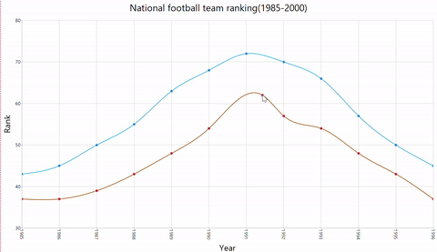

# How to drag the Chart Series Points at run time

You can drag the chart series points by calculating new x and y values while handling any of the ChartRegionMouse Events likeMouseUp, MouseDown, MouseHover, MouseLeave, and so forth, on the chart. The new x and y values of the series are calculated from the mouse point, and GetValueByPoint which returns the x and y values of the mouse point calculated from the Chart Point.

The following code snippet must be given under the mouse event handler of the ChartRegionMouse event.





public class Form1 : MetroForm
{
    #region Private Members
    private int seriesIndex = -1;
    private int selectedIndex = -1;
    private bool isSelected = false;

    private void InitializeComponent()
    {
        //
        // Chart definition
        //
        this.chartControl1.ChartRegionMouseDown += ChartControl1_ChartRegionMouseDown;
        this.chartControl1.ChartRegionMouseMove += ChartControl1_ChartRegionMouseMove;
        this.chartControl1.ChartRegionMouseUp += ChartControl1_ChartRegionMouseUp;
    }

    private void ChartControl1_ChartRegionMouseUp(object sender, ChartRegionMouseEventArgs e) 
    {
        if(isSelected) 
        { 
            isSelected = false;
            selectedIndex = -1;
            seriesIndex = -1;
        }
    }

    private void ChartControl1_ChartRegionMouseMove(object sender, ChartRegionMouseEventArgs e) 
    {
        if(isSelected)
        {
            double newY = Math.Floor(this.chartControl1.ChartArea.GetValueByPoint(e.Point).YValues[0]);
            double newX = this.chartControl1.ChartArea.GetValueByPoint(e.Point).X;

            if (seriesIndex != -1 && selectedIndex != -1) 
            {
                this.chartControl1.Series[seriesIndex].Points[selectedIndex].X = newX;
                this.chartControl1.Series[seriesIndex].Points[selectedIndex].YValues[0] = newY;
            }
        }
    }

    private void ChartControl1_ChartRegionMouseDown(object sender, ChartRegionMouseEventArgs e) 
    {
        if(e.Region != null && isSelected == false) 
        {
            seriesIndex = e.Region.SeriesIndex;
            selectedIndex = e.Region.PointIndex;
            isSelected = true;
        }
    }
}





Partial Class Form1
    Inherits System.Windows.Forms.Form

    Private seriesIndex As Integer = -1
    Private selectedIndex As Integer = -1
    Private isSelected As Boolean = False

    Private Sub InitializeComponent()
        '
        ' Chart Definition
        '
        AddHandler Me.ChartControl1.ChartRegionMouseUp, AddressOf Me.ChartControl1_ChartRegionMouseUp
        AddHandler Me.ChartControl1.ChartRegionMouseDown, AddressOf Me.ChartControl1_ChartRegionMouseDown
        AddHandler Me.ChartControl1.ChartRegionMouseMove, AddressOf Me.ChartControl1_ChartRegionMouseMove
    End Sub

    Private Sub ChartControl1_ChartRegionMouseMove(sender As Object, e As ChartRegionMouseEventArgs)
        If isSelected = True Then
            Dim newY As Double = Math.Floor(Me.ChartControl1.ChartArea.GetValueByPoint(e.Point).YValues(0))
            Dim newX As Double = Me.ChartControl1.ChartArea.GetValueByPoint(e.Point).X

            If seriesIndex <> -1 AndAlso selectedIndex <> -1 Then
                Me.ChartControl1.Series(seriesIndex).Points(selectedIndex).X = newX
                Me.ChartControl1.Series(seriesIndex).Points(selectedIndex).YValues(0) = newY
            End If
        End If
    End Sub

    Private Sub ChartControl1_ChartRegionMouseDown(sender As Object, e As ChartRegionMouseEventArgs)
        If e.Region IsNot Nothing AndAlso isSelected = False Then
            seriesIndex = e.Region.SeriesIndex
            selectedIndex = e.Region.PointIndex
            isSelected = True
        End If
    End Sub

    Private Sub ChartControl1_ChartRegionMouseUp(sender As Object, e As ChartRegionMouseEventArgs)
        If isSelected Then
            isSelected = False
            selectedIndex = -1
            seriesIndex = -1
        End If
    End Sub

End Class





