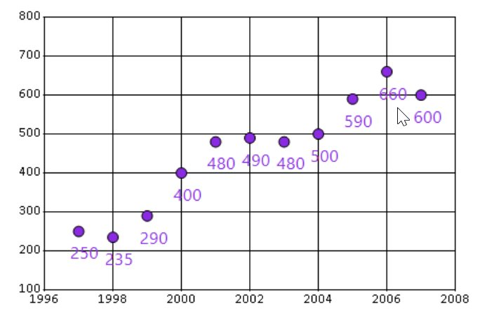

# How to draw custom series using ChartSeriesRenderer

The chart series renderer allows you draw the series as required with chart helper functions and graphics objects.

The following code sample demonstrates how to draw custom series using chart series renderer.





      //Registering custom renderer to draw scatter series manually
      ChartSeries series = new ChartSeries("series", ChartSeriesType.Custom);            
      series.Renderer = new CustomScatterRenderer(series);





      //Registering custom renderer to draw scatter series manually
      ChartSeries series = new ChartSeries("series", ChartSeriesType.Custom);            
      series.Renderer = new CustomScatterRenderer(series);



	

The following code sample demonstrates how to implement a custom series renderer.




// Custom renderer should extend ChartSeriesRenderer with a parameterized constructor and implement the Renderer method
    public class CustomScatterRenderer : ChartSeriesRenderer
    {
        public CustomScatterRenderer(ChartSeries series)
            : base(series)
        {
        }
        public override void Render(ChartRenderArgs2D args)
        {
            IndexRange visibleRange = this.CalculateVisibleRange();
            ChartStyledPoint[] styledPoints = this.PreparePoints();

            Graphics g = (Graphics)args.Graph.GetType().GetProperty("Graphics").GetValue(args.Graph);

            Brush br = new SolidBrush(Color.BlueViolet);
            Pen pen = new Pen(Color.Black);
            Font font = new Font("Segoe UI", 12);

            for (int i = visibleRange.From; i <= visibleRange.To; i++)
            {
                ChartStyledPoint point = styledPoints[i];

                if (point.IsVisible)
                {
                    GraphicsPath gp = new GraphicsPath();
                    PointF ptF = args.GetPoint(point.X, point.YValues[0]);
                    Size size = point.Style.Symbol.Size;

                    //Drawing custom symbol
                    gp.AddEllipse(ptF.X - size.Width / 2, ptF.Y - size.Height / 2, size.Width, size.Height);
                    g.FillPath(br, gp);
                    g.DrawPath(pen, gp);

                    //Drawing custom text
                    Point textPoint = Point.Round(ptF);
                    textPoint.Offset(-10, size.Height);
                    g.DrawString(point.YValues[0].ToString(), font, br, textPoint);

                    //Tooltip for Scatter symbols
                    if (this.Chart.NeedRegionUpdate)
                    {
                        Region region = new Region(gp);
                        this.Chart.ChartRegions.Add(new ChartRegion(region, this.Chart.Series.IndexOf(m_series), point.Index, point.ToolTip, "Symbol"));
                    }
                }
            }

            //Disposing Pen, Brush and Font objects
            font.Dispose();
            br.Dispose();
            pen.Dispose();
        }
    }





// Custom renderer should extend ChartSeriesRenderer with a parameterized constructor and implement the Renderer method
   Public Class CustomScatterRenderer Inherits ChartSeriesRenderer

    Public Sub New(ByVal series As ChartSeries)
        MyBase.New(series)
    End Sub

    Public Overrides Sub Render(ByVal args As ChartRenderArgs2D)
        Dim visibleRange As IndexRange = Me.CalculateVisibleRange()
        Dim styledPoints As ChartStyledPoint() = Me.PreparePoints()
        Dim g As Graphics = CType(args.Graph.[GetType]().GetProperty("Graphics").GetValue(args.Graph), Graphics)
        Dim br As Brush = New SolidBrush(Color.BlueViolet)
        Dim pen As Pen = New Pen(Color.Black)
        Dim font As Font = New Font("Segoe UI", 12)

        For i As Integer = visibleRange.From To visibleRange.[To]
            Dim point As ChartStyledPoint = styledPoints(i)

            If point.IsVisible Then
                Dim gp As GraphicsPath = New GraphicsPath()
                Dim ptF As PointF = args.GetPoint(point.X, point.YValues(0))
                Dim size As Size = point.Style.Symbol.Size
                gp.AddEllipse(ptF.X - size.Width / 2, ptF.Y - size.Height / 2, size.Width, size.Height)
                g.FillPath(br, gp)
                g.DrawPath(pen, gp)
                Dim textPoint As Point = Point.Round(ptF)
                textPoint.Offset(-10, size.Height)
                g.DrawString(point.YValues(0).ToString(), font, br, textPoint)

                If Me.Chart.NeedRegionUpdate Then
                    Dim region As Region = New Region(gp)
                    Me.Chart.ChartRegions.Add(New ChartRegion(region, Me.Chart.Series.IndexOf(m_series), point.Index, point.ToolTip, "Symbol"))
                End If
            End If
        Next

        font.Dispose()
        br.Dispose()
        pen.Dispose()
    End Sub
End Class



	

