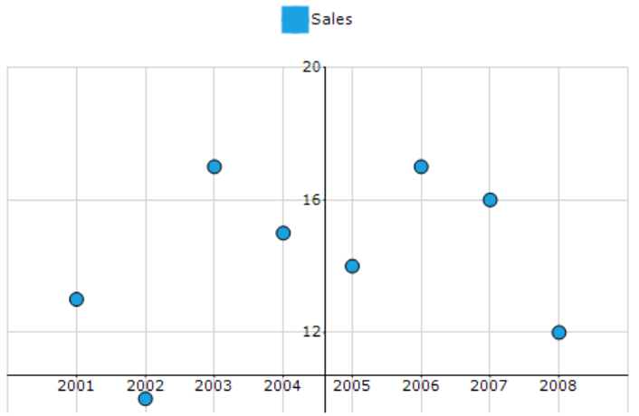

# How to draw the Y-axis at the center of the X-axis

The y-axis can be drawn at any custom position using the ChartAxisLocationType class. This can be achieved by setting the value of the LocationType property of the PrimaryYAxis to Set.





// Drawing Y-axis at the center of the X-axis.

this.chartControl1.PrimaryXAxis.ValueType = ChartValueType.Category;

this.chartControl1.PrimaryYAxis.LocationType = ChartAxisLocationType.Set;

this.chartControl1.PrimaryYAxis.Location = new PointF(255, 352);

ChartSeries chartSeries = new ChartSeries("Sales",ChartSeriesType.Scatter);

this.chartControl1.Series.Add(chartSeries);

this.chartControl1.Size = new System.Drawing.Size(750, 500);





' Drawing Y-axis at the center of the X-axis.

Me.chartControl1.PrimaryXAxis.ValueType = ChartValueType.Category

Me.chartControl1.PrimaryYAxis.LocationType = ChartAxisLocationType.Set

Me.chartControl1.PrimaryYAxis.Location = New PointF(255, 352)

Dim series As New ChartSeries("Sales", ChartSeriesType.Scatter)

Me.chartControl1.Series.Add(chartSeries)

Me.chartControl1.Size = new System.Drawing.Size(750, 500)   



	

