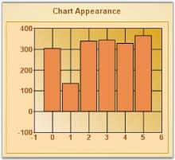
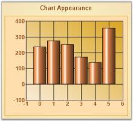

# How to get back to the gradient appearance of the Chart Series

The default appearance of the chart series is as shown in the image below.

To get the gradient appearance, we need to set the ChartControl.Model.ColorModel.AllowGradient to true. By default this is set to false.





//Sets the Gradient look and feel.

this.chartControl1.Model.ColorModel.AllowGradient = true;





'Sets the Gradient look and feel.

Me.chartControl1.Model.ColorModel.AllowGradient = True





N> We can also use ChartControl.AllowGradientPalette property to enable or disable gradient effect for chart series. By default it set to false.

