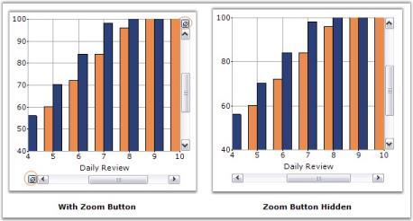

# How to hide the Chart ZoomButton

Syncfusion Chart provides a way to access the ZoomOutButton through the ScrollBar instance. In order to hide this Zoom button, if Visible property is set to false, ZoomButton will be disabled, but there will be an empty space. So instead of setting Visible property, we can set the ZoomButton size to be 0.





this.chartControl1.GetVScrollBar(this.chartControl1.PrimaryYAxis).ZoomButton.Size = new Size(0,0);

this.chartControl1.GetHScrollBar(this.chartControl1.PrimaryXAxis).ZoomButton.Size = new Size(0, 0);





Me.chartControl1.GetVScrollBar(Me.chartControl1.PrimaryYAxis).ZoomButton.Size = New Size(0,0)

Me.chartControl1.GetHScrollBar(Me.chartControl1.PrimaryXAxis).ZoomButton.Size = New Size(0, 0)





This setting will be useful, if you need to display the scrollbar, without ZoomingCancel operation, or if you need to change the back color and other properties, as ZoomButton is derived from the Button control.



[Zooming and Scrolling](/windowsforms/chart/runtime-features#zooming-and-scrolling)


