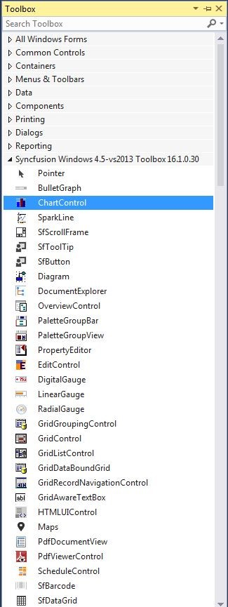
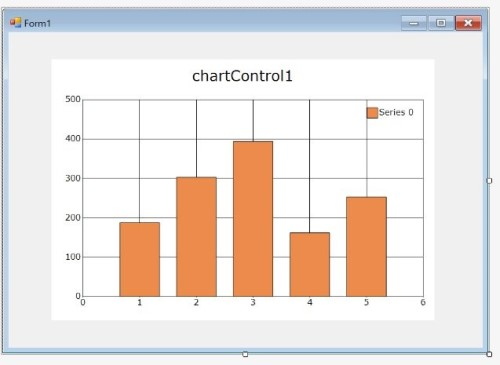
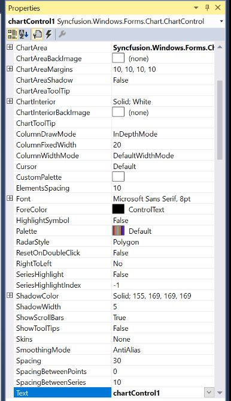
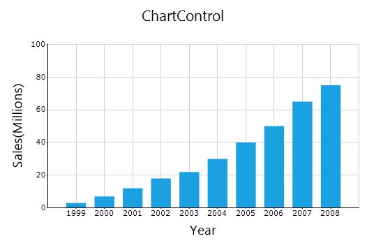
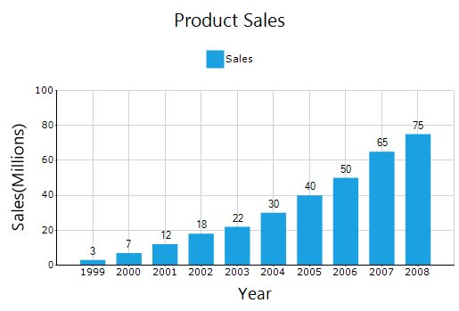
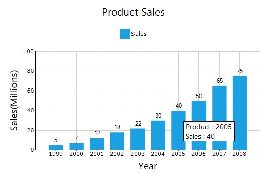

# Getting Started with Windows Forms Chart

This section provides the details that you will need to know about getting started with our [WinForms Chart](https://www.syncfusion.com/winforms-ui-controls/chart) control. 

## Assembly deployment

Refer [control dependencies](https://help.syncfusion.com/windowsforms/control-dependencies#chart) section to get the list of assemblies or NuGet package needs to be added as reference to use the control in any application.

Please find more details regarding how to install the nuget packages in windows form application in the below link:

[How to install nuget packages](https://help.syncfusion.com/windowsforms/installation/install-nuget-packages)

## Adding chart to form

To add chart to your form, follow the given steps:

1.Open your form in designer. Add the Syncfusion® controls to your VS.NET toolbox if you have not done it already (the install would have automatically done this unless you selected not to complete toolbox integration during installation). 

2.Drag the [ChartControl](https://help.syncfusion.com/cr/windowsforms/Syncfusion.Windows.Forms.Chart.ChartControl.html) and drop into the form.

3.After dropping the chart, the **ChartWizard** will be opened. You can set up the chart configuration during design-time.

4.Appearance and behavior-related aspects of chart can be controlled by setting the appropriate properties using the properties grid. 

For example, change the position of the legend to be aligned at the top by changing the **LegendPosition** property.

## Populate chart with data

In this section, the comparison of sales of a product has been visualized by using the **BindingList**.

1. Now, define a simple data model that represents a data point and create a data model class like as follows.






public class SalesData
{
    private string year;

    private double sales;

    public string Year
    {
        get { return year; }

        set { year = value; }
    }
    public double Sales
    {
        get { return sales; }

        set { sales = value; }
    }

    public SalesData(string year, double sales)
    {
        this.Year = year;

        this.Sales = sales;
    }
}





Public Class SalesData

    Private xValue As String

    Private yValue As Double

    Public Property Year As String
        Get
            Return xValue
        End Get

        Set(ByVal value As String)
            xValue = value
        End Set
    End Property

    Public Property Sales As Double
        Get
            Return yValue
        End Get

        Set(ByVal value As Double)
            yValue = value
        End Set
    End Property

    Public Sub New(ByVal year As String, ByVal sales As Double)
        Me.Year = year
        Me.Sales = sales
    End Sub

End Class





{{ codesnippet1 | OrderList_Indent_Level_1 }}	

2. Create an instance for **BindingList** to add list of data model.






BindingList<SalesData> dataSource = new BindingList<SalesData>(); 

dataSource.Add(new SalesData("1999", 3));

dataSource.Add(new SalesData("2000", 7));

dataSource.Add(new SalesData("2001", 12));

dataSource.Add(new SalesData("2002", 18));

dataSource.Add(new SalesData("2003", 22));

dataSource.Add(new SalesData("2004", 30));

dataSource.Add(new SalesData("2005", 40));

dataSource.Add(new SalesData("2006", 50));

dataSource.Add(new SalesData("2007", 65));

dataSource.Add(new SalesData("2008", 75));





Dim dataSource As BindingList(Of SalesData) = New BindingList(Of SalesData)

dataSource.Add(New SalesData("1999", 3))

dataSource.Add(New SalesData("2000", 7))

dataSource.Add(New SalesData("2001", 12))

dataSource.Add(New SalesData("2002", 18))

dataSource.Add(New SalesData("2003", 22))

dataSource.Add(New SalesData("2004", 30))

dataSource.Add(New SalesData("2005", 40))

dataSource.Add(New SalesData("2006", 50))

dataSource.Add(New SalesData("2007", 65))

dataSource.Add(New SalesData("2008", 75))





{{ codesnippet2 | OrderList_Indent_Level_1 }}	
   
3. Create an instance of [CategoryAxisDataBindModel](https://help.syncfusion.com/cr/windowsforms/Syncfusion.Windows.Forms.Chart.CategoryAxisDataBindModel.html) and bind the **XValues** and **YValues** to [CategoryName](https://help.syncfusion.com/cr/windowsforms/Syncfusion.Windows.Forms.Chart.CategoryAxisDataBindModel.html#Syncfusion_Windows_Forms_Chart_CategoryAxisDataBindModel_CategoryName) and [YNames](https://help.syncfusion.com/cr/windowsforms/Syncfusion.Windows.Forms.Chart.CategoryAxisDataBindModel.html#Syncfusion_Windows_Forms_Chart_CategoryAxisDataBindModel_YNames) properties, respectively as follows.






CategoryAxisDataBindModel dataSeriesModel = new CategoryAxisDataBindModel(dataSource);

dataSeriesModel.CategoryName = "Year";

dataSeriesModel.YNames = new string[] { "Sales" };





Dim dataSeriesModel As CategoryAxisDataBindModel = New CategoryAxisDataBindModel(dataSource)

dataSeriesModel.CategoryName = "Year"

dataSeriesModel.YNames = New String() {"Sales"}





{{ codesnippet3 | OrderList_Indent_Level_1 }}	

4. Create a [ChartSeries](https://help.syncfusion.com/cr/windowsforms/Syncfusion.Windows.Forms.Chart.ChartSeries.html) to bind the above data bind model to [CategoryModel](https://help.syncfusion.com/cr/windowsforms/Syncfusion.Windows.Forms.Chart.ChartSeries.html#Syncfusion_Windows_Forms_Chart_ChartSeries_CategoryModel) and add it to the [ChartControl](https://help.syncfusion.com/cr/windowsforms/Syncfusion.Windows.Forms.Chart.ChartControl.html).






ChartSeries chartSeries = new ChartSeries("Sales");

chartSeries.CategoryModel = dataSeriesModel;





Dim chartSeries As ChartSeries = New ChartSeries("Sales")

chartSeries.CategoryModel = dataSeriesModel





{{ codesnippet4 | OrderList_Indent_Level_1 }}

5. To use categorical data, set the [ValueType](https://help.syncfusion.com/cr/windowsforms/Syncfusion.Windows.Forms.Chart.ChartAxis.html#Syncfusion_Windows_Forms_Chart_ChartAxis_ValueType) property of [PrimaryXAxis](https://help.syncfusion.com/cr/windowsforms/Syncfusion.Windows.Forms.Chart.ChartControl.html#Syncfusion_Windows_Forms_Chart_ChartControl_PrimaryXAxis) to Category.






this.chartControl1.PrimaryXAxis.ValueType = ChartValueType.Category;





Me.chartControl1.PrimaryXAxis.ValueType = ChartValueType.Category





{{ codesnippet5 | OrderList_Indent_Level_1 }}

## Apply skins to ChartControl

To improve the appearance of chart, apply **Metro skin** to [ChartControl](https://help.syncfusion.com/cr/windowsforms/Syncfusion.Windows.Forms.Chart.ChartControl.html) as follows.




  
this.chartControl1.Skins = Skins.Metro;





Me.chartControl1.Skins = Skins.Metro



	

The following screenshot depicts the view when you run the project in your form.

## Add chart title

Title is added to chart to provide quick information to users about the data being plotted in the chart. You can add title to chart by using the [Text](https://help.syncfusion.com/cr/windowsforms/Syncfusion.Windows.Forms.Chart.ChartTitle.html#Syncfusion_Windows_Forms_Chart_ChartTitle_Text) property of [ChartTitle](https://help.syncfusion.com/cr/windowsforms/Syncfusion.Windows.Forms.Chart.ChartTitle.html).




  
ChartTitle title = new ChartTitle();

title.Text = "Product Sales";

this.chartControl1.Titles.Add(title);





Dim title As ChartTitle = New ChartTitle("Sales")

title.Text = "Product Sales"

Me.chartControl1.Titles.Add(title);



	

## Enable legend

The [Legend](https://help.syncfusion.com/cr/windowsforms/Syncfusion.Windows.Forms.Chart.ChartControl.html#Syncfusion_Windows_Forms_Chart_ChartControl_Legend) is enabled or disabled by using the **Visible** property. The legend is enabled in chart, by default. 




  
ChartSeries chartSeries = new ChartSeries("Sales");

this.chartControl1.Legend.Visible = true;

this.chartControl1.LegendAlignment = ChartAlignment.Center;

this.chartControl1.Legend.Position = ChartDock.Top; 
           
this.chartControl1.LegendsPlacement = ChartPlacement.Outside;





Dim chartSeries As ChartSeries = New ChartSeries("Sales")

Me.chartControl1.Legend.Visible = true

Me.chartControl1.LegendAlignment = ChartAlignment.Center

Me.chartControl1.Legend.Position = ChartDock.Top

Me.chartControl1.LegendsPlacement = ChartPlacement.Outside



	

## Enable data labels

You can add data labels to chart to improve readability by enabling the [DisplayText](https://help.syncfusion.com/cr/windowsforms/Syncfusion.Windows.Forms.Chart.ChartStyleInfo.html#Syncfusion_Windows_Forms_Chart_ChartStyleInfo_DisplayText) property of [Style](https://help.syncfusion.com/cr/windowsforms/Syncfusion.Windows.Forms.Chart.ChartSeries.html#Syncfusion_Windows_Forms_Chart_ChartSeries_Style) in [ChartSeries](https://help.syncfusion.com/cr/windowsforms/Syncfusion.Windows.Forms.Chart.ChartSeries.html).




  
chartSeries.Style.DisplayText = true;

chartSeries.Style.TextOrientation = ChartTextOrientation.Up;





chartSeries.Style.DisplayText = true

chartSeries.Style.TextOrientation = ChartTextOrientation.Up



	

## Enable tooltip

The Tooltip is used to show detailed information about a data point. Using data labels to show detailed information is not pleasant due to space constraints. You can enable tooltip by using the [ShowToolTips](https://help.syncfusion.com/cr/windowsforms/Syncfusion.Windows.Forms.Chart.ChartControl.html#Syncfusion_Windows_Forms_Chart_ChartControl_ShowToolTips) property.




  
this.chartControl1.ShowToolTips = true;

this.chartControl1.Tooltip.BackgroundColor = new BrushInfo(Color.White);

this.chartControl1.Tooltip.BorderStyle = BorderStyle.FixedSingle;

this.chartControl1.Tooltip.Font = new Font("Segoe UI", 10);

chartSeries.PrepareStyle += ChartSeries_PrepareStyle;

private void ChartSeries_PrepareStyle(object sender, ChartPrepareStyleInfoEventArgs args)
{
     ChartSeries series = sender as ChartSeries;

     int index = args.Index;

     ChartPoint point = series.Points[index];

     args.Style.ToolTip = "Product : " + point.Category + "\nSales : " + point.YValues[0];
	 
	 args.Handled = true;
}





Me.chartControl1.ShowToolTips = true

Me.chartControl1.Tooltip.BackgroundColor = New BrushInfo(Color.White)

Me.chartControl1.Tooltip.BorderStyle = BorderStyle.FixedSingle

Me.chartControl1.Tooltip.Font = New Font("Segoe UI", 10)

chartSeries.PrepareStyle = (chartSeries1.PrepareStyle + ChartSeries_PrepareStyle)

Private Sub ChartSeries_PrepareStyle(ByVal sender As Object, ByVal args As ChartPrepareStyleInfoEventArgs)

        Dim series As ChartSeries = CType(sender,ChartSeries)

        Dim index As Integer = args.Index

        Dim point As ChartPoint = series.Points(index)

        args.Style.ToolTip = ("Product : " _ + (point.Category + (""& vbLf&"Sales : " + point.YValues(0))))
		
		args.Handled = true;

End Sub



	



[Binding a DataSet to a Chart](https://help.syncfusion.com/windowsforms/chart/chart-data#binding-a-dataset-to-the-chart), [Tasks Window](https://help.syncfusion.com/windowsforms/chart/design-time-features#tasks-window)



You can find the complete getting started sample from this [link](https://github.com/SyncfusionExamples/winforms-chart-getting-started).

N> You can also explore our [WinForms Chart example](https://github.com/syncfusion/winforms-demos/tree/master/chart) that shows how to render various chart types as well as how to easily configure with built-in support for creating stunning visual effects.
