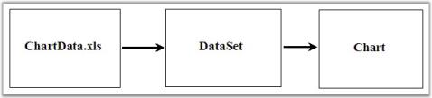
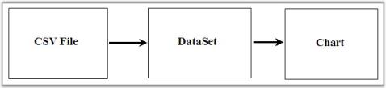
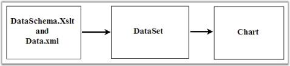

# Importing in Windows Forms Chart

The [WinForms Chart control](https://www.syncfusion.com/winforms-ui-controls/chart) can display data from various sources, including Excel, CSV, XML, arrays, and databases. Retrieve the data at runtime, store it in a compatible data source, and then populate or bind it to the chart.

N> The Chart control does not directly import data from external sources. The retrieved data must be stored in a `DataSet`, `DataTable`, array, or collection before it is bound to the chart.

## Import Data from Excel to Chart

Use **Microsoft.Jet.OLEDB.4.0** or **Microsoft.ACE.OLEDB.12.0** to retrieve Excel data into a `DataSet`, and then bind the `DataSet` to the chart. For more details, please check the sample included with the installation.

The following image illustrates Excel data displayed in the Windows Forms Chart control.

## Import Data from CSV to Chart
 
Use **Microsoft.Jet.OLEDB.4.0** to retrieve CSV data into a `DataSet`, and then bind the `DataSet` to the chart. For more details, please check the sample included with the installation.

The following image illustrates CSV data displayed in the Windows Forms Chart control.

## Import Data from XML to Chart

Use a corresponding XSLT file to transform XML data into a `DataSet`, and easily bound to the chart.

The following image illustrates XML data displayed in the Windows Forms Chart control.

## Import Data from Arrays to Chart
 
Data stored in arrays or collections, such as a `List<T>`, can be bound directly to the chart using methods like `DataBindXY()` or by setting `DataSource`, `XValueMember`, and `YValueMembers`.
 
## Import Data from Databases to Chart
 
Use ADO.NET or Entity Framework to retrieve data from a database and store it in a `DataTable` or collection. Bind the resulting data source to the Chart control using standard binding methods.

## See Also

- [How to import data from various formats to WinForms Chart](https://support.syncfusion.com/kb/article/4125/how-to-import-data-from-various-formats-to-winforms-chart)
- [How do I use Essential Chart to visualize data from Essential Grid](https://support.syncfusion.com/kb/article/1189/how-do-i-use-essential-chart-to-visualize-data-from-essential-grid)