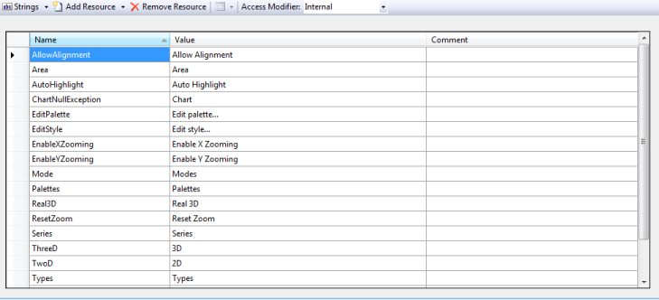

# Localization in Windows Forms Chart

[Localization](https://help.syncfusion.com/cr/windowsforms/Syncfusion.Windows.Forms.Chart.LocalizationBase.html) allows chart to display data according to the language and culture specific to a particular country or region.

Essential® Chart now supports localization; built-in resource files for specific languages can be easily added.  Context menu items, exception messages, and some of the toolbar items can be localized.

### Use Case Scenario

This enables you to localize any part of the chart that has static strings in it.

<table>
<tr>
<th>
Property </th><th>
Description </th><th>
Type </th><th>
Data Type </th><th>
Reference links </th><th>
Dependencies</th></tr>
<tr>
<td>

{{'[Localize](https://help.syncfusion.com/cr/windowsforms/Syncfusion.Windows.Forms.Chart.ChartControl.html#Syncfusion_Windows_Forms_Chart_ChartControl_Localize)'| markdownify }}
</td><td>
Get or set the localization culture of Grid.</td><td>
Server side</td><td>
A string containing the name of the target System.Globalization.CultureInfo </td><td>
NA</td><td>
NA</td></tr>
</table>

**Adding Localization to an Application**

1. Create your localization resource file (.resx) in the  bin -> Debug folder with the following naming convention:
   * ChartControl.< your culture info name >.resx

   N> It is mandatory to follow this naming convention.

   

2. Enter the UI name in the Name column and the equivalent term you want in the Value column of the resource file.

   

    N> It is mandatory to specify equivalent terms for all static element to localize the chart.

3. Specify the culture using the [Localize](https://help.syncfusion.com/cr/windowsforms/Syncfusion.Windows.Forms.Chart.ChartControl.html#Syncfusion_Windows_Forms_Chart_ChartControl_Localize) property as given in the following code.


  



this.chartControl1.Localize=”de-DE”;





Me.chartControl1.Localize=”de-DE”





{{ codesnippet1 | OrderList_Indent_Level_1 }}

### Sample Link

To view a sample,

1. Open the Syncfusion® Dashboard.
2. Select User Interface -> Windows Forms.
3. Click Run Samples.
4. Navigate to Culture Localization > Localization sample.

You can find the resource file for the localization in English at the .../bin/Debug location of the sample file.

[Chart_Localization Sample](https://github.com/syncfusion/winforms-demos/tree/master/chart/Culture%20Localization)
