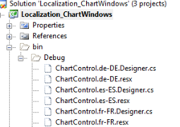
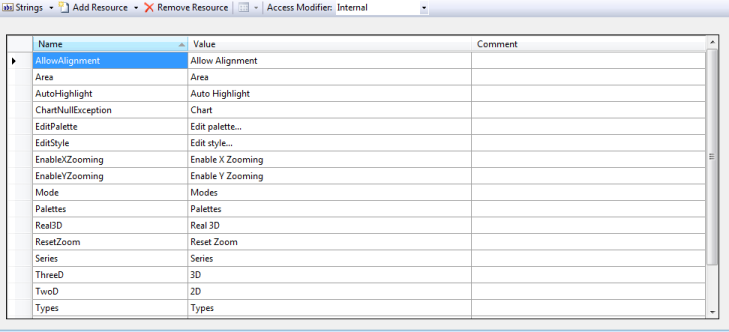
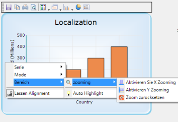

# Localization in Windows Forms Chart

[Localization](https://help.syncfusion.com/cr/windowsforms/Syncfusion.Windows.Forms.Chart.LocalizationBase.html) is the process of translating application resources into different languages for specific cultures. The Windows Forms Chart control can be localized using culture-specific resource files that contain translated text for context menu items, exception messages, and supported toolbar items.

## Localize the chart

Use the [Localize](https://help.syncfusion.com/cr/windowsforms/Syncfusion.Windows.Forms.Chart.ChartControl.html#Syncfusion_Windows_Forms_Chart_ChartControl_Localize) property to specify the culture that should be applied to the chart.

Adding Localization to an Application

**Step-1:** Create a resource file (`.resx`) in the bin -> Debug folder with the following naming convention:

```text
ChartControl.<culture-name>.resx
```

For example, use the following file name for the German culture:

```text
ChartControl.de-DE.resx
```

N> It is mandatory to follow this naming convention.



**Step-2:** Open the resource file and add the chart UI resource names in the **Name** column. Enter the corresponding localized text in the **Value** column.



N> It is mandatory to specify equivalent terms for all static element to localize the chart.

**Step-3:** Specify the culture using the [Localize](https://help.syncfusion.com/cr/windowsforms/Syncfusion.Windows.Forms.Chart.ChartControl.html#Syncfusion_Windows_Forms_Chart_ChartControl_Localize) property as given in the following code.



this.chartControl1.Localize = "de-DE";


Me.chartControl1.Localize = "de-DE"



The following image illustrates the chart UI localized using the specified culture.



### Sample Link

To view a sample,

1. Open the Syncfusion® Dashboard.
2. Select User Interface -> Windows Forms.
3. Click Run Local Demos Samples.
4. Open the chart control
4. Navigate to Culture Localization > Localization sample.

You can find the resource file for the localization in English at the .../bin/Debug location of the sample file.

[Chart_Localization Sample](https://github.com/syncfusion/winforms-demos/tree/master/chart/Culture%20Localization)
