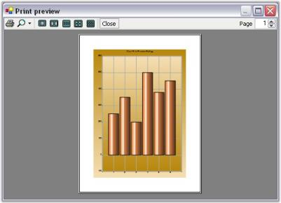
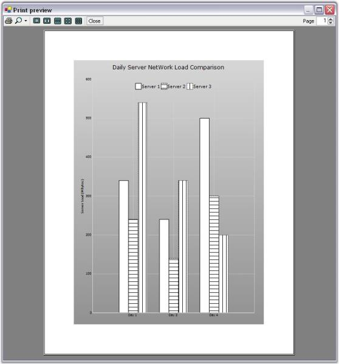

# Printing in Windows Forms Chart

The Windows Forms Chart control supports printing that enables you to print the chart.

## Print Preview

The chart exposes a [PrintDocument](https://help.syncfusion.com/cr/windowsforms/Syncfusion.Windows.Forms.Chart.ChartControl.html#Syncfusion_Windows_Forms_Chart_ChartControl_PrintDocument) property that can be assigned to a `.NET PrintPreviewDialog` to preview the chart before printing.

The following code example demonstrates how to display a print preview dialog for the chart.




PrintPreviewDialog printPreviewDialog = new PrintPreviewDialog(); 
//Customizing the icon of print preview dialog
(printPreviewDialog as Form).Icon = new Icon(@"....\App.ico");
printPreviewDialog.Document = this.chartControl.PrintDocument;
printPreviewDialog.ShowDialog();





Dim printPreviewDialog As New PrintPreviewDialog()
' Customizing the icon of the print preview dialog.
CType(printPreviewDialog, Form).Icon = New Icon("..\..\App.ico")
printPreviewDialog.Document = Me.chartControl.PrintDocument
printPreviewDialog.ShowDialog()





## Printing

Print a chart control using the [PrintDocument](https://help.syncfusion.com/cr/windowsforms/Syncfusion.Windows.Forms.Chart.ChartControl.html#Syncfusion_Windows_Forms_Chart_ChartControl_PrintDocument) exposed by the chart control as follows:

N> For a complete example that demonstrates printing a chart across multiple pages, refer to [How to print a chart in multiple pages](https://help.syncfusion.com/windowsforms/chart/faq/how-to-print-a-chart-in-multiple-pages).

  



this.chartControl.PrintDocument.Print();





Me.chartControl.PrintDocument.Print()




You can also specify whether the chart should be printed in color or grayscale by using the [PrintColorMode](https://help.syncfusion.com/cr/windowsforms/Syncfusion.Windows.Forms.Chart.ChartControl.html#Syncfusion_Windows_Forms_Chart_ChartControl_PrintColorMode) property. By default, the chart uses the [CheckPrinter](https://help.syncfusion.com/cr/windowsforms/Syncfusion.Windows.Forms.Chart.ChartPrintColorMode.html#Syncfusion_Windows_Forms_Chart_ChartPrintColorMode_CheckPrinter) mode to determine whether it should be printed in color or grayscale.

The [PrintColorMode](https://help.syncfusion.com/cr/windowsforms/Syncfusion.Windows.Forms.Chart.ChartControl.html#Syncfusion_Windows_Forms_Chart_ChartControl_PrintColorMode) property provides the following values:
- [Color](https://help.syncfusion.com/cr/windowsforms/Syncfusion.Windows.Forms.Chart.ChartPrintColorMode.html#Syncfusion_Windows_Forms_Chart_ChartPrintColorMode_CheckPrinter) - Prints the chart in color.
- [GrayScale](https://help.syncfusion.com/cr/windowsforms/Syncfusion.Windows.Forms.Chart.ChartPrintColorMode.html#Syncfusion_Windows_Forms_Chart_ChartPrintColorMode_GrayScale) - Prints the chart in grayscale.
- [CheckPrinter](https://help.syncfusion.com/cr/windowsforms/Syncfusion.Windows.Forms.Chart.ChartPrintColorMode.html#Syncfusion_Windows_Forms_Chart_ChartPrintColorMode_CheckPrinter) - If printer allows color print in color, otherwise use gray scale (default setting)

The following code example demonstrates how to print the chart in grayscale.

  



this.chartControl.PrintColorMode = ChartPrintColorMode.GrayScale;





Me.chartControl.PrintColorMode = ChartPrintColorMode.GrayScale




## Automatic GrayScale Handling

Setting GrayScale print mode for the chart lets you print the chart in a gray scale and when multiple series are printed in this case, chart data points are automatically rendered with a patterned brush to differentiate the different series as shown in the image below.

A sample illustrating the printing features is available in the below location.

&lt;Install Location&gt;\Syncfusion\EssentialStudio\<Install version>\Windows\chart\Print\Chart Print

## Displaying ToolBar while printing

[ShowToolBar](https://help.syncfusion.com/cr/windowsforms/Syncfusion.Windows.Forms.Chart.ChartControl.html#Syncfusion_Windows_Forms_Chart_ChartControl_ShowToolbar) property should be set to true to display a toolbar in the Chart. You can show or hide the toolbar while printing a Chart using [PrintToolBar](https://help.syncfusion.com/cr/windowsforms/Syncfusion.Windows.Forms.Chart.ChartPrintDocument.html#Syncfusion_Windows_Forms_Chart_ChartPrintDocument_PrintToolBar) property. 

  



chartControl.ShowToolbar = true;
chartControl.PrintDocument.PrintToolBar = true;





chartControl.ShowToolbar = True
chartControl.PrintDocument.PrintToolBar = True




## See also

- [How do I print a Chart in WinForms](https://support.syncfusion.com/kb/article/4023/how-do-i-print-a-chart-in-winforms)
- [How do I set the color to print a WinForms Chart](https://support.syncfusion.com/kb/article/4128/how-do-i-set-the-color-to-print-a-winforms-chart)
- [How to print multiple charts in Windows Forms Chart](https://help.syncfusion.com/windowsforms/chart/faq/how-to-print-a-chart-in-multiple-pages)