# User Interactions in Windows Forms Chart

The following topics under this section elaborates on the runtime features of Chart control.

## Zooming and Scrolling

### Zooming via Mouse

Essential® Chart supports interactive zooming features along the x and y axis. During runtime, the user can simply select the range he wants to zoom with the mouse and the chart will accordingly zoom-in. Scrollbars will be activated to browse the areas that become hidden on zooming in.

Enable Zooming via the [EnableXZooming](https://help.syncfusion.com/cr/windowsforms/Syncfusion.Windows.Forms.Chart.ChartControl.html#Syncfusion_Windows_Forms_Chart_ChartControl_EnableXZooming) and [EnableYZooming](https://help.syncfusion.com/cr/windowsforms/Syncfusion.Windows.Forms.Chart.ChartControl.html#Syncfusion_Windows_Forms_Chart_ChartControl_EnableYZooming) properties.

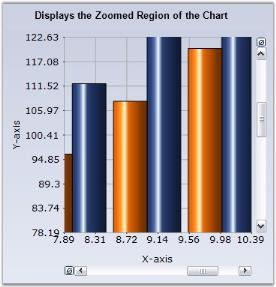

The scrollbar will shift by the amount specified in the [ScrollPrecision](https://help.syncfusion.com/cr/windowsforms/Syncfusion.Windows.Forms.Chart.ChartControl.html#Syncfusion_Windows_Forms_Chart_ChartControl_ScrollPrecision) property which is set to 20 by default.

User can zoom out by clicking the "Zoom Out" button in the scrollbar.

[ZoomOutIncrement](https://help.syncfusion.com/cr/windowsforms/Syncfusion.Windows.Forms.Chart.ChartControl.html#Syncfusion_Windows_Forms_Chart_ChartControl_ZoomOutIncrement) property specifies the increment by which to zoom out. The default value is 0.2.

### Programmatic Zooming

Programmatically the chart can be zoomed using [ZoomFactorX](https://help.syncfusion.com/cr/windowsforms/Syncfusion.Windows.Forms.Chart.ChartControl.html#Syncfusion_Windows_Forms_Chart_ChartControl_ZoomFactorX) and [ZoomFactorY](https://help.syncfusion.com/cr/windowsforms/Syncfusion.Windows.Forms.Chart.ChartControl.html#Syncfusion_Windows_Forms_Chart_ChartControl_ZoomFactorY) properties.The Zoom factor is usually between 0 and 1. When set to 1, the chart isn't zoomed. When set to 0.5, the chart is double its usual size. Scrollbars will automatically appear to allow any section of the hidden range to be viewed. The default value is 1.

You can also programmatically specify the scrollbar position of the zoomed in axes using the [ZoomPositionX](https://help.syncfusion.com/cr/windowsforms/Syncfusion.Windows.Forms.Chart.ChartControl.html#Syncfusion_Windows_Forms_Chart_ChartControl_ZoomPositionX) and [ZoomPositionY](https://help.syncfusion.com/cr/windowsforms/Syncfusion.Windows.Forms.Chart.ChartControl.html#Syncfusion_Windows_Forms_Chart_ChartControl_ZoomPositionY) properties.

To restrict the zoom-in factor to a certain level on the x and y axis use the [MinZoomFactorX](https://help.syncfusion.com/cr/windowsforms/Syncfusion.Windows.Forms.Chart.ChartControl.html#Syncfusion_Windows_Forms_Chart_ChartControl_MinZoomFactorX) and [MinZoomFactorY](https://help.syncfusion.com/cr/windowsforms/Syncfusion.Windows.Forms.Chart.ChartControl.html#Syncfusion_Windows_Forms_Chart_ChartControl_MinZoomFactorY) properties. The value can be in between 0 and 1. If the value is 1 means, not zoomed.

### Zooming via Keyboard

Essential® Chart also enables users to use keyboard shortcuts to enable zooming. Enable this feature through the [KeyZoom](https://help.syncfusion.com/cr/windowsforms/Syncfusion.Windows.Forms.Chart.ChartControl.html#Syncfusion_Windows_Forms_Chart_ChartControl_KeyZoom) property.

Using the following properties the zooming action can be mapped to specific keys.

<table>
<tr>
<th>
Chart control Property</th><th>
Description</th></tr>
<tr>
<td>

{{'[ZoomCancel](https://help.syncfusion.com/cr/windowsforms/Syncfusion.Windows.Forms.Chart.ChartControl.html#Syncfusion_Windows_Forms_Chart_ChartControl_ZoomCancel)'| markdownify }}
</td><td>
Specifies the keyboard shortcut to control Zoom cancel. The default value is ESCAPE.</td></tr>
<tr>
<td>
{{'[ZoomDown](https://help.syncfusion.com/cr/windowsforms/Syncfusion.Windows.Forms.Chart.ChartControl.html#Syncfusion_Windows_Forms_Chart_ChartControl_ZoomDown)'| markdownify }}
</td><td>
Specifies the keyboard shortcut to control Zoom Down. The default value is DOWN arrow.</td></tr>
<tr>
<td>
{{'[ZoomIn](https://help.syncfusion.com/cr/windowsforms/Syncfusion.Windows.Forms.Chart.ChartControl.html#Syncfusion_Windows_Forms_Chart_ChartControl_ZoomIn)'| markdownify }}
</td><td>
Specifies the keyboard shortcut to control Zoom In. The default value is ADD key. </td></tr>
<tr>
<td>
{{'[ZoomLeft](https://help.syncfusion.com/cr/windowsforms/Syncfusion.Windows.Forms.Chart.ChartControl.html#Syncfusion_Windows_Forms_Chart_ChartControl_ZoomLeft)'| markdownify }}
</td><td>
Specifies the keyboard shortcut to control Zoom Left. The default value is LEFT arrow.</td></tr>
<tr>
<td>
{{'[ZoomOut](https://help.syncfusion.com/cr/windowsforms/Syncfusion.Windows.Forms.Chart.ChartControl.html#Syncfusion_Windows_Forms_Chart_ChartControl_ZoomOut)'| markdownify }}
</td><td>
Specifies the keyboard shortcut to control Zoom Out. The default value is SUBTRACT.</td></tr>
<tr>
<td>
{{'[ZoomRight](https://help.syncfusion.com/cr/windowsforms/Syncfusion.Windows.Forms.Chart.ChartControl.html#Syncfusion_Windows_Forms_Chart_ChartControl_ZoomRight)'| markdownify }}
</td><td>
Specifies the keyboard shortcut to control Zoom Right. The default value is RIGHT arrow.</td></tr>
<tr>
<td>
{{'[ZoomUp](https://help.syncfusion.com/cr/windowsforms/Syncfusion.Windows.Forms.Chart.ChartControl.html#Syncfusion_Windows_Forms_Chart_ChartControl_ZoomUp)'| markdownify }}
</td><td>
Specifies the keyboard short cut to control Zoom Up. The default value is UP arrow.</td></tr>
</table>

### Panning Support for Zoomed Chart

Now, you will be able to pan a chart when it is zoomed. Set the [ChartControl.MouseAction](https://help.syncfusion.com/cr/windowsforms/Syncfusion.Windows.Forms.Chart.ChartControl.html#Syncfusion_Windows_Forms_Chart_ChartControl_MouseAction) to **Panning** to enable this feature. Set the MouseAction to **None** to disable this feature. The panning action can be controlled using the [ZoomActions](https://help.syncfusion.com/cr/windowsforms/Syncfusion.Windows.Forms.Chart.ChartAxis.html#Syncfusion_Windows_Forms_Chart_ChartAxis_ZoomActions) property that is available for individual axis. 

<table>
<tr>
<th>
Chart Axes Property</th><th>
Description</th></tr>
<tr>
<td>

{{'[ZoomActions](https://help.syncfusion.com/cr/windowsforms/Syncfusion.Windows.Forms.Chart.ChartAxis.html#Syncfusion_Windows_Forms_Chart_ChartAxis_ZoomActions)'| markdownify }}
</td><td>
Specifies the zoom action on the corresponding axis. The options are, <ul><li>Panning - Enables panning in the zoomed chart.</li><li>None - Disables panning in the zoomed chart.</li></ul></td></tr>
</table>

  



this.chartControl1.MouseAction = ChartMouseAction.Panning;

this.chartControl1.PrimaryXAxis.ZoomActions = ChartZoomingAction.Panning;

this.chartControl1.PrimaryYAxis.ZoomActions = ChartZoomingAction.Panning;





Me.chartControl1.MouseAction = ChartMouseAction.Panning

Me.chartControl1.PrimaryXAxis.ZoomActions = ChartZoomingAction.Panning

Me.chartControl1.PrimaryYAxis.ZoomActions = ChartZoomingAction.Panning




N> Remember to enable zooming on both the axis using [EnableXZooming](https://help.syncfusion.com/cr/windowsforms/Syncfusion.Windows.Forms.Chart.ChartControl.html#Syncfusion_Windows_Forms_Chart_ChartControl_EnableXZooming) and [EnableYZooming](https://help.syncfusion.com/cr/windowsforms/Syncfusion.Windows.Forms.Chart.ChartControl.html#Syncfusion_Windows_Forms_Chart_ChartControl_EnableYZooming) properties, before trying out the above panning feature. You cannot pan a chart without zooming it.

### Zoom Types

Essential® Chart provides support to Zoom the chart in three different ways .The default zooming type is **Selection**. The [ZoomType](https://help.syncfusion.com/cr/windowsforms/Syncfusion.Windows.Forms.Chart.ChartControl.html#Syncfusion_Windows_Forms_Chart_ChartControl_ZoomType) property is used for specifying the way in which the chart should be zoomed. The [ZoomType](https://help.syncfusion.com/cr/windowsforms/Syncfusion.Windows.Forms.Chart.ChartControl.html#Syncfusion_Windows_Forms_Chart_ChartControl_ZoomType) property is a **flagged enum** and it can accept all 3 types of zooming.

<table>
<tr>
<th>
ChartControl.ZoomType Property</th><th>
Description</th></tr>
<tr>
<td>
Selection
</td><td>
The Chart is zoomed based on the user selection.</td></tr>
<tr>
<td>
MouseWheelZooming</td><td>
The Chart is zoomed according to the mouse wheel movement.</td></tr>
<tr>
<td>
PinchZooming</td><td>
The Chart is zoomed according to the spread/pinch gestures.</td></tr>
</table>

### Zooming via Mouse Selection

In selection zoom type, the user can select the required range to be zoomed and the chart will be zoomed in accordingly. The chart is restored to its original position on Double click.

 



this.chartControl1.ZoomType = ZoomType.Selection;





Me.chartControl1.ZoomType= ZoomType.Selection





**Illustrates the Selection of Chart Region for Zooming** 

**Displays the Zoomed Region of the chart**
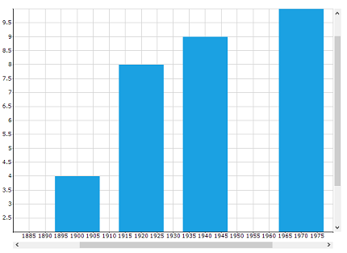

### Zooming via Mouse Wheel

When the ZoomType is set as **ZoomType.MouseWheelZooming**, then the chart is zoomed in and out based on the mouse wheel movement. Double clicking on the chart will restore the chart to its original position





this.chartControl1.ZoomType = ZoomType.MouseWheelZooming;





Me.chartControl1.ZoomType= ZoomType.MouseWheelZooming





### Zooming in Touch devices 

In touch enabled devices, the user can zoom the chart using the spread or pinch gestures.

**Spread**

**Pinch**
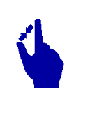

The spread action  will result in zoom- in of the chart and pinch action will result in zoom-out of the chart. Double tapping on the chart area restores the chart to its original position.





this.chartControl1.ZoomType = ZoomType.PinchZooming;





Me.chartControl1.ZoomType= ZoomType.PinchZooming





### ResetOnDoubleClick

When the [ResetOnDoubleClick](https://help.syncfusion.com/cr/windowsforms/Syncfusion.Windows.Forms.Chart.ChartControl.html#Syncfusion_Windows_Forms_Chart_ChartControl_ResetOnDoubleClick) option is enabled, the chart is reset to its original position on **Double click or Double Tap**. The default value of this property is **False**.





this.chartControl1.ResetOnDoubleClick = true;





Me.chartControl1.ResetOnDoubleClick= true





### Formatted Axes Labels

It is possible to show formatted axes labels for a zoomed chart. Essential® Chart's [SmartDateZoom](https://help.syncfusion.com/cr/windowsforms/Syncfusion.Windows.Forms.Chart.ChartAxis.html#Syncfusion_Windows_Forms_Chart_ChartAxis_SmartDateZoom) property when set to true enables this feature. You can set any one of the following custom label formats to the chart axis. 

* SmartDateZoomDayLevelLabelFormat 
* SmartDateZoomYearLevelLabelFormat
* SmartDateZoomWeekLevelLabelFormat 
* SmartDateZoomSecondLevelLabelFormat
* SmartDateZoomMonthLevelLabelFormat
* SmartDateZoomHourLevelLabelFormat
* SmartDateZoomMinuteLevelLabelFormat

  



this.chartControl1.PrimaryXAxis.SmartDateZoom = true;

this.chartControl1.PrimaryXAxis.SmartDateZoomDayLevelLabelFormat = "dd MM/yy HH.00";





Me.chartControl1.PrimaryXAxis.SmartDateZoom = True

Me.chartControl1.PrimaryXAxis.SmartDateZoomDayLevelLabelFormat = "dd MM/yy HH.00"




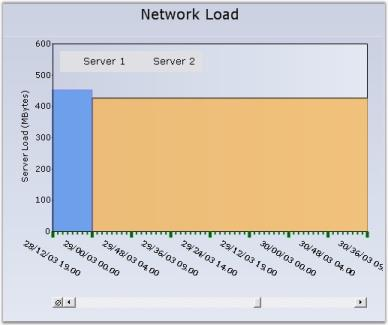

N> The value type of the axis should be **DateTime** for setting the above formatted labels.

A sample which demonstrates the zooming and scrolling features are available in the following sample installation location.

&lt;Install Location&gt;\Syncfusion\EssentialStudio\<Install version>\Windows\Chart.Windows\Samples\Zoom and Scrolling



[How to hide the Chart ZoomButton](https://help.syncfusion.com/windowsforms/chart/faq/how-to-hide-the-chart-zoombutton)



## Toolbars

Essential® Charts comes with a built-in Toolbar that can be made visible to enable the user to do the following during runtime.

* Save the chart as an image.
* Copy the image to clipboard.
* Print the chart.
* Print Preview of the Chart.
* Change the color palette of the chart.
* Affects the style of the chart.
* Change the Chart Type.
* Toggle 3D style of the Chart.
* Toggle Legend Appearance.

The toolbar can be made visible through the ChartControl's [ShowToolbar](https://help.syncfusion.com/cr/windowsforms/Syncfusion.Windows.Forms.Chart.ChartControl.html#Syncfusion_Windows_Forms_Chart_ChartControl_ShowToolbar) property.

The toolbar looks like the below image.

The toolbar commands and their functionalities are described below.

<table>
<tr>
<th>
Chart toolbar Commands</th><th>
Chart toolbar Items name</th><th>
Description</th></tr>
<tr>
<td>

{{'[Save](https://help.syncfusion.com/cr/windowsforms/Syncfusion.Windows.Forms.Chart.ChartCommands.html#Syncfusion_Windows_Forms_Chart_ChartCommands_Save)'| markdownify }}
</td><td>

{{'[ChartToolBarSaveItem](https://help.syncfusion.com/cr/windowsforms/Syncfusion.Windows.Forms.Chart.ChartToolBarSaveItem.html)'| markdownify }}
</td><td>
Using this command, user can save the chart to a specific location.</td></tr>
<tr>
<td>
{{'[Copy](https://help.syncfusion.com/cr/windowsforms/Syncfusion.Windows.Forms.Chart.ChartCommands.html#Syncfusion_Windows_Forms_Chart_ChartCommands_Copy)'| markdownify }}
</td><td>
{{'[ChartToolBarCopyItem](https://help.syncfusion.com/cr/windowsforms/Syncfusion.Windows.Forms.Chart.ChartToolBarCopyItem.html)'| markdownify }}
</td><td>
Clicking this toolbar command will copy the chart to the clipboard.</td></tr>
<tr>
<td>
{{'[Styles](https://help.syncfusion.com/cr/windowsforms/Syncfusion.Windows.Forms.Chart.ChartSeries.html#Syncfusion_Windows_Forms_Chart_ChartSeries_Styles)'| markdownify }}
</td><td>
{{'[ChartToolBarStyleItem](https://help.syncfusion.com/cr/windowsforms/Syncfusion.Windows.Forms.Chart.ChartToolBarStyleItem.html)'| markdownify }}
</td><td>
This pops up a Chart Series Style dialog window, using which various properties and chart styles can be set. </td></tr>
<tr>
<td>
{{'[Print](https://help.syncfusion.com/cr/windowsforms/Syncfusion.Windows.Forms.Chart.ChartCommands.html#Syncfusion_Windows_Forms_Chart_ChartCommands_Print)'| markdownify }}
</td><td>
{{'[ChartToolBarPrintItem](https://help.syncfusion.com/cr/windowsforms/Syncfusion.Windows.Forms.Chart.ChartToolBarPrintItem.html)'| markdownify }}
</td><td>
This toolbar command is used to print the Chart.</td></tr>
<tr>
<td>
{{'[Palette](https://help.syncfusion.com/cr/windowsforms/Syncfusion.Windows.Forms.Chart.ChartControl.html#Syncfusion_Windows_Forms_Chart_ChartControl_Palette)'| markdownify }}
</td><td>
{{'[ChartToolBarPaletteItem](https://help.syncfusion.com/cr/windowsforms/Syncfusion.Windows.Forms.Chart.ChartToolBarPaletteItem.html)'| markdownify }}
</td><td>
Palette for the series can be chosen at run time using this command. All palette colors available in the designer will be available in this Palette option also.</td></tr>
<tr>
<td>
{{'[Chart Types](https://help.syncfusion.com/windowsforms/chart/chart-types)'| markdownify }}
</td><td>
{{'[ChartToolBarTypeItem](https://help.syncfusion.com/cr/windowsforms/Syncfusion.Windows.Forms.Chart.ChartToolBarTypeItem.html)'| markdownify }}
</td><td>
Any chart type can be set for the chart at run time using this command.</td></tr>
<tr>
<td>
{{'[PrintPreview](https://help.syncfusion.com/cr/windowsforms/Syncfusion.Windows.Forms.Chart.ChartCommands.html#Syncfusion_Windows_Forms_Chart_ChartCommands_PrintPriview)'| markdownify }}
</td><td>
{{'[ChartToolBarPrintPreviewItem](https://help.syncfusion.com/cr/windowsforms/Syncfusion.Windows.Forms.Chart.ChartToolBarPrintPreviewItem.html)'| markdownify }}
</td><td>
This toolbar command is used to see a print preview of the Chart.</td></tr>
<tr>
<td>
{{'[Toggle3D](https://help.syncfusion.com/cr/windowsforms/Syncfusion.Windows.Forms.Chart.ChartCommands.html#Syncfusion_Windows_Forms_Chart_ChartCommands_Toggle3D)'| markdownify }}
</td><td>
{{'[ChartToolBarSeries3DItem](https://help.syncfusion.com/cr/windowsforms/Syncfusion.Windows.Forms.Chart.ChartToolBarSeries3DItem.html)'| markdownify }}
</td><td>
This command is used to toggle the 3D mode of the chart.</td></tr>
<tr>
<td>
Toggle Legend Appearance</td><td>
{{'[ChartToolBarShowLegendItem](https://help.syncfusion.com/cr/windowsforms/Syncfusion.Windows.Forms.Chart.ChartToolBarShowLegendItem.html)'| markdownify }}
</td><td>
This command is used to toggle the legend appearance.</td></tr>
<tr>
<td>
Splitter</td><td>
{{'[ChartToolBarSplitter](https://help.syncfusion.com/cr/windowsforms/Syncfusion.Windows.Forms.Chart.ChartToolBarSplitter.html)'| markdownify }}
</td><td>
This item provides a logical split between the collection of commands.</td></tr>
</table>

### Saving chart without toolbar

When clicking the save/copy toolbar item, the toolbar will also be copied along with chart. You can use the 'IncludeInExportedChart' property of the 'Toolbar' to specify whether the toolbar should be saved along with chart control. The default value of this property is *true*.

  



//Save chart without toolbar
this.chartControl1.ToolBar.IncludeInExportedChart = false;





'Save chart without toolbar
Me.chartControl1.ToolBar.IncludeInExportedChart = false




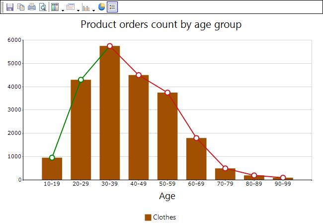

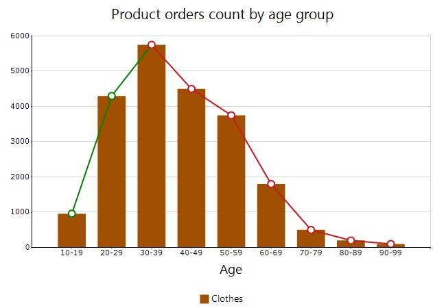

### Custom Toolbar Commands

You can also add custom toolbar items using [ChartToolBarCommandItem](https://help.syncfusion.com/cr/windowsforms/Syncfusion.Windows.Forms.Chart.ChartToolBarCommandItem.html) class. The [ChartCommands](https://help.syncfusion.com/cr/windowsforms/Syncfusion.Windows.Forms.Chart.ChartCommands.html) enum lists the commands that can be added. The following table describes those commands.

<table>
<tr>
<th>
Chart toolbar Custom Commands</th><th>
Description</th></tr>
<tr>
<td>

{{'[ZoomIn](https://help.syncfusion.com/cr/windowsforms/Syncfusion.Windows.Forms.Chart.ChartControl.html#Syncfusion_Windows_Forms_Chart_ChartControl_ZoomIn)'| markdownify }}
</td><td>
Using this command, user can zoom the chart.</td></tr>
<tr>
<td>
{{'[ZoomOut](https://help.syncfusion.com/cr/windowsforms/Syncfusion.Windows.Forms.Chart.ChartControl.html#Syncfusion_Windows_Forms_Chart_ChartControl_ZoomOut)'| markdownify }}
</td><td>
This command zooms out the chart.</td></tr>
<tr>
<td>
{{'[ResetZooming](https://help.syncfusion.com/cr/windowsforms/Syncfusion.Windows.Forms.Chart.ChartCommands.html#Syncfusion_Windows_Forms_Chart_ChartCommands_ResetZooming)'| markdownify }}
</td><td>
The zooming is reset using this command.</td></tr>
<tr>
<td>
{{'[AutoHighlight](https://help.syncfusion.com/cr/windowsforms/Syncfusion.Windows.Forms.Chart.ChartCommands.html#Syncfusion_Windows_Forms_Chart_ChartCommands_AutoHighlight)'| markdownify }}
</td><td>
This command is used to enable the auto highlight feature in the chart series.</td></tr>
<tr>
<td>
{{'[ToggleXZooming](https://help.syncfusion.com/cr/windowsforms/Syncfusion.Windows.Forms.Chart.ChartCommands.html#Syncfusion_Windows_Forms_Chart_ChartCommands_ToggleXZooming)'| markdownify }}
</td><td>
This toolbar command enables zooming in x-axis.</td></tr>
<tr>
<td>
{{'[ToggleYZooming](https://help.syncfusion.com/cr/windowsforms/Syncfusion.Windows.Forms.Chart.ChartCommands.html#Syncfusion_Windows_Forms_Chart_ChartCommands_ToggleYZooming)'| markdownify }}
</td><td>
This toolbar command enables zooming in y-axis.</td></tr>
<tr>
<td>
{{'[TogglePanning](https://help.syncfusion.com/cr/windowsforms/Syncfusion.Windows.Forms.Chart.ChartCommands.html#Syncfusion_Windows_Forms_Chart_ChartCommands_TogglePanning)'| markdownify }}
</td><td>
This command enables panning of the zoomed chart.</td></tr>
</table>

  



ChartToolBarCommandItem x1 = new ChartToolBarCommandItem();

x1.Command = ChartCommands.AutoHighlight;

x1.IsCheckable = false;

Image v = System.Drawing.Image.FromFile(@"..\..\Data\Visio.png");

x1.Image = v;

x1.Name = "Custom Tools";

x1.ToolTip = "Highlighting";

x1.Checked = true;

this.chartControl1.ToolBar.Items.Add(x1); 





Dim x1 As New ChartToolBarCommandItem()

x1.Command = ChartCommands.AutoHighlight

x1.IsCheckable = False

Dim v As Image = System.Drawing.Image.FromFile("..\..\Data\Visio.png")

x1.Image = v

x1.Name = "Custom Tools"

x1.ToolTip = "Highlighting"

x1.Checked = True

Me.chartControl1.ToolBar.Items.Add(x1)



  
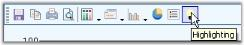

### Toolbar Properties

The chart control provides complete support for customizing the toolbar appearance. Use the [ChartControl.ToolBar](https://help.syncfusion.com/cr/windowsforms/Syncfusion.Windows.Forms.Chart.ChartControl.html#Syncfusion_Windows_Forms_Chart_ChartControl_ToolBar) property to access the toolbar. At runtime, double-click the toolbar to show the ToolBar Properties dialog box as in the below image, which lists all the properties. For this, you need to set the [ToolBar.ShowDialog](https://help.syncfusion.com/cr/windowsforms/Syncfusion.Windows.Forms.Chart.ChartToolBarInfo.html#Syncfusion_Windows_Forms_Chart_ChartToolBarInfo_ShowDialog) property to True. If you do not want to display this dialog box, set this property to False.

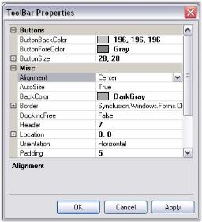

Below are the toolbar properties and their description.

<table>
<tr>
<th>
Chart ToolBar Property</th><th>
Description</th></tr>
<tr>
<td>

{{'[Alignment](https://help.syncfusion.com/cr/windowsforms/Syncfusion.Windows.Forms.Chart.ChartToolBarInfo.html#Syncfusion_Windows_Forms_Chart_ChartToolBarInfo_Alignment)'| markdownify }}
</td><td>
Indicates the alignment of the toolbar. Default value is Center.</td></tr>
<tr>
<td>
{{'[AutoSize](https://help.syncfusion.com/cr/windowsforms/Syncfusion.Windows.Forms.Chart.ChartToolBarInfo.html#Syncfusion_Windows_Forms_Chart_ChartToolBarInfo_AutoSize)'| markdownify }}
</td><td>
Indicates if the toolbar can be resized automatically. Default value is true.</td></tr>
<tr>
<td>
{{'[BackColor](https://help.syncfusion.com/cr/windowsforms/Syncfusion.Windows.Forms.Chart.ChartToolBarInfo.html#Syncfusion_Windows_Forms_Chart_ChartToolBarInfo_BackColor)'| markdownify }}
</td><td>
Indicates back color of the toolbar.</td></tr>
<tr>
<td>
{{'[Border](https://help.syncfusion.com/cr/windowsforms/Syncfusion.Windows.Forms.Chart.ChartToolBarInfo.html#Syncfusion_Windows_Forms_Chart_ChartToolBarInfo_Buttons)'| markdownify }}
</td><td>
Specifies the border style.</td></tr>
<tr>
<td>
{{'[Buttons](https://help.syncfusion.com/cr/windowsforms/Syncfusion.Windows.Forms.Chart.ChartToolBarInfo.html#Syncfusion_Windows_Forms_Chart_ChartToolBarInfo_Border)'| markdownify }}
</td><td>
List of buttons to which you can add new Buttons or delete existing ones.</td></tr>
<tr>
<td>
{{'[ButtonBackColor](https://help.syncfusion.com/cr/windowsforms/Syncfusion.Windows.Forms.Chart.ChartToolBarInfo.html#Syncfusion_Windows_Forms_Chart_ChartToolBarInfo_ButtonBackColor)'| markdownify }}
</td><td>
Gets / sets the back color of the toolbar button.</td></tr>
<tr>
<td>
{{'[ButtonFlatStyle](https://help.syncfusion.com/cr/windowsforms/Syncfusion.Windows.Forms.Chart.ChartToolBarInfo.html#Syncfusion_Windows_Forms_Chart_ChartToolBarInfo_ButtonFlatStyle)'| markdownify }}
</td><td>
Gets / sets the flat style appearance for the toolbar button control. Default value is **FlatStyle.Flat**.</td></tr>
<tr>
<td>
{{'[ButtonForeColor](https://help.syncfusion.com/cr/windowsforms/Syncfusion.Windows.Forms.Chart.ChartToolBarInfo.html#Syncfusion_Windows_Forms_Chart_ChartToolBarInfo_ButtonForeColor)'| markdownify }}
</td><td>
Gets / sets the fore color of the toolbar button.</td></tr>
<tr>
<td>
{{'[ButtonSize](https://help.syncfusion.com/cr/windowsforms/Syncfusion.Windows.Forms.Chart.ChartToolBarInfo.html#Syncfusion_Windows_Forms_Chart_ChartToolBarInfo_ButtonSize)'| markdownify }}
</td><td>
Indicates the button size of the toolbar buttons.</td></tr>
<tr>
<td>
{{'[DockingFree](https://help.syncfusion.com/cr/windowsforms/Syncfusion.Windows.Forms.Chart.ChartToolBarInfo.html#Syncfusion_Windows_Forms_Chart_ChartToolBarInfo_DockingFree)'| markdownify }}
</td><td>
Indicates if the toolbar is to be held docked. Default value is false.</td></tr>
<tr>
<td>
{{'[Header](https://help.syncfusion.com/cr/windowsforms/Syncfusion.Windows.Forms.Chart.ChartToolBarInfo.html#Syncfusion_Windows_Forms_Chart_ChartToolBarInfo_Header)'| markdownify }}
</td><td>
Gets / sets the height of the header. Default value is 0.</td></tr>
<tr>
<td>
{{'[Location](https://help.syncfusion.com/cr/windowsforms/Syncfusion.Windows.Forms.Chart.ChartToolBarInfo.html#Syncfusion_Windows_Forms_Chart_ChartToolBarInfo_Location)'| markdownify }}
</td><td>
Gets / sets the location of the toolbar.</td></tr>
<tr>
<td>
{{'[Orientation](https://help.syncfusion.com/cr/windowsforms/Syncfusion.Windows.Forms.Chart.ChartToolBarInfo.html#Syncfusion_Windows_Forms_Chart_ChartToolBarInfo_Orientation)'| markdownify }}
</td><td>
Gets / sets the orientation of the toolbar. Default value is Horizontal.</td></tr>
<tr>
<td>
{{'[Position](https://help.syncfusion.com/cr/windowsforms/Syncfusion.Windows.Forms.Chart.ChartToolBarInfo.html#Syncfusion_Windows_Forms_Chart_ChartToolBarInfo_Position)'| markdownify }}
</td><td>
Gets / sets the docking position of the toolbar. Default value is ChartDock.Top.</td></tr>
<tr>
<td>
{{'[ShowBorder](https://help.syncfusion.com/cr/windowsforms/Syncfusion.Windows.Forms.Chart.ChartToolBarInfo.html#Syncfusion_Windows_Forms_Chart_ChartToolBarInfo_ShowBorder)'| markdownify }}
</td><td>
Indicates if the border of the toolbar should be shown. Default value is true.</td></tr>
<tr>
<td>
{{'[Size](https://help.syncfusion.com/cr/windowsforms/Syncfusion.Windows.Forms.Chart.ChartToolBarInfo.html#Syncfusion_Windows_Forms_Chart_ChartToolBarInfo_Size)'| markdownify }}
</td><td>
Gets / sets the size of the toolbar button. Will be used only when Autosize property is set to false.</td></tr>
<tr>
<td>
{{'[Spacing](https://help.syncfusion.com/cr/windowsforms/Syncfusion.Windows.Forms.Chart.ChartToolBarInfo.html#Syncfusion_Windows_Forms_Chart_ChartToolBarInfo_Spacing)'| markdownify }}
</td><td>
Gets or sets the spacing. Default value is 4.</td></tr>
</table>

## Appearance

Setting Styles for the Chart through the Toolbar.

Click the Styles icon in the toolbar to open the Chart Series Style dialog box. The following are the settings available in this dialog box.

* **Interior** color for the series can be set using the options available in the Interior tab. 
* **Border** properties using Border tab.
* **Text** for the series can be enabled and also customized using the Text tab.
* **Shadow** for the series can be enabled and customized using the Shadow tab.
* **Series** can hold customized symbols using the Symbol tab.
* **FancyToolTip** can be enabled using the options available in the Fancy ToolTip tab.

The below image shows how to set the interior properties through **Interior** tab in the Chart Series Style Window. This can be invoked by clicking [Styles](https://help.syncfusion.com/cr/windowsforms/Syncfusion.Windows.Forms.Chart.ChartSeries.html#Syncfusion_Windows_Forms_Chart_ChartSeries_Styles) command.

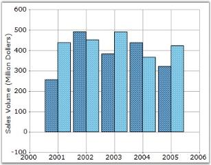

### Toolbar Appearance

Toolbar provides an option to set different back color, border style, button back color and button fore color. 

User can enable or disable the Border line of Toolbar by using [ShowBorder](https://help.syncfusion.com/cr/windowsforms/Syncfusion.Windows.Forms.Chart.ChartToolBarInfo.html#Syncfusion_Windows_Forms_Chart_ChartToolBarInfo_ShowBorder) property in the Toolbar instance.

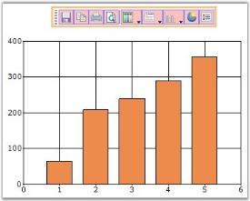

### Toolbar Behavior

The docking behavior of the Toolbar can be controlled using [Toolbar.Behavior](https://help.syncfusion.com/cr/windowsforms/Syncfusion.Windows.Forms.Chart.ChartToolBarInfo.html#Syncfusion_Windows_Forms_Chart_ChartToolBarInfo_Behavior) property. 

<table>
<tr>
<th>
Toolbar Property</th><th>
Description</th></tr>
<tr>
<td>

{{'[Behavior](https://help.syncfusion.com/cr/windowsforms/Syncfusion.Windows.Forms.Chart.ChartToolBarInfo.html#Syncfusion_Windows_Forms_Chart_ChartToolBarInfo_Behavior)'| markdownify }}
</td><td>
Specifies the docking behavior of the toolbar. <ul><li>Docking - It is dockable on all four sides.</li><li>Movable - It is movable.</li><li>All - It is movable and dockable.</li><li>None - It is neither movable nor dockable.</li></ul></td></tr>
</table>

  



this.chartControl1.ToolBar.Behavior = ChartDockingFlags.All;





Me.chartControl1.ToolBar.Behavior = ChartDockingFlags.All




N> You can display or hide a toolbar while printing a Chart. See Printing And Print Preview topic for more details.

## Context Menu

Chart Area and Series Context menu

The chart has a built-in context menu, which can be enabled by setting the [ShowContextMenu](https://help.syncfusion.com/cr/windowsforms/Syncfusion.Windows.Forms.Chart.ChartControl.html#Syncfusion_Windows_Forms_Chart_ChartControl_ShowContextMenu) property to true. This context menu will let the user change the chart type on a series, enable zooming, switch between 2D and 3D modes and so on.

There are two types of context menus, both of which get shown by default when the above property is set to true.

1.Chart Area context menu - This will be displayed when the mouse is over the chart area.
 

This context menu can be disabled by setting the [DisplayChartContextMenu](https://help.syncfusion.com/cr/windowsforms/Syncfusion.Windows.Forms.Chart.ChartControl.html#Syncfusion_Windows_Forms_Chart_ChartControl_DisplayChartContextMenu) property to false.

2.Chart Series context menu - This will be displayed when the mouse is over a series.

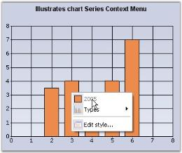

This context menu can be disabled by setting the [DisplaySeriesContextMenu](https://help.syncfusion.com/cr/windowsforms/Syncfusion.Windows.Forms.Chart.ChartControl.html#Syncfusion_Windows_Forms_Chart_ChartControl_DisplaySeriesContextMenu) property to false.

### Legend Context Menu

This context menu can be enabled by setting the [ShowContextMenuInLegend](https://help.syncfusion.com/cr/windowsforms/Syncfusion.Windows.Forms.Chart.ChartControl.html#Syncfusion_Windows_Forms_Chart_ChartControl_ShowContextMenuInLegend) property to true.

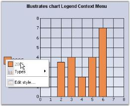

## Interactive Features

### Interactive Cursor

This feature lets you position the mouse pointer at a specific data point in a series and hint you on it's x and y values via a horizontal and vertical line passing through the data point and intersecting the x and y axis. These lines can be dragged around in order to position them at specific data points.

Interactive Cursor can be implemented by creating an instance of [ChartInteractiveCursor](https://help.syncfusion.com/cr/windowsforms/Syncfusion.Windows.Forms.Chart.ChartInteractiveCursor.html) with the [ChartSeries](https://help.syncfusion.com/cr/windowsforms/Syncfusion.Windows.Forms.Chart.ChartSeries.html) as its input. Then add the instance to the [InteractiveCursors](https://help.syncfusion.com/cr/windowsforms/Syncfusion.Windows.Forms.Chart.ChartArea.html#Syncfusion_Windows_Forms_Chart_ChartArea_InteractiveCursors) collection as shown below. 

  



// Create a new instance of the ChartInteractiveCursor class and initialize chart series into it.

ChartInteractiveCursor cursor1 = new ChartInteractiveCursor(this.chartControl1.Series[0]);

// Add the instance to the ChartInteractive Cursor collection.

this.chartControl1.ChartArea.InteractiveCursors.Add(cursor1));

//Color of the pointer

cursor1.Color = Color.Red;





' Create a new instance of the ChartInteractiveCursor class and initialize chart series into it.

ChartInteractiveCursor cursor1 = New ChartInteractiveCursor(Me.chartControl1.Series(0))

' Add the instance to the ChartInteractive Cursor collection.

Me.chartControl1.ChartArea.InteractiveCursors.Add(cursor1))

'Color of the pointer

cursor1.Color = Color.Red




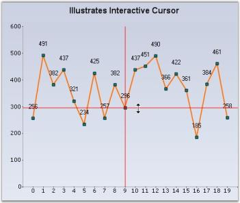

### Chart AutoHighlight 

The points or the series of the chart can be highlighted when the mouse hovers over them. Use the [AutoHighlight](https://help.syncfusion.com/cr/windowsforms/Syncfusion.Windows.Forms.Chart.ChartControl.html#Syncfusion_Windows_Forms_Chart_ChartControl_AutoHighlight) property to enable this feature.

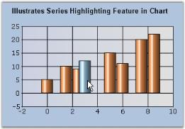

### Chart Series Highlighting

You can also highlight a particular chart series alone while mouse hovering, and make the other series transparent. For this, you need to set [SeriesHighlight](https://help.syncfusion.com/cr/windowsforms/Syncfusion.Windows.Forms.Chart.ChartControl.html#Syncfusion_Windows_Forms_Chart_ChartControl_SeriesHighlight) property to true. The series can also be highlighted by hovering the mouse over a legend item corresponding to a particular series.

The following table describes properties related to this feature.

<table>
<tr>
<th>
Property</th><th>
Description</th></tr>
<tr>
<td>

{{'[HighlightInterior](https://help.syncfusion.com/cr/windowsforms/Syncfusion.Windows.Forms.Chart.ChartStyleInfo.html#Syncfusion_Windows_Forms_Chart_ChartStyleInfo_HighlightInterior)'| markdownify }}
</td><td>
Sets the highlight color for the series.</td></tr>
<tr>
<td>
{{'[DimmedInterior](https://help.syncfusion.com/cr/windowsforms/Syncfusion.Windows.Forms.Chart.ChartStyleInfo.html#Syncfusion_Windows_Forms_Chart_ChartStyleInfo_DimmedInterior)'| markdownify }}
</td><td>
Controls the transparency of the non-highlighted series. While mouse hovering on a particular series, all other series will be set with the color, specified in this property.</td></tr>
<tr>
<td>
{{'[SeriesHighlightIndex](https://help.syncfusion.com/cr/windowsforms/Syncfusion.Windows.Forms.Chart.ChartControl.html#Syncfusion_Windows_Forms_Chart_ChartControl_SeriesHighlightIndex)'| markdownify }}
</td><td>
If you want to highlight only a particular series alone, you need to set the index value for this property. The default value is -1.</td></tr>
</table>

N> The [AutoHighlight](https://help.syncfusion.com/cr/windowsforms/Syncfusion.Windows.Forms.Chart.ChartControl.html#Syncfusion_Windows_Forms_Chart_ChartControl_AutoHighlight) property should be disabled to enable this chart series highlighting feature.

  



this.chartControl1.SeriesHighlight = true;

this.chartControl1.Series[0].Style.HighlightInterior = new BrushInfo(Color.Gold);

BrushInfo bi = new BrushInfo(GradientStyle.Vertical, Color.Red, Color.Red);

this.chartControl1.Series[0].Style.HiddenInterior = new BrushInfo(0, bi); 





Me.chartControl1.SeriesHighlight = True

Me.chartControl1.Series(0).Style.HighlightInterior = New BrushInfo(Color.Gold)

Dim bi As New BrushInfo(GradientStyle.Vertical, Color.Red, Color.Red)

Me.chartControl1.Series(0).Style.HiddenInterior = New BrushInfo(0, bi




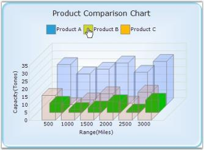

### Drawing Interactive Cursor Separately – Either Horizontally or Vertically or Both 

An Interactive cursor is used to indicate the x-axis and y-axis values of a data point. The interactive cursor can be drawn in different orientations namely **Horizontal, Vertical** and in both directions. The cursor color can also be changed according to requirements. The default color is set at the initial stage and this can be changed according to orientation or a common color can be set for both orientations as the parent color.

### Use Case Scenarios

The purpose of using Chart Interactive Cursor is to indicate the x-axis and y-axis values for a specified data point.  You can accurately locate the position of the point on the axes. You can use it as per your requirement i.e. horizontal, vertical or both accordingly.

The following screenshot shows the Interactive cursor, which is drawn in horizontal orientation:

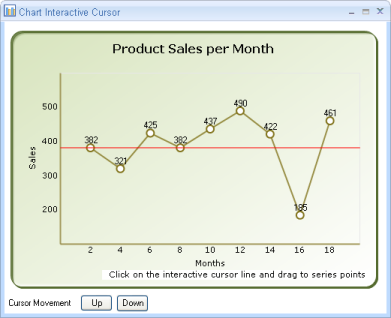

**Properties**

<table>
<tr>
<th>
Property </th><th>
Description </th><th>
Data Type </th></tr>
<tr>
<td>

{{'[CursorOrientation](https://help.syncfusion.com/cr/windowsforms/Syncfusion.Windows.Forms.Chart.ChartInteractiveCursor.html#Syncfusion_Windows_Forms_Chart_ChartInteractiveCursor_CursorOrientation)'| markdownify }}
</td><td>
Indicates the orientation in which the Interactive Cursor is to be drawn. The options are : <ul><li>Horizontal</li><li>Vertical</li><li>Both</li></ul></td><td>
 Enum </td></tr>
<tr>
<td>
{{'[HorizontalCursorColor](https://help.syncfusion.com/cr/windowsforms/Syncfusion.Windows.Forms.Chart.ChartInteractiveCursor.html#Syncfusion_Windows_Forms_Chart_ChartInteractiveCursor_HorizontalCursorColor)'| markdownify }}
</td><td>
Specifies the color, which is to be used when Horizontal Interactive Cursor is drawn.</td><td>
Color</td></tr>
<tr>
<td>
{{'[VerticalCursorColor](https://help.syncfusion.com/cr/windowsforms/Syncfusion.Windows.Forms.Chart.ChartInteractiveCursor.html#Syncfusion_Windows_Forms_Chart_ChartInteractiveCursor_VerticalCursorColor)'| markdownify }}
</td><td>
Specifies the color, which is to be used when Vertical  Interactive Cursor is drawn.</td><td>
Color</td></tr>
<tr>
<td>
{{'[Color](https://help.syncfusion.com/cr/windowsforms/Syncfusion.Windows.Forms.Chart.ChartInteractiveCursor.html#Syncfusion_Windows_Forms_Chart_ChartInteractiveCursor_Color)'| markdownify }}
</td><td>
Specifies the base color, which is to be used other than the default color. This acts as a parent color.</td><td>
Color</td></tr>
</table>

**Drawing Interactive Cursor in a Chart Application**

To add Interactive Cursor to the Chart control:

1. Add a Interactive cursor to the Chart control.
2. Set the orientation to horizontal or vertical or both.
3. Choose the color.

Refer to the following code snippets to draw the interactive cursor separately.

  



cursor1 = new ChartInteractiveCursor(this.chartControl1.Series[0]);

this.chartControl1.ChartArea.InteractiveCursors.Add(cursor1);           

cursor1.CursorOrientation = InteractiveCursorOrientation.Horizontal;

cursor1.HorizontalCursorColor = Color.Red;





cursor1 = New ChartInteractiveCursor(Me.chartControl1.Series(0))

Me.chartControl1.ChartArea.InteractiveCursors.Add(cursor1)

cursor1.CursorOrientation = InteractiveCursorOrientation.Horizontal

cursor1.HorizontalCursorColor = Color.Red




The interactive cursor as described earlier can be set in three different orientations. 

To draw the interactive cursor in horizontal orientation, you need to set the cursor orientation to **Horizontal** as shown in the following code snippets.

  



cursor1.CursorOrientation = InteractiveCursorOrientation.Horizontal;





cursor1.CursorOrientation = InteractiveCursorOrientation.Horizontal




The same step is repeated for **vertical** and **both** cursor orientations except for the naming **Vertical** and **Both** respectively.

You can also add color(s) to individual interactive cursor. The default color (base color) is **Red**. You can change the default color by using [Color](https://help.syncfusion.com/cr/windowsforms/Syncfusion.Windows.Forms.Chart.ChartInteractiveCursor.html#Syncfusion_Windows_Forms_Chart_ChartInteractiveCursor_Color), [HorizontalCursorColor](https://help.syncfusion.com/cr/windowsforms/Syncfusion.Windows.Forms.Chart.ChartInteractiveCursor.html#Syncfusion_Windows_Forms_Chart_ChartInteractiveCursor_HorizontalCursorColor), and [VerticalCursorColor](https://help.syncfusion.com/cr/windowsforms/Syncfusion.Windows.Forms.Chart.ChartInteractiveCursor.html#Syncfusion_Windows_Forms_Chart_ChartInteractiveCursor_VerticalCursorColor) properties. When you use the [Color](https://help.syncfusion.com/cr/windowsforms/Syncfusion.Windows.Forms.Chart.ChartInteractiveCursor.html#Syncfusion_Windows_Forms_Chart_ChartInteractiveCursor_Color) property, the interactive cursor will be drawn based on the color specified by the Color property (assuming this as base/parent color) regardless of the colors specified for Horizontal and Vertical cursor orientations. This is shown in the following code snippets.

  

cursor1.CursorOrientation = InteractiveCursorOrientation.Both ;

cursor1.Color = Color.Blue;

cursor1.VerticalCursorColor = Color.Green;

cursor1.HorizontalCursorColor = Color.Red;





cursor1.CursorOrientation = InteractiveCursorOrientation.Both

cursor1.Color = Color.Blue

cursor1.VerticalCursorColor = Color.Green

cursor1.HorizontalCursorColor = Color.Red




Now, the default color would be replaced with blue color at both the orientations as it is the parent color.

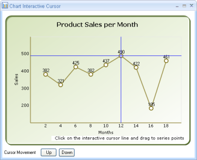

The following code snippets draw interactive cursor in different colors:

  



cursor1.CursorOrientation = InteractiveCursorOrientation.Both ;

cursor1.VerticalCursorColor = Color.Green;

cursor1.HorizontalCursorColor = Color.Red;





cursor1.CursorOrientation = InteractiveCursorOrientation.Both

cursor1.VerticalCursorColor = Color.Green

cursor1.HorizontalCursorColor = Color.Red




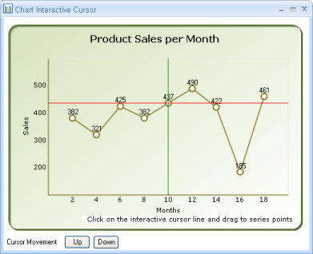

### ChartInteractiveCursor Support for Chart Area

Essential® Chart now supports moving the interactive cursor fully over the chart area. It provides simple methods to display symbols at the intersection of series points and the interactive cursor.

### Use Case Scenarios

This feature is useful for moving the interactive cursor across the entire chart area region, allowing users to get the intersection point values between the series and interactive cursor. 

### Sample Link

To view a sample,

1. Open the Syncfusion® Dashboard.
2. Click the Windows Forms drop-down list and select Run Locally Installed Samples.
3. Navigate to Chart samples > User Interaction > Chart Interactive Cursor.

<table>
<tr>
<th>
Property </th><th>
Description </th><th>
Type </th><th>
Data Type </th></tr>
<tr>
<td>

{{'[MoveToChartArea](https://help.syncfusion.com/cr/windowsforms/Syncfusion.Windows.Forms.Chart.ChartInteractiveCursor.html#Syncfusion_Windows_Forms_Chart_ChartInteractiveCursor_MoveToChartArea)'| markdownify }}
</td><td>
Specifies whether the  interactive cursor is enabled for chart series or series points</td><td>
Server Side </td><td>
Boolean</td></tr>
<tr>
<td>
{{'[XInterval](https://help.syncfusion.com/cr/windowsforms/Syncfusion.Windows.Forms.Chart.ChartInteractiveCursor.html#Syncfusion_Windows_Forms_Chart_ChartInteractiveCursor_XInterval)'| markdownify }}
</td><td>
Specifies the cursor movement on the x-axis (left to right or right to left)</td><td>
Server Side</td><td>
Double</td></tr>
<tr>
<td>
{{'[YInterval](https://help.syncfusion.com/cr/windowsforms/Syncfusion.Windows.Forms.Chart.ChartInteractiveCursor.html#Syncfusion_Windows_Forms_Chart_ChartInteractiveCursor_YInterval)'| markdownify }}
</td><td>
Specifies the cursor movement on the y-axis (top to bottom or bottom to top)</td><td>
Server Side</td><td>
Double</td></tr>
</table>

### Existing Features

We can move the interactive cursor for series points only (i.e., the interactive cursor can be moved from one data point to another by dragging). Users cannot move the interactive cursor over the whole chart area.

### MoveToChartArea

We can enable this feature by setting the [MoveToChartArea](https://help.syncfusion.com/cr/windowsforms/Syncfusion.Windows.Forms.Chart.ChartInteractiveCursor.html#Syncfusion_Windows_Forms_Chart_ChartInteractiveCursor_MoveToChartArea) property of the interactive cursor to true. The default value is false.

  



this.chartControl1.ChartArea.InteractiveCursors[0].MoveToChartArea = true;





Me.chartControl1.ChartArea.InteractiveCursors(0).MoveToChartArea = True




### XInterval

The cursor on the x-axis can be moved from left to right or right to left based on the value provided in this property of the interactive cursor.

### YInterval

The cursor on the y-axis can be moved from top to bottom or bottom to top based on the value provided in this property of the interactive cursor.

### Symbol

Symbols will be displayed when the interactive cursor meets the series point in the chart area by dragging.

  



this.chartControl1.ChartArea.InteractiveCursors[0].XInterval = 2;

this.chartControl1.ChartArea.InteractiveCursors[0].YInterval = 50;





Me.chartControl1.ChartArea.InteractiveCursors(0).XInterval = 2

Me.chartControl1.ChartArea.InteractiveCursors(0).YInterval = 50




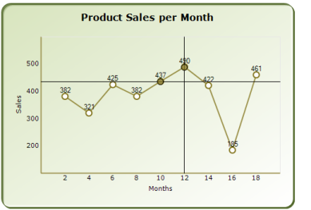

## ToolTips

Essential® Chart supports ToolTips in different areas of the chart which comes with multiple customization options.

The different tooltips in the chart can be turned off using the control's [ShowToolTips](https://help.syncfusion.com/cr/windowsforms/Syncfusion.Windows.Forms.Chart.ChartControl.html#Syncfusion_Windows_Forms_Chart_ChartControl_ShowToolTips) property.




  
this.chartControl1.ShowToolTips = true;

this.chartControl1.Tooltip.BackgroundColor = new BrushInfo(Color.White);

this.chartControl1.Tooltip.BorderStyle = BorderStyle.FixedSingle;

this.chartControl1.Tooltip.Font = new Font("Segoe UI", 10);





Me.chartControl1.ShowToolTips = true

Me.chartControl1.Tooltip.BackgroundColor = New BrushInfo(Color.White)

Me.chartControl1.Tooltip.BorderStyle = BorderStyle.FixedSingle

Me.chartControl1.Tooltip.Font = New Font("Segoe UI", 10)



	

N> The [ShowToolTips](https://help.syncfusion.com/cr/windowsforms/Syncfusion.Windows.Forms.Chart.ChartControl.html#Syncfusion_Windows_Forms_Chart_ChartControl_ShowToolTips) property in the chart is false by default, so remember to turn this on, before setting tooltips in the different chart areas.

### DataPoint Tooltips

Tooltips can be shown on each data point when the mouse hovers on them. The format of the tooltip is specified by the following property in [ChartSeries](https://help.syncfusion.com/cr/windowsforms/Syncfusion.Windows.Forms.Chart.ChartSeries.html).

<table>
<tr>
<th>
ChartSeries Property</th><th>
Description</th></tr>
<tr>
<td>

{{'[PointsToolTipFormat](https://help.syncfusion.com/cr/windowsforms/Syncfusion.Windows.Forms.Chart.ChartSeries.html#Syncfusion_Windows_Forms_Chart_ChartSeries_PointsToolTipFormat)'| markdownify }}
</td><td>
Specifies the format for the datapoint tooltips. The following place-holders can be used in the value.<ul><li>{0} - Will be replaced by the corresponding ChartSeries.Name.</li><li>{1} - Will be replaced by the corresponding ChartSeries.Style.ToolTip.</li><li>{2} - Will be replaced by the corresponding data point's tooltip, for example to set the first point's tooltip, use "series1.Styles[0].ToolTip".</li><li>{3} - Will be replaced by the corresponding X value of the point.</li><li>{4} - Will be replaced by the corresponding Y value of the point. Default setting.</li><li>{5} - Will be replaced by the 2nd Y value, if any.</li><li>{6} - and so on.</li></ul></td></tr>
</table>

  



series1.PointsToolTipFormat = "Sales:{4}K";





series1.PointsToolTipFormat = "Sales:{4}K"





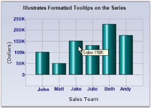

You can also customize the tooltip for individual data points by setting the ToolTip style for each data point. This is best accomplished by listening to the [ChartSeries.PrepareStyle](https://help.syncfusion.com/cr/windowsforms/Syncfusion.Windows.Forms.Chart.ChartSeries.html#Syncfusion_Windows_Forms_Chart_ChartSeries_PrepareStyle) event as shown below.

  



//Setting the Tooltip Format

series1.PointsToolTipFormat = "{2}"; 

protected void series1_PrepareStyle(object sender, ChartPrepareStyleInfoEventArgs args)

{

  // Style formatting using a callback. You can apply the same settings directly on the series style on the

  // point styles.

  ChartSeries series = sender as ChartSeries;

  if (series != null)

  {

    args.Style.ToolTip = "Made " + ( (series.Points[args.Index].YValues[0] / 150) * 100) + "% of quota";

    args.Handled = true;

  }

}





'Setting the Tooltip Format

series1.PointsToolTipFormat = "{2}"

Protected Sub series1_PrepareStyle(ByVal sender As Object, ByVal args As ChartPrepareStyleInfoEventArgs)

' Style formatting using a callback. You can apply the same settings directly on the series style on the

' point styles.

    Dim series As ChartSeries = CType(IIf(TypeOf sender Is ChartSeries, sender, Nothing), ChartSeries)

    If Not series Is Nothing Then

      args.Style.ToolTip = "Made " + ( (series.Points[args.Index].YValues[0] / 150) * 100) + "% of quota"

      args.Handled = True

    End If

End Sub




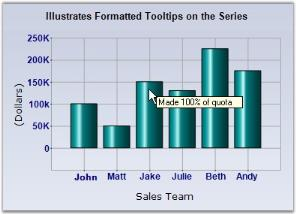

### Chart Area Tooltip

Tooltips can also be set for the whole chart area (does not include legends and the space around legends) through the ChartAreaToolTip. The data points tooltips will of course override this setting.

### Chart Empty Area Tooltip

The chart also lets you show a tooltip when the mouse hovers over empty areas in the chart (usually around the legend) via the ChartToolTip property.

### DataPoint FancyToolTip

Chart Windows includes a **fancy tooltip** feature. As the name implies, this tooltip, which occurs when hovering over a data point looks like a balloon and includes information regarding the series name and the X, Y points. This feature can be turned on by setting the [ChartSeries.FancyToolTip.Visible](https://help.syncfusion.com/cr/windowsforms/Syncfusion.Windows.Forms.Chart.ChartFancyToolTipInfo.html#Syncfusion_Windows_Forms_Chart_ChartFancyToolTipInfo_Visible) property to true.

The FancyToolTip can also be customized with more of the following properties.

<table>
<tr>
<th>
FancyToolTip Property</th><th>
Description</th></tr>
<tr>
<td>

{{'[Alignment](https://help.syncfusion.com/cr/windowsforms/Syncfusion.Windows.Forms.Chart.ChartFancyToolTipInfo.html#Syncfusion_Windows_Forms_Chart_ChartFancyToolTipInfo_Alignment)'| markdownify }}
</td><td>
Indicates the alignment of the marker to that of the tooltip balloon.</td></tr>
<tr>
<td>
{{'[Angle](https://help.syncfusion.com/cr/windowsforms/Syncfusion.Windows.Forms.Chart.ChartFancyToolTipInfo.html#Syncfusion_Windows_Forms_Chart_ChartFancyToolTipInfo_Angle)'| markdownify }}
</td><td>
Specifies the angle at which to render the balloon in the alignment specified.</td></tr>
<tr>
<td>
{{'[BackColor](https://help.syncfusion.com/cr/windowsforms/Syncfusion.Windows.Forms.Chart.ChartFancyToolTipInfo.html#Syncfusion_Windows_Forms_Chart_ChartFancyToolTipInfo_BackColor)'| markdownify }}
</td><td>
Specifies the back color</td></tr>
<tr>
<td>
{{'[Border](https://help.syncfusion.com/cr/windowsforms/Syncfusion.Windows.Forms.Chart.ChartFancyToolTipInfo.html#Syncfusion_Windows_Forms_Chart_ChartFancyToolTipInfo_Border)'| markdownify }}
</td><td>
Let you customize the border look of the tooltip.</td></tr>
<tr>
<td>
{{'[CheckLocation](https://help.syncfusion.com/cr/windowsforms/Syncfusion.Windows.Forms.Chart.ChartFancyToolTipInfo.html#Syncfusion_Windows_Forms_Chart_ChartFancyToolTipInfo_CheckLocation)'| markdownify }}
</td><td>
Specifies whether the tooltip should auto align when shown for data points close to the chart border.</td></tr>
<tr>
<td>
{{'[Font](https://help.syncfusion.com/cr/windowsforms/Syncfusion.Windows.Forms.Chart.ChartFancyToolTipInfo.html#Syncfusion_Windows_Forms_Chart_ChartFancyToolTipInfo_Font)'| markdownify }}
</td><td>
Specifies the font for the tooltip text.</td></tr>
<tr>
<td>
{{'[ForeColor](https://help.syncfusion.com/cr/windowsforms/Syncfusion.Windows.Forms.Chart.ChartFancyToolTipInfo.html#Syncfusion_Windows_Forms_Chart_ChartFancyToolTipInfo_ForeColor)'| markdownify }}
</td><td>
Specifies the color for the tooltip text.</td></tr>
<tr>
<td>
{{'[Spacing](https://help.syncfusion.com/cr/windowsforms/Syncfusion.Windows.Forms.Chart.ChartFancyToolTipInfo.html#Syncfusion_Windows_Forms_Chart_ChartFancyToolTipInfo_Spacing)'| markdownify }}
</td><td>
The space between the tooltip text and the border.</td></tr>
<tr>
<td>
{{'[Style](https://help.syncfusion.com/cr/windowsforms/Syncfusion.Windows.Forms.Chart.ChartFancyToolTipInfo.html#Syncfusion_Windows_Forms_Chart_ChartFancyToolTipInfo_Style)'| markdownify }}
</td><td>
Specifies the tooltip style. Possible values:EllipseRectangleSmoothRectangle - Default value</td></tr>
<tr>
<td>
{{'[Symbol](https://help.syncfusion.com/cr/windowsforms/Syncfusion.Windows.Forms.Chart.ChartFancyToolTipInfo.html#Syncfusion_Windows_Forms_Chart_ChartFancyToolTipInfo_Symbol)'| markdownify }}
</td><td>
Specifies the symbol shape to use.</td></tr>
<tr>
<td>
{{'[SymbolColor](https://help.syncfusion.com/cr/windowsforms/Syncfusion.Windows.Forms.Chart.ChartFancyToolTipInfo.html#Syncfusion_Windows_Forms_Chart_ChartFancyToolTipInfo_SymbolColor)'| markdownify }}
</td><td>
Specifies the inner color of the symbol.</td></tr>
<tr>
<td>
{{'[SymbolSize](https://help.syncfusion.com/cr/windowsforms/Syncfusion.Windows.Forms.Chart.ChartFancyToolTipInfo.html#Syncfusion_Windows_Forms_Chart_ChartFancyToolTipInfo_SymbolSize)'| markdownify }}
</td><td>
Specifies the size of the symbol.</td></tr>
<tr>
<td>
{{'[ToTarget](https://help.syncfusion.com/cr/windowsforms/Syncfusion.Windows.Forms.Chart.ChartFancyToolTipInfo.html#Syncfusion_Windows_Forms_Chart_ChartFancyToolTipInfo_ToTarget)'| markdownify }}
</td><td>
Specifies the distance between the balloon and the target.</td></tr>
<tr>
<td>
{{'[Visible](https://help.syncfusion.com/cr/windowsforms/Syncfusion.Windows.Forms.Chart.ChartFancyToolTipInfo.html#Syncfusion_Windows_Forms_Chart_ChartFancyToolTipInfo_Visible)'| markdownify }}
</td><td>
Turns on/off fancy tooltips.</td></tr>
</table>

  



series1.FancyToolTip.Visible = true;

series1.FancyToolTip.Alignment = TabAlignment.Top;





series1.FancyToolTip.Visible = True

series1.FancyToolTip.Alignment = TabAlignment.Top






[How to display tooltip over Histogram Chart columns](https://help.syncfusion.com/windowsforms/chart/faq/how-to-display-custom-tooltip-over-histogram-chart)



## Trackball

The [ChartTrackball](https://help.syncfusion.com/cr/windowsforms/Syncfusion.Windows.Forms.Chart.ChartTrackball.html)  displays information about the data point close to the current mouse position. The closest point can also be highlighted with a symbol or marker. The x values of an axis are determined from the position of the vertical line of the axis, and y values are determined from the points touching the vertical line in the series.

### Properties

The following properties are used to customize the appearance of [Trackball](https://help.syncfusion.com/cr/windowsforms/Syncfusion.Windows.Forms.Chart.ChartControl.html#Syncfusion_Windows_Forms_Chart_ChartControl_Trackball).

<table>
<tr>
<th>
Property 
</th>
<th>
Description
</th>
<th>
Type
</th>
</tr>
<tr>
<td>

{{'[Visible](https://help.syncfusion.com/cr/windowsforms/Syncfusion.Windows.Forms.Chart.ChartCrosshair.html#Syncfusion_Windows_Forms_Chart_ChartCrosshair_Visible)'| markdownify }}
</td>
<td>
Specifies whether the {{'[trackball](https://help.syncfusion.com/cr/windowsforms/Syncfusion.Windows.Forms.Chart.ChartControl.html#Syncfusion_Windows_Forms_Chart_ChartControl_Trackball)'| markdownify }} should be visible or not.
</td> 
<td>
bool
</td>
</tr>
<tr>
<td>
{{'[AxisTooltip](https://help.syncfusion.com/cr/windowsforms/Syncfusion.Windows.Forms.Chart.ChartCrosshair.html#Syncfusion_Windows_Forms_Chart_ChartCrosshair_AxisTooltip)'| markdownify }}
</td>
<td>
You can customize the border, text color, text format, corner radius, font, etc. of a tooltip using the {{'[Border](https://help.syncfusion.com/cr/windowsforms/Syncfusion.Windows.Forms.Chart.TrackballTooltip.html#Syncfusion_Windows_Forms_Chart_TrackballTooltip_Border)'| markdownify }}, {{'[TextColor](https://help.syncfusion.com/cr/windowsforms/Syncfusion.Windows.Forms.Chart.TrackballTooltip.html#Syncfusion_Windows_Forms_Chart_TrackballTooltip_TextColor)'| markdownify }}, {{'[TextFormat](https://help.syncfusion.com/cr/windowsforms/Syncfusion.Windows.Forms.Chart.TrackballTooltip.html#Syncfusion_Windows_Forms_Chart_TrackballTooltip_TextFormat)'| markdownify }}, {{'[CornerRadius](https://help.syncfusion.com/cr/windowsforms/Syncfusion.Windows.Forms.Chart.TrackballTooltip.html#Syncfusion_Windows_Forms_Chart_TrackballTooltip_CornerRadius)'| markdownify }}, {{'[Font](https://help.syncfusion.com/cr/windowsforms/Syncfusion.Windows.Forms.Chart.TrackballTooltip.html#Syncfusion_Windows_Forms_Chart_TrackballTooltip_Font)'| markdownify }}, etc properties. 

This customization will be applied to all the horizontal {{'[ChartAxis](https://help.syncfusion.com/cr/windowsforms/Syncfusion.Windows.Forms.Chart.ChartAxis.html)'| markdownify }}.
</td>
<td>
{{'[TrackballTooltip](https://help.syncfusion.com/cr/windowsforms/Syncfusion.Windows.Forms.Chart.TrackballTooltip.html)'| markdownify }}
</td>
</tr>
<tr>
<td>
{{'[DisplayMode](https://help.syncfusion.com/cr/windowsforms/Syncfusion.Windows.Forms.Chart.ChartTrackball.html#Syncfusion_Windows_Forms_Chart_ChartTrackball_DisplayMode)'| markdownify }}
</td>
<td>
Specifies whether single trackball tooltip should be displayed for all {{'[ChartSeries](https://help.syncfusion.com/cr/windowsforms/Syncfusion.Windows.Forms.Chart.ChartSeries.html)'| markdownify }} or each series should have its own trackball tooltip.

The following two options can be set to this property,

<ul><li>Float</li><li>Group</li></ul>
</td>
<td>
{{'[TrackballTooltipDisplayMode](https://help.syncfusion.com/cr/windowsforms/Syncfusion.Windows.Forms.Chart.TrackballTooltipDisplayMode.html)'| markdownify }}
</td>
</tr>
<tr>
<td>
{{'[Line](https://help.syncfusion.com/cr/windowsforms/Syncfusion.Windows.Forms.Chart.ChartCrosshair.html#Syncfusion_Windows_Forms_Chart_ChartCrosshair_Line)'| markdownify }}
</td>
<td>
The {{'[Line](https://help.syncfusion.com/cr/windowsforms/Syncfusion.Windows.Forms.Chart.ChartCrosshair.html#Syncfusion_Windows_Forms_Chart_ChartCrosshair_Line)'| markdownify }} property is used to hold the pen information to draw tracker line. 
</td>
<td>
{{'[ChartLineInfo](https://help.syncfusion.com/cr/windowsforms/Syncfusion.Windows.Forms.Chart.ChartLineInfo.html)'| markdownify }}
</td>
</tr>
<tr>
<td>
{{'[Symbol](https://help.syncfusion.com/cr/windowsforms/Syncfusion.Windows.Forms.Chart.ChartTrackball.html#Syncfusion_Windows_Forms_Chart_ChartTrackball_Symbol)'| markdownify }}
</td>
<td>
Provides options to customize the trackball symbols, which are used to highlight the data points. 

You can customize the {{'[Shape](https://help.syncfusion.com/cr/windowsforms/Syncfusion.Windows.Forms.Chart.ChartSymbolInfo.html#Syncfusion_Windows_Forms_Chart_ChartSymbolInfo_Shape)'| markdownify }}, {{'[Border](https://help.syncfusion.com/cr/windowsforms/Syncfusion.Windows.Forms.Chart.ChartSymbolInfo.html#Syncfusion_Windows_Forms_Chart_ChartSymbolInfo_Border)'| markdownify }}, and  {{'[Color](https://help.syncfusion.com/cr/windowsforms/Syncfusion.Windows.Forms.Chart.ChartSymbolInfo.html#Syncfusion_Windows_Forms_Chart_ChartSymbolInfo_Color)'| markdownify }} of a symbol to be highlighted using this instance.
</td>
<td>
{{'[ChartSymbolInfo](https://help.syncfusion.com/cr/windowsforms/Syncfusion.Windows.Forms.Chart.ChartSymbolInfo.html)'| markdownify }}
</td>
</tr>
<tr>
<td>
{{'[ToolTip](https://help.syncfusion.com/cr/windowsforms/Syncfusion.Windows.Forms.Chart.ChartTrackball.html#Syncfusion_Windows_Forms_Chart_ChartTrackball_Tooltip)'| markdownify }}
</td>
<td>
You can customize the border, text color, text format, font, corner radius, etc. of a trackball tooltip using the  {{'[Border](https://help.syncfusion.com/cr/windowsforms/Syncfusion.Windows.Forms.Chart.TrackballTooltip.html#Syncfusion_Windows_Forms_Chart_TrackballTooltip_Border)'| markdownify }}, {{'[TextColor](https://help.syncfusion.com/cr/windowsforms/Syncfusion.Windows.Forms.Chart.TrackballTooltip.html#Syncfusion_Windows_Forms_Chart_TrackballTooltip_TextColor)'| markdownify }}, {{'[TextFormat](https://help.syncfusion.com/cr/windowsforms/Syncfusion.Windows.Forms.Chart.TrackballTooltip.html#Syncfusion_Windows_Forms_Chart_TrackballTooltip_TextFormat)'| markdownify }}, {{'[CornerRadius](https://help.syncfusion.com/cr/windowsforms/Syncfusion.Windows.Forms.Chart.TrackballTooltip.html#Syncfusion_Windows_Forms_Chart_TrackballTooltip_CornerRadius)'| markdownify }}, {{'[Font](https://help.syncfusion.com/cr/windowsforms/Syncfusion.Windows.Forms.Chart.TrackballTooltip.html#Syncfusion_Windows_Forms_Chart_TrackballTooltip_Font)'| markdownify }}, etc properties. 

This customization will be applied to all the {{'[ChartSeries](https://help.syncfusion.com/cr/windowsforms/Syncfusion.Windows.Forms.Chart.ChartSeries.html)'| markdownify }} added in {{'[ChartControl](https://help.syncfusion.com/cr/windowsforms/Syncfusion.Windows.Forms.Chart.ChartControl.html)'| markdownify }} 
</td>
<td>
{{'[TrackballTooltip](https://help.syncfusion.com/cr/windowsforms/Syncfusion.Windows.Forms.Chart.TrackballTooltip.html)'| markdownify }}
</td>
</tr>
</table>

### Events

The following events are used to customize the appearance of [AxisTooltip](https://help.syncfusion.com/cr/windowsforms/Syncfusion.Windows.Forms.Chart.ChartCrosshair.html#Syncfusion_Windows_Forms_Chart_ChartCrosshair_AxisTooltip) and [ChartSeries](https://help.syncfusion.com/cr/windowsforms/Syncfusion.Windows.Forms.Chart.ChartSeries.html) tooltip individually before rendering them.

<table>
<tr>
<th>
Property 
</th>
<th>
Description 
</th>
<th>
Type 
</th>
</tr>
<tr>
<td>

{{'[AxisTooltipRendering](https://help.syncfusion.com/cr/windowsforms/Syncfusion.Windows.Forms.Chart.ChartTrackball.html#Syncfusion_Windows_Forms_Chart_ChartTrackball_AxisTooltipRendering)'| markdownify }}
</td>
<td>
This event is triggered once for each axis. The appearance of individual {{'[AxisTooltip](https://help.syncfusion.com/cr/windowsforms/Syncfusion.Windows.Forms.Chart.ChartCrosshair.html#Syncfusion_Windows_Forms_Chart_ChartCrosshair_AxisTooltip)'| markdownify }} of {{'[ChartControl](https://help.syncfusion.com/cr/windowsforms/Syncfusion.Windows.Forms.Chart.ChartControl.html)'| markdownify }}  can be customized using this event.
</td> 
<td>
{{'[AxisTooltipRenderingEventHandler](https://help.syncfusion.com/cr/windowsforms/Syncfusion.Windows.Forms.Chart.AxisTooltipRenderingEventHandler.html)'| markdownify }}
</td>
</tr>
<tr>
<td>
{{'[TrackballTooltipRendering](https://help.syncfusion.com/cr/windowsforms/Syncfusion.Windows.Forms.Chart.ChartTrackball.html#Syncfusion_Windows_Forms_Chart_ChartTrackball_TrackballTooltipRendering)'| markdownify }}
</td>
<td>
This event is triggered once for each series. The appearance of individual {{'[TrackballTooltip](https://help.syncfusion.com/cr/windowsforms/Syncfusion.Windows.Forms.Chart.TrackballTooltip.html)'| markdownify }} of {{'[ChartSeries](https://help.syncfusion.com/cr/windowsforms/Syncfusion.Windows.Forms.Chart.ChartSeries.html)'| markdownify }} can be customized using this event.
</td> 
<td>
{{'[TrackballTooltipRenderingEventHandler](https://help.syncfusion.com/cr/windowsforms/Syncfusion.Windows.Forms.Chart.TrackballTooltipRenderingEventHandler.html)'| markdownify }}
</td>
</tr>
</table>

  



this.chartControl1.Trackball.Visible = true;





Me.chartControl1.Trackball.Visible = True





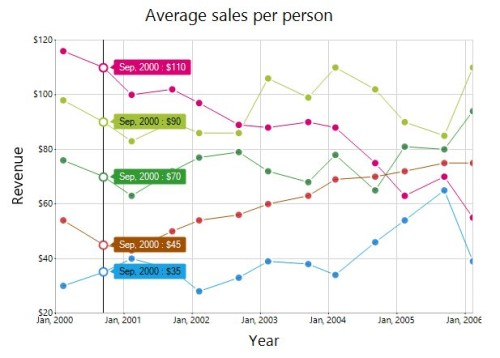

### Customize trackball marker and trackball line
 
Visibility, shape, size, and border of a trackball marker can be customized by using the  [Visibility](https://help.syncfusion.com/cr/windowsforms/Syncfusion.Windows.Forms.Chart.ChartCrosshair.html#Syncfusion_Windows_Forms_Chart_ChartCrosshair_Visible), [Shape](https://help.syncfusion.com/cr/windowsforms/Syncfusion.Windows.Forms.Chart.ChartTrackball.html#Syncfusion_Windows_Forms_Chart_ChartTrackball_Symbol), [Size](https://help.syncfusion.com/cr/windowsforms/Syncfusion.Windows.Forms.Chart.ChartSymbolInfo.html#Syncfusion_Windows_Forms_Chart_ChartSymbolInfo_Size), [Border](https://help.syncfusion.com/cr/windowsforms/Syncfusion.Windows.Forms.Chart.ChartSymbolInfo.html#Syncfusion_Windows_Forms_Chart_ChartSymbolInfo_Border) of the trackball marker. The [Color](https://help.syncfusion.com/cr/windowsforms/Syncfusion.Windows.Forms.Chart.ChartLineInfo.html#Syncfusion_Windows_Forms_Chart_ChartLineInfo_Color) and [Width](https://help.syncfusion.com/cr/windowsforms/Syncfusion.Windows.Forms.Chart.ChartLineInfo.html#Syncfusion_Windows_Forms_Chart_ChartLineInfo_Width) of a trackball line can be customized by using the [Line](https://help.syncfusion.com/cr/windowsforms/Syncfusion.Windows.Forms.Chart.ChartCrosshair.html#Syncfusion_Windows_Forms_Chart_ChartCrosshair_Line) option in the crosshair.

  



this.chartControl1.Trackball.Visible = true;

this.chartControl1.Trackball.Line.Color = Color.FromArgb(128, 0, 0);

this.chartControl1.Trackball.Line.Width = 3;

this.chartControl1.Trackball.Symbol.Shape = ChartSymbolShape.Pentagon;

this.chartControl1.Trackball.Symbol.Border.Width = 5;

this.chartControl1.Trackball.Symbol.Border.Color = Color.White;

this.chartControl1.Trackball.Symbol.Size = new Size(20, 20);





chartControl1.Trackball.Visible = True

chartControl1.Trackball.Line.Color = Color.FromArgb(128, 0, 0)

chartControl1.Trackball.Line.Width = 3

chartControl1.Trackball.Symbol.Shape = ChartSymbolShape.Pentagon

chartControl1.Trackball.Symbol.Border.Width = 5

chartControl1.Trackball.Symbol.Border.Color = Color.White

chartControl1.Trackball.Symbol.Size = New Size(20, 20)





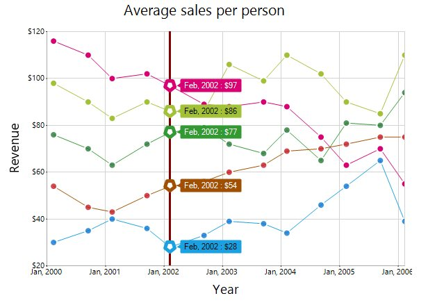

## Crosshair

The [ChartCrossHair](https://help.syncfusion.com/cr/windowsforms/Syncfusion.Windows.Forms.Chart.ChartCrosshair.html) behavior is used to view the values at mouse point or touch contact point. By hovering the mouse over the chart or taping the chart area, the corresponding value will be displayed as tooltip in the axis.

### Properties

The following properties are used to customize the appearance of [crosshair](https://help.syncfusion.com/cr/windowsforms/Syncfusion.Windows.Forms.Chart.ChartControl.html#Syncfusion_Windows_Forms_Chart_ChartControl_Crosshair).

<table>
<tr>
<th>
Property 
</th>
<th>
Description 
</th>
<th>
Type 
</th>
</tr>
<tr>
<td>

{{'[Visible](https://help.syncfusion.com/cr/windowsforms/Syncfusion.Windows.Forms.Chart.ChartCrosshair.html#Syncfusion_Windows_Forms_Chart_ChartCrosshair_Visible)'| markdownify }}
</td>
<td>
Specifies whether the {{'[crosshair](https://help.syncfusion.com/cr/windowsforms/Syncfusion.Windows.Forms.Chart.ChartControl.html#Syncfusion_Windows_Forms_Chart_ChartControl_Crosshair)'| markdownify }} should be visible or not.
</td> 
<td>
bool
</td>
</tr>
<tr>
<td>
{{'[AxisTooltip](https://help.syncfusion.com/cr/windowsforms/Syncfusion.Windows.Forms.Chart.ChartCrosshair.html#Syncfusion_Windows_Forms_Chart_ChartCrosshair_AxisTooltip)'| markdownify }}
</td>
<td>
Provides options to customize the border, text color, text format, corner radius, font, etc. of an axis tooltip using the {{'[Border](https://help.syncfusion.com/cr/windowsforms/Syncfusion.Windows.Forms.Chart.TrackballTooltip.html#Syncfusion_Windows_Forms_Chart_TrackballTooltip_Border)'| markdownify }}, {{'[TextColor](https://help.syncfusion.com/cr/windowsforms/Syncfusion.Windows.Forms.Chart.TrackballTooltip.html#Syncfusion_Windows_Forms_Chart_TrackballTooltip_TextColor)'| markdownify }}, {{'[TextFormat](https://help.syncfusion.com/cr/windowsforms/Syncfusion.Windows.Forms.Chart.TrackballTooltip.html#Syncfusion_Windows_Forms_Chart_TrackballTooltip_TextFormat)'| markdownify }}, {{'[CornerRadius](https://help.syncfusion.com/cr/windowsforms/Syncfusion.Windows.Forms.Chart.TrackballTooltip.html#Syncfusion_Windows_Forms_Chart_TrackballTooltip_CornerRadius)'| markdownify }}, {{'[Font](https://help.syncfusion.com/cr/windowsforms/Syncfusion.Windows.Forms.Chart.TrackballTooltip.html#Syncfusion_Windows_Forms_Chart_TrackballTooltip_Font)'| markdownify }}, etc properties.

This customization will be applied to all the {{'[ChartAxis](https://help.syncfusion.com/cr/windowsforms/Syncfusion.Windows.Forms.Chart.ChartAxis.html)'| markdownify }}.
</td>
<td>
{{'[TrackballTooltip](https://help.syncfusion.com/cr/windowsforms/Syncfusion.Windows.Forms.Chart.TrackballTooltip.html)'| markdownify }}
</td>
</tr>
<tr>
<td>
{{'[Line](https://help.syncfusion.com/cr/windowsforms/Syncfusion.Windows.Forms.Chart.ChartCrosshair.html#Syncfusion_Windows_Forms_Chart_ChartCrosshair_Line)'| markdownify }}
</td>
<td>
This property holds the pen information to draw tracker line. 
</td>
<td>
{{'[ChartLineInfo](https://help.syncfusion.com/cr/windowsforms/Syncfusion.Windows.Forms.Chart.ChartLineInfo.html)'| markdownify }}
</td>
</tr>
</table>

### Events

The following event is used to customize the appearance of [AxisTooltip](https://help.syncfusion.com/cr/windowsforms/Syncfusion.Windows.Forms.Chart.ChartCrosshair.html#Syncfusion_Windows_Forms_Chart_ChartCrosshair_AxisTooltip).

<table>
<tr>
<th>
Property 
</th>
<th>
Description 
</th>
<th>
Type 
</th>
</tr>
<tr>
<td>

{{'[AxisTooltipRendering](https://help.syncfusion.com/cr/windowsforms/Syncfusion.Windows.Forms.Chart.ChartCrosshair.html#Syncfusion_Windows_Forms_Chart_ChartCrosshair_AxisTooltipRendering)'| markdownify }} 
</td>
<td>
This event is triggered once for each axis. The appearance of individual {{'[AxisTooltip](https://help.syncfusion.com/cr/windowsforms/Syncfusion.Windows.Forms.Chart.ChartCrosshair.html#Syncfusion_Windows_Forms_Chart_ChartCrosshair_AxisTooltip)'| markdownify }} of {{'[ChartControl](https://help.syncfusion.com/cr/windowsforms/Syncfusion.Windows.Forms.Chart.ChartControl.html)'| markdownify }} can be customized using this event.
</td> 
<td>
{{'[AxisTooltipRenderingEventHandler](https://help.syncfusion.com/cr/windowsforms/Syncfusion.Windows.Forms.Chart.AxisTooltipRenderingEventHandler.html)'| markdownify }}
</td>
</tr>
</table>

  



this.chartControl1.Crosshair.Visible = true;





Me.chartControl1.Crosshair.Visible = True





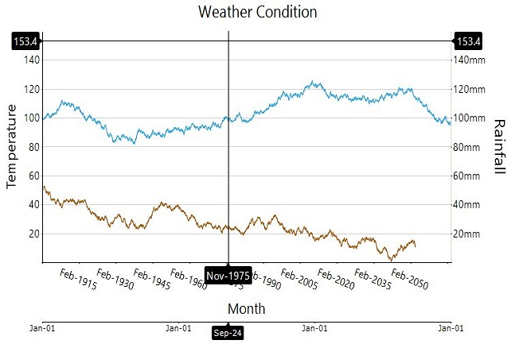

### Customize the crosshair line and crosshair label

The fill and border options of the crosshairLabel are used to customize the background color and border of the crosshair label, respectively. The [Color](https://help.syncfusion.com/cr/windowsforms/Syncfusion.Windows.Forms.Chart.ChartLineInfo.html#Syncfusion_Windows_Forms_Chart_ChartLineInfo_Color) and [Width](https://help.syncfusion.com/cr/windowsforms/Syncfusion.Windows.Forms.Chart.ChartLineInfo.html#Syncfusion_Windows_Forms_Chart_ChartLineInfo_Width) of a crosshair line can be customized by using the [Line](https://help.syncfusion.com/cr/windowsforms/Syncfusion.Windows.Forms.Chart.ChartCrosshair.html#Syncfusion_Windows_Forms_Chart_ChartCrosshair_Line) option of the crosshair.

  



this.chartControl1.Crosshair.AxisTooltip.Border = new ChartLineInfo();

this.chartControl1.Crosshair.AxisTooltip.Border.Color = Color.Green;

this.chartControl1.Crosshair.AxisTooltip.Border.Width = 3;

this.chartControl1.Crosshair.Line.Color = Color.Gray;

this.chartControl1.Crosshair.Line.Width = 3;

this.chartControl1.Crosshair.AxisTooltip.Interior = new BrushInfo(Color.Red);





chartControl1.Crosshair.AxisTooltip.Border = New ChartLineInfo()

chartControl1.Crosshair.AxisTooltip.Border.Color = Color.Green

chartControl1.Crosshair.AxisTooltip.Border.Width = 3

chartControl1.Crosshair.Line.Color = Color.Gray

chartControl1.Crosshair.Line.Width = 3

chartControl1.Crosshair.AxisTooltip.Interior = New BrushInfo(Color.Red)





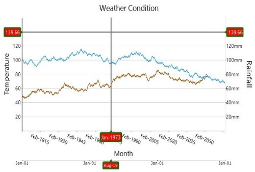
