# Statistical Formulas in Windows Forms Chart

Essential Chart comes with support for several Statistical formulas that will let you apply formulas on data points in one or more series and will help you analyze and arrive at meaningful information from those data points.

These formulas are mainly exposed via static methods from the [BasicStatisticalFormulas](https://help.syncfusion.com/cr/windowsforms/Syncfusion.Windows.Forms.Chart.Statistics.BasicStatisticalFormulas.html) and UtilityFunctions types.

## Basic Statistical Formulas

Some commonly used statistical formulas that you can apply on the series points are exposed via static methods in the [BasicStatisticalFormulas](https://help.syncfusion.com/cr/windowsforms/Syncfusion.Windows.Forms.Chart.Statistics.BasicStatisticalFormulas.html) type.

**BasicStatisticalFormula**

<table>
<tr>
<th>
Statistical Formulas</th><th>
Description</th></tr>
<tr>
<td>

{{'[ANOVA](https://help.syncfusion.com/cr/windowsforms/Syncfusion.Windows.Forms.Chart.Statistics.BasicStatisticalFormulas.html#Syncfusion_Windows_Forms_Chart_Statistics_BasicStatisticalFormulas_Anova_System_Double_Syncfusion_Windows_Forms_Chart_ChartSeries___)'| markdownify }}
</td><td>
An ANOVA test is used to test the differences between the means of two or more groups of data.</td></tr>
<tr>
<td>
{{'[Correlation](https://help.syncfusion.com/cr/windowsforms/Syncfusion.Windows.Forms.Chart.Statistics.BasicStatisticalFormulas.html#Syncfusion_Windows_Forms_Chart_Statistics_BasicStatisticalFormulas_Correlation_Syncfusion_Windows_Forms_Chart_ChartSeries_Syncfusion_Windows_Forms_Chart_ChartSeries_)'| markdownify }}
</td><td> 
The Correlation formula shows how strong the relation is between two random variables.</td></tr>
<tr>
<td>
{{'[Covariance](https://help.syncfusion.com/cr/windowsforms/Syncfusion.Windows.Forms.Chart.Statistics.BasicStatisticalFormulas.html#Syncfusion_Windows_Forms_Chart_Statistics_BasicStatisticalFormulas_Covariance_Syncfusion_Windows_Forms_Chart_ChartSeries_Syncfusion_Windows_Forms_Chart_ChartSeries_)'| markdownify }}
</td><td>
The Covariance formula measures the degree of dependence between two random variables.</td></tr>
<tr>
<td>
{{'[F-Test](https://help.syncfusion.com/cr/windowsforms/Syncfusion.Windows.Forms.Chart.Statistics.BasicStatisticalFormulas.html#Syncfusion_Windows_Forms_Chart_Statistics_BasicStatisticalFormulas_FTest_System_Double_Syncfusion_Windows_Forms_Chart_ChartSeries_Syncfusion_Windows_Forms_Chart_ChartSeries_)'| markdownify }}
</td><td>
An F-test is any statistical test in which, the test statistic has an F-distribution if the null hypothesis is true. </td></tr>
<tr>
<td>
{{'[Mean](https://help.syncfusion.com/cr/windowsforms/Syncfusion.Windows.Forms.Chart.Statistics.BasicStatisticalFormulas.html#Syncfusion_Windows_Forms_Chart_Statistics_BasicStatisticalFormulas_Mean_Syncfusion_Windows_Forms_Chart_ChartSeries_)'| markdownify }}
</td><td>
This formula returns the average, or mean, of data stored in a data series.</td></tr>
<tr>
<td>
{{'[Median](https://help.syncfusion.com/cr/windowsforms/Syncfusion.Windows.Forms.Chart.Statistics.BasicStatisticalFormulas.html#Syncfusion_Windows_Forms_Chart_Statistics_BasicStatisticalFormulas_Median_Syncfusion_Windows_Forms_Chart_ChartSeries_)'| markdownify }}
</td><td>
This formula returns the median for data stored in a data series.</td></tr>
<tr>
<td>
{{'[StandardDeviation](https://help.syncfusion.com/cr/windowsforms/Syncfusion.Windows.Forms.Chart.Statistics.BasicStatisticalFormulas.html#Syncfusion_Windows_Forms_Chart_Statistics_BasicStatisticalFormulas_StandardDeviation_Syncfusion_Windows_Forms_Chart_ChartSeries_System_Boolean_)'| markdownify }}
</td><td>
This formula returns the Standard Deviation within a group of data.</td></tr>
<tr>
<td>
{{'[T Test with Equal Variances](https://help.syncfusion.com/cr/windowsforms/Syncfusion.Windows.Forms.Chart.Statistics.BasicStatisticalFormulas.html#Syncfusion_Windows_Forms_Chart_Statistics_BasicStatisticalFormulas_TTestEqualVariances_System_Double_System_Double_Syncfusion_Windows_Forms_Chart_ChartSeries_Syncfusion_Windows_Forms_Chart_ChartSeries_)'| markdownify }}
</td><td>
Perform a T Test using Student's distribution (T distribution) with equal variances.</td></tr>
<tr>
<td>
{{'[T Test Paired](https://help.syncfusion.com/cr/windowsforms/Syncfusion.Windows.Forms.Chart.Statistics.BasicStatisticalFormulas.html#Syncfusion_Windows_Forms_Chart_Statistics_BasicStatisticalFormulas_TTestPaired_System_Double_System_Double_Syncfusion_Windows_Forms_Chart_ChartSeries_Syncfusion_Windows_Forms_Chart_ChartSeries_)'| markdownify }}
</td><td>
Performs a T Test using Student's distribution (T distribution) with paired samples. This is useful when there is a natural pairing of observations in samples. (i.e. when a sample group is tested twice.)</td></tr>
<tr>
<td>
{{'[T Test with unequal variances](https://help.syncfusion.com/cr/windowsforms/Syncfusion.Windows.Forms.Chart.Statistics.BasicStatisticalFormulas.html#Syncfusion_Windows_Forms_Chart_Statistics_BasicStatisticalFormulas_TTestUnEqualVariances_System_Double_System_Double_Syncfusion_Windows_Forms_Chart_ChartSeries_Syncfusion_Windows_Forms_Chart_ChartSeries_)'| markdownify }}
</td><td>
Perform a T Test using Student's distribution (T distribution) with unequal variances.</td></tr>
<tr>
<td>
{{'[Variance](https://help.syncfusion.com/cr/windowsforms/Syncfusion.Windows.Forms.Chart.Statistics.BasicStatisticalFormulas.html#Syncfusion_Windows_Forms_Chart_Statistics_BasicStatisticalFormulas_Variance_Syncfusion_Windows_Forms_Chart_ChartSeries_System_Boolean_)'| markdownify }}
</td><td>
This formula returns the variance within a group of data. </td></tr>
<tr>
<td>
{{'[ZTest](https://help.syncfusion.com/cr/windowsforms/Syncfusion.Windows.Forms.Chart.Statistics.BasicStatisticalFormulas.html#Syncfusion_Windows_Forms_Chart_Statistics_BasicStatisticalFormulas_ZTest_System_Double_System_Double_System_Double_System_Double_Syncfusion_Windows_Forms_Chart_ChartSeries_Syncfusion_Windows_Forms_Chart_ChartSeries_)'| markdownify }}
</td><td>
This formula performs a Z Test using Normal distribution.</td></tr>
</table>

### ANOVA Test

ANOVA stands for **Analysis Of Variance**. It is a technique to test the hypothesis that means among two or more groups of data are equal and thereby, testing the differences between their variances, under the assumption that the sampled groups are normally distributed. 

The test actually compares the variation between the groups with the variation within the groups and produces the results based on the values of these variations. If the between variation is larger than the within variation, the means of the groups will not be equal. If both these variations are of approximately the same size, then there will not be any significant difference between the means.

**Steps to perform an ANOVA test**

The null hypothesis is that there is no difference between the means and the alternative hypothesis is that at least one means is different.

The following assumptions must be satisfied before performing the test.

* The groups from which the samples were obtained must be normally distributed.
* The groups are sampled randomly.
* The samples must be independent.
* The variances of the groups must be equal.
* The null hypothesis.

1. Calculate the Sum of Squares for total, between and within variations.

   #### Total Variation

   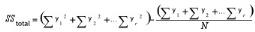

   #### Between Variation

   

   Where,

   y is the individual y point of the series,

   r is the number of series present,

   N is the total number of y points for all the series and

   n is the number of y points in each series.

   Within Variation

   **SSwithin = SStotal - SSamong**

2. Using the above quantities, calculate the degrees of freedom(_df_) for these variations.

   #### Between Variation

   _dfamong = r-1_

   #### Within Variation

   _dfwithin = N-r_

   Where,

   r is the number of series present and

   N is the total number of Y points for all the series.

3. As the next step, calculate the Mean Squares of these variations. The mean square for a variation can be calculated simply by dividing its sum of square by its degrees of freedom.

   #### Between Variation

   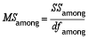

   #### Within Variation

   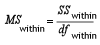

4. Finally, calculate F Ratio as below and get the F Critical Value.

   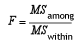

5. Make your decision as below.
   * If the between variance is smaller than the within variance, then the means are really close to each other and you will fail to reject the null hypothesis.
   * If the F ratio is greater than the F critical value, then the decision will be to reject the null hypothesis and thereby conclude that at least one of the means is different.

#### APIs Used

EssentialChart provides support to perform **ANOVA Test** by implementing a method named Anova in the [BasicStatisticalFormulas](https://help.syncfusion.com/cr/windowsforms/Syncfusion.Windows.Forms.Chart.Statistics.BasicStatisticalFormulas.html) class. This method does the above described calculations and returns the test results as an instance of AnovaResult class. The [AnovaResult](https://help.syncfusion.com/cr/windowsforms/Syncfusion.Windows.Forms.Chart.Statistics.AnovaResult.html) is a class implemented to store the ANOVA test results such as sum of squares, degrees of freedom and mean squares for different variations and also stores the [FRatio](https://help.syncfusion.com/cr/windowsforms/Syncfusion.Windows.Forms.Chart.Statistics.AnovaResult.html#Syncfusion_Windows_Forms_Chart_Statistics_AnovaResult_FRatio) and [FCriticalValue](https://help.syncfusion.com/cr/windowsforms/Syncfusion.Windows.Forms.Chart.Statistics.AnovaResult.html#Syncfusion_Windows_Forms_Chart_Statistics_AnovaResult_FCriticalValue) of the test. Below is a detailed table for the ANOVA method.

**Methods**

<table>
<tr>
<th>
Method Name</th><th>
Parameters</th><th>
Return Values</th></tr>
<tr>
<td>
Anova</td><td>
<ul><li>Probability: the alpha value (probability).</li><li>InputSeries: references to two or more input series. Each series must exist in the series collection at the time of the method call, and have the same number of data points.</li></ul></td><td>
An Anova has the following members:<ul><li>DegreeOfFreedomBetweenGroups</li><li>DegreeOfFreedomTotal</li><li>DegreeOfFreedomWithinGroups</li><li>FCriticalValue</li><li>FRatio</li><li>MeanSquareVarianceBetweenGroups</li><li>MeanSquareVarianceWithinGroups</li><li>SumOfSquaresBetweenGroups</li> <li>SumOfSquaresTotal</li><li>SumOfSquaresWithinGroups</li></ul></td></tr>
</table>

Here is a sample code snippet to simulate an ANOVA test.

  



AnovaResult ar = BasicStatisticalFormulas.Anova(confidenceLevel,new ChartSeries[]{ series1, series2, series3} );





Dim ar As AnovaResult = BasicStatisticalFormulas.Anova(confidenceLevel, New ChartSeries(){ series1, series2, series3})




The following image displays the results of an ANOVA test.

### Correlation

Correlation, which is otherwise called as **Correlation Coefficient**, is a statistical formula that determines the degree of relationship between the y values of two series representing two variables. This calculation will then be used to measure the depth of synchronization between those two variables. 

A relationship generally refers to the correspondence between two variables. For instance, let us have two variables with one representing **Work Experience** while the other indicating the **Salary Expectation**. If the **Work Experience** is high, then the **Salary Expectation** will also be high. When **Work Experience** is low, then the **Salary Expectation** also tends to be low. Thereby these two variables are correlated. 

The relationships can be classified into two types, **Positive and Negative**. In a positive relationship, high values on one variable are associated with high values on the other and low values on one variable are associated with low values on the other. The negative relationship is just the inverse of the positive relationship where the high values on one variable are associated with low values on the other.

When the measured correlation coefficient is positive, the series values would be positively correlated whereas if the correlation coefficient is negative, then the series values would then be negatively correlated. Below is the formula for calculating correlation coefficient.

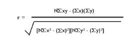

where,

x is the y value of first series and

y is the y value of second series.

#### Using the Formula

The **Correlation Coefficient** can easily be calculated by using the Correlation method available with the [BasicStatisticalFormulas](https://help.syncfusion.com/cr/windowsforms/Syncfusion.Windows.Forms.Chart.Statistics.BasicStatisticalFormulas.html) class. The following table describes the details of this method. This method returns the covariance of the datasets divided by the product of their standard deviations.

**Methods**

<table>
<tr>
<th>
Method Name</th><th>
Parameters</th><th>
Return Value</th></tr>
<tr>
<td>

{{'[Correlation](https://help.syncfusion.com/cr/windowsforms/Syncfusion.Windows.Forms.Chart.Statistics.BasicStatisticalFormulas.html#Syncfusion_Windows_Forms_Chart_Statistics_BasicStatisticalFormulas_Correlation_Syncfusion_Windows_Forms_Chart_ChartSeries_Syncfusion_Windows_Forms_Chart_ChartSeries_)'| markdownify }}
</td><td>
<ul><li>FirstInputSeries: A ChartSeries object that stores the first group's data.</li><li>SecondInputSeries: A ChartSeries object that stores the second group's data. An exception will be raised if the input series does not have the same number of data points.</li></ul></td><td>
A double that represents the correlation value between the two groups of data. The value always ranges from -1 to 1.</td></tr>
</table>

**Example**

The below code snippet demonstrates how to get the correlation coefficient between two groups of data (Series1 and Series2) using the in-built formula.

  



using Syncfusion.Windows.Forms.Chart.Statistics;

............

double Correlation1= BasicStatisticalFormulas.Correlation(series1,series2);





Imports Syncfusion.Windows.Forms.Chart.Statistics

.............

Dim Correlation1 As Double

Correlation1=BasicStatisticalFormulas.Correlation(series,series1)




N> For further details, refer to this Browser Sample:

&lt;Install Location&gt;\Syncfusion\EssentialStudio\<Install version>\Windows\Chart.Windows\Samples\Statistical Analysis\Chart Statistical Formulas

### Covariance

Covariance is a statistical formula that measures the extent to which the y values of two series vary together. It is basically used to measure the fluctuations between two quantities. For a given pairs of series y values, the covariance can be calculated by taking their differences from their mean values and multiplying these differences together. That is,

_Cov(x,y) = {[ x-(x) ][ y-(y) ]}_

If this product is positive, then the values would be varying in the same direction; if it is negative, then the values would be varying in opposite directions. If the product is zero, then we can conclude that there is no linear relationship between the series values. The above formula can be simplified as below.

_Cov(x,y) = {xy} - {x}{y}_

#### Using the Formula

The [Covariance](https://help.syncfusion.com/cr/windowsforms/Syncfusion.Windows.Forms.Chart.Statistics.BasicStatisticalFormulas.html#Syncfusion_Windows_Forms_Chart_Statistics_BasicStatisticalFormulas_Covariance_Syncfusion_Windows_Forms_Chart_ChartSeries_Syncfusion_Windows_Forms_Chart_ChartSeries_) can easily be calculated by using the Covariance method available with the [BasicStatisticalFormulas](https://help.syncfusion.com/cr/windowsforms/Syncfusion.Windows.Forms.Chart.Statistics.BasicStatisticalFormulas.html) class. The following table describes the details of this method.

**Methods**

<table>
<tr>
<th>
Method Name</th><th>
Parameters</th><th>
Return Value</th></tr>
<tr>
<td>

{{'[Covariance](https://help.syncfusion.com/cr/windowsforms/Syncfusion.Windows.Forms.Chart.Statistics.BasicStatisticalFormulas.html#Syncfusion_Windows_Forms_Chart_Statistics_BasicStatisticalFormulas_Covariance_Syncfusion_Windows_Forms_Chart_ChartSeries_Syncfusion_Windows_Forms_Chart_ChartSeries_)'| markdownify }}
</td><td>
<ul><li>FirstInputSeriesName: A ChartSeries object that stores the first group's data.</li><li>SecondInputSeriesName: A ChartSeries object that stores the second group's data. An exception will be raised if the input series do not have the same number of data points.</li></ul></td><td>
A double value that represents the covariance value between the two groups of data.</td></tr>
</table>

**Example**

Here is the code snippet that demonstrates the usage of this method.

  



using Syncfusion.Windows.Forms.Chart.Statistics;

............

double Covariance1= Statistics.BasicStatisticalFormulas.Covariance(series1,series2);





Imports Syncfusion.Windows.Forms.Chart.Statistics

.............

Dim Covariance1 As Double

Covariance1=BasicStatisticalFormulas.Covariance (series,series1)




N> For further details, refer to this Browser Sample:

&lt;Install Location&gt;\Syncfusion\EssentialStudio\<Install version>\Windows\Chart.Windows\Samples\Statistical Analysis\Chart Statistical Formulas

### F-Test

The [F-Test](https://help.syncfusion.com/cr/windowsforms/Syncfusion.Windows.Forms.Chart.Statistics.BasicStatisticalFormulas.html#Syncfusion_Windows_Forms_Chart_Statistics_BasicStatisticalFormulas_FTest_System_Double_Syncfusion_Windows_Forms_Chart_ChartSeries_Syncfusion_Windows_Forms_Chart_ChartSeries_) is a statistical test, which is carried out to find out whether two series have the same standard deviation with the specified confidence level. It is achieved by comparing the variances of the series values and thereby comparing their standard deviations. Here, the null hypothesis is that the two variances are equal. All hypothesis testing is done under the assumption that the null hypothesis is true.

#### Steps to perform F-Test

1. Calculate the variances of both the series.
2. Calculate F Ratio as given below.

**F Value_ _= firstSeriesVariance / secondSeriesVariance.**

F-Test can be easily performed by using the FTest method of [BasicStatisticalFormulas](https://help.syncfusion.com/cr/windowsforms/Syncfusion.Windows.Forms.Chart.Statistics.BasicStatisticalFormulas.html) class that returns the results as a type of FTestResult. The [FTestResult](https://help.syncfusion.com/cr/windowsforms/Syncfusion.Windows.Forms.Chart.Statistics.FTestResult.html) is a class implemented to save the F test result as FValue and other computation results such as series means, series variances, [FRatio](https://help.syncfusion.com/cr/windowsforms/Syncfusion.Windows.Forms.Chart.Statistics.AnovaResult.html#Syncfusion_Windows_Forms_Chart_Statistics_AnovaResult_FRatio) and [FCriticalValue](https://help.syncfusion.com/cr/windowsforms/Syncfusion.Windows.Forms.Chart.Statistics.AnovaResult.html#Syncfusion_Windows_Forms_Chart_Statistics_AnovaResult_FCriticalValue) of the test. Below is a detailed table for the FTest method.  

**Methods**

<table>
<tr>
<th>
Method Name</th><th>
Parameters</th><th>
Returns</th></tr>
<tr>
<td>
FTest
</td><td>
<ul><li>Probability: Probability that gives the confidence level.</li><li>FirstInputSeries: Type of ChartSeries object that represents the first group of data.</li><li>SecondInputSeries: Type of ChartSeries object that represents the second group of data.</li></ul></td><td>
An FTestResult has the following members:<ul><li>FirstSeriesMean</li><li>SecondSeriesMean</li><li>FirstSeriesVariance</li><li>SecondSeriesVariance</li><li>FValue</li><li>ProbabilityFOneTail</li><li>FCriticalValueOneTail</li></ul></td></tr>
</table>

**Example**

Here is a code snippet that shows a sample usage.

  



FTestResult result = Syncfusion.Windows.Forms.Chart.Statistics.BasicStatisticalFormulas.FTest(confidenceLevel,series1,series2);





Dim result As FTestResult = Syncfusion.Windows.Forms.Chart.Statistics.BasicStatisticalFormulas.FTest(confidenceLevel,series1,series2)




N> For further details, refer to this Browser Sample:

&lt;Install Location&gt;\Syncfusion\EssentialStudio\<Install version>\Windows\Chart.Windows\Samples\Statistical Analysis\Chart Statistical Formulas

### Mean

Mean is statistical formula that returns the arithmetic average of series y values where the arithmetic average is the sum of all y values of a series divided by the total number of y values present in that series. The arithmetic mean can be calculated for any chart series by using Mean method of the [BasicStatisticalFormulas](https://help.syncfusion.com/cr/windowsforms/Syncfusion.Windows.Forms.Chart.Statistics.BasicStatisticalFormulas.html) class. Below table shows the method details.

**Methods**

<table>
<tr>
<th>
Method Name</th><th>
Parameter</th><th>
Return value</th></tr>
<tr>
<td>

{{'[Mean](https://help.syncfusion.com/cr/windowsforms/Syncfusion.Windows.Forms.Chart.Statistics.BasicStatisticalFormulas.html#Syncfusion_Windows_Forms_Chart_Statistics_BasicStatisticalFormulas_Mean_Syncfusion_Windows_Forms_Chart_ChartSeries_)'| markdownify }}
</td><td>
InputSeries: A ChartSeries type object for whose y values an average is required. </td><td>
A double that represents the average of all the  y values in the given series.</td></tr>
</table>

**Example**

Here is a code snippet that shows a sample usage.

  



using Syncfusion.Windows.Forms.Chart.Statistics;

............

double calculatedMean = BasicStatisticalFormulas.Mean(series1);





Imports Syncfusion.Windows.Forms.Chart.Statistics

.............

Dim calculatedMean As Double

calculatedMean = BasicStatisticalFormulas.Mean(series1)




N> For further details, refer to this Browser Sample:

&lt;Install Location&gt;\Syncfusion\EssentialStudio\<Install version>\Windows\Chart.Windows\Samples\Statistical Analysis\Chart Statistical Formulas

### Median

Median is a statistical formula that is used to find the median of y values of a series. Median can be calculated by arranging the values from the lowest to the highest and picking up the middle one. If the total number of values is even, then pick up the two middle values after sorting the values in ascending order. The mean of these two middle values will give you the median. Hence half of the series points have values less than the median and the values of the other half will be greater than the median.

Median can be found out for any series by using the Median method of [BasicStatisticalFormulas](https://help.syncfusion.com/cr/windowsforms/Syncfusion.Windows.Forms.Chart.Statistics.BasicStatisticalFormulas.html) class. The below table shows the details of this method.

**Methods**

<table>
<tr>
<th>
Method Name</th><th>
Parameter</th><th>
Return value</th></tr>
<tr>
<td>

{{'[Median](https://help.syncfusion.com/cr/windowsforms/Syncfusion.Windows.Forms.Chart.Statistics.BasicStatisticalFormulas.html#Syncfusion_Windows_Forms_Chart_Statistics_BasicStatisticalFormulas_Median_Syncfusion_Windows_Forms_Chart_ChartSeries_)'| markdownify }}
</td><td>
InputSeries: A ChartSeries type object for whose X values an average is required.</td><td>
A double that represents the Median value of all the X values in the given series.</td></tr>
</table>

**Example**

Here is a code snippet that shows a sample usage.

  



using Syncfusion.Windows.Forms.Chart.Statistics;

............

double calculatedMedian = Statistics.BasicStatisticalFormulas.Median(series1);





Imports Syncfusion.Windows.Forms.Chart.Statistics

.............

Dim Median1 As Double

calculatedMedian = BasicStatisticalFormulas.Median(series1)




N> For further details, refer to this Browser Sample:

&lt;Install Location&gt;\Syncfusion\EssentialStudio\<Install version>\Windows\Chart.Windows\Samples\Statistical Analysis\Chart Statistical Formulas

### Standard Deviation

[StandardDeviation](https://help.syncfusion.com/cr/windowsforms/Syncfusion.Windows.Forms.Chart.Statistics.BasicStatisticalFormulas.html#Syncfusion_Windows_Forms_Chart_Statistics_BasicStatisticalFormulas_StandardDeviation_Syncfusion_Windows_Forms_Chart_ChartSeries_System_Boolean_) is the statistical formula that is basically used to measure the variability. That is, it can be used to measure how to spread out your data are. It can be defined as the square root of the variance where a variance is the average of the squared differences between the data points and the mean. In other words, it is named as the **root-mean-square** of the data values. 

It can be used to check how tightly the data values are clustered around the mean. If the data points are close to the mean, then the standard deviation will be small or if the points are far from the mean, then the standard deviation is large or if all the data values are equal, then the standard deviation is zero.

The Standard Deviation can be calculated for any series by using the [StandardDeviation](https://help.syncfusion.com/cr/windowsforms/Syncfusion.Windows.Forms.Chart.Statistics.BasicStatisticalFormulas.html#Syncfusion_Windows_Forms_Chart_Statistics_BasicStatisticalFormulas_StandardDeviation_Syncfusion_Windows_Forms_Chart_ChartSeries_System_Boolean_) method of [BasicStatisticalFormulas](https://help.syncfusion.com/cr/windowsforms/Syncfusion.Windows.Forms.Chart.Statistics.BasicStatisticalFormulas.html) class. Below is the detailed description of this method.

**Methods**

<table>
<tr>
<th>
Method Name</th><th>
Parameters</th><th>
Return Value</th></tr>
<tr>
<td>

{{'[StandardDeviation](https://help.syncfusion.com/cr/windowsforms/Syncfusion.Windows.Forms.Chart.Statistics.BasicStatisticalFormulas.html#Syncfusion_Windows_Forms_Chart_Statistics_BasicStatisticalFormulas_StandardDeviation_Syncfusion_Windows_Forms_Chart_ChartSeries_System_Boolean_)'| markdownify }}
</td><td>
<ul><li>InputSeries: A ChartSeries type object for on whose Y values this formula should be applied.</li><li>SampleVariance: true if the data is a sample of a population, false if it is the entire population.</li></ul></td><td>
A double that represents the standard deviation within the group of data.</td></tr>
</table>

**Example**

Here is a code snippet that shows a sample usage.

  



using Syncfusion.Windows.Forms.Chart.Statistics;

............

double Deviation1 = BasicStatisticalFormulas.StandartDeviation(series1,false);





Imports Syncfusion.Windows.Forms.Chart.Statistics

.............

Dim Deviation1 As Double

Deviation1 = BasicStatisticalFormulas. StandartDeviation  (series1,false)




N> For further details, refer to this Browser Sample:

&lt;Install Location&gt;\Syncfusion\EssentialStudio\<Install version>\Windows\Chart.Windows\Samples\Statistical Analysis\Chart Statistical Formulas

### T-Tests

T-Test is a statistical formula that is used to measure the equality between the means of two series. In other words, the T-test compares the actual difference between two means in relation to the variation in data that can be measured by calculating the standard deviation of the difference between the means.

It is a statistical test used to test the null hypothesis that the means of two normally distributed populations are equal. This test can be performed on two given samples (series), each characterized by its mean, standard deviation and number of data points, to determine whether the means are distinct based on the assumption that the underlying distributions are normal.

#### Different T-Tests

There are different versions of T tests depending on whether the samples are:

* Independent of each other, (where the series are random with no relationship between each other)

  _OR_

* Paired, (where every data point in one series will have a relationship with a particular point of another series).

If the calculated t-statistic exceeds the chosen threshold value (usually 0.05), then the decision is to reject the null hypothesis, which states that the two sample means are equal, in favor of an alternate hypothesis, which typically specifies that the two samples differ.

Below are the different formulae to calculate the t-statistic:

* T-Test with Equal Variances

This formula performs a T test for two groups of data and assumes equal variances between the two groups (i.e. series). 

* T-Test Paired

This formula performs a paired two-sample student's t-test to determine whether a sample's means are distinct. This form of the t-test does not assume that the variances of both the populations are equal. 

Use a paired test when there is a natural pairing of observations in the samples, such as a sample group that is tested twice. (e.g. before and after an experiment)

* T-Test with UnEqual Variances

This formula performs a T-test for two groups of data and assumes unequal variances between the two groups. (i.e. series)

This analysis tool is referred to as a heteroscedasticity t-test and can be used when the groups that are under study are distinct. Use a paired test when there is one group before and after a treatment.

N> For programming example, refer to the following Browser Sample:

&lt;Install Location&gt;\Syncfusion\EssentialStudio\<Install version>\Windows\Chart.Windows\Samples\Statistical Analysis\Chart Statistical Formulas

#### TTest with Equal Variances

This type of TTest can be performed on two random series that have no relationship with each other. But they should be of equal sizes, i.e., the number of data points of the two series should be same.

**Steps to perform the test**

1. Specify the null hypothesis and alternate hypothesis.

   * Null Hypothesis - Difference between the two means is zero.   
   * Alternate Hypothesis - Difference between the two means is not zero.

2. Calculate the means of the two input series (µ1 and µ2)and calculate their difference (Md).

   _Md = µ1 - µ2_

3. Calculate the variances of the two input series (s1 and s2).

4. Let n1 and n2 be the number of data points in first and second series respectively.

5. Calculate the degrees of freedom.

   _D = n1 + n2 - 2_

6. As a next step, calculate the Pooled Estimator as below.

   _Sp = (n1 - 1) * s1 + (n2 - 1) * s2_

7. Calculate the T-statistic as given below.

   _t = (µ1  - µ2 - Md) / Sqrt(Sp/n1 + Sp/n2)_

8. Construct a t-table at (n1+n2-2) degrees of freedom.

9. Choose a level of significance(probability), say p = 0.05 and read the tabulated value.

10. If the calculated tvalue exceeds the tabulated value we can say that the means are significantly different at that level of probability.

#### Using the Formula 

The TTest formula for equal variances can be calculated by using the [TTestEqualVariances](https://help.syncfusion.com/cr/windowsforms/Syncfusion.Windows.Forms.Chart.Statistics.BasicStatisticalFormulas.html#Syncfusion_Windows_Forms_Chart_Statistics_BasicStatisticalFormulas_TTestEqualVariances_System_Double_System_Double_Syncfusion_Windows_Forms_Chart_ChartSeries_Syncfusion_Windows_Forms_Chart_ChartSeries_) method of the [BasicStatisticalFormulas](https://help.syncfusion.com/cr/windowsforms/Syncfusion.Windows.Forms.Chart.Statistics.BasicStatisticalFormulas.html) class. The following table presents the details of this method. This method returns an instance of [TTestResult](https://help.syncfusion.com/cr/windowsforms/Syncfusion.Windows.Forms.Chart.Statistics.TTestResult.html) class that stores the resultant values of this test such as means of the two series, T value, degrees of freedom, number of points in every series, T critical value and confidence level(probability).

**Methods**

<table>
<tr>
<th>
Method Name</th><th>
Parameters</th><th>
Return Value</th></tr>
<tr>
<td>

{{'[TTestEqualVariances](https://help.syncfusion.com/cr/windowsforms/Syncfusion.Windows.Forms.Chart.Statistics.BasicStatisticalFormulas.html#Syncfusion_Windows_Forms_Chart_Statistics_BasicStatisticalFormulas_TTestEqualVariances_System_Double_System_Double_Syncfusion_Windows_Forms_Chart_ChartSeries_Syncfusion_Windows_Forms_Chart_ChartSeries_)'| markdownify }}
</td><td>
<ul><li>HypothesizedMeanDifference: A double value specifying the difference between two population means.</li><li>Probability: A double value that gives the confidence level.</li><li>FirstInputSeries: A ChartSeries object that stores the first group of data.</li><li>SecondInputSeries: A ChartSeries object that stores the second group of data.</li></ul></td><td>
A TTestResult object that has the following members:<ul><li>FirstSeriesMean</li><li>SecondSeriesMean</li><li>FirstSeriesVariance</li><li>SecondSeriesVariance</li><li>Tvalue</li><li>DegreeOfFreedom</li><li>ProbabilityTOneTail</li><li>TCriticalValueOneTail</li><li>ProbabilityTTwoTail</li> <li>TCriticalValueTwoTail</li></ul></td></tr>
</table>

**Example**

Here is a code snippet that shows a sample usage.

  



using Syncfusion.Windows.Forms.Chart.Statistics;

TTestResult result = BasicStatisticalFormulas.TTestEqualVariances (0.2, 0.05, series1, series2);





Imports Syncfusion.Windows.Forms.Chart.Statistics

Dim result As TTestResult = BasicStatisticalFormulas.TTestEqualVariances (0.2, 0.05, series1, series2)




#### T-Test with UnEqual Variance

If the assumption of 'equal variances' is violated, then we have to compute the test statistic using the individual sample's standard deviation instead of pooled standard deviation. Like the TTestEqualVariances formula, the TTestUnequalVariances formula also will be carried out on two independent samples. The only difference with unequal variances test is that the sample should be of different sizes.

**Steps to perform the test**

1.Specify the null hypothesis and alternate hypothesis.

   * Null Hypothesis - Difference between the two means is zero.
   * Alternate Hypothesis - Difference between the two means is not zero.

2.Calculate the means of the two input series (µ1 and µ2)and calculate their difference (Md).

   _Md = µ1 - µ2_

3.Calculate the variances of the two input series (s1 and s2).

4.Let n1 and n2 be the number of data points in first and second series respectively.

5.Calculate the degrees of freedom.

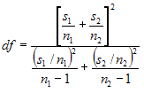

6.Calculate the T-statistic as given below.

   _t = (µ1  - µ2 - Md) / Sqrt( s1/n1 + s2/n2 )_

7.Choose a level of significance (probability), say p = 0.05 and read the tabulated value.

8.If the calculated tvalue exceeds the tabulated value we can say that the means are significantly different at that level of probability.

#### Using the Formula 

The TTest formula for unequal variances can be calculated by using the [TTestUnEqualVariances](https://help.syncfusion.com/cr/windowsforms/Syncfusion.Windows.Forms.Chart.Statistics.BasicStatisticalFormulas.html#Syncfusion_Windows_Forms_Chart_Statistics_BasicStatisticalFormulas_TTestUnEqualVariances_System_Double_System_Double_Syncfusion_Windows_Forms_Chart_ChartSeries_Syncfusion_Windows_Forms_Chart_ChartSeries_) method of the [BasicStatisticalFormulas](https://help.syncfusion.com/cr/windowsforms/Syncfusion.Windows.Forms.Chart.Statistics.BasicStatisticalFormulas.html) class. The following table presents the details of this method. This method returns an instance of [TTestResult](https://help.syncfusion.com/cr/windowsforms/Syncfusion.Windows.Forms.Chart.Statistics.TTestResult.html) class that stores the resultant values of this test such as means of the two series, T value, degrees of freedom, number of points in every series, T critical value and confidence level (probability).

**Methods**

<table>
<tr>
<th>
Method Name</th><th>
Parameters</th><th>
Return Value</th></tr>
<tr>
<td>

{{'[TTestUnEqualVariances](https://help.syncfusion.com/cr/windowsforms/Syncfusion.Windows.Forms.Chart.Statistics.BasicStatisticalFormulas.html#Syncfusion_Windows_Forms_Chart_Statistics_BasicStatisticalFormulas_TTestUnEqualVariances_System_Double_System_Double_Syncfusion_Windows_Forms_Chart_ChartSeries_Syncfusion_Windows_Forms_Chart_ChartSeries_)'| markdownify }}
</td><td>
<ul><li>HypothesizedMeanDifference: A double value  that gives the difference between the means of the two input series.</li><li>Probability: A double value  that denotes the probability that gives the confidence level.</li><li>FirstSeries: A ChartSeries object that stores the first group of data.</li><li>SecondSeries: A ChartSeries object that stores the second group of data.</li></ul></td><td>
A TTestResult object that has the following members:<ul><li>FirstSeriesMean</li><li>SecondSeriesMean</li><li>FirstSeriesVariance</li><li>SecondSeriesVariance</li><li>Tvalue</li><li>DegreeOfFreedom</li><li>ProbabilityTOneTail</li><li>TCriticalValueOneTail</li><li>ProbabilityTTwoTail</li> <li>TCriticalValueTwoTail</li></ul></td></tr>
</table>

**Example**

Here is a code snippet that shows a sample usage.

  



TTestResult result = BasicStatisticalFormulas.TTestUnEqualVariances(0.2, 0.05,series1,series2);





Dim result As TTestResult = BasicStatisticalFormulas.TTestUnEqualVariances(0.2, 0.05, series1, series2)




#### TTest Paired

This formula is used when there is a dependency between the samples. The two possible scenarios could be when there is a single sample that is tested twice (before and after an experiment), or when there are two samples whose values can be matched. This test assumes that there is some difference between the means of two input series populations. Input series are regarded as samples from normally distributed populations. The population variances are assumed to be unequal. This test is otherwise called as Robust TTest.

**Steps to perform the test**

1.Specify the null hypothesis and alternate hypothesis.

   * Null Hypothesis: Difference between the two means is zero.
   * Alternate Hypothesis: Difference between the two means is not zero.

2.Calculate the difference between two series on each pair of values. Calculate the mean difference ( Mdiff ), i.e. mean of the new series values.

3.Calculate the Standard Deviation of the differences( _SD_ ).

4.Get the degrees of freedom.

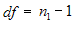

5.Compute the t-statistic as given below.

   _t = ( Mdiff - Md ) / [SD * Sqrt( 1/n1 )]_

6.Construct a t-table at (n1 - 1) degrees of freedom and get the tabulated value for a given level of significance (probability).

7.If the calculated tvalue exceeds the tabulated value we can say that the means are significantly different at that level of probability.

#### Using the Formula

The TTest formula for dependent samples can be calculated by using the TTestPaired method of the [BasicStatisticalFormulas](https://help.syncfusion.com/cr/windowsforms/Syncfusion.Windows.Forms.Chart.Statistics.BasicStatisticalFormulas.html) class. The following table presents the details of this method. This method returns an instance of TTestResult class that stores the resultant values of this test such as means of the two series, T value, degrees of freedom, and number of points in every series, T critical value and confidence level (probability).

**Methods**

<table>
<tr>
<th>
Method Name</th><th>
Parameters</th><th>
Return Value</th></tr>
<tr>
<td>

{{'[TTestPaired](https://help.syncfusion.com/cr/windowsforms/Syncfusion.Windows.Forms.Chart.Statistics.BasicStatisticalFormulas.html#Syncfusion_Windows_Forms_Chart_Statistics_BasicStatisticalFormulas_TTestPaired_System_Double_System_Double_Syncfusion_Windows_Forms_Chart_ChartSeries_Syncfusion_Windows_Forms_Chart_ChartSeries_)'| markdownify }}
</td><td>
<ul><li>HypothesizedMeanDifference: A double value specifying the difference between two population means.</li><li>Probability: A double value  that denotes the probability that gives the confidence level.</li><li>FirstSeries: A ChartSeries object that stores the first group of data.</li><li>SecondSeries: A ChartSeries object that stores the second group of data.</li></ul></td><td>
A TTestResult object that has the following members:<ul><li>FirstSeriesMean</li><li>SecondSeriesMean</li><li>FirstSeriesVariance</li><li>SecondSeriesVariance</li><li>Tvalue</li><li>DegreeOfFreedom</li><li>ProbabilityTOneTail</li><li>TCriticalValueOneTail</li><li>ProbabilityTTwoTail</li> <li>TCriticalValueTwoTail</li></ul></td></tr>
</table>

**Example**

Here is a code snippet that shows a sample usage.

  



using Syncfusion.Windows.Forms.Chart.Statistics;

TTestResult result = BasicStatisticalFormulas.TTestPaired(0.2, 0.05, series1, series2);





Imports Syncfusion.Windows.Forms.Chart.Statistics

Dim result As TTestResult = BasicStatisticalFormulas.TTestPaired(0.2, 0.05, series1, series2)




### Variance

Variance is a statistical formula that calculates the variance of series y values. A Variance can be defined as the square of the standard deviation of a sample.

#### Using the Formula

The variance can be computed for any series by using the method Variance of [BasicStatisticalFormulas](https://help.syncfusion.com/cr/windowsforms/Syncfusion.Windows.Forms.Chart.Statistics.BasicStatisticalFormulas.html) class. Below table shows the details of this method.

**Methods**

<table>
<tr>
<th>
Method Name</th><th>
Parameters</th><th>
Return Value</th></tr>
<tr>
<td>

{{'[Variance](https://help.syncfusion.com/cr/windowsforms/Syncfusion.Windows.Forms.Chart.Statistics.BasicStatisticalFormulas.html#Syncfusion_Windows_Forms_Chart_Statistics_BasicStatisticalFormulas_Variance_Syncfusion_Windows_Forms_Chart_ChartSeries_System_Boolean_)'| markdownify }}
</td><td>
<ul><li>InputSeries: A ChartSeries object that represents the input series.</li><li>SampleVariance: A boolean value; true if the data is a sample of a population, false if it is the entire population.</li></ul></td><td>
A double that represents the variance within the group of data.</td></tr>
</table>

**Example**

Variance is the square of the standard deviation for the given data.   

  



using Syncfusion.Windows.Forms.Chart.Statistics;

............

double Variance1= BasicStatisticalFormulas.Variance(series1,false);





Imports Syncfusion.Windows.Forms.Chart.Statistics

.............

Dim Variance1 As Double
Variance1=BasicStatisticalFormulas.Variance (series1,false) 




### Z-Test

[Z-test](https://help.syncfusion.com/cr/windowsforms/Syncfusion.Windows.Forms.Chart.Statistics.BasicStatisticalFormulas.html#Syncfusion_Windows_Forms_Chart_Statistics_BasicStatisticalFormulas_ZTest_System_Double_System_Double_System_Double_System_Double_Syncfusion_Windows_Forms_Chart_ChartSeries_Syncfusion_Windows_Forms_Chart_ChartSeries_) is a statistical formula that is used to determine if the difference between a sample mean and the population mean is large enough to be statistically significant. This test is primarily used to determine if the test scores of the samples are either within or outside the standard scores. 

**Steps to perform ZTest**

This test requires the sample to be random and is taken from a population that is distributed normally. In order to perform this test, the following quantities should be known.

* s (the standard deviation of the population) 
* µ (the mean of the population) 
* x (the mean of the sample) 
* n (the size of the sample) 

1.Calculate the standard error (SE) of the mean:

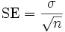

2.Then compute the z-score for the Z-test as below.

3.Finally, the z score is compared to a Z table which contains the percent of area under the normal curve between the mean and the z score. Using this table will indicate whether the calculated z score is within the realm of chance or it is so different from the mean that the sample mean is unlikely to have happened by chance.

#### Using the Formula

The Z-test can be carried out on any two series values by using the ZTest method of [BasicStatisticalFormulas](https://help.syncfusion.com/cr/windowsforms/Syncfusion.Windows.Forms.Chart.Statistics.BasicStatisticalFormulas.html) class. Below table gives the detailed description of this method. The method returns an instance of [ZTestResult](https://help.syncfusion.com/cr/windowsforms/Syncfusion.Windows.Forms.Chart.Statistics.ZTestResult.html) object that saves the intermediate results and also the final z score of the test.

**Methods**

<table>
<tr>
<th>
Method Name</th><th>
Parameters</th><th>
Return Value</th></tr>
<tr>
<td>

{{'[ZTest](https://help.syncfusion.com/cr/windowsforms/Syncfusion.Windows.Forms.Chart.Statistics.BasicStatisticalFormulas.html#Syncfusion_Windows_Forms_Chart_Statistics_BasicStatisticalFormulas_ZTest_System_Double_System_Double_System_Double_System_Double_Syncfusion_Windows_Forms_Chart_ChartSeries_Syncfusion_Windows_Forms_Chart_ChartSeries_)'| markdownify }}
</td><td>
<ul><li>HypothesizedMeanDifference: the difference between the population means.</li><li>VarianceOfFirstSeries: the variance within the first series population.</li><li>VarianceOfSecondSeries: the variance within the second series population.</li><li>Probability: the probability that gives the confidence level.</li><li>FirstSeries: A ChartSeries object that stores the first group of data.</li><li>SecondSeries: A ChartSeries object that stores the second group of data.</li></ul></td><td>
An ZTestResult object that has the following members:<ul><li>FirstSeriesMean</li><li>SecondSeriesMean</li><li>FirstSeriesVariance</li><li>SecondSeriesVariance</li><li>ZValue</li><li>ProbabilityZOneTail</li><li>ZCriticalValueOneTail</li><li>ProbabilityZTwoTail</li><li>ZCriticalValueTwoTail</li></ul>  </td></tr>
</table>

**Example**

Here is a code snippet that shows a sample usage.

  



ZTestResult result = BasicStatisticalFormulas.ZTest( Convert.ToDouble(TextBox6.Text.ToString()), 

sqrtVarianceOfFirstSeries*sqrtVarianceOfFirstSeries,

sqrtVarianceOfSecondSeries* sqrtVarianceOfSecondSeries,0.05,series1,series2);





Dim result As ZTestResult = BasicStatisticalFormulas.ZTest(Convert.ToDouble(TextBox6.Text.ToString()), sqrtVarianceOfFirstSeries*sqrtVarianceOfFirstSeries, sqrtVarianceOfSecondSeries*sqrtVarianceOfSecondSeries, 0.05, series1, series2)




N> For programming example, refer to the following Sample:

&lt;Install Location&gt;\Syncfusion\EssentialStudio\<Install version>\Windows\Chart.Windows\Samples\Statistical Analysis\Chart Statistical Formulas

## Utility Functions

Listed below are some common statistical formulas that are implemented in the Utilities type.

**Utilities**

<table>
<tr>
<th>
Statistical Formulas</th><th>
Description</th></tr>
<tr>
<td>

{{'[Beta Function](https://help.syncfusion.com/cr/windowsforms/Syncfusion.Windows.Forms.Chart.Statistics.UtilityFunctions.html#Syncfusion_Windows_Forms_Chart_Statistics_UtilityFunctions_Beta_System_Double_System_Double_)'| markdownify }}
</td><td>
The BetaFunction method returns the beta function for a given value.</td></tr>
<tr>
<td>

{{'[Beta Cumulative Distribution](https://help.syncfusion.com/cr/windowsforms/Syncfusion.Windows.Forms.Chart.Statistics.UtilityFunctions.html#Syncfusion_Windows_Forms_Chart_Statistics_UtilityFunctions_BetaCumulativeDistribution_System_Double_System_Double_System_Double_)'| markdownify }}
</td><td>
The Beta Cumulative Distribution method returns the Beta cumulative distribution for a given value.</td></tr>
<tr>
<td>
{{'[Inverse Beta Cumulative Distribution](https://help.syncfusion.com/cr/windowsforms/Syncfusion.Windows.Forms.Chart.Statistics.UtilityFunctions.html#Syncfusion_Windows_Forms_Chart_Statistics_UtilityFunctions_InverseBetaCumulativeDistribution_System_Double_System_Double_System_Double_)'| markdownify }}
</td><td>
The Inverse Beta Cumulative Distribution method returns the Inverse Beta cumulative distribution for a given value.</td></tr>
<tr>
<td>
{{'[Gamma Function](https://help.syncfusion.com/cr/windowsforms/Syncfusion.Windows.Forms.Chart.Statistics.UtilityFunctions.html#Syncfusion_Windows_Forms_Chart_Statistics_UtilityFunctions_Gamma_System_Double_)'| markdownify }}
</td><td>
The GammaFunction method returns the gamma function for a given value.</td></tr>
<tr>
<td>
{{'[Gamma Cumulative Distribution](https://help.syncfusion.com/cr/windowsforms/Syncfusion.Windows.Forms.Chart.Statistics.UtilityFunctions.html#Syncfusion_Windows_Forms_Chart_Statistics_UtilityFunctions_GammaCumulativeDistribution_System_Double_System_Double_)'| markdownify }}
</td><td>
The Gamma Cumulative Distribution method returns the Gamma cumulative distribution for a given value.</td></tr>
<tr>
<td>
{{'[FCumulative Distribution](https://help.syncfusion.com/cr/windowsforms/Syncfusion.Windows.Forms.Chart.Statistics.UtilityFunctions.html#Syncfusion_Windows_Forms_Chart_Statistics_UtilityFunctions_FCumulativeDistribution_System_Double_System_Double_System_Double_)'| markdownify }}
</td><td>
The F Cumulative Distribution method returns the FCumulative distribution for a given value.</td></tr>
<tr>
<td>
{{'[Inverse FCumulative Distribution](https://help.syncfusion.com/cr/windowsforms/Syncfusion.Windows.Forms.Chart.Statistics.UtilityFunctions.html#Syncfusion_Windows_Forms_Chart_Statistics_UtilityFunctions_InverseFCumulativeDistribution_System_Double_System_Double_System_Double_)'| markdownify }}
</td><td>
The Inverse F Cumulative Distribution method returns the Inverse F Cumulative distribution for a given value.</td></tr>
<tr>
<td>
{{'[TCumulative Distribution](https://help.syncfusion.com/cr/windowsforms/Syncfusion.Windows.Forms.Chart.Statistics.UtilityFunctions.html#Syncfusion_Windows_Forms_Chart_Statistics_UtilityFunctions_TCumulativeDistribution_System_Double_System_Double_System_Boolean_)'| markdownify }}
</td><td>
The T Cumulative Distribution method returns the T Cumulative distribution for a given value.</td></tr>
<tr>
<td>
{{'[Inverse TCumulative Distribution](https://help.syncfusion.com/cr/windowsforms/Syncfusion.Windows.Forms.Chart.Statistics.UtilityFunctions.html#Syncfusion_Windows_Forms_Chart_Statistics_UtilityFunctions_InverseTCumulativeDistribution_System_Double_System_Double_System_Boolean_)'| markdownify }}
</td><td>
The Inverse T Cumulative Distribution method returns the Inverse T Cumulative distribution for a given value.</td></tr>
<tr>
<td>
{{'[Normal Distribution](https://help.syncfusion.com/cr/windowsforms/Syncfusion.Windows.Forms.Chart.Statistics.UtilityFunctions.html#Syncfusion_Windows_Forms_Chart_Statistics_UtilityFunctions_NormalDistribution_System_Double_)'| markdownify }}
</td><td>
The Normal Distribution method returns the Normal distribution for a given value.</td></tr>
<tr>
<td>
{{'[Inverse Normal Distribution](https://help.syncfusion.com/cr/windowsforms/Syncfusion.Windows.Forms.Chart.Statistics.UtilityFunctions.html#Syncfusion_Windows_Forms_Chart_Statistics_UtilityFunctions_InverseNormalDistribution_System_Double_)'| markdownify }}
</td><td>
Returns the inverse of the standard normal cumulative distribution. The distribution has a mean of 0 (zero) and a standard deviation of one.</td></tr>
<tr>
<td>
{{'[Normal Distribution Density](https://help.syncfusion.com/cr/windowsforms/Syncfusion.Windows.Forms.Chart.Statistics.UtilityFunctions.html#Syncfusion_Windows_Forms_Chart_Statistics_UtilityFunctions_NormalDistributionDensity_System_Double_System_Double_System_Double_)'| markdownify }}
</td><td>
The Normal Distribution Density method returns the Normal distribution density for a given value.</td></tr>
<tr>
<td>
{{'[Binomial](https://help.syncfusion.com/cr/windowsforms/Syncfusion.Windows.Forms.Chart.Statistics.UtilityFunctions.html#Syncfusion_Windows_Forms_Chart_Statistics_UtilityFunctions_Binomial_System_Int32_System_Int32_)'| markdownify }}
</td><td>
The Binomial method returns the Binomial coefficient for a given Value.</td></tr>
<tr>
<td>
{{'[Factorial](https://help.syncfusion.com/cr/windowsforms/Syncfusion.Windows.Forms.Chart.Statistics.UtilityFunctions.html#Syncfusion_Windows_Forms_Chart_Statistics_UtilityFunctions_Factorial_System_Int32_)'| markdownify }}
</td><td>
The Factorial method returns the Factorial for a given Value.(eg 2!=2).</td></tr>
<tr>
<td>
{{'[Error Function](https://help.syncfusion.com/cr/windowsforms/Syncfusion.Windows.Forms.Chart.Statistics.UtilityFunctions.html#Syncfusion_Windows_Forms_Chart_Statistics_UtilityFunctions_Erf_System_Double_)'| markdownify }}
</td><td>
The Erf method returns the Error Function for a given Value.</td></tr>
<tr>
<td>
{{'[Inverse Error Function](https://help.syncfusion.com/cr/windowsforms/Syncfusion.Windows.Forms.Chart.Statistics.UtilityFunctions.html#Syncfusion_Windows_Forms_Chart_Statistics_UtilityFunctions_InverseErf_System_Double_)'| markdownify }}
</td><td>
The Inverse Erf method returns the Inverse Error Function for a given Value.</td></tr>
</table>

### Beta Function 

There are two widely used utility functions, the Gamma and Beta functions, which are used in statistics to calculate distribution values. These functions always return a double value and use two double values for input. **The beta function was studied by Euler and Legendre and was named by Jacques Binet**. In mathematics, the beta function (occasionally written as Beta function) which, is also called the Euler integral of the first kind, is a special function defined by:

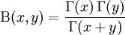

where G(x) is the gamma function.

#### Using the Formula

The Beta method of the [UtilityFunctions](https://help.syncfusion.com/cr/windowsforms/Syncfusion.Windows.Forms.Chart.Statistics.UtilityFunctions.html) class calculates the beta function for given two values. 

**Methods**

<table>
<tr>
<th>
Method Name</th><th>
Parameters</th><th>
Return Value</th></tr>
<tr>
<td>

{{'[Beta](https://help.syncfusion.com/cr/windowsforms/Syncfusion.Windows.Forms.Chart.Statistics.UtilityFunctions.html#Syncfusion_Windows_Forms_Chart_Statistics_UtilityFunctions_Beta_System_Double_System_Double_)'| markdownify }}
</td><td>
<ul><li>a: The first value.</li><li>b: The second value.</li></ul></td><td>
A double that represents the beta function value.</td></tr>
</table>

**Example**

Here is a code snippet that shows a sample usage.

  



using Syncfusion.Windows.Forms.Chart.Statistics;

double result = UtilityFunctions.Beta(a,b);





Imports Syncfusion.Windows.Forms.Chart.Statistics

Dim double as result = UtilityFunctions.Beta(a,b);




#### Beta Cumulative Distribution

The Beta Distribution can be defined as a family of probability distributions differing in the values of **α and β**. The Cumulative distribution function is given below.

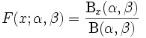

where Bx(α, ß) is the incomplete beta function and Ix(α, ß) is the regularized incomplete beta function.

#### Using the Formula

The [BetaCumulativeDistribution](https://help.syncfusion.com/cr/windowsforms/Syncfusion.Windows.Forms.Chart.Statistics.UtilityFunctions.html#Syncfusion_Windows_Forms_Chart_Statistics_UtilityFunctions_BetaCumulativeDistribution_System_Double_System_Double_System_Double_) method of the UtilityFunctions class returns the cumulative beta distribution for x>=0, a >0, b>0.

**Methods**

<table>
<tr>
<th>
Method Name</th><th>
Parameters</th><th>
Return Value</th></tr>
<tr>
<td>

{{'[BetaCumulativeDistribution](https://help.syncfusion.com/cr/windowsforms/Syncfusion.Windows.Forms.Chart.Statistics.UtilityFunctions.html#Syncfusion_Windows_Forms_Chart_Statistics_UtilityFunctions_BetaCumulativeDistribution_System_Double_System_Double_System_Double_)'| markdownify }}
</td><td>
<ul><li>a: The lower limit.</li><li>b: The upper limit.</li><li>x: the value for which the distribution has to be calculated.</li></ul></td><td>
A double that represents the cumulative beta distribution.</td></tr>
</table>

**Example**

Here is a code snippet that shows a sample usage.

  



ChartSeries series = new ChartSeries("a=b=0.5");

for(double i = 0; i <= 1; i = i + 0.1)

{

// Calculate Beta cumulative function for a points and plot the points in chart control.

series.Points.Add(i,Syncfusion.Windows.Forms.Chart.Statistics.UtilityFunctions.BetaCumulativeDistribution(0.5,0.5,i));

}

series.Type = ChartSeriesType.Spline;

series.Tex = series.Name;

this.ChartControl1.Series.Add(series);





'Calculate Beta cumulative function for a points and plot the points in chart control.

Dim series As New ChartSeries("a=b=0.5")

For i As Double = 0 To 1 Step 0.1

series.Points.Add(i,Syncfusion.Windows.Forms.Chart.Statistics.UtilityFunctions.BetaCumulativeDistribution(0.5,0.5,i))

Next i

series.Type = ChartSeriesType.Spline

series.Text = series.Name

Me.ChartControl1.Series.Add(series)




### Binomial Coefficient 

Binomial Coefficient is an utility function used in statistical calculations. This function is used to determine the possible number of combinations of 'k' items that can be selected from a set of 'n' items. The binomial coefficient formula can be explicitly stated as given below.

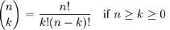

where n! denotes the factorial of n. 

An alternative name for the binomial coefficient is choose function; the binomial coefficient of n and k is often read as "n choose k". Alternative notations include C(n, k), nCk (C for combination). These numbers are called binomial coefficients because they are coefficients in binomial theorem.

#### Using the formula

The Binomial method of the UtilityFunctions class returns the binomial coefficient for given n and k values.

**Methods**

<table>
<tr>
<th>
Method Name</th><th>
Parameters</th><th>
Return Value</th></tr>
<tr>
<td>
Binomial</td><td>
<ul><li>The n value.</li><li>The k value.</li></ul></td><td>
An integer that represents the binomial coefficient  value.</td></tr>
</table>

**Example**

Here is a code snippet that shows a sample usage.

  



using Syncfusion.Windows.Forms.Chart.Statistics;

int result = UtilityFunctions.Binomial(n, k);





Imports Syncfusion.Windows.Forms.Chart.Statistics

Dim int as result = UtilityFunctions.Binomial(n, k)




### Inverse Beta Cumulative Distribution

This formula returns the inverse of Beta Cumulative Distribution.

#### Using the formula

The [InverseBetaCumulativeDistribution](https://help.syncfusion.com/cr/windowsforms/Syncfusion.Windows.Forms.Chart.Statistics.UtilityFunctions.html#Syncfusion_Windows_Forms_Chart_Statistics_UtilityFunctions_InverseBetaCumulativeDistribution_System_Double_System_Double_System_Double_) method of the UtilityFunctions class returns the inverse of beta cumulative distribution ( for 1 >= p >= 0 , a > 0, b > 0 ).

**Methods**

<table>
<tr>
<th>
Method Name</th><th>
Parameters</th><th>
Return Value</th></tr>
<tr>
<td>

{{'[InverseBetaCumulativeDistribution](https://help.syncfusion.com/cr/windowsforms/Syncfusion.Windows.Forms.Chart.Statistics.UtilityFunctions.html#Syncfusion_Windows_Forms_Chart_Statistics_UtilityFunctions_InverseBetaCumulativeDistribution_System_Double_System_Double_System_Double_)'| markdownify }}
</td><td>
<ul><li>a: First Parameter of Beta function.</li><li>b: Second Parameter of Beta function.</li><li>p: The probability.</li></ul></td><td>
A double that inverses the beta cumulative distribution value.</td></tr>
</table>

**Example**

Here is a code snippet that shows a sample usage.

  



using Syncfusion.Windows.Forms.Chart.Statistics;

double result = UtilityFunctions.InverseBetaCumulativeDistribution (a, b, p);





Imports Syncfusion.Windows.Forms.Chart.Statistics

Dim double as result = UtilityFunctions.InverseBetaCumulativeDistribution (a, b, p)





### Error Function

The Error function, denoted as Erf(x), gives the probability that a measurement under the influence of accidental errors has a distance less than x from the average value at the center. It is the integral of Gauss curve, that is usually normalized to one with a factor of 2/Öp. It is otherwise called as integrated Gauss function or Gauss Error function.

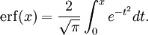

Here is the plot of error function.

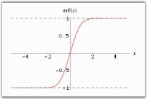

#### Using the formula

The Erf method of the UtilityFunctions class returns integral of the Gauss curve for x > 0.

**Methods**

<table>
<tr>
<th>
Method Name</th><th>
Parameters</th><th>
Return Value</th></tr>
<tr>
<td>
Erf</td><td>
x: must be greater than zero.</td><td>
A double that represents the Gauss integral.</td></tr>
</table>

**Example**

Here is a code snippet that shows a sample usage.

  



using Syncfusion.Windows.Forms.Chart.Statistics;

int double = UtilityFunctions.Erf(x);





Imports Syncfusion.Windows.Forms.Chart.Statistics

Dim double as result = UtilityFunctions.Erf(x)




### Factorial

The Factorial function returns the factorial value of a given number. In mathematics, the factorial of a natural number n is the product of all positive integers less than or equal to n. It is denoted as n! and pronounced **"n factorial", or colloquially "n shriek", "n bang" or "n crit"**. Factorial finds its main application in combinatorics like Permutations and Combinations and is also used in Number Theory.

The factorial function is defined by the following expression.

which is equivalent to n! = n . (n-1) . ..... . 2 . 1.

The above definition incorporates the convention that the product of no numbers at all is 1, i.e., 0! = 1.

#### Using the formula

The [Factorial](https://help.syncfusion.com/cr/windowsforms/Syncfusion.Windows.Forms.Chart.Statistics.UtilityFunctions.html#Syncfusion_Windows_Forms_Chart_Statistics_UtilityFunctions_Factorial_System_Int32_) method of the UtilityFunctions class returns the factorial value for any positive integer.

**Methods**

<table>
<tr>
<th>
Method Name</th><th>
Parameters</th><th>
Example</th></tr>
<tr>
<td>

{{'[Factorial](https://help.syncfusion.com/cr/windowsforms/Syncfusion.Windows.Forms.Chart.Statistics.UtilityFunctions.html#Syncfusion_Windows_Forms_Chart_Statistics_UtilityFunctions_Factorial_System_Int32_)'| markdownify }}
</td><td>
n: The number whose factorial should be found out.</td><td>
An integer that returns the factorial of n.</td></tr>
</table>

**Example**

Here is a code snippet that shows a sample usage.

  



using Syncfusion.Windows.Forms.Chart.Statistics;

int result = UtilityFunctions.Factorial(int n);





Imports Syncfusion.Windows.Forms.Chart.Statistics

Dim int as result = UtilityFunctions.Factorial(int n)





### F Cumulative Distribution

This formula returns cumulative F Distribution which can be defined as the ratio of two chi-square distributions. The formula can be expressed as given below.

where,

U1 is the first chi square distribution with d1 degrees of freedom and

U2 is the second chi square distribution with d2 degrees of freedom.

#### Using the Formula 

[FCumulativeDistribution](https://help.syncfusion.com/cr/windowsforms/Syncfusion.Windows.Forms.Chart.Statistics.UtilityFunctions.html#Syncfusion_Windows_Forms_Chart_Statistics_UtilityFunctions_FCumulativeDistribution_System_Double_System_Double_System_Double_) is calculated using the Statistics.UtilityFunctions class. The following table describes the F Cumulative distribution method.

**Methods**

<table>
<tr>
<th>
Method Name</th><th>
Parameters</th><th>
Return Value</th></tr>
<tr>
<td>

{{'[FCumulativeDistribution](https://help.syncfusion.com/cr/windowsforms/Syncfusion.Windows.Forms.Chart.Statistics.UtilityFunctions.html#Syncfusion_Windows_Forms_Chart_Statistics_UtilityFunctions_FCumulativeDistribution_System_Double_System_Double_System_Double_)'| markdownify }}
</td><td>
<ul><li>fValue: The F value for which you want the distribution.</li><li>firstDegreeOfFreedom: an integer value that represents the first degree of freedom.</li><li>secondDegreeOfFreedom: an integer value that represents the second degree of freedom.</li></ul></td><td>
A double that represents T cumulative distribution.</td></tr>
</table>

**Example**

Here is a code snippet that shows a sample usage.

  



using Syncfusion.Windows.Forms.Chart.Statistics;

double x = Statistics.UtilityFunctions. FCumulativeDistribution( fValue, firstDegreeOfFreedom, secondDegreeOfFreedom );





Imports Syncfusion.Windows.Forms.Chart.Statistics

double x = Statistics.UtilityFunctions. FCumulativeDistribution(fValue, firstDegreeOfFreedom, secondDegreeOfFreedom)




### Gamma Function

The Gamma Function is an attempt to generalize the factorial function to real and complex numbers. It is related to the factorial function by

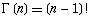

The Gamma Function

For a complex number x with a positive real part, the function can be given by

Special Values of gamma function

#### Using the Formula

The Gamma function is calculated using the Statistics.UtilityFunctions class. The following table describes the parameters and the return value of the gamma function.

**Methods**

<table>
<tr>
<th>
Method Name</th><th>
Parameters</th><th>
Return Value</th></tr>
<tr>
<td>

{{'[Gamma](https://help.syncfusion.com/cr/windowsforms/Syncfusion.Windows.Forms.Chart.Statistics.UtilityFunctions.html#Syncfusion_Windows_Forms_Chart_Statistics_UtilityFunctions_Gamma_System_Double_)'| markdownify }}
</td><td>
p: a value for which the gamma value is required.</td><td>
A double that represents the gamma function value.</td></tr>
</table>

**Example**

Here is a code snippet that shows a sample usage.

  



using Syncfusion.Windows.Forms.Chart.Statistics;

double x = Statistics.UtilityFunctions.Gamma( p );





Imports Syncfusion.Windows.Forms.Chart.Statistics

double x = Statistics.UtilityFunctions.Gamma( p )




### Gamma Cumulative Distribution

The formula for the cumulative distribution function for the gamma distribution is,

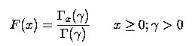

where is the gamma function defined above and is the incomplete gamma function. The incomplete gamma function has the formula.

**Example**

Here is a code snippet that shows a sample usage.

  



ChartSeries series = new ChartSeries("a=2");

for(double i = 0; i <= 20;i = i+2)

{

// Calculate Gamma Cumulative function for a points and plot the points in chart control.

 series.Points.Add (i,Syncfusion.Windows.Forms.Chart.Statistics.UtilityFunctions.GammaCumulativeDistribution(2.0,i));

}

series.Type=ChartSeriesType.Spline;

series.Text=series.Name;

this.ChartControl1.Series.Add(series);





Dim series As ChartSeries=Me.ChartControl1.Model.NewSeries("a=2")

For i As Double = 0 To 20 Step 2

' Calculate Gamma Cumulative function for a points and plot the points in chart control.

series.Points.Add(i,Syncfusion.Windows.Forms.Chart.Statistics.UtilityFunctions.GammaCumulativeDistribution(2.0,i))

Next i

series.Type=ChartSeriesType.Spline

series.Text=series.Name

Me.ChartControl1.Series.Add(series)




### Inverse Error Function

The Inverse Error function, which is a rational approximation of the error function, gives the element-by-element inverse of the error function. The absolute value of the relative error is less than 1.15 -10.9 in the entire region.

#### Using the formula

The below table describes this function in detail.

**Methods**

<table>
<tr>
<th>
Method Name</th><th>
Parameters</th><th>
Return Value</th></tr>
<tr>
<td>

{{'[InverseErrorFunction](https://help.syncfusion.com/cr/windowsforms/Syncfusion.Windows.Forms.Chart.Statistics.UtilityFunctions.html#Syncfusion_Windows_Forms_Chart_Statistics_UtilityFunctions_InverseErf_System_Double_)'| markdownify }}
</td><td>
x must be less than 1.15-10.9 </td><td>
A double that gives the inverse of error function.</td></tr>
</table>

Example

Here is a code snippet that shows a sample usage.

  



using Syncfusion.Windows.Forms.Chart.Statistics;

int double = UtilityFunctions.InverseErf(x);





Imports Syncfusion.Windows.Forms.Chart.Statistics

Dim double as result = UtilityFunctions.InverseErf(x)




### Inverse F Cumulative Distribution

This formula returns the inverse of the F cumulative distribution.

#### Using the Formula 

[InverseFCumulativeDistribution](https://help.syncfusion.com/cr/windowsforms/Syncfusion.Windows.Forms.Chart.Statistics.UtilityFunctions.html#Syncfusion_Windows_Forms_Chart_Statistics_UtilityFunctions_InverseFCumulativeDistribution_System_Double_System_Double_System_Double_) is calculated using the Statistics.UtilityFunctions class. The following table describes its parameters and its values.

**Methods**

<table>
<tr>
<th>
Method Name</th><th>
Parameters</th><th>
Return Value</th></tr>
<tr>
<td>

{{'[InverseFCumulativeDistribution](https://help.syncfusion.com/cr/windowsforms/Syncfusion.Windows.Forms.Chart.Statistics.UtilityFunctions.html#Syncfusion_Windows_Forms_Chart_Statistics_UtilityFunctions_InverseFCumulativeDistribution_System_Double_System_Double_System_Double_)'| markdownify }}
</td><td>
<ul><li>fValue: The F value for which you need the distribution.</li><li>firstDegreeOfFreedom: an integer value that represents the first degree of freedom.</li><li>secondDegreeOfFreedom: an integer value that represents the second degree of freedom.</li></ul></td><td>
A double that represents the inverse F cumulative distribution.</td></tr>
</table>

**Example**

Here is a code snippet that shows a sample usage.

  



using Syncfusion.Windows.Forms.Chart.Statistics;

double x= Statistics.UtilityFunctions. InverseFCumulativeDistribution( fValue, firstDegreeOfFreedom, secondDegreeOfFreedom );





Imports Syncfusion.Windows.Forms.Chart.Statistics

double x= Statistics.UtilityFunctions. InverseFCumulativeDistribution(fValue, firstDegreeOfFreedom, secondDegreeOfFreedom)





### Inverse Normal Distribution

This formula returns an approximation of the inverse of the standard normal cumulative distribution. That is, for a given P, it returns an approximation to the x satisfying P=Pr {z is smaller than x} where z is a random variable from the standard normal distribution.

#### Using the Formula

[InverseNormalDistribution](https://help.syncfusion.com/cr/windowsforms/Syncfusion.Windows.Forms.Chart.Statistics.UtilityFunctions.html#Syncfusion_Windows_Forms_Chart_Statistics_UtilityFunctions_InverseNormalDistribution_System_Double_) is calculated using the Statistics.UtilityFunctions class. The following table describes its parameters and its values.

**Methods**

<table>
<tr>
<th>
Method Name</th><th>
Parameters</th><th>
Example</th></tr>
<tr>
<td>

{{'[InverseNormalDistribution](https://help.syncfusion.com/cr/windowsforms/Syncfusion.Windows.Forms.Chart.Statistics.UtilityFunctions.html#Syncfusion_Windows_Forms_Chart_Statistics_UtilityFunctions_InverseNormalDistribution_System_Double_)'| markdownify }}
</td><td>
p: the probability at which the function value is evaluated. p must be in (0,1) range.</td><td>
A double that represents the inverse of the normal distribution function.</td></tr>
</table>

The algorithm uses a minimax approximation by rational functions and the result has a relative error whose absolute value is less than 1.15e-9.

**Example**

Here is a code snippet that shows a sample usage.

  



using Syncfusion.Windows.Forms.Chart.Statistics;

double x = Statistics.UtilityFunctions.InverseNormalDistribution( p );





Imports Syncfusion.Windows.Forms.Chart.Statistics

double x = Statistics.UtilityFunctions.InverseNormalDistribution( p )





### Normal Distribution

This formula yields the value of the standard normal cumulative distribution. Normal distributions are symmetric and have bell-shaped density curves with a single peak. Two factors, the mean (__) and the standard deviation (), come into place when we speak of normal distribution. The mean indicates the peak of the density curve and the standard deviation indicates the spread of the bell curve.

The normal density function is given by,

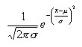

Different values of __ and  yield different normal density curves and hence different normal distributions.  All normal density curves satisfy the following property which is often referred to as the__Empirical Rule.

* 68% of the observations fall within 1 standard deviation of the mean, that is, between __ -  and __ + . 
* 95% of the observations fall within 2 standard deviations of the mean, that is, between __ - 2 and __ + 2. 
* 99.7% of the observations fall within 3 standard deviations of the mean, that is, between __ - 3 and __ + 3.

Thus, for a normal distribution, almost all values lie within three standard deviations of the mean.

#### Using the Formula 

NormalDistribution is calculated using the Statistics.UtilityFunctions class. The following table describes this formula's parameters and its values.

**Methods**

<table>
<tr>
<th>
Method Name</th><th>
Parameters</th><th>
Return Value</th></tr>
<tr>
<td>

{{'[NormalDistribution](https://help.syncfusion.com/cr/windowsforms/Syncfusion.Windows.Forms.Chart.Statistics.UtilityFunctions.html#Syncfusion_Windows_Forms_Chart_Statistics_UtilityFunctions_NormalDistribution_System_Double_)'| markdownify }}
</td><td>
zValue: The value for which the distribution is required. </td><td>
A double that represents the standard normal cumulative distribution value.</td></tr>
</table>

**Example**

Here is a code snippet that shows a sample usage.

  



using Syncfusion.Windows.Forms.Chart.Statistics;

double x = Statistics.UtilityFunctions.NormalDistribution( p );





Imports Syncfusion.Windows.Forms.Chart.Statistics

double x = Statistics.UtilityFunctions.NormalDistribution( p )





### Normal Distribution Density

In probability and statistics, the log-normal distribution is the probability of distribution of any random variable whose logarithm is normally distributed (the base of the logarithmic function is immaterial in that loga x is normally distributed if and only if logb X is normally distributed). If x is a random variable with a normal distribution, then exp(X) will have a log-normal distribution.

"Log-normal" can also be written as **"log normal", "lognormal" or "logistic normal"**.

A variable might be modeled as log-normal if it can be thought of as the multiplicative product of many small independent factors. A typical example of this is the long-term return rate on a stock investment: it can be considered as the product of the daily return rates.

The log-normal distribution has a probability density function (pdf),

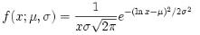

for x > 0, where µ and s are the median and standard deviation of the variable's logarithm. The expected value is,

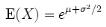

and the variance is,

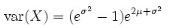

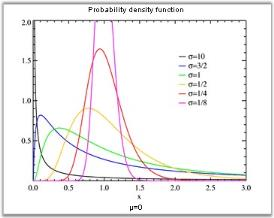

#### Using the formula

**Methods**

<table>
<tr>
<th>
Method Name</th><th>
Parameters</th><th>
Return Value</th></tr>
<tr>
<td>

{{'[NormalDistributionDensity](https://help.syncfusion.com/cr/windowsforms/Syncfusion.Windows.Forms.Chart.Statistics.UtilityFunctions.html#Syncfusion_Windows_Forms_Chart_Statistics_UtilityFunctions_NormalDistributionDensity_System_Double_System_Double_System_Double_)'| markdownify }}
</td><td>
<ul><li>x: the value at which the distribution density is evaluated.</li><li>m: the expected value of distribution.</li><li>sigma: the variance of distribution.</li></ul></td><td>
A double that represents the Normal Distribution Density  function value.</td></tr>
</table>

**Example**

Here is a code snippet that shows a sample usage.

  



using Syncfusion.Windows.Forms.Chart.Statistics;

double result = UtilityFunctions.NormalDistributionDensity(x, m ,sigma);





Imports Syncfusion.Windows.Forms.Chart.Statistics

Dim double as result = UtilityFunctions.NormalDistributionDensity(x, m ,sigma)




### Inverse T Cumulative Distribution

This formula computes the inverse of the cumulative distribution for T-statistic.

#### Using the Formula 

[InverseTCumulativeDistribution](https://help.syncfusion.com/cr/windowsforms/Syncfusion.Windows.Forms.Chart.Statistics.UtilityFunctions.html#Syncfusion_Windows_Forms_Chart_Statistics_UtilityFunctions_InverseTCumulativeDistribution_System_Double_System_Double_System_Boolean_) is calculated using the Statistics.UtilityFunctions class. The following table describes this function's parameters and its values.

**Methods**

<table>
<tr>
<th>
Method Name</th><th>
Parameters</th><th>
Return Value</th></tr>
<tr>
<td>

{{'[InverseTCumulativeDistribution](https://help.syncfusion.com/cr/windowsforms/Syncfusion.Windows.Forms.Chart.Statistics.UtilityFunctions.html#Syncfusion_Windows_Forms_Chart_Statistics_UtilityFunctions_InverseTCumulativeDistribution_System_Double_System_Double_System_Boolean_)'| markdownify }}
</td><td>
<ul><li>p: the alpha value (probability).</li><li>degreeOfFreedom: an integer value that represents the degree of freedom.</li><li>oneTail: If true, one-tailed distribution is used; otherwise two-tailed distribution is used.</li></ul></td><td>
A double that represents the Inverse of T cumulative distribution function probability.</td></tr>
</table>

**Example**

Here is a code snippet that shows a sample usage.

  



using Syncfusion.Windows.Forms.Chart.Statistics;

double x= Statistics.UtilityFunctions. InverseTCumulativeDistribution(p, degreeOfFreedom,OneTail );





Imports Syncfusion.Windows.Forms.Chart.Statistics

double x= Statistics.UtilityFunctions. InverseTCumulativeDistribution(p, degreeOfFreedom,OneTail )




### TCumulative Distribution

This formula will return the T cumulative distribution (student's t-distribution) for a degree of freedom > 0. When there is a need to estimate the mean of a normally distributed population for a given sample, the t-distribution comes into action. It is the basis of the popular t-tests to find out the difference between two sample means.

For a sample with size n drawn from a normal population with mean  and standard deviation . Let {{ '' | markdownify }}

 and _s_  denote the sample mean and sample standard deviation respectively. Then the quantity 

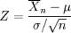

gives the t-distribution for n-1 degrees of freedom.

#### Using the Formula

[TCumulativeDistribution](https://help.syncfusion.com/cr/windowsforms/Syncfusion.Windows.Forms.Chart.Statistics.UtilityFunctions.html#Syncfusion_Windows_Forms_Chart_Statistics_UtilityFunctions_TCumulativeDistribution_System_Double_System_Double_System_Boolean_) is calculated using the Statistics.UtilityFunctions class. The following table describes this function's parameters and its values.

**Methods**

<table>
<tr>
<th>
Method Name</th><th>
Parameters</th><th>
Return Value</th></tr>
<tr>
<td>

{{'[TCumulativeDistribution](https://help.syncfusion.com/cr/windowsforms/Syncfusion.Windows.Forms.Chart.Statistics.UtilityFunctions.html#Syncfusion_Windows_Forms_Chart_Statistics_UtilityFunctions_TCumulativeDistribution_System_Double_System_Double_System_Boolean_)'| markdownify }}
</td><td>
<ul><li>t Value: the T value for which you want the distribution.</li><li>degreeOfFreedom: an integer value that represents the degree of freedom.</li><li>oneTail: If true, one-tailed distribution is used; otherwise two-tailed distribution is used.</li></ul></td><td>
A double that represents the T cumulative distribution function probability.</td></tr>
</table>

**Example**

Here is a code snippet that shows a sample usage.

  



using Syncfusion.Windows.Forms.Chart.Statistics;

double x= Statistics.UtilityFunctions.TCumulativeDistribution(tvalue, degreeOfFreedom,OneTail );





Imports Syncfusion.Windows.Forms.Chart.Statistics

double x= Statistics.UtilityFunctions.TCumulativeDistribution(tvalue, degreeOfFreedom,OneTail )




