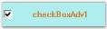

# Alignment Settings

This section discusses the alignment settings of the CheckBoxAdv.

## Text Alignment

Text in the CheckBoxAdv can be aligned to the desired location as given below.

The `TextContentAlignment` property options included are as follows, TopLeft, TopCenter, TopRight, MiddleLeft, MiddleCenter, MiddleRight, BottomLeft, BottomCenter and BottomRight.

<table>
<tr>
<th>
CheckBoxAdv Properties</th><th>
Description</th></tr>
<tr>
<td>
TextContentAlignment</td><td>
Indicates the alignment of the text.The default value is set to `MiddleLeft`. WrapText property must be set to 'False'. Refer {{'[Text Settings](https://help.syncfusion.com/windowsforms/checkboxadv/text-settings)' | markdownify}}</td></tr>
</table>




this.checkBoxAdv1.TextContentAlignment = System.Drawing.ContentAlignment.MiddleCenter;





Me.checkBoxAdv1.TextContentAlignment = System.Drawing.ContentAlignment.MiddleCenter




## CheckBox Alignment

The CheckBox itself can be aligned to any desired location that can be chosen from the options given in the following property.

The `CheckAlign` property options included are as follows, TopLeft, TopCenter, TopRight, MiddleLeft, MiddleCenter, MiddleRight, BottomLeft, BottomCenter and BottomRight.

<table>
<tr>
<th>
CheckBoxAdv Properties</th><th>
Description</th></tr>
<tr>
<td>
CheckAlign</td><td>
Indicates the alignment of the CheckBox. The default value is set to 'MiddleLeft'.</td></tr>
</table>




this.checkBoxAdv1.CheckAlign = System.Drawing.ContentAlignment.MiddleRight;





Me.checkBoxAdv1.CheckAlign = System.Drawing.ContentAlignment.MiddleRight






[Text Settings](http://docs.syncfusion.com//WindowsForms/CheckBoxAdv/Text-Settings), [CheckBoxAdv Settings](http://docs.syncfusion.com//WindowsForms/CheckBoxAdv/CheckBoxAdv-Settings)

