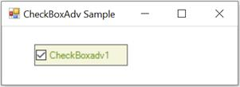

# Getting Started

The CheckBoxAdv control can be created in the following ways.

## Assembly Deployment

Refer to the [control dependencies](https://help.syncfusion.com/windowsforms/control-dependencies#checkboxadv) section to get the list of assemblies or NuGet package needs to be added as reference to use the control in any application.

Find more details about installing the nuget packages in a Windows Forms application in the following link: [How to install nuget packages](https://help.syncfusion.com/windowsforms/nuget-packages).

## Creating the project

Create a new Windows Forms Project in Visual Studio to display the `CheckBoxAdv` with basic functionalities.

## Through Designer

The following steps illustrate how to create a CheckBoxAdv control through designer.

**Step 1**: The `CheckBoxAdv` control can be added to an application by dragging it from the toolbox to designer view. The following required assembly reference will be added automatically.

* Syncfusion.Tools.Windows.dll

**Step 2**: Set the desired properties for the control through the Property grid.

**Step 3**: Run the application.


[Through Code](#through-code)


## Through Code

The CheckBoxAdv control can be created programmatically as detailed below:

**Step 1**: Create a C# or VB.NET application though Visual Studio.

**Step 2**: Include the required assembly references.

	Syncfusion.Tools.Windows.dll

**Step 3**: Include the required namespace.




using Syncfusion.Windows.Forms.Tools;





Imports Syncfusion.Windows.Forms.Tools




**Step 4**: Create an instance of the CheckBoxAdv control class.




private Syncfusion.Windows.Forms.Tools.CheckBoxAdv checkBoxAdv1;
this.checkBoxAdv1 = new Syncfusion.Windows.Forms.Tools.CheckBoxAdv();





Private checkBoxAdv1 As Syncfusion.Windows.Forms.Tools.CheckBoxAdv
Me.checkBoxAdv1 = New Syncfusion.Windows.Forms.Tools.CheckBoxAdv()




**Step 5**: Set the properties and add the CheckBoxAdv control to the form.




this.checkBoxAdv1.Text = "checkBoxAdv1";
this.checkBoxAdv1.Font = new System.Drawing.Font("Microsoft Sans Serif", 8.25F, System.Drawing.FontStyle.Bold, System.Drawing.GraphicsUnit.Point, ((byte)(0)));
this.checkBoxAdv1.ForeColor = System.Drawing.Color.OliveDrab;
this.checkBoxAdv1.BackColor = System.Drawing.Color.Beige;

// Add the CheckBoxAdv control to the Form.
this.Controls.Add(this.radioButtonAdv1);





Me.checkBoxAdv1.Text = "checkBoxAdv1"
Me.checkBoxAdv1.Font = New System.Drawing.Font("Microsoft Sans Serif", 8.25F, System.Drawing.FontStyle.Bold, System.Drawing.GraphicsUnit.Point, CByte((0)))
Me.checkBoxAdv1.ForeColor = System.Drawing.Color.OliveDrab
Me.checkBoxAdv1.BackColor = System.Drawing.Color.Beige

// Add the CheckBoxAdv control to the Form.
Me.Controls.Add(Me.radioButtonAdv1)





[Through Designer](#through-designer)

