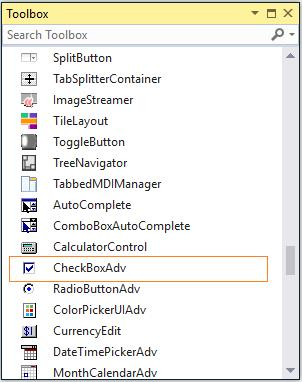

# Getting Started

The CheckBoxAdv control can be created in the following ways.

## Assembly Deployment

Refer to the [control dependencies](https://help.syncfusion.com/windowsforms/control-dependencies#checkboxadv) section to get the list of assemblies or details of NuGet package needs to be added as reference to use the control in any application.

Click [NuGet Packages](https://help.syncfusion.com/windowsforms/visual-studio-integration/nuget-packages) to learn how to install nuget packages in Windows Forms application.

## Adding CheckBoxAdv control via designer

The following steps illustrate how to create a CheckBoxAdv control via designer.

1) Create a new Windows Forms Project in Visual Studio.

2) The [CheckBoxAdv](https://help.syncfusion.com/cr/windowsforms/Syncfusion.Tools.Windows~Syncfusion.Windows.Forms.Tools.CheckBoxAdv.html) control can be added to an application by dragging it from the toolbox to designer view. The following required assembly reference will be added automatically.

* Syncfusion.Tools.Windows

## Adding CheckBoxAdv control via code

The CheckBoxAdv control can be created programmatically as detailed below:

1) Create a C# or VB application though Visual Studio.

2) Include the required assembly references.

* Syncfusion.Tools.Windows

3) Include the required namespace.




using Syncfusion.Windows.Forms.Tools;





Imports Syncfusion.Windows.Forms.Tools




4) Create an instance of the [CheckBoxAdv](https://help.syncfusion.com/cr/windowsforms/Syncfusion.Tools.Windows~Syncfusion.Windows.Forms.Tools.CheckBoxAdv.html) control, and add it to the form.




private Syncfusion.Windows.Forms.Tools.CheckBoxAdv checkBoxAdv1;
this.checkBoxAdv1 = new Syncfusion.Windows.Forms.Tools.CheckBoxAdv();
this.Controls.Add(this.checkBoxAdv1);





Private checkBoxAdv1 As Syncfusion.Windows.Forms.Tools.CheckBoxAdv
Me.checkBoxAdv1 = New Syncfusion.Windows.Forms.Tools.CheckBoxAdv()
Me.Controls.Add(Me.checkBoxAdv1)




5) Set the text and style of the control.




this.checkBoxAdv1.Text = "checkBoxAdv1";
this.checkBoxAdv1.Font = new System.Drawing.Font("Microsoft Sans Serif", 8.25F, System.Drawing.FontStyle.Bold, System.Drawing.GraphicsUnit.Point, ((byte)(0)));
this.checkBoxAdv1.BorderStyle = System.Windows.Forms.BorderStyle.FixedSingle;





Me.checkBoxAdv1.Text = "checkBoxAdv1"
Me.checkBoxAdv1.Font = New System.Drawing.Font("Microsoft Sans Serif", 8.25F, System.Drawing.FontStyle.Bold, System.Drawing.GraphicsUnit.Point, CByte((0)))
Me.checkBoxAdv1.BorderStyle = System.Windows.Forms.BorderStyle.FixedSingle




5) Set the [Checked](https://help.syncfusion.com/cr/windowsforms/Syncfusion.Tools.Windows~Syncfusion.Windows.Forms.Tools.CheckBoxAdv~Checked.html) property as `true`. The default value is `false`.




this.checkBoxAdv1.Checked = true;
this.checkBoxAdv1.CheckState = System.Windows.Forms.CheckState.Checked;




Me.checkBoxAdv1.Checked = True
Me.checkBoxAdv1.CheckState = System.Windows.Forms.CheckState.Checked




