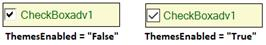

# Themes and Visual Styles

This section discusses the themes and visual style settings that are supported by the CheckBoxAdv control.

## Themes

The CheckBoxAdv can be provided with a themed appearance using the below given property.

<table>
<tr>
<th>
CheckBoxAdv Property</th><th>
Description</th></tr>
<tr>
<td>
ThemesEnabled</td><td>
Specifies whether themes are enabled for CheckBoxAdv.</td></tr>
</table>




this.checkBoxAdv1.ThemesEnabled = true;





Me.checkBoxAdv1.ThemesEnabled = True




## Visual Styles

The appearance of the CheckBoxAdv control can be customized using the various options provided by the following properties.

<table>
<tr>
<th>
CheckBoxAdv Properties</th><th>
Description</th></tr>
<tr>
<td>
Style</td><td>
Gets or sets an advanced appearance for the CheckBoxAdv.The options included are as follows, Default, Office2007, Metro, Office2016Colorful, Office2016White, Office2016Black, Office2016DarkGray

</td></tr>
<tr>
<td>
Office2007ColorScheme</td><td>
Gets or sets Office 2007 color scheme.The options included are as follows, Managed, Blue, Silver and Black. The Style property should be set to "Office2007".</td></tr>
</table>




this.checkBoxAdv1.Style = Syncfusion.Windows.Forms.Tools.CheckBoxAdvStyle.Office2016Colorful;





Me.checkBoxAdv1.Style = Syncfusion.Windows.Forms.Tools.CheckBoxAdvStyle.Office2016Colorful




 

When the Office2007ColorScheme property is set to 'Managed', the CheckBox in the CheckBoxAdv can be displayed using custom colors supported by the control.

This can be done programmatically as follows.




this.checkBoxAdv1.Style = Syncfusion.Windows.Forms.Tools.CheckBoxAdvStyle.Office2007;
this.checkBoxAdv1.Office2007ColorScheme = Syncfusion.Windows.Forms.Office2007Theme.Managed;
Office2007Colors.ApplyManagedColors(this, Color.Pink);





Me.checkBoxAdv1.Style = Syncfusion.Windows.Forms.Tools.CheckBoxAdvStyle.Office2007
Me.checkBoxAdv1.Office2007ColorScheme = Syncfusion.Windows.Forms.Office2007Theme.Managed
Office2007Colors.ApplyManagedColors(Me, Color.Pink)




