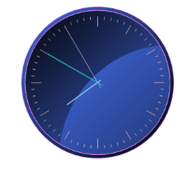
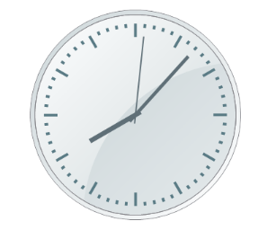
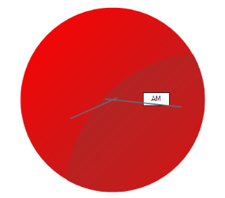

#  Appearance and structure of the Clock control

## Color setting

The [Clock](https://help.syncfusion.com/cr/windowsforms/Syncfusion.Windows.Forms.Tools.Clock.html) control allows you to customize its gradient back color, hands color, minute line color, and border color.

### Customizing color to the Clock

The [Clock](https://help.syncfusion.com/cr/windowsforms/Syncfusion.Windows.Forms.Tools.Clock.html) control has individual properties to set colors for [gradient back color](https://help.syncfusion.com/cr/windowsforms/Syncfusion.Windows.Forms.Tools.Clock.html#Syncfusion_Windows_Forms_Tools_Clock_StartGradientBackColor), [hour hands color](https://help.syncfusion.com/cr/windowsforms/Syncfusion.Windows.Forms.Tools.Clock.html#Syncfusion_Windows_Forms_Tools_Clock_HourHandColor), [minutes color](https://help.syncfusion.com/cr/windowsforms/Syncfusion.Windows.Forms.Tools.Clock.html#Syncfusion_Windows_Forms_Tools_Clock_MinuteHandColor), and [border color](https://help.syncfusion.com/cr/windowsforms/Syncfusion.Windows.Forms.Tools.Clock.html#Syncfusion_Windows_Forms_Tools_Clock_BorderColor).




using Syncfusion.Windows.Forms.Tools;

this.clock1.BorderColor = Color.Violet;

this.clock1.EndGradientBackColor = Color.RoyalBlue;

this.clock1.HourHandColor = Color.SkyBlue;

this.clock1.MinuteColor = Color.LightPink;

this.clock1.MinuteHandColor = Color.LightSeaGreen;

this.clock1.SecondHandColor = Color.LightSteelBlue;

this.clock1.StartGradientBackColor = Color.Black;




Imports Syncfusion.Windows.Forms.Tools

Me.clock1.BorderColor = Color.Violet

Me.clock1.EndGradientBackColor = Color.RoyalBlue

Me.clock1.HourHandColor = Color.SkyBlue

Me.clock1.MinuteColor = Color.LightPink

Me.clock1.MinuteHandColor = Color.LightSeaGreen

Me.clock1.SecondHandColor = Color.LightSteelBlue

Me.clock1.StartGradientBackColor = Color.Black





 

## Appearance setting

The [Clock](https://help.syncfusion.com/cr/windowsforms/Syncfusion.Windows.Forms.Tools.Clock.html) control allows you to customize the thickness of the hands and minute line. It also allows you to enable or disable the AM/PM, borders, minute, and second hand. The [Clock](https://help.syncfusion.com/cr/windowsforms/Syncfusion.Windows.Forms.Tools.Clock.html) control supports a transparent appearance.

### Customization of hands thickness

Clock control allows you to adjust the thickness of hands and minute line.




using Syncfusion.Windows.Forms.Tools;

this.clock1.HourHandThickness = 7;

this.clock1.MinuteHandThickness = 5;

this.clock1.SecondHandThickness = 2;

this.clock1.MinuteThickness = 4;




Imports Syncfusion.Windows.Forms.Tools

Me.clock1.HourHandThickness = 7

Me.clock1.MinuteHandThickness = 5

Me.clock1.SecondHandThickness = 2

Me.clock1.MinuteThickness = 4





 

### Enable and disable properties

The [Clock](https://help.syncfusion.com/cr/windowsforms/Syncfusion.Windows.Forms.Tools.Clock.html) control allows you to enable or disable AM/PM, second hand, minute line, and border.




using Syncfusion.Windows.Forms.Tools;

this.clock1.ShowAMorPM = true;

this.clock1.ShowBorder = false;

this.clock1.ShowMinute = false;

this.clock1.ShowSecondHand = false;




Imports Syncfusion.Windows.Forms.Tools

Me.clock1.ShowAMorPM = True

Me.clock1.ShowBorder = False

Me.clock1.ShowMinute = False

Me.clock1.ShowSecondHand = False





 

## Transparent support

Clock control supports a transparent background.




using Syncfusion.Windows.Forms.Tools;

this.clock1.IsTransparent = true;




Imports Syncfusion.Windows.Forms.Tools

Me.clock1.IsTransparent = True





### How to show a fixed time in the Clock control

The [Clock](https://help.syncfusion.com/cr/windowsforms/Syncfusion.Windows.Forms.Tools.Clock.html) control usually displays the current time on the machine where it is hosted. To freeze the clock to display a fixed time, the Boolean property [StopTimer](https://help.syncfusion.com/cr/windowsforms/Syncfusion.Windows.Forms.Tools.Clock.html#Syncfusion_Windows_Forms_Tools_Clock_StopTimer) can be used. Then, using the Clock control's [Now](https://help.syncfusion.com/cr/windowsforms/Syncfusion.Windows.Forms.Tools.Clock.html#Syncfusion_Windows_Forms_Tools_Clock_Now) property, the desired time can be displayed; otherwise, the default time will be shown.




using Syncfusion.Windows.Forms.Tools;

//Gets or sets the value to freeze or unfreeze time in the clock.

this.clock1.StopTimer = true;




Imports Syncfusion.Windows.Forms.Tools

'Gets or sets the value to freeze or unfreeze time in the clock.

Me.clock1.StopTimer = True





