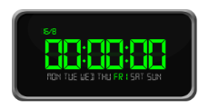

# Digital clock in Windows Forms Clock

The DigitalClock is implemented as an extension to the existing [Windows Forms Clock](https://www.syncfusion.com/winforms-ui-controls/clock) control in the UI controls, but offers a richer UI experience than the existing clock and is capable of displaying the time as digital text.

You can use the DigitalClock in your application by simply switching the [ClockType](https://help.syncfusion.com/cr/windowsforms/Syncfusion.Windows.Forms.Tools.Clock.html#Syncfusion_Windows_Forms_Tools_Clock_ClockType) of the existing [Clock](https://help.syncfusion.com/cr/windowsforms/Syncfusion.Windows.Forms.Tools.Clock.html) control as described in the following sample code:





this.clock1.ClockType = Syncfusion.Windows.Forms.Tools.ClockTypes.Digital;





Me.clock1.ClockType = Syncfusion.Windows.Forms.Tools.ClockTypes.Digital





## Appearance

The DigitalClock offers a wide range of options to customize its appearance. It provides three built-in frames and five background shapes. Users can also use their own frames for the DigitalClock through the renderer.

### Frames

To enable the background frames, the DigitalClock should be enabled with the property [ShowClockFrame](https://help.syncfusion.com/cr/windowsforms/Syncfusion.Windows.Forms.Tools.Clock.html#Syncfusion_Windows_Forms_Tools_Clock_ShowClockFrame) set to `true`.

#### Rectangular frame





    this.clock1.ShowClockFrame = true;

    this.clock1.ClockFrame = Syncfusion.Windows.Forms.Tools.ClockFrames.RectangularFrame;





    Me.clock1.ShowClockFrame = true
    Me.clock1.ClockFrame = Syncfusion.Windows.Forms.Tools.ClockFrames.RectangularFrame





 

#### Circular frame





    this.clock1.ShowClockFrame = true;

    this.clock1.ClockFrame = Syncfusion.Windows.Forms.Tools.ClockFrames.CircularFrame;





Me.clock1.ShowClockFrame = true
Me.clock1.ClockFrame = Syncfusion.Windows.Forms.Tools.ClockFrames.CircularFrame





 

#### Square frame





    this.clock1.ShowClockFrame = true;

    this.clock1.ClockFrame = Syncfusion.Windows.Forms.Tools.ClockFrames.SquareFrame;





Me.clock1.ShowClockFrame = true
Me.clock1.ClockFrame = Syncfusion.Windows.Forms.Tools.ClockFrames.SquareFrame





 

### Shapes

To enable background shapes in the [Clock](https://help.syncfusion.com/cr/windowsforms/Syncfusion.Windows.Forms.Tools.Clock.html) control, the [ShowClockFrame](https://help.syncfusion.com/cr/windowsforms/Syncfusion.Windows.Forms.Tools.Clock.html#Syncfusion_Windows_Forms_Tools_Clock_ShowClockFrame) property should be disabled so that the control can support rendering the background shapes.

#### Rectangular shape





    this.clock1.ShowClockFrame = false;

    this.clock1.ClockShape = Syncfusion.Windows.Forms.Tools.ClockShapes.Rectangle;





Me.clock1.ShowClockFrame = False
Me.clock1.ClockFrame = Syncfusion.Windows.Forms.Tools.ClockFrames.CircularFrame





 

#### RoundedRectangular shape





    this.clock1.ShowClockFrame = false;

    this.clock2.ClockShape = Syncfusion.Windows.Forms.Tools.ClockShapes.RoundedRectangle;

 



Me.clock1.ShowClockFrame = False
Me.clock1.ClockFrame = Syncfusion.Windows.Forms.Tools.ClockShapes.CircularFrame





 

#### Circular shape





  this.clock1.ShowClockFrame = false;

  this.clock2.ClockShape = Syncfusion.Windows.Forms.Tools.ClockShapes.Circle;


 


Me.clock1.ShowClockFrame = false
Me.clock1.ClockShape = Syncfusion.Windows.Forms.Tools.ClockShapes.Circle





#### Square shape





  this.clock1.ShowClockFrame = false;

  this.clock1.ClockShape = Syncfusion.Windows.Forms.Tools.ClockShapes.Square;

 



Me.clock1.ShowClockFrame = false
Me.clock1.ClockShape = Syncfusion.Windows.Forms.Tools.ClockShapes.Square

 

 

#### RoundedSquare shape





  this.clock1.ShowClockFrame = false;

  this.clock1.ClockShape = Syncfusion.Windows.Forms.Tools.ClockShapes.RoundedSquare;





Me.clock1.ShowClockFrame = false
Me.clock1.ClockShape = Syncfusion.Windows.Forms.Tools.ClockShapes.RoundedSquare





 

### Color customizations

#### Foreground color

The foreground color for the DigitalClock can be changed using the [ForeColor](https://help.syncfusion.com/cr/windowsforms/Syncfusion.Windows.Forms.Tools.Clock.html#Syncfusion_Windows_Forms_Tools_Clock_ForeColor) property. This color will be reflected in the text of the control.





    this.clock1.ForeColor = System.Drawing.Color.Yellow;





   Me.clock1.ForeColor = System.Drawing.Color.Yellow





 

#### Background color

The background color for the DigitalClock can be changed using the [BackgroundColor](https://help.syncfusion.com/cr/windowsforms/Syncfusion.Windows.Forms.Tools.Clock.html#Syncfusion_Windows_Forms_Tools_Clock_BackgroundColor) property. This color will be reflected in the background of the control.





    this.clock1.BackgroundColor = System.Drawing.SystemColors.ActiveCaption;

    this.clock1.ForeColor = System.Drawing.Color.Yellow;





   Me.clock1.BackgroundColor = System.Drawing.SystemColors.ActiveCaption

   Me.clock1.ForeColor = System.Drawing.Color.Yellow





 

#### Border color

The border color for the control will be reflected only when the control is assigned with the background shapes as follows:





    this.clock1.BorderColor = System.Drawing.Color.Yellow;    

    this.clock1.BackgroundColor = System.Drawing.SystemColors.ActiveCaption;

    this.clock1.ForeColor = System.Drawing.Color.Yellow;





   Me.clock1.BorderColor = System.Drawing.Color.Yellow

   Me.clock1.BackgroundColor = System.Drawing.SystemColors.ActiveCaption

   Me.clock1.ForeColor = System.Drawing.Color.Yellow





## Behavior

### Show or hide days of the week

To display or hide the week days and current date in the DigitalClock, the [DisplayDates](https://help.syncfusion.com/cr/windowsforms/Syncfusion.Windows.Forms.Tools.Clock.html#Syncfusion_Windows_Forms_Tools_Clock_DisplayDates) property can be used.





          this.clock1.DisplayDates = true;





        Me.clock1.DisplayDates = True





 

 

### Show or hide the hour designator

To display or hide the hour designator (AM and PM) in the DigitalClock, the [ShowHourDesignator](https://help.syncfusion.com/cr/windowsforms/Syncfusion.Windows.Forms.Tools.Clock.html#Syncfusion_Windows_Forms_Tools_Clock_ShowHourDesignator) property can be used.



     

          this.clock1.ShowHourDesignator = false;





          Me.clock1.ShowHourDesignator = false





 

 

### Custom time Clock

To enable the custom time, the DigitalClock should be enabled with the property [ShowCustomTimeClock](https://help.syncfusion.com/cr/windowsforms/Syncfusion.Windows.Forms.Tools.Clock.html#Syncfusion_Windows_Forms_Tools_Clock_ShowCustomTimeClock) set as `true`.

#### Input formats

To enable the custom time, the clock control should be enabled with the [ShowCustomTimeClock](https://help.syncfusion.com/cr/windowsforms/Syncfusion.Windows.Forms.Tools.Clock.html#Syncfusion_Windows_Forms_Tools_Clock_ShowCustomTimeClock) property set as `true`, and the custom time should be in DateTime format.





          this.clock1.ShowCustomTimeClock = true;

          this.clock1.CustomTime = new System.DateTime(2013, 9, 14, 10, 10, 15, 0);





          Me.clock1.ShowCustomTimeClock = true

                   Me.clock1.CustomTime = New Date(2013, 9, 14, 10, 10, 15, 0)





 

#### Applying custom renderer to the DigitalClock control

The following code sample can be utilized for applying a custom renderer to the DigitalClock.





  DigitalRenderer render = new DigitalRenderer();

  this.clock1.DigitalRenderer = render;

   public class DigitalRenderer : DigitalClockRenderer

    {

        public override void DrawDigitalClockFrame(Graphics g, Image newImage, Clock clock)

        {

            Image image =Image.FromFile(@"D:\CustomClock.PNG");

            base.DrawDigitalClockFrame(g, image, clock);

        }

    }




Dim render As DigitalRenderer = New DigitalRenderer
Me.clock1.DigitalRenderer = render
Public Class DigitalRenderer
    Inherits DigitalClockRenderer

    Public Overrides Sub DrawDigitalClockFrame(ByVal g As Graphics, ByVal newImage As Image, ByVal clock As Clock)
        Dim image As Image = Image.FromFile("G:\CustomClock.PNG")
        MyBase.DrawDigitalClockFrame(g, image, clock)
    End Sub
End Class





