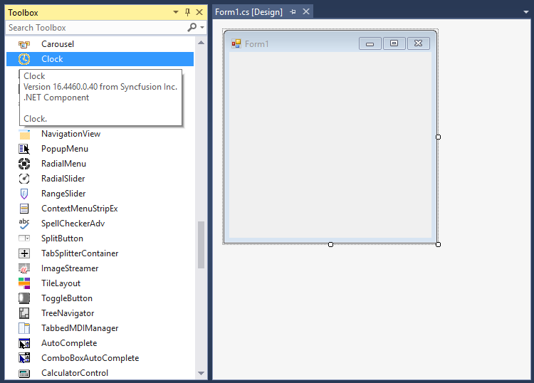
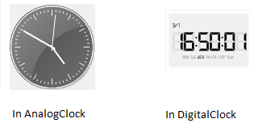

# Getting Started with Windows Forms Clock
This section provides a quick overview for working with the [Clock](https://help.syncfusion.com/cr/windowsforms/Syncfusion.Windows.Forms.Tools.Clock.html) control for WinForms.

## Assembly deployment

Refer to the [Control dependencies](https://help.syncfusion.com/windowsforms/control-dependencies#clock) section to get the list of assemblies or details of NuGet package that needs to be added as a reference to use the control in any application. 

Click [NuGet Packages](https://help.syncfusion.com/windowsforms/installation/install-nuget-packages) to learn how to install nuget packages in a Windows Forms application.

## Creating Application with Clock
In this walk through, users will create WinForms application that contains [Clock](https://help.syncfusion.com/cr/windowsforms/Syncfusion.Windows.Forms.Tools.Clock.html) control.

### Creating the Project
Create new Windows Forms Project in Visual Studio to display [Clock](https://help.syncfusion.com/cr/windowsforms/Syncfusion.Windows.Forms.Tools.Clock.html) with data objects.

### Adding Clock control via designer

1. Create a new Windows Forms project in Visual Studio.

2. The [Clock](https://help.syncfusion.com/cr/windowsforms/Syncfusion.Windows.Forms.Tools.Clock.html) control can be added to an application by dragging it from the toolbox to a designer view. The following dependent assemblies will be added automatically:

    * Syncfusion.Grid.Base
    * Syncfusion.Grid.Windows
    * Syncfusion.Shared.Base
    * Syncfusion.Shared.Windows
    * Syncfusion.Tools.Base 
    * Syncfusion.Tools.Windows

 

### Adding Clock control via code

To add the control manually in C#, follow the given steps:

1. Create a C# or VB application via Visual Studio.

2. Add the following assembly references to the project:

    * Syncfusion.Grid.Base
    * Syncfusion.Grid.Windows
    * Syncfusion.Shared.Base
    * Syncfusion.Shared.Windows
    * Syncfusion.Tools.Base 
    * Syncfusion.Tools.Windows

3. Include the required namespace.




  
using Syncfusion.Windows.Forms.Tools;




Imports Syncfusion.Windows.Forms.Tools


 

{{ codesnippet1 | OrderList_Indent_Level_1 }}

4. Create an instance of the [Clock](https://help.syncfusion.com/cr/windowsforms/Syncfusion.Windows.Forms.Tools.Clock.html) control instance, and add it to the form.





Clock clock1 = new Clock();
this.Controls.Add(clock1);




Dim clock1 As New Clock()
Me.Controls.Add(clock1)




{{ codesnippet2 | OrderList_Indent_Level_1 }}

 

## Clock type

You can change the analog clock to digital clock by setting the [ClockType](https://help.syncfusion.com/cr/windowsforms/Syncfusion.Windows.Forms.Tools.Clock.html#Syncfusion_Windows_Forms_Tools_Clock_ClockType) property of the [Clock](https://help.syncfusion.com/cr/windowsforms/Syncfusion.Windows.Forms.Tools.Clock.html) control.





clock1.ClockType = Syncfusion.Windows.Forms.Tools.ClockTypes.Digital;





clock1.ClockType = Syncfusion.Windows.Forms.Tools.ClockTypes.Digital





For Analog Clock,





clock1.ClockType = Syncfusion.Windows.Forms.Tools.ClockTypes.Analog;





clock1.ClockType = Syncfusion.Windows.Forms.Tools.ClockTypes.Analog





## Change date and time

To enable custom time, the Clock control should be enabled by setting the [ShowCustomTimeClock](https://help.syncfusion.com/cr/windowsforms/Syncfusion.Windows.Forms.Tools.Clock.html#Syncfusion_Windows_Forms_Tools_Clock_ShowCustomTimeClock) property to `true`, and the custom time should be in date-time format.




clock1.ShowCustomTimeClock = true;
clock1.CustomTime = new System.DateTime(2019, 7, 3, 16, 50, 1, 0);




clock1.ShowCustomTimeClock = True
clock1.CustomTime = New System.DateTime(2019, 7, 3, 16, 50, 1, 0)




